賞櫻這幾年在台灣好像越炒越熱...不管是武陵還是阿里山 人潮都一年比一年多 甚至連我們家的低級小學生阿徹有天放學回家後也興衝衝的跟我說'阿里山櫻花好漂亮耶! 尤其那個夜櫻' 我問'你怎麼知道阿里山櫻花漂亮阿'  阿徹說'下課花路米介紹的阿' 下課花路米還真是現代老師的得力助教阿 董得比老師多 教的也比老師廣 Orz... 雖然四年前我們便曾上阿里山賞過櫻也領教過山上的人潮  但是難得阿徹這樣想上阿里山賞櫻 於是我跟徹爸便決定清明假期回嘉義的時候找一天透早上山賞櫻去 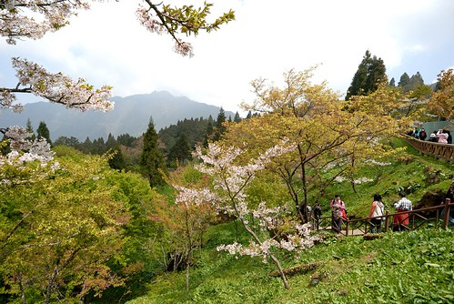

清明連假第二天(4/3) 我們準備早起上阿里山賞櫻去 只是原本預計5點起床的 卻因徹爸手機新鬧鈴太小聲讓我們睡到6點才醒來 而更"過分"的是這項計劃的提議者 阿徹竟然在一覺醒來後決定不跟我們上阿里山 要同三姑姑家哥哥在一起 前一天阿徹便在櫻花與他最愛的瑋瑋哥哥間掙扎 可是臨睡前他給我們的答覆是要跟我們一起去 因此他的最後反悔實在讓人很想痛扁他一頓  但媽媽這次也心一橫 完全沒有勸說及威脅 冷冷落下"隨便你"之後便出門去了  (除了前一晚有說" 媽媽這次上阿里山後10年內不會再去了") 沒關係! 我相信這件事絕對會被我們說一輩子 而他日後也勢必會領受到失信於人的苦楚的...

若不是因為徹爸家就位在嘉義市往阿里山的台18號公路上  我們也不會這麼勤勞上山 加上若不是看在阿徹原本的滿腔熱血 我真的不會想在人最多的櫻花季上阿里山(我對阿徹的怨念不小心全都寫出來了 哈) 6點多從嘉義出發後 18號公路從山下便開始是一台接一台的連綿車陣 雖然沒有塞但感受的出上山的人有多阿! 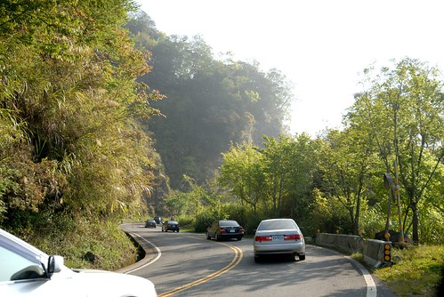

而真正的考驗其實是在抵達阿里山之後 從入口處的前幾公里到過入口處後往山上的後幾公里 路邊能停車的地方早都已停滿車 最後我們停在離入口3.5公里的地方  (這3.5公里還是在回程撘接駁車時仔細留意路標才知道的) 從入口處的下方到上方總共設有10站的接駁車站排 (下面兩個 上面八個) 而我們車子停在七的地方 雖然不知道距離入口有多遠  但十來多分的車程讓我們知道車子真的停很遠 所以雖然距離最近的接駁站排隊人潮很多 但我們還是乖乖地排.... 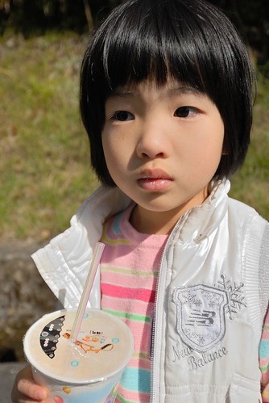

等了20分鐘  一輛輛從上方載滿人的接駁車皆過站不停的往下開去  我們最終決定那就用走的吧! 要不然光等接駁車就不知道要耗去多少時間了 那時候我真的傻傻認為大約只要走2公里左右的路吧 所以才決定幹這種事的 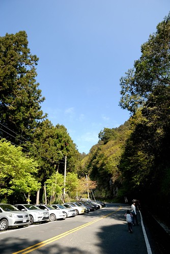

但是很幸運的 走不到10分鐘後前面一組中年遊客攔了對向空的接駁車而司機竟也願意搭載 所以我們'碰人運氣'地也一起上了接駁車 跟著車子再回頭走到八號接駁站時  看到那排隊的長攏我總算明白爲什麼在七號接駁站的我們怎樣也撘不到車 真的超級誇張的啦! 雖然在車上的我們實在有點不好意思 但是心裡真的很暗爽撿到這幸運  尤其當接駁車又開了好久才到入口處時(回程時 仔細計算公里數時才發現這段路竟然有3.5km 更是慶幸早上不是用走的下山阿) 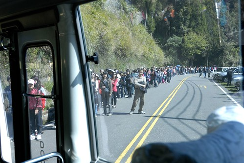

10點鍾前 我們總算抵達阿里山森林遊樂區的入口嚕~ 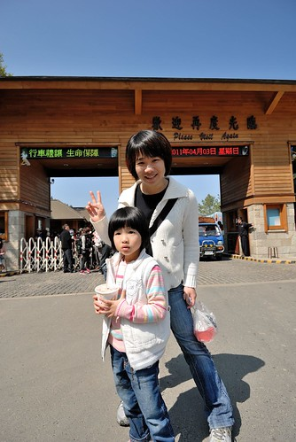

開始賞花前先來回顧一下四年前賞花的模樣 那時候阿徹就像現在的愛愛這樣大 而愛愛還是坐推車的奶娃 靠著這台推車跟著我們上山下海 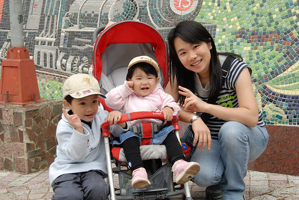

山上的櫻花依舊美麗 可是兄妹倆都已經長大很多嚕 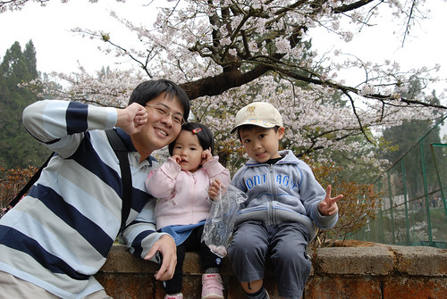

看到照片裡的阿徹又忍不住感嘆一下 其實提議者阿徹不去了 理當我們就可以不要去了 但因為都做好要出門的身心準備了 而且為了賭一口氣 我們還是上山了 只是少了阿徹一同出門賞櫻  我們三個的心情都有點受影響 少了不愛爬山的小孩吵也少了阿徹這個聊天咖帶來的樂趣 但我們還是要努力盡興地賞櫻... 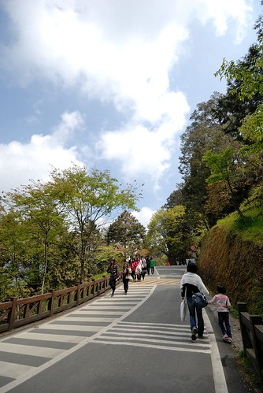

今日雖然人多但天氣好 走起路很舒服 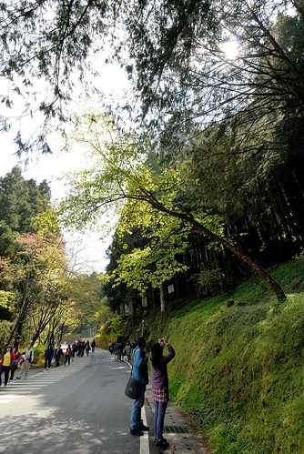

為了避免下山塞車之苦 我們打算花3個小時走過三個重點賞櫻處後便下山 首先是往沼平車站那段 這的櫻花密度最高 (話說國人照相很愛往樹上爬哩 還一次三個真的不太好啦...) 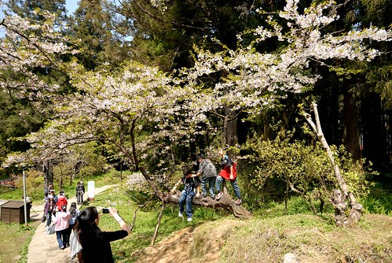

步道途中派出所前的"招牌"櫻花  花旺人也盛 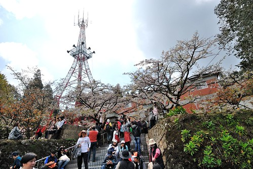

剛好有對新人在這拍婚紗照 愛愛目不轉睛的看了好久 愛愛說以後她也要來這裡拍結婚的照片  我說"你可以去武陵農場拍阿 我覺得武陵比較漂亮說" 愛愛說"可是武陵農場好冷喔"(可見上次上武陵5度以下的低溫有讓她冷到) 我說"那你可以像是秋天賞楓或是不是那麼冷的時候去阿'  愛愛明白似的喔了一下 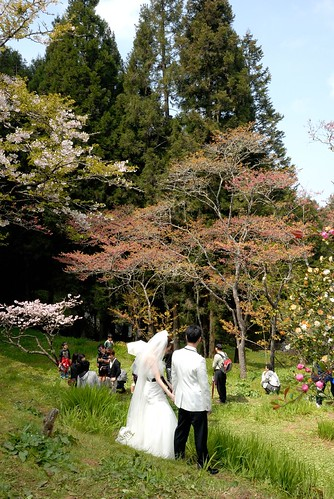

櫻花幾乎都已經長新葉 只是花與葉的比例從8:2到5:5不等 雖然沒有10:0的極大盛 但這樣綠中透白又是另一種景緻 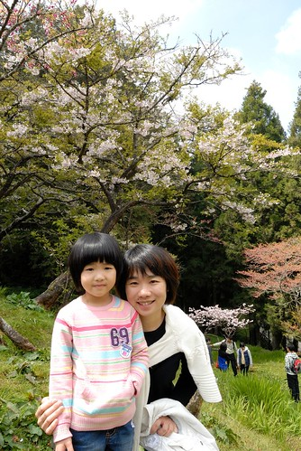

我們也來到派出所鮮紅的高壓電塔下 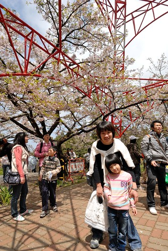

哇! 電塔好高!  拜櫻花所賜 全台大概就這座高壓電塔能聚集這麼多的人 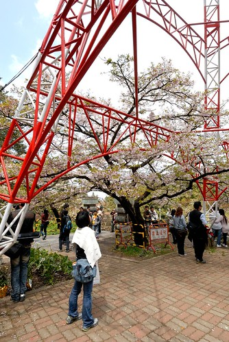

過了盛開期空中不時可見櫻花瓣飄  而花辦更是零零落落散落各地 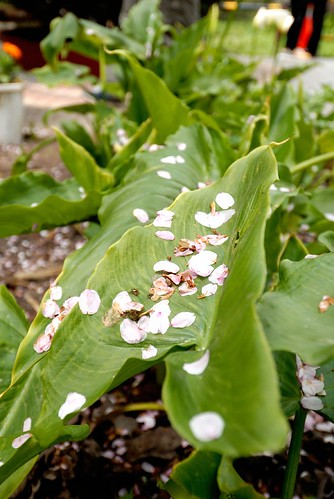

沒有阿徹哥哥在 愛愛很提不起勁連笑容都好淺好淡 而手中拿的PINKY是她今日的精神良藥 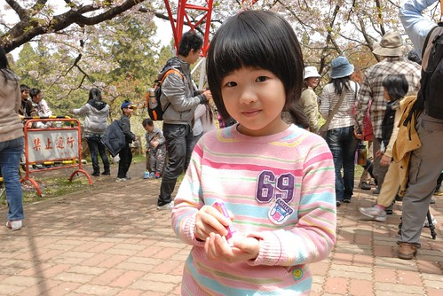

好不容易愛愛總算主動說要照相.. 要在鐵軌上照相 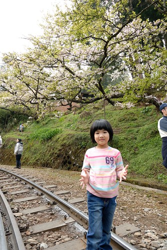

照完相 火車剛好也嘟嘟嘟的要經過 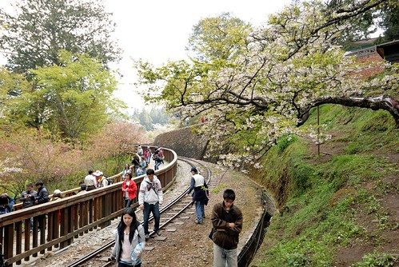

每看到一次火車 愛愛就嘟嚷著一次要坐火車 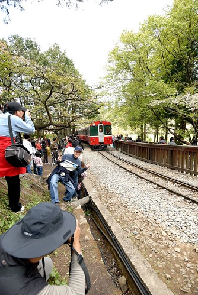

ㄟ...人粉多說(有沒有看到人都快貼到門邊了)...而且我們要趕下山說... 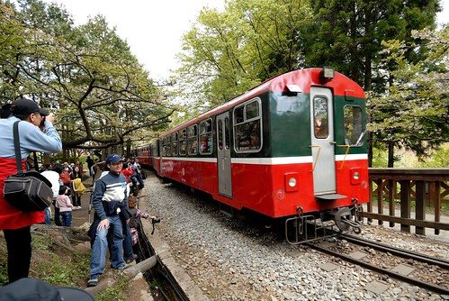

乖! 下次有機會再讓你搭火車嘿! (話說愛愛很愛搭大眾運輸工具 如公車 捷運 還有小黃...) 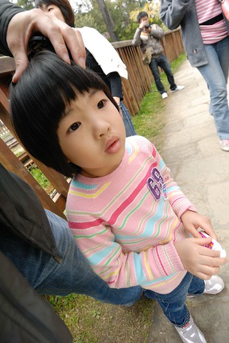

徹爸邊拍火車邊說 這火車是不是跟上次來的時侯不一樣阿 有嗎? 一樣地紅阿 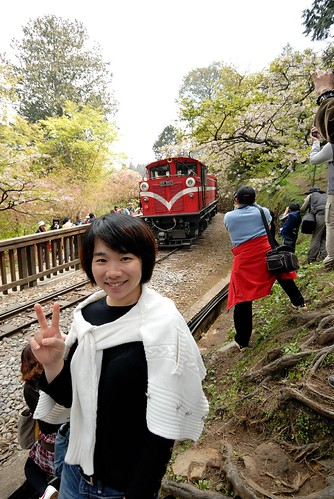

翻了四年前的照片 咦! 還真的不一樣哩 而且以前的火車頭還會ㄅㄨㄅㄨ冒白煙說 攝影大哥們等的就是這一景阿 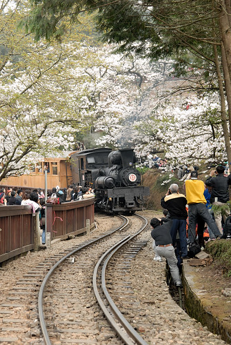

雖然沼平車站正在整修重建中 但從這看出去的山景蠻漂亮的 尤其現在百花齊放 山頭五顏六色的 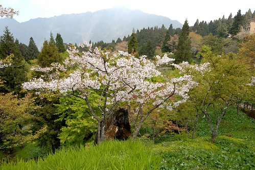

等著徹爸的我跟愛愛在這看了好一會風景 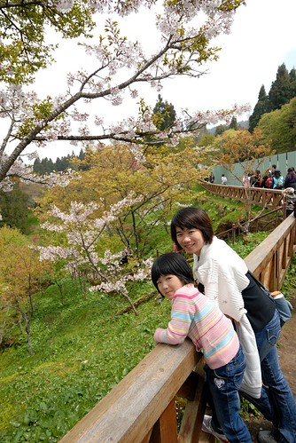

不知不覺連愛愛都也這麼大隻了 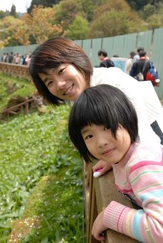

當然也不免俗地來個夫妻自拍嚕 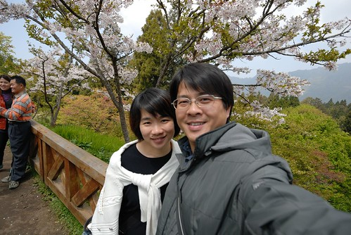

不管是武陵還是阿里山 櫻花過後的時節隨處可見青嫩的綠景 剛長出的新葉還是地上的小草 每一樣都綠的超級清新 可愛的 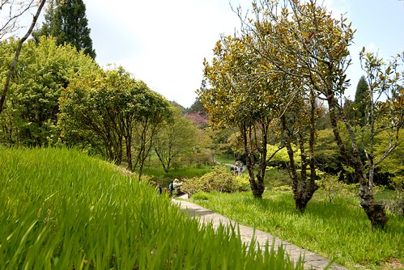

而這片綠也讓我跟徹爸即時心中有著小小失落但仍有著好心情 甚至即使賞花人潮多但仍覺不枉走這一趟 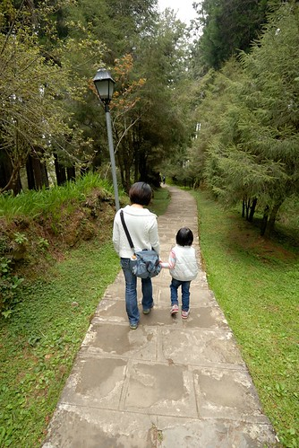

這是我們第一次沒跟阿徹在一起而出門這麼久 難得的三人世界 原來只有一個小孩是這種感覺阿... 安靜很多... 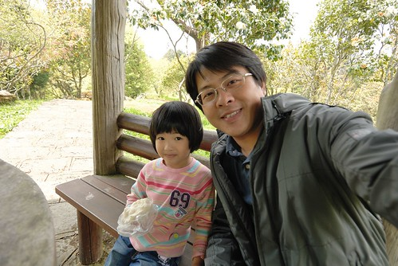

只是怎麼我們三個人的笑容都有那麼一點點的落寞阿 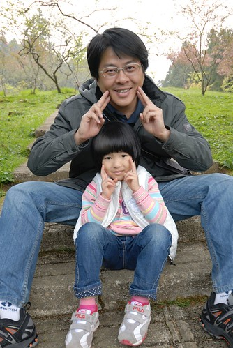

尤其愛愛今日走來完全的沒勁 常唉著好累 不想走了.. 徹爸說"你這樣子 以後我不要幫你拍結婚的照片喔" 愛愛竟然也當真的相信她爸的威脅而努力走(原來她心裡真想是要讓她爸爸幫她拍婚紗照的阿) 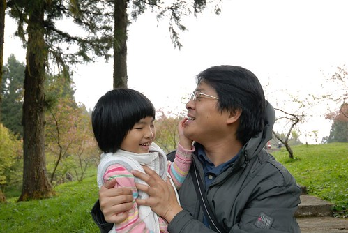

第二個賞花重點是阿里山賓館  這的櫻花落的更多 葉的比例也更多了 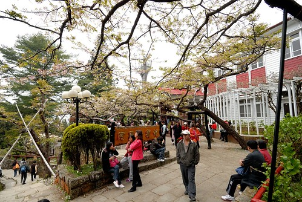

不過樹下賞花的人還是不少 賓館甚至圈起大半範圍賣起餐點 在樹下吃貢丸湯感覺還蠻屌的 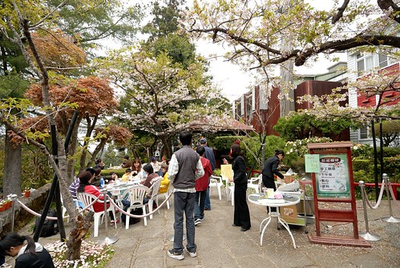

第三個賞花重點 阿里山工作站旁的步道 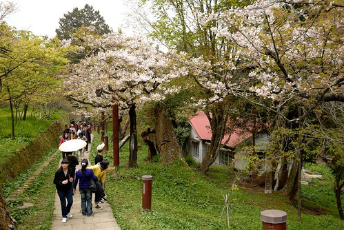

覺得雖然阿里山櫻花的密度不高 但整個山景搭配起來還挺有古意有感覺的... 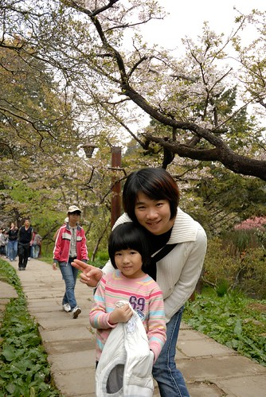

YA! 今日賞花到此即將接近尾聲 (徹爸新買的廣角鏡讓我今日的臉看起來瘦 腿看起來長 不錯不錯 以後就都帶這鏡頭出門好) 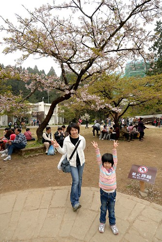

雖然這張徹爸又把我拍的胖胖的 但是很喜歡這張的感覺 也忘了我跟愛愛到底在做什麼 應該就是少了阿徹太無聊在瞎玩 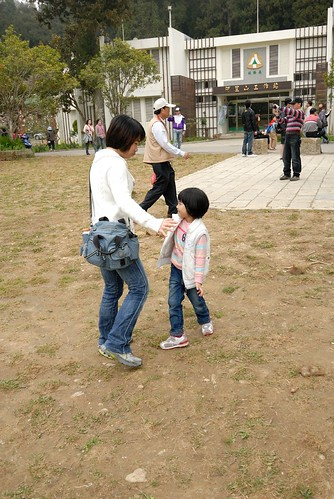

來過阿里山三次 這次停留時間最短但這次卻覺得阿里山最美 心裡想如果能在非假日來這住上一晚 傍晚時分人少實漫步林中一定很棒 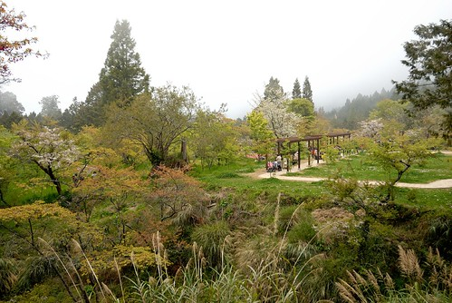

阿里山就像日月潭的確有其獨特的迷人之處 難怪陸客特愛去這兩個地方 可是陸客真的好多喔...到處可聽到濃濃的同胞音啊... 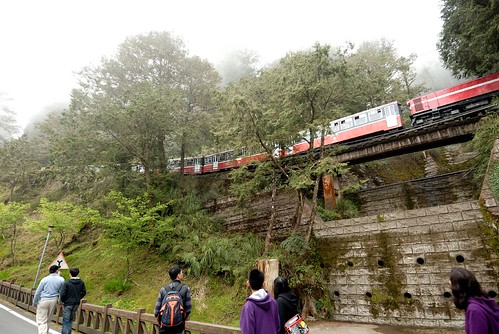

12點多往回頭走時山裡頓時間全起霧了    一早的大太陽全躲起來了 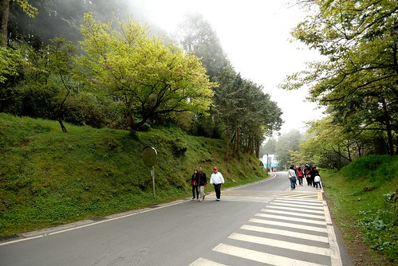

這霧真是來的又急又猛 氣溫急降....好厲害的山頭 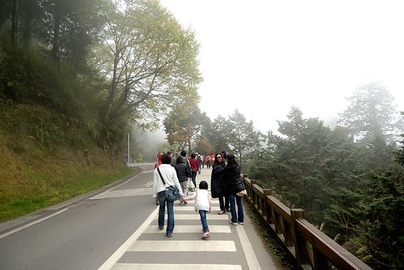

回到公車站附近準備吃個午餐再下山 可是每家店都大爆滿阿 連SEVEN也是滿間的人 關東煮是店員用大鐵桶一桶一桶的裝 真是有夠誇張的 而就算想吃個泡麵算了 也因為找不到可以坐下來好好吃泡麵的地方而只能做罷 因此最後我們是到人比較少點的萊爾富買個麵包 茶葉蛋 牛奶後坐在路邊吃 (就坐在像照面右方那樣的小階台) 吃的實在有點狼狽 有點可憐... 

而最後要搭接駁車時 等車的人潮也繞了一大圈 等了30來分才上車 愛愛可能被吃飯時以及等車時的人潮有嚇到  一臉認真的跟我說"我以後不要來這裡拍結婚照了..." 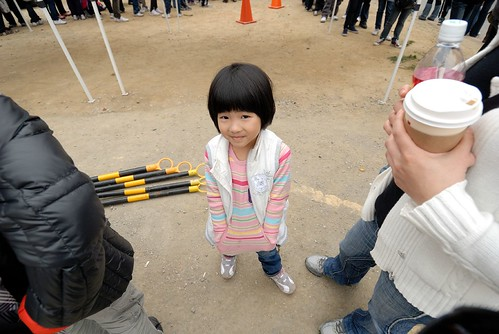

回台北後看到新聞才知道我們上山那天 阿里山有1萬9千多名的遊客 這麼多人也難怪我們的車子得停在快4公里遠的地方 所以我說啦 縱使阿里山很美 可是她的人潮會讓我怯步10年的... 頂著濃霧我們完成今日賞花 下山去嚕 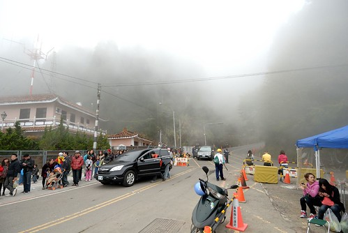

回到嘉義4點 首先繞去中埔買水煎包填胃  肚子好餓好空虛啊... 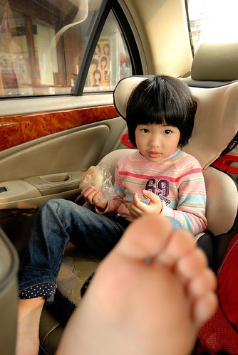

而此刻我們的阿徹還跟著姑姑哥哥們在高雄的義大世界玩樂 臭小子! 我們一輩子會記得今日你對我們的辜負..............................
