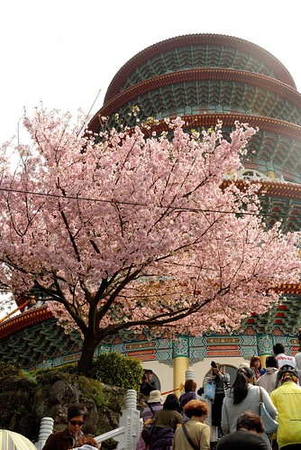
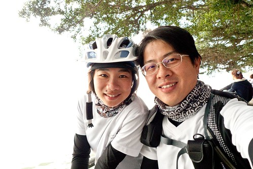
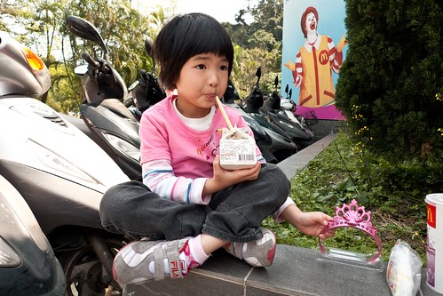

去年底在做今年年曆時  我說少了櫻花照片的年曆少了份春意 而原本2月中要上武陵過夜賞的櫻花也因當時花況未大盛而臨時取消了 期待兩個月最終卻沒能賞到櫻花讓我很悶 很悶... 而就在我跟徹爸說找天天氣好的時後陪我騎車去淡水吃阿給時 徹爸竟提出了那就乾脆騎車上天元宮賞櫻吧! 啥咪?! 真的還假的? 我沒騎過連續山路也深覺自己上山絕對變狗熊的說 可是徹爸的提議讓我很興奮... 為了騎車去賞櫻 我荒廢兩三個月的飛輪運動再度啟動 因為實在很怕騎的狼狽甚至掛在半路上阿 倒是徹爸一點都不擔心 他說"又沒什麼 頂多就是牽車走上去而已啊" 呵呵! 幸好! 有練有差 我應該還算有從容的騎上山且賞到了櫻花 YABE!! 

距離去年有了自己的第一台登山車到關渡的試騎 已經又過了一年 可以明顯感受出自己這一年有變強一些些喔... 除了大稻埕的短暫休息外 一路到關渡才再休息 抵達關渡宮看到林立的小吃攤 徹爸嚷著 "肚子好餓 好想吃阿"  我說現在也才10點多不過出門一小時而已說 不過徹爸說"要吃飽飽等會才有體力上山" 所以兩人一人一隻豬血糕外加共飲一瓶沙士 其實我怕我吃太多等會騎到吐 所以很克制的只吃了2/3根的豬血糕 汽水也只喝幾口 剩下的都是徹爸解決的 吃完兩人坐在樹下 微風徐徐 突然覺得這樣睡個一覺好像也很好說 呵呵...果然吃飽就會想睡...  

離開關渡後 一路沒停歇的往淡水 然後從紅樹林站附近切出走淡金路 到淡金路後 看到那仿若大於30度(在我眼中)的爬坡 我的心忍不住顫了一下 懷疑"我真的可以嗎?" 才第一個坡就讓我騎的脹紅臉 胸膛隨著心跳明顯起伏著.. 而轉進北新路後 OH~ 連綿的山路雖然早已知道也開車走過 但還是讓我好想哭啊... 前面一檔後面四五檔 努力地 龜速地的緩步前進著 所幸慢慢抓到訣竅 隨著自己的呼吸節奏換檔著 而在還沒有狼狽的時後便追過賞櫻的車陣 經過車陣時生平第一次有這樣的感覺 就是即使自己騎的很慢 但還是贏過那一堆車啊! 感覺真的很爽 很爽!! 中午12點我們抵達了天元宮 OHYA! 今日最困難的已經過去了.... (摘下帽子後 看到我額頭上的帽痕 徹爸笑個不停) 

停好車卸好裝備 迫不及待的先來個兩人勝利照 

天元宮在愛愛三個月大時我們曾經來賞櫻過   當時人雖多但不算盛 只是這幾年 就如其他的賞櫻勝地如武陵農場 怎麼賞櫻的人越來越多 越炒越熱啊.. 

徹爸說 好像夜市喔 只有夜市的街上才會這樣人擠人吧 

抵達最盛賞櫻段時 看到第一株盛開的櫻花  不管人怎樣多先照個一張照再說 

大部分人都是在樹下照 不過徹爸另有見解 都是在人潮外圍尋找到最佳照相點 

沿著天元宮後面這段路 一整排的櫻花開的很旺很漂亮 但人很多... 

人真的 真的很多..... 

櫻花雖美 但觀察遊客各式各樣的賞櫻方式與表情反而更是件有趣的事 

走到這 突然想起實在應該買個東西邊吃 這樣等會好下山阿(吃飽點 重力加速度快些) 讓徹爸好好拍拍好的時後(其實徹爸很不愛在人多的地方拍照 而且沒有大景他都沒啥動力) 我又衝回攤販處買東西吃 

有櫻花就一定有蜜蜂 蜜蜂是櫻花照片的最佳配角 

蜜蜂屁股還剛好正正的被拍個正著 

原本早上出門時天空還陰陰的 想不到後來也是日頭赤炎炎 只是這樣的藍天白雲跟武陵的實在差太多  我還是最喜歡襯著乾淨藍天的武陵櫻花 

徹爸說這角度可是很經典的喔 

這張也是.. 可惜徹爸沒有廣角鏡 所以經不經典不能說... 

徹爸說 沒有阿徹跟愛愛 所以我是他今日外拍Model 可是人家都是穿很美來賞櫻 我穿的實在很... 當Model會不好意思的說 

沒有小孩在 兩人只好你拍我 我拍你 自娛娛人 (持續有在騎飛輪健身的徹爸 精實後越來越顯年輕了) 

天元宮的櫻花美歸美 但三不五時就會有個電線桿或是電線檔著 園方實在可以考慮好好規劃一下 甚至可以圍著宮再種植地密集一些 那樣會更精彩的 

離去前 徹爸說"最後來個一張"  不過我的頭上怎麼開櫻花了ㄋ ㄘㄟ... 

就像醉翁之意不在酒 我們的賞櫻之意也不在櫻花 在於兩個人一起騎著車上山 一起賞櫻 這些過程的小小滿足與感動 (尤其謝謝徹爸願意帶肉腳徹媽上山) 

要再著裝備上路時 徹爸看到掛在車上帽子裡掉了一瓣櫻花 又開心的嚷著"好有FU阿" 

我說倒是這車子停在滿地櫻花瓣的地上更有感覺吧 

下山時 連續的下坡就算我拼命按煞車 時速還是曾經快破40 第一次這樣下山騎車的我騎的心很驚 覺得如果這一摔可不得了啊... 花了個小時才上山的路 滑不到幾十分鐘便即抵達山下 今日第二目標是真理街文化阿給 所以下山後轉進淡水吃阿給嚕  吃完阿給再沿著老街晃晃  

很多年沒來過淡水了(起碼愛愛就沒來過)  雖然非假日還是小有人潮但挺愜意的 

我今日拼命抓著徹爸搞自拍 話說咱家徹爸的自拍技術真的不錯 

離開淡水我們又一路狂飆回板橋嚕 中間最高時速28公里破了我生平平路最高時速紀錄 

抵達家裡時是下午4點初多一些 從早上9點出門到此共7小時而騎車的時間4小時 總共騎乘63公里 當我聽到徹爸跟我說總共騎了63公里 我說啥咪? 你之前不是跟我說來回56而已 如果知道破60公里 我想我一定會拒絕徹爸這樣的賞櫻提議的... 晚上讓阿徹知道我們今日騎車兜風去時 徹爸說"你知道今天是什麼日子嗎? 媽媽告訴他" 我一臉自信的說"今天是白色情人情" 徹爸一臉被打敗說"不是這個啦.." 我說啥咪然後努力的想啊想..."阿! 今天是交往紀念日" 徹爸說"對啦 對我來說這個日子最具意義 因為第一次有女朋友了" 呵呵 我說你今天一整天都知道今天是交往紀念日阿 徹爸說對阿 我說我今天才都想說今天是白色情人節可以跟徹爸來騎車約會很幸福了說 想不到竟然是更具意義的日子阿 真是的..也不早點跟我講 讓我幸福感再多一些...

++++++++++++++++++++++++++++++++++++++++++++++++++++++++++++++++++++++++++ 賞櫻的前一天 其實便趁著難得的好天氣全家騎車去動物園 來回46.3KM 也就是我跟徹爸兩天中也騎了110公里的車啊 好像有點太拼了... 阿徹又好久沒騎車了 為了今年的旅遊目標而且阿徹真是越來越胖了 所以不管怎樣 這樣的好天氣 全家人都被媽媽吆喝一起去騎車 

前兩週週末都有跟徹爸去河濱練車的愛愛 今日礙於距離是給徹爸載的 愛愛優喝說"太棒了 這樣我就可以好好在後面看風景了" ㄘㄟ... 

去年徹爸跟阿徹便曾經從公館騎到動物園探勘  今日全家直接從板橋到動物園去 過公館後的景美溪自行車道人車都很少 有一種原始且寧靜的美麗 我很喜歡 

阿徹雖然很久沒騎車了但速度又比去年進步了 平均時速可以15KM上下了(回程時還時速20KM) 只是很愛哇哇叫 喊苦 喊撐不下去了...明明都可以的說... 不過回程時雖然身體真的累了 但因為有回家的動力反而可以一股作氣很猛的騎 

騎到動物園後我們沒進園 不過在麥當勞休息了近一小時 買了兩份餐以及從公館買的御飯糰 臨著我們腳踏車就地野餐了起來 ( 愛愛的飯糰早在景美段時便在後座嗑完了 邊賞風景邊吃飯糰還真愜意) 

吃飽飯足休息一下 頂著烈日(中午一點)要再準備騎回家嚕  騎車來這就為了吃麥當勞 挺讚的! 今年是我們家的單車年.. 四個人都要加油 以後要多多出門騎車去...共勉之~ 
