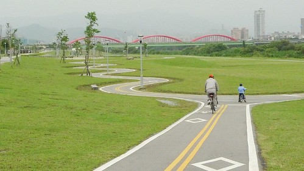
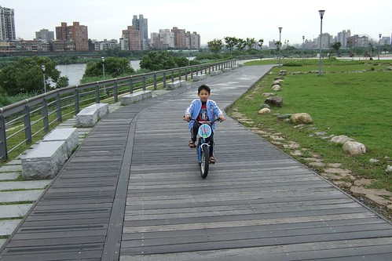
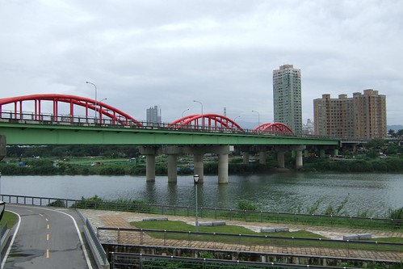
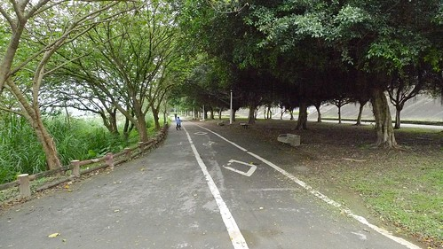
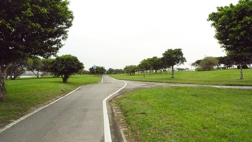
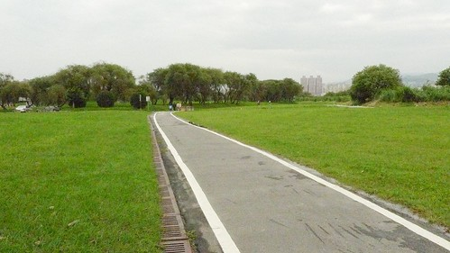
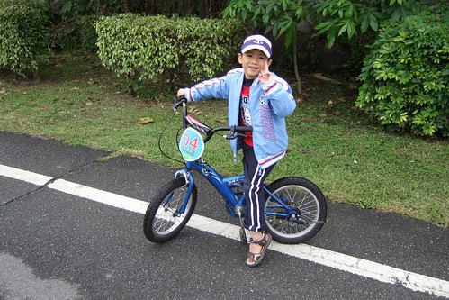
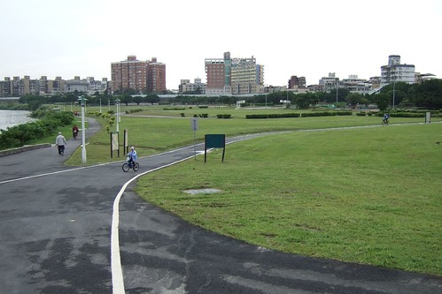
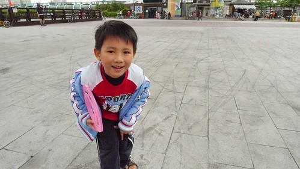

徹家的相機家族應該算很龐大  有過去式的小7 小5 現在式的小兩 小P 小3等.. 而在五月徹家又新成立了一個腳踏車家族 包含原本就存在的兩台童車 短短不到一個月的時間內陸續又添了幾位成員 辦遠傳門號送的小粉  我的上網買的美利達親子小摺(小紫)  阿徹的小黑 徹爸的小紅 我想這一切的"意外"應該起因於4月底的公館單車行吧

乘著風的感覺讓徹爸回想起高中騎腳踏車上下學的日子 當兵前每早騎繞著嘉義仁義潭瘦身練身體的日子 於是我們家的腳踏車家族就這麼如野火燎原般的快速成長 嗯~ 很好!  徹家走路爬山之外又多了"騎車"這休閒活動 希望不要哪天阿徹跟小愛被操到不想當徹家的小孩了 呵呵~

阿徹早在剛唸中班時就會騎沒有輔助輪的腳踏車了 但因為平常都是在家頂樓溜車而已 上路經驗不超過3次吧 所以平心而論阿徹應該還不能稱之為"會騎車的"

鑒於快要唸小學了 好像很多事都應該要會了 所以是時候該多多去外頭上路 累積實戰經驗的

雖然在嘉義阿徹已晉升20吋輪族 但還是覺得16吋大小適合點 所以今日租了台Giant 16吋童車讓阿徹試試 雖然一開始阿徹好像新手一樣騎的不是太穩定 但很快的就可以發揮在家裡頂樓的猛勁 衝衝衝了

其實那一天是因為想要到公館買拼圖  所以才會順道去騎自來水博物館旁的河岸車道的

也許因為一開始的沒有期待 所以後來才會這麼被驚豔

那天是沒有藍天白雲的陰濛天氣  竟也覺得台北竟然這麼美...

因為小愛是自己騎著從家裡載來的腳踏車 所以媽媽一開始就清楚這小女子今日只是來插花的 於是跟徹爸交代 他跟阿徹就放手的往前騎吧 能騎多遠就多遠 不用顧忌我們母女倆  我們母女倆會自己打發在起點等他們的 於是阿徹父子倆就這麼騎騎騎 衝衝衝 總計單程騎了5km(來回10K) 都快騎到連接板橋的華江橋了

沒跟著騎的我 只能聽徹爸轉述沿途的風光

而愛愛在自己騎了半個多小時後就開始嚷著好累 想要回頭 因此我們母女倆回到出發處玩滑梯

在等了一個多鐘頭還等不著阿徹父子倆歸來時 總算忍不住打了通電話給徹爸 電話那頭的徹爸用著興奮的語氣說"我們快騎到我們家那了 我們已經快到華江橋了..." 我懷疑的問"阿徹可以嗎?" (其實是怕阿徹嚇到以後也把騎車列為"黑"活動) 徹爸問阿徹"媽媽問你可以嗎" 然後我聽到阿徹在電話那頭大聲/興致高昂的回應我"媽媽 我可以的"

只是阿徹在跟我說了"我可以"沒多久後 就嚷著要回頭了

ㄘㄟˊ...下次先惦惦自己本事再來搞"人小志氣高"這種事唄

第一次騎著自己的車(雖然只是辦門號送的"小"摺)遊台北 徹爸非常滿意這樣的感覺 (總算不用騎出租站那難騎的車了) 也喚起徹爸細胞裡騎腳踏車的因子 所以徹家的腳踏車家族就這麼順勢的茁壯成長了

阿徹對於今日的第一次兩輪遊河也非常的滿意

相較於爬山又累又枯燥  他應該比較喜歡騎車迎著風的感覺吧 呵呵~  慢慢的會讓你吃到苦頭的...

 媽媽的感想: 因為天氣有點陰霾 也也許因為台北人習慣過午後活動 那日騎車的人並不是很多 更增添了在河濱車道騎車的愜意感 這樣騎著車 慢慢感受沿途的一草一"幕" 突然覺得台北這城市其實還蠻美的嘛....
