Blog好像落掉很多沒寫  甚至連花蓮的遊記都還沒寫完 呵呵… 就從熱騰騰又令人振奮的上週六下午臨時成行的外澳戲沙開始寫起吧~ 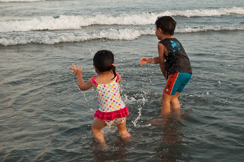

話說上週六徹媽早上運動完 跟徹爸2點睡完午覺醒來 兩人在那念著"要去哪ㄋ? 去哪ㄋ?" 雖然宅男阿徹一大早就說他一整天都不想出門想在家就好(想玩大富翁) 但是我跟徹爸實在不想一整天呆在家面對整間的寧亂以及小孩的吵鬧聲(其實我跟徹爸這麼勤勞出門是因為不想只呆在家罵小孩阿) 於是就在一句"走~來去玩沙"後 我們火速打包出門 只是就在歡呼過後就聽到遠方傳來轟?的打雷聲 但我們還是打算出門碰運氣 只是車子駛到內湖木柵時老天降起磅礡大雨 我們依照過往經驗安慰自己過了雪隧後將會是另一個天空世界 只是車子轉入5號北宜高後塞塞塞阿…尤其過了石碇時速大約只有20-30Km 徹爸開始打退堂鼓想要回頭回家去吃涮涮鍋 我們也做好準備從坪林交流道回頭改天找個非週末下午再來 只是想不到千辛萬苦的從石碇塞到坪林 出了彭山隧道時竟完全不塞了 阿徹歡呼著"沒有塞了椰"  我慫恿著"既然都走到這了半途回去很可惜哩" 於是徹爸只好放下他思思念念的涮涮鍋 一路順暢的往頭城外澳沙灘前進 到外澳前當然還先順路去買了阿宗芋冰吃 好好吃好滿足喔(邊吃邊高興有來)

到達外澳沙灘時已經是4點但是日頭還是很赤焰焰 雖然阿徹小愛早已經迫不及待的想要往沙灘衝 硬是被我們多拖延20多分鐘 而等到放生時她們竟馬上的就放開投入 尤其小愛不到一分鐘就"咚"的坐在沙泥中玩起來 跟以往一開始的含蓄顧忌差很多 不知道是長大了勇氣變大了 還是經驗多了所以熱的快…

(趁著回車上拿東西的時候徹爸拿了一把傘要給他的"寶貝"遮陽  我說徹爸還是比我孝順... )

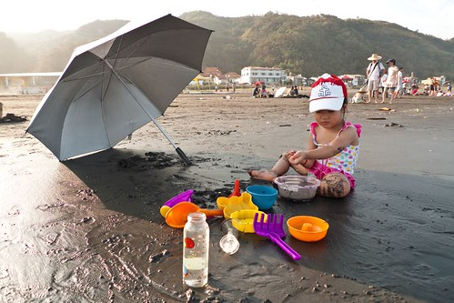

週六的人潮不算少 但還是很容易的找個潮間帶當做自己的地盤 這的沙超細 顏色也比較深 其實感覺有點像是在玩爛泥巴說

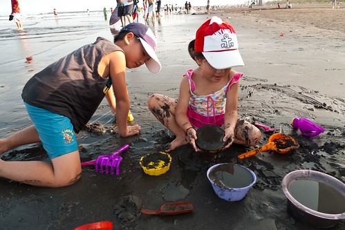

有看到照面中那對坐在椅子上的夫妻嗎?讚啦 我們也要再去買一把摺疊小椅子(車上已有一把) 這樣以後出門我跟徹爸也可以坐在椅子上納涼就好

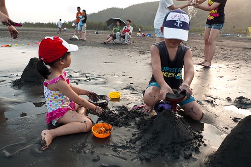

徹爸提議來堆沙塔 看誰堆的比較高而且禁的起海浪侵襲 雖然我堆的有點醜但是很結實的哩 一小時候依然屹立不搖 且有小孩經過時 忍不住敲了敲後說"哇 好硬阿"   可見我過程中壓拍的很紮實

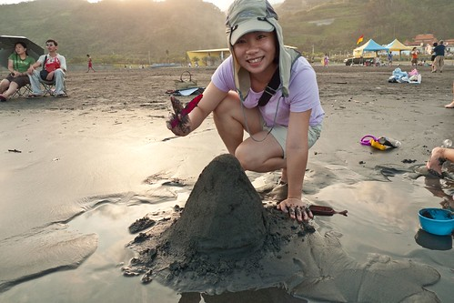

阿徹做了噁心大便塔

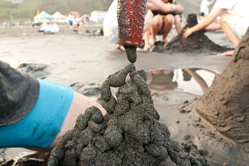

我真的很訝異小愛這次這麼不"潔癖"  尤其那黑黑的沙真的很像爛泥巴說

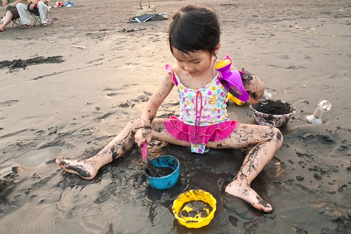

徹爸說有阿徹哥哥帶果然有差 小愛長大的很快

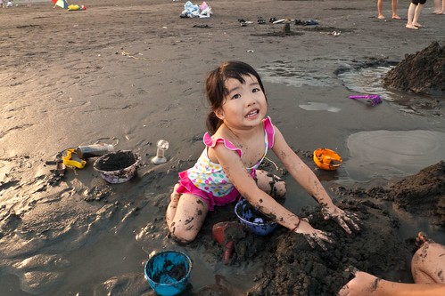

這個阿徹哥哥當然又是玩瘋了 鑒於8月初在坪林曬的太誇張(有在flicker上看到紅屁股的人就知道有多誇張)  這回要阿徹非得穿著上衣下海

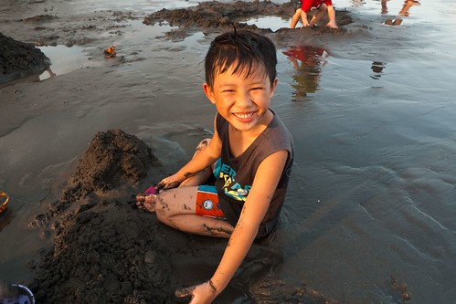

5點過後太陽準備下山 沒有了熾熱的感覺 取而代之的是微風徐徐的舒適

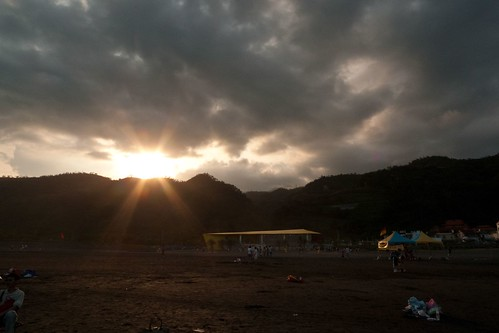

舒適到每個到這沙灘的大人小孩都忍不住下海了

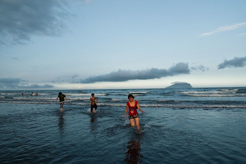

我跟徹爸又無聊的玩起互拍  經過指點媽媽這張照的還不賴吧

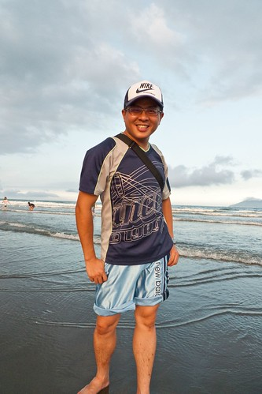

這是我用一個卡通威脅阿徹 換來的合照

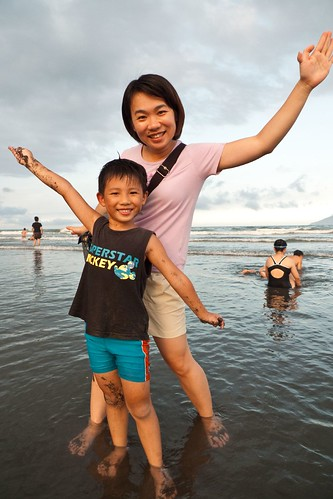

有人在我們旁邊挖鑿了一個大水壩  等她們走後阿徹小愛坐享其成的接管水壩 只因媽媽一句玩笑話"可以在裡面泡湯喔"  兄妹倆一直千里迢迢的從大海裏舀水注入 看到她們的傻勁我跟徹爸忍不住笑她們傻   阿就等一個大浪過來就注滿啦

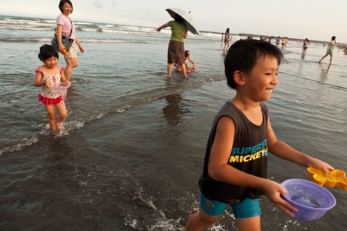

挖的很大的一個壩...

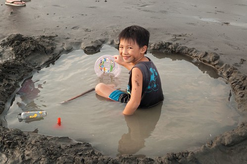

浪打過來時阿徹心急的一直要攔砂護牆 不過依舊是傻勁的徒勞無功 又看不下去的我們跟他說 你要做的不是堆圍牆而是要把裡面再挖深...

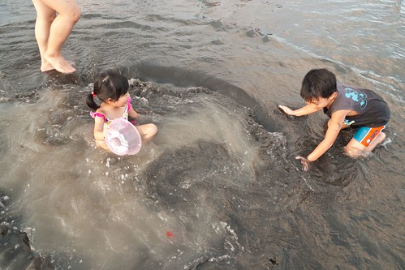

小愛還真的把他當作湯池泡起湯來了

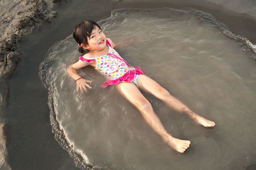

不過這應該是跟關仔領一樣的泥湯池

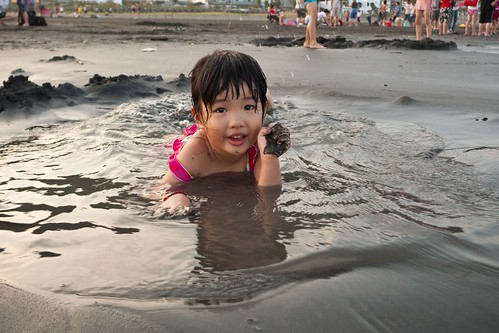

不小心阿徹戴上了沙眼罩

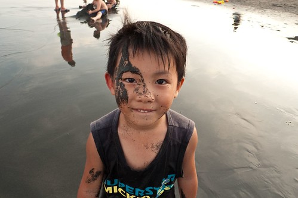

還是泡在海水裏比較過癮啦 這麼大一大片隨你泡

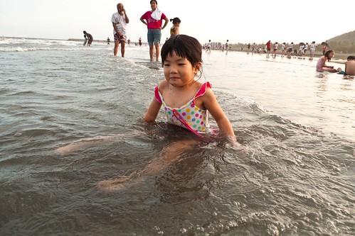

去年來的時候小愛都離海遠遠的 不小心跌倒吃到海水就嚷著要收工 今年來已經可以自己一個人很勇敢很自在在海裏玩嚕

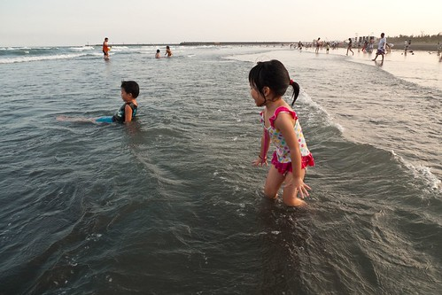

甚至還在水裏擺起了舞蹈動作哩

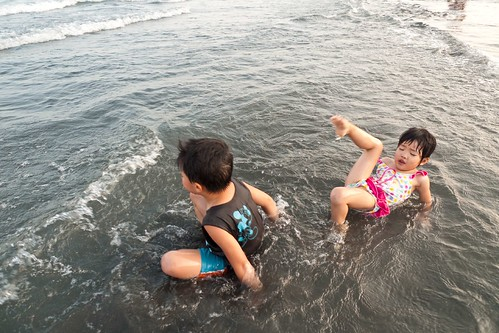

看著阿徹小愛玩的這麼開心 我跟徹爸說就這麼臨時起意的一下午就讓兄妹倆玩的這麼開心 4小時的車程往返加上2小時的戲沙 總共也才不過6小時之內發生的事 2點的時候我們還躺在家裏的床上 5點的時候我們在頭城海邊 而晚上8點的時候我們又已經坐在板橋常關顧的涮涮鍋店裡大口喀湯了 我真是愛死北宜高了~

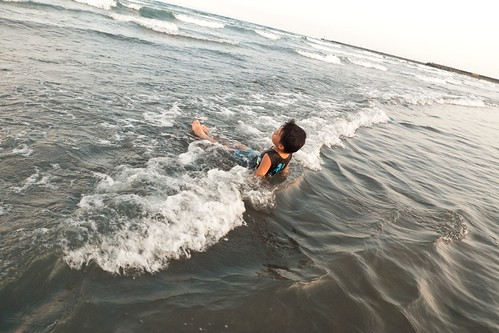

過個雪隧就可以來到截然不同感受的宜蘭  難怪雪隧常在大塞車

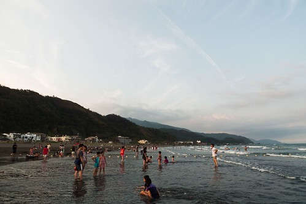

今天的外澳 遠方天空那片長雲襯的龜山島更美了

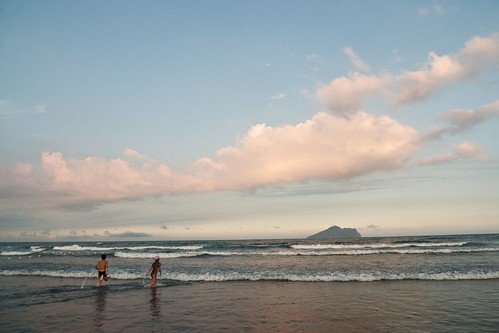

YA! 今日出擊大成功!!   明年夏天再這麼心血來潮來外澳戲沙吧~

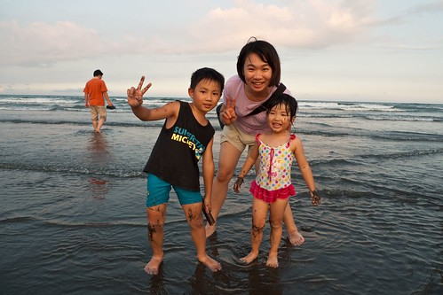

補充: 有關最近一: 這陣子工作沒有很忙 可以慢慢的仔細的玩資料寫程式 但是在辦公室的臉皮越來越薄 越來越不好意思偷時間小寫一下東西 而年紀大了中午的午休時間也越來越不能不小憩一下 所以似乎只能利用晚上在家的時間寫blog了 只是最近回家後有空的時間好像又都窩在沙發前看日劇 木村的Mr-Brain還有天海佑希的Boss讓我夜夜沉迷不已 唉~果然電視是毒藥 一旦染上時間就都被偷走了…(自己愛看還牽拖..)

最近二: 這一個月因為阿徹結束幼稚園課程 開始進入小一預備期的正音班課程 全家好像就這麼跟著提早開學似的 常常為了阿徹的作業而大人罵小孩哭 雖然阿徹哭一哭後又常好像啥都沒發生沒改變過似的 (這真的不知道是好是壞) 但是 唉…我很不愛這種"上小學"的感覺說… 有點擔心屆時真的開學後會有小學適應不良問題的會是媽媽我而不是阿徹 (就是這原因讓徹媽一直不願意去寫阿徹畢業典禮的日記 然後blog就這麼卡住了)

最近三: 停了一年多的體適能瑜珈課程 在唸了半年多後總算總算重新開始了 上週六(8/15)早上六點半起床出門去復興北路的教室上7點半的課 雖然新的教室 新的老師不是那麼令人滿意  但一群人一起運動吶喊流汗的感覺很棒 兩小時的課程雖然得換來接下來數天的筋骨痛但是連徹爸都說 "哇塞 怎麼覺得你一整個容光煥發" 哇哈哈!!! 希望以後自己有機會讓自己多容光煥發點….

最近四: 雖然今年夏天依舊很熱 不是徹媽的季節 但是這個夏天我跟徹爸有比較孝順帶阿徹小愛去戲水 從七月底的自來水博物館 8月初的坪林烤肉玩水 到上週六的宜蘭外澳戲沙 自己都要給我跟徹爸這對孝子孝女拍拍手了 奇怪怎麼在自己對小孩越來越兇的同時卻也越來越孝順了 唉…
