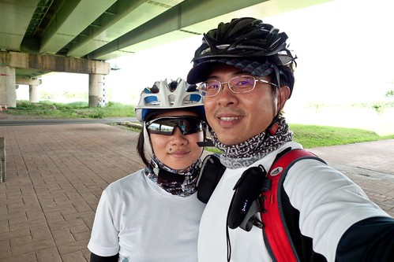
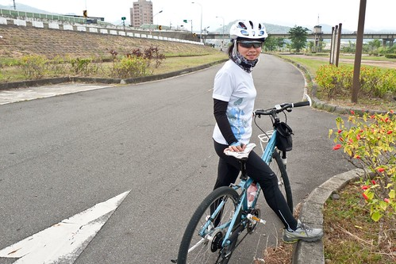
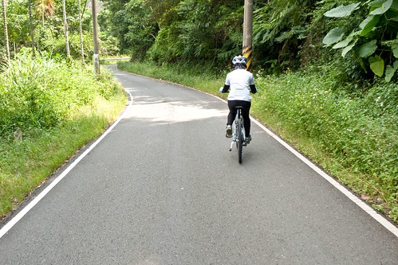
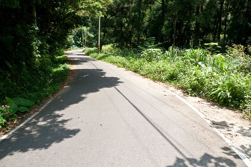
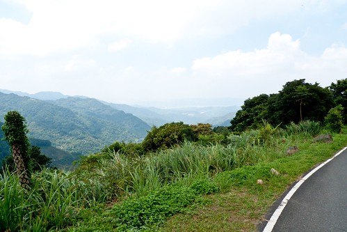
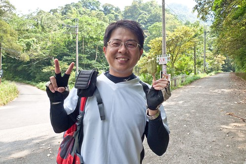
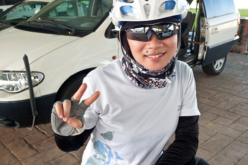
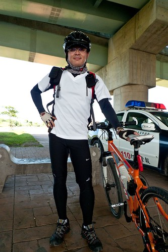
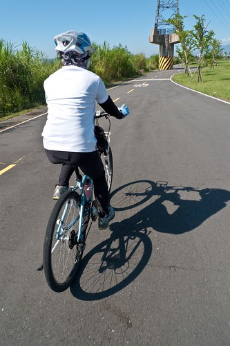

我跟徹爸好久沒有的單車約會 總算在秋涼加上小主管出國做研究時成行了 徹爸一兩年前從新店山區騎到三峽熊空山腳下後 偶而都會跟我說著"有機會我帶你去騎熊空" 於是預計這月要騎車後 便要徹爸好好的研究一下路線 徹爸回報"來回54KM 山區路段只有5KM" 我對照上次天元宮3KM多的山路 覺得自己應該可以 於是便信誓旦旦地跟著徹爸去熊空 結果安知殘念阿... 徹爸跟我說的5KM山路硬生生的變成10KM 而且從進入三峽到熊空山腳下便已是一路的緩上坡而且這段路途便已超乎我們想像的遠 所以最後我在山路的一半便頹然放棄 獨留徹爸自己一人攻上熊空 雖然未能跟徹爸一起上熊空心裡有些遺憾 對於自己的不成材也有點厄然 但夫妻倆一起這樣狼狽 這樣汗水淋漓 喝著徹爸從熊空帶下來的冰紅茶 感覺還是很窩心 很棒! 徹爸很擔心我會不會被嚇到 以後再也不敢跟他去騎車了 呵呵! 我想我應該沒這麼遜吧! 不過下次真的要多做點準備 不論是食物還是肌耐力...

這是我們第一次沒有偷偷摸摸 背著阿徹愛愛去單車約會 一早徹爸便一身短褲送阿徹去上學 明確告知阿徹"今天是爸爸的休假 要跟媽媽一起去騎車" 很奇怪 阿徹竟然一反常態的沒有抗議(上三年級換老師後 有愛上學喔) 不過可能也知道爸爸媽媽兩個人的單車約會路線對他來講實在有點苦 所以也沒啥好羨慕的啦! 我們送完徹愛去學校也打理好車子後 九點從板橋家裡出發 兩人從萬板路水門外的堤外車道一路飆到浮州橋下(10KM)是今天的暖身  徹爸看著我一路亦步亦趨的跟在他身後 肯定我的高轉速飛輪練習似乎有效喔 聽徹爸這麼說 我更是賣力的騎阿...   (這時後徹爸還很開心今天可以很早就收工了) 後來忍不住懷疑是不是因為一開始的衝過頭以致最後的鍛羽  過土城後 我們轉切入一般的道路往三峽邁進  從這時後開始便開始是慢慢的緩上坡 稍微變個檔 我還算可以應付 這樣騎個快10公里來到山下 徹爸所謂的通往熊空山路的起點小村莊時 徹爸跟我說 接下來才是山路的起點 我忍不住哀嚎著"啥咪 剛的都還不是山路喔?" 我心裡開始挫 不過心想 "好吧! 5KM 撐一下應該還可以撐過去吧!" 所以這時候我還能笑著在這張 徹爸說的很有名的導覽圖前留念一張  拍了第一張 徹爸說太八股了 於是再補張俏麗版的  其實我懷疑徹爸這時後可能就發現他之前定位錯誤 錯估路程數了 不過他還是亢奮地鼓勵支持著我往他所謂的山路前進 雖然有點喘 幸好我還記得請徹爸幫我照一張騎車的背影 徹爸笑說"還記得要照相 可見還很好!"  可是OH MY GOD! 就在我看著路邊的某山上咖啡廳指示牌從一開始的5公里變成3公里 (這指示牌也有鬼 一開始降很快 後來中間還增加數字 騙人嫌疑很大) 雖然覺得自己快耗盡但起碼還欣慰只要再撐個兩個公里左右就可以收工時 看到路旁熊空的指示牌標示著8KM時 我差點沒崩潰了 我忍不住大喊著"我不要騎了! 8KM 我不可能騎的上去的" 真只差沒轉頭就滑下山 徹爸只好連哄帶騙的要我再多騎一點 就算用牽的也沒關係 就當是來爬山 只是手上多了台車子 於是後來徹爸陪我牽了好長一段路... 可是就算用牽的 牽到後來還是覺得好累好累 全身使不上力  氣好虛 我生平第一次這種感覺 我說不出的感覺 感覺身體好像快不是自己的 累到需要停在定點休息好久好久 總算覺得自己好像可以了 可以再上路了 可是再上車沒多久(時間還超級短的) 我的戰鬥力又咻的一下全消失不見 跌入無底深淵... 看我這樣 徹爸很是自責他定位錯誤 錯估山路的里程  以致我們只有揹水上來卻沒有帶任何的食物來補充熱量 從早上9點的出門到11點半徹爸獨自攻頂 我們只有汗水的大量流逝卻沒有任何能量的補給 所以徹爸事後一直強調(安慰我) 我是有進步的只是後來血糖太低所以才... 徹爸很怕我被嚇到 以後不願意再跟他一起單車約會了  最後在離熊空接近5KM時 我在一個稍微會有點人跡出現的叉路口徹底放棄了 徹爸本說那就兩人一起下山吧! 可是徹爸已經是第二次來到熊空山下了(上次礙於要回家接小孩 沒上去) 我衷心希望他這次能達陣 而且這樣以後我就不用再被揪來了(如果他沒達陣 我一定會愧疚的想再陪他來的 只是可能要練很久) 我跟徹爸說"你衝上去熊空 幫我帶冰紅茶下來給我喝 補充熱量" 兩人行前幻想著的流汗過後的冰紅茶 憑著老婆對紅茶的渴望 徹爸(擦乾眼淚)獨自一人奮力的繼續騎上去 我們預估著剩下的4公里大約40-60分鐘可以完成吧! 過了30分鐘後 徹爸打電話給我(電話響時 我開心著"徹爸真棒 解決了")說"剩下2公里了"  " 我忍不住"啥咪" 徹爸說"幸好你沒上來 後面又更陡了"  真是慶幸自己沒有逞強阿 又過了20分鐘我再打電話給徹爸 想說他應該到了吧 結果徹爸說"還剩一公里" 我說"啥咪 過這麼久怎麼還一公里"  結果徹爸說他也不行 下來牽了一公里 (為了老婆的紅茶 好辛苦) 最後的一公里 徹爸跟他拼了 騎到終點 一群騎MOTO上來的年輕人忍不住竊語著"天阿 他用騎的上來耶" 徹爸笑說幸好最後一公里有ㄍ一ㄥ上去 讓人以為他很厲害(其實真的很狼狽阿)  徹爸在終點的熊空有機農場買了老婆交代的冰紅茶 還有他覺得很好喝的東方美人茶  根本無心賞景的 趕緊再滑下山找老婆  看到我後 徹爸邊脫他的背包邊喊著"快! 快! 快! 有個東西" 揪感心! 徹爸竟然在山上買了隻雪糕 小心翼翼的保溫在包包裡 帶下山來要給我吃阿! 當然還有好喝的冰紅茶還有徹爸讚不絕口的冰東方美人茶 身心都獲得血糖補充後 兩人一起開心的滑下山  一路滑阿滑 滑了半個多小時才抵達三峽的邊陲 早上本來兩人預計要去鶯歌吃好吃的排骨飯的 這時後沒力氣也沒胃口的只想簡單在7-11解決中餐(已經一點半了) 不到一百塊的涼麵+廣東粥+一瓶沙士 就是我們辛苦約會的中餐 兩人忍不住自嘲"舒舒服服的在家 或是去看場電影約會不要 跑來這裡狼狽"  而且吃飽飯 兩點鐘的日頭赤炎炎下 我們還有10多公里的路得騎回家 約會有沒有這麼拼 這麼苦阿?!  再上路後 我們討論著等會回家後要去吃什麼? 甜不辣 還是挫冰 粉條冰... 藉著幻想轉移住意力 可是騎到浮洲橋(剩下10公里) 腳開始痠了  鐵漢徹爸好像也累了  徹爸說"山路拖太久了 感覺比較累" (都是老婆害的)  可是兩人還是得努力的騎回家... 直到看到大漢橋畔巨蛋的五跟高塔時  我們真高興我們快到家了!  後記: 1. 回家後我的腳痠了兩天 而徹爸痠了三天 其中的差別在於我有體貼的老公每天幫我的腳按摩 2. 徹爸回家後很認真的反省檢討這次失敗的原因 他說這樣下次才能改進而且他可能真的很怕我怕到以後不要跟他去騎車了 3. 最後徹爸的騎乘公里數是63KM  我扣掉9公里大約54KM 果然是去之前 徹爸跟我說的公里數以及山路數  可見我目前的能力大概真的只能到這樣 4.  鑒於這次的失敗加上老婆還願意嘗試 徹爸努力研究思索著下次可以去哪裡騎 不過聽了老婆的一堆心理話 老實講徹爸現在應該很苦惱到底能安排什麼樣的路線 到底能怎樣訓練老婆吧! 想想想....為了下一次努力的想想想.... 5. 阿徹聽了我描述的慘況後 問我等爸爸的時候在做什麼 我說就看花 數花瓣數 還有看著小螞蟻努力的搬著大螞蟻屍骸回家... 對了 我有找到四頁跟五頁的幸運草  原來沒事做只能看草時還真的就能找到 不過四頁是幸運 那五頁ㄋ? 怪胎嗎?!
