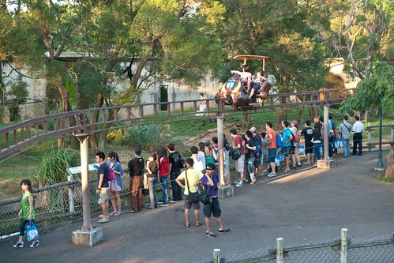

其實我跟徹爸都是孤僻 不愛參加公司團體活動的人 去年忘了什麼原因 我們"長這麼大"來第一次參加徹爸公司的家庭日活動 那一天是暑假的最後週末天 我們足足開了4小時才從板橋到宜蘭武荖坑的活動地點 想當然爾 不愛熱鬧又被塞怕的我們 日後參加家庭日的意願肯定會打個大X... 今年徹爸公司的家庭日辦在六福村  時間還是暑假過後的九月中 看到這地點我跟徹爸兩人不約而同想到阿徹 因為每次走高速公路經過"六福村"路標時 阿徹都會唸著"我好想去六福村喔..." 於是為了一雙可愛兒女(這樣講有沒有更突顯我們的孝行) 我跟徹爸只好再次當孝子孝女 

那天早上我還先去學校參加阿徹的家長會 11點提早離席跟徹爸們會合一起出發 不知道是因為開學後 還是出發的早 我們12點便抵達六福村且車子還能停在離大門口近的地方 不過12點半才開始的報到 已經有一長票的人等著  我們報名了四個名額 跟去年一樣領了四份手冊以及四袋滿滿的紀念品 徹爸先把不需要的紀念品以及袋子都拿回車上放 而我則是努力的研究活動手冊以及園區導覽 徹愛則開始把玩著紀念品之一的掌上型風扇  阿徹還難得地很認真的自己研究園區地圖 劃出他想要去的地方 我們也一起討論 擬好作戰策略 先小逛園區 然後等著1點半去預約兩點的DIY 兩點的DIY做完後再開始好好的跑 想要看的表演或是展館 然後就看我們的耐力可以到幾點 如果能撐到晚上8點的煙火表演也沒關係 以上是我們的完美計劃! (最後執行度50%不到 哈!)

我跟徹爸對於六福村最後(應該也是徹爸唯一)的印象是 大三的暑假 我們兩人以"好同學"名義一起來的 10多年前的事了 想當然爾現在的六福村早已不是我們記憶中的六福村了 而且我們的心臟又更加的衰弱了.. 我們也知道阿徹跟我們兩人一樣的沒心臟 不會想玩刺激的遊戲 只是沒想到有大膽愛封號的愛愛竟然比著一樣樣的飛車 盪來盪去的XX船 喊著"我好想要坐喔" ㄟ...阿爸阿母沒這麼猛的心臟陪你坐 也沒那樣強的心臟讓你自己去坐啦!  幸好愛愛向來認命 不會太嚕著做我們不想她做的事 所以當他比著旋轉木馬時 我們當然樂意的一起奉陪  這應該是徹爸第一次一起跟我們坐旋轉木馬吧 之前他都是在場外看 幫我們拍照而已 感覺他有莫名的興奮感喔!  上回花博在兒童樂園 愛愛還硬要我跟她一起搭馬車 這回的條件是她得自己搭一匹馬  經過中班下學期的小人國外宿洗禮 愛愛的膽子大許多 或許也可以說是被老師 同學給激發出她原本就潛在的大膽本能吧!  難得來一次六福村 而且除了這次 阿徹們也很難奢望我們再帶他們來 所以看到有可愛的大公仔時 我都會問徹愛要不要照相阿 雖然玩的沒人家多 那起碼相不要少照吧! 呵呵  中間因為卡著要排隊預約DIY 加上預約好時間的DIY 我們多在園區裡來來回回走了幾趟 大熱天的 還真的挺折騰人的! 尤其參加家庭日的人真的粉多...  可是因為徹愛向來很愛做DIY .. 所以做父母的就..孝順吧!  活動提供了三種DIY 我們選擇了排隊人潮最少的個性磁鐵DIY 成品效果..ㄣ..ㄟ...並沒有預期中的好 不過小人有開心就好! (家庭日的最大目的阿)  2點半做完DIY 趕緊去找3點海綿寶寶見面會表演的館場 我說"為什麼六福村有海棉寶寶阿?" 阿徹說"因為小人國以前有A夢 現在有OPEN醬" 徹爸說"可能因為有人發現這招有效 所以現在的樂園好像都會有個主題卡通明星" 聽完..我還是滿腦的不解... 因為感覺實在很迎合哩  原本擔心看表演的觀眾會很多 得花點時間排隊  想不到等待的觀眾三三兩兩 我們也不想再走遠 就在門口邊等邊跟海綿寶寶跟派大星照相 我個人比較喜歡派大星說  憨厚可愛 不若海綿寶寶那樣過於伶俐及愛講話..  其實我並是太喜歡海綿寶寶這個卡通節目 因為實在覺得很無厘頭 可是海綿寶寶就跟喜洋洋一樣 每當我允許小孩可以看電視時 打開兒童頻道常不是海綿寶寶就喜洋洋 曝光率實在有夠高滴 偏偏阿徹跟愛愛對於這兩個節目又都蠻喜歡 常看得笑呵呵 有一次我問"你們不覺得海綿寶寶很無聊阿"   兩人異口同聲大喊"不會阿" 徹爸說"其實海綿寶寶蠻有義氣 對朋友很好" 嗯! 好吧  起碼海綿寶寶這精神還值得學習!  而阿徹一直唸著想去六福村 為的就是來看海綿寶寶 所以我們這回真的是讓徹愛來"追星"的!  (穿插: 這是阿徹DIY的成品 一隻磁鐵豬 )  隨著主角們的登場 全場氣氛是一整個越來越High阿 "是的 船長'的回答聲絡繹不絕 "海綿寶寶 海綿寶寶..."的主題曲歌聲響震全場 不只小孩手舞足蹈唱著 還有許多媽媽也跟著大聲唱合著 我看的嘖嘖稱奇!  阿徹明明很愛海綿寶寶 可是好像礙於小學生身分 不好意思一起唱更別說站起來跳舞了 而小愛雖然不好意思站起來跳 但手會忍不住跟著一起舞著 而歌是越唱越大聲  活動其實就是幾首歌的帶動唱 大約20分鐘便結束 讓人感覺真的有點"虛"說.... 不過可能追星活動就是這樣吧! 聽明星唱個幾首歌 然後接下來的簽名/握手/照相會是另一個重點  我們排隊等待了20多分鐘也輪到跟海綿寶寶合照了  對於這樣的追星行為 我到現在還是一整個覺得好笑(我竟然會做這種事) 不過由此可見 我跟徹爸對於小孩還算不壞啦! 不是只會帶她們去騎車 去荒郊野外而已... 接著繼續應阿徹的要求 我們繼續去拜訪章魚哥的家  派大星的家  還有海綿寶寶的家  總算追星行程結束...  完全顛覆一般人對於六福村印象的遊玩方式吧! 追完星 我們肚子餓了 也才開始好好的使用活動護照上的抵用卷 在回家之前 必須努力的把幾百元的抵用卷吃完 (晚餐還有MOS幸福套餐可以領 所以抵用卷是要當點心吃完的) 徹爸買了一片炸雞排  雖然剛炸起而超級燙口 雖然最後只剩下一小塊 三人張大著嘴呼嚕呼嚕地急著吃 搶著吃....  剩下的最後一塊 徹爸說"這都是骨頭 沒有得吃了" 結果兄妹倆說"哪有 那還有肉" 逼的徹爸只好把僅剩的一塊再分成兩塊給兄妹 完全沒獲得滿足的徹爸一臉OS著"最後僅剩的一小塊 你們也要瓜分..."  小人不留情的搶食掉最後的雞肉 獨留徹爸允指回味  突然阿徹良心發現似的 把他的最後一口給了徹爸   真是不往費徹爸這陣子對他的好阿!  我原本計劃可以看一兩個表演節目的 可是徹愛一心只想著去非洲區騎下午看到的空中腳踏車 於是我們排隊等待了一個小時 騎到愛愛指名的腳踏車  此刻 還因為前一天的貓空行而腳痠的我跟徹爸 腿已經快要不是自己的了 孝子孝女真的不好當! 兩人得努力撐住..  我說 我一定要跟阿徹騎 因為我沒力了得靠阿徹的壯腿  而小愛就交給徹爸照顧了(一家之主的擔當阿)  等待了一個小時 最後啟程出發時 四個人的心情果都很High  不過老實講 除了愛愛外 我們其餘三個人都覺得這腳踏車有點恐怖說...   因為就這麼一個細細長長的軌道支撐著車子阿 坐在上面 身子都不敢亂動 深怕可能一不小心 重心不穩就倒一邊去了  不過這種異於一般遊客 由上面看動物的感覺是還真有點屌啦  整趟大約5分多鐘的騎乘 雖不短但也結束的讓人覺得快了點..  騎完腳踏車已經5點多 非洲動物園區也陸續準備關閉 今天沒能好好的看到所有動物有點可惜  為了繼續把抵用卷花完 我們回到中東區買好像很好吃的土耳其冰淇淋 QQ像麻吉的口感 獲得我們四個人的一致好評  我們就坐在一個花台邊 吹著風吃著冰淇淋  徹爸說這真是今天最舒服 愜意的時候  後來看到一個魔毯救公主的動態電影剛好差不多時間要開演 雖然向來怕恐怖 怕刺激的阿徹有點不願意 但在我們勸騙下還是跟著一起排隊 但等到準備進播放室 看到預告片段後 阿徹立刻紅了眼框抓著我要往外衝 不論我怎樣保證 勸說就是不願意進去 後來我們兩人獨自散步在園區等徹爸她們的時候(徹爸完全不知道我們出場了)談論起這事 阿徹清楚的跟我說'我就是不喜歡看恐怖的東西 所以我不要看!' 如徹爸說的'清楚自己的優缺點 能避免缺點也是個優點'!  同時間 愛愛跟著徹爸看救公主看的很開心 只是徹爸說節目內容一樣有點虛哩 當他覺得好像才要進入高潮時 愛愛就喊著'公主救到了' 幸好公主很快就救到讓我跟阿徹不用在外頭等很久... 六點半四個人會合後 領了摩斯三明治當晚餐... 父子三人等著我領餐的時候玩起小風扇..這是愛愛的風火輪  兄妹兩人一起的風火輪(阿徹眼睛還一直喵舞台上的卓文宣)  愛愛的萬花筒寫輪眼!  那天回家的路上 阿徹說'六福村不好玩! 以後的家庭日如果是去公園或是大自然的地方 我們再參加 如果是像這種的樂園就不要了 好累又不好玩..' 呵呵! 我們家果然不是玩主題樂園的咖阿! 一整個不知道怎麼玩也沒什麼動力玩 就連我的blog也寫的超級卡.................
