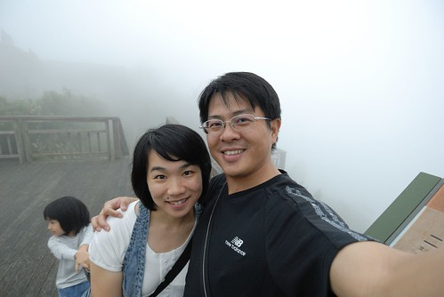

隙頂 位於阿里山公路五十四公里附近  大部分的人可能從沒聽過"隙頂"這地名 但只要開車上過阿里山 就絕對曾經經過這個地方 甚至有多注意到這個茶莊林立的小社區 即使如今當地農民和政府觀光單位努力發展為休閒農業區 宣傳隙頂為阿里山的前院 但大半的車還是都過門不入地趕赴阿里山... 隙頂的地名源自於兩座山谷夾矗 原住民需涉山谷之隙徑以下山入城 故名為隙頂 而又因這裡是阿里山公路上最近的觀霧地點也是眺望日出的地方 所以亦曾名為曦頂 講真的 如果不是自己來這一趟 感受到這裡雲霧變化景觀之美 我想我也絕對難以體會這個前院有多美 有多迷人! 而永遠只是過門不入的錯過她...  

隙頂位處海拔1200公尺左右 行政區域為嘉義縣番路鄉公田村  也就是我出生的那個番路鄉! 只是我小嬰兒時全家就上台北 所以實際上"番路"對於我的意義 只是我每年會回去的 阿爸阿母的故鄉 也一直印象那裡很不開發很不方便(從我是產婆在家裡接生還有我出生申報的生日比實際生日晚快一個月得證) 但是菜公店的土雞城很好吃 還有一個姨婆在隙頂種茶... 所以隙頂對於我來說並不是個陌生的地名 自小便常聽親友提起過 不過我會注意到隙頂 興起想去隙頂住一晚的念頭乃源於兩三年前徹爸給我看的一篇PO文 驚豔於車友文中的隙頂日出雲海 就此便一直把隙頂放在我的旅遊口袋名單中! 只是隙頂真的離嘉義市不遠  車程大約只需4-50分鐘 所謂的越近的地方越是遙不可及 也因此這麼多年了還是一直停留在打算中 直到今年八月與徹爸兄姐討論起家族旅遊的事情時  我提出了去隙頂的行程建議 徹爸的哥哥姐姐看到的當下反映應該都是"啥? 這是那裡?" 進一步知道是在阿里山公路上的小村落時 心裡也還是納悶"這裡有什麼好玩的嗎?" 可是我像寫報告似的 列出一堆文字看起來風景秀麗的步道 還有應可媲美旅行社的規劃說明 於是一大家子人就這麼被我一起騙來隙頂了! (我真覺得有點誘騙的性質啦)       

隙頂地區是傳統的高山農業區 金萱茶 烏龍茶 甜柿以及蝴蝶蘭是當地特產 雖然鄰近有不少步道 但觀光資源算是還停留在未開發的天然處女地  二延平山步道是隙頂最有名 最經典的一條步道 沿途除可觀賞到怡人的竹林 茶園景觀外 天氣好的時後還可以俯瞰到嘉南平原 仁義潭以及曾文水庫風光 亦可眺望玉山主峰 (民宿主人說 天氣超級乾淨的時後甚至可以看到澎湖群島上的燈光   )

那天下午3-4點我們一伙人浩浩蕩蕩的一同拜訪二延平山 我依照行前做功課看到的網友建議從54K傳說村的路口進入  網友說這裡進入比較平緩 可是對於一家子的老小來講 好像還是陡了些  為了轉移大家不想走的心情 我說起網路上看到的介紹(我是豆油小姐): "據說，日據時代這裡藏有土匪，日本人追捕至此，曾逮捕了不少匪徒，但仍有少部分的土匪逃竄，逃亡時，土匪埋藏許多黃金在此，由於在當地口耳相傳，形成一段傳說，因此才將此地命為傳說村，而循山而上的小路，命為傳說路"

 聽我這麼一介紹後 果然有激發起小人們(尤其是阿徹)的好奇心與戰鬥力 豪心壯志的說要去找黃金 甚至偶會拾起石頭努力的丟打 期待黃金的出現 雖然真的黃金當然沒找著 不過這裡的石頭風化嚴重 所以敲碎的黃黃模樣倒也有幾分相像  順著傳說路往二延平景觀台的方向走  襯著山巒的茶園景觀煞是美麗  而這裡的茶園景觀跟一般茶園有點不一樣茶園裡砌著一排排的石牆 原來是當地居民為了種茶 將整地時挖出的巨石堆砌而成的辛苦結果 旅遊告示牌上稱這為"巨石駁坎"  正當一家老小好不容易快抵達二延平的景觀台時 天空竟然開始下起小雨且霧茫茫一片 所以我們沒能見著雲海大景也沒能看見嘉南平原遠景 兩頭都落空的最不好結果 於是待雨小一些 大夥便又趕緊下山了 (下到步道口時 民宿主人打電話來說兩公里遠外的民宿剛下著大雨ㄋ 幸好我們這雨不大沒淋成落湯雞)  阿徹以前最喜歡的瑋瑋哥哥 前陣子因青春叛逆期的開始不太搭理人 讓阿徹很傷心 沒想到這回旅行中 哥哥又願意跟阿徹玩一起 讓阿徹好開心 也因此阿徹這兩天又變成別人家的小孩了  每當阿徹黏著哥哥們時 愛愛便會很落寞的黏在我們身邊 因此我陪著愛愛一馬當先的走在最前頭 而徹爸則跟著大家慢慢的走下山  雖然一大家子出門真的盛大的挺麻煩的 但我喜歡看到這樣大家開心笑著的照片 一年一年的家族旅遊 累積著也延續著一家子的感情..  二延平步道這段路挺美的 不過有點懊惱採了網友的建議由傳說路到觀景亭然後走木棧道下山 網友口中的比較好行 對我們來說卻反而是下山時的膝蓋不適感 (尤其對老人家來講) 而且這段路 由下往上走 會覺得更美麗的! (有下次再來的理由了)  我們的出口 也就是一般人會走的二延平步道入口就在53.5K的地方 這裡有廁所 也有景觀台 還有一家小巧的咖啡民宿  這是民宿庭院裡的假鴨子 還真是有模有樣的可愛  只可惜 當時真是一片霧茫茫 能見度30公尺不到! 沒能見到二延平最美麗的雲海景觀(更別說是雲瀑了)  這是再往下一點的馬路旁入口處 以後大家再開車上阿里山時 經過53.5K時可以停個車 上個廁所喝個茶 還說不定有機會見到雲瀑大景喔  想像一下這白茫茫的一片是雲海! 嗯~ 好美 好美~  我跟徹爸說 以後回嘉義時可以專程上來看雲海(我很認真的問了民宿主人什麼樣的天氣 季節可以衝上來) 真高興徹爸也說這裡很近 想上來就可以上來! (其實這上山的路程比從板橋上陽明山還快阿)  有點落寞的小愛 是我們那天的寶貝獨生女  乖! 哥哥不疼 阿爸阿母疼 
