10/10徹爸家族旅遊在南投小半天  趁著下午集合前我們先繞去車埕走走 講到車埕便會想起集集 因為車埕是集集支線的終點站 對我來說算是同一掛的 因為我對集集實在沒有好印象 因此連帶很沒動力想去車埕 只是這一兩年看了一些朋友blog提及車埕的樸實以及那有間木作小工廠 因此趁著這回到南投 我們"順道"繞了過去... 感覺車埕真的跟集集很不一樣  少了人潮 少了攤販 卻多了一份懷舊樸實的溫暖 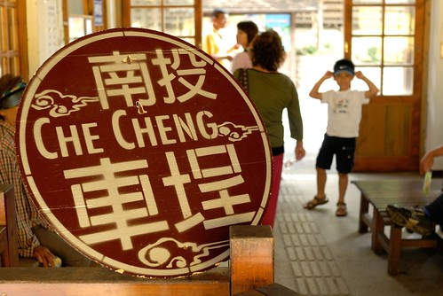 

從水里往車埕的路上 徹爸直念著我們大三時後一起去過(當然是以同學關係) 講真的我還真完全沒印象了... "西元1919年，日人在日月潭興建水力發電廠。為了要運送發電工程所需的設備及原料，於是興建集集線鐵道，車埕是集集線鐵道的終點站，在日月潭電廠興建期間，大量的工程人員進駐車埕，曾經讓當地繁華一時，接著，50年代台灣林業鉅子孫海先生的振昌木業公司也在車埕設廠，使得車埕成為南投木材的主要集散地，當時人車絡繹不絕、熱鬧非常，使得水里車埕一帶有 「小台北」之稱。但是隨著台灣木業禁伐木政策而沒落，車埕也跟著蕭條沉寂，直到近幾年。集集支線鐵道沿線的觀光產業風起雲湧，車埕這個深具發電與木業特色的歷史小站，才再受人重視。從集集搭火車要前往車埕，在終點站前有一座小隧道，穿過隧道，車埕村落便豁然呈現眼前，讓人有一種「柳暗花明又一村」的感覺，使得車埕有 「秘密花園」的美稱。 "

進入車埕車站的區域範圍時 映入眼裡的整潔清爽就讓人對它有好印象 雖然車站旁的停車場很小得遠些停在大馬路旁 可是專人協助管理下也井然有序 

車站正在進行修護中 幾個鐵道跟隧道口都圍有柵欄 殺了些風景 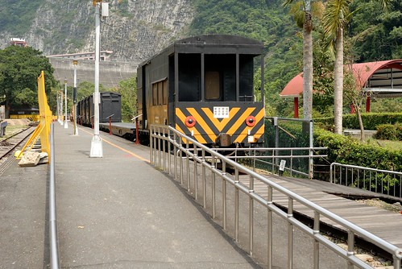

沒關係! 隨遇而安最重要  況且今日本來主要的目的即在於木工DIY 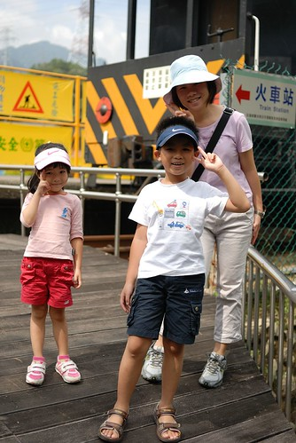

"車埕車站在921地震時被嚴重摧殘，重建時保留了部份主體，再用原木打造把整座車站重新包起來，就連車站前的廣場空地上也是用原木鋪設的。" 原木小車站給人一種很溫暖很溫暖的感受 只是講真的我很難想像如果這個小車站充滿遊客的樣子  那氣質實在太不適合了... 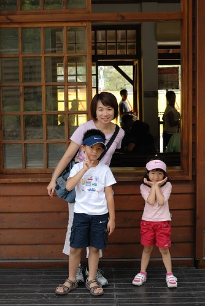

中午一點鐘肚子餓 走走趕快去找木桶便當吃飯喔!! 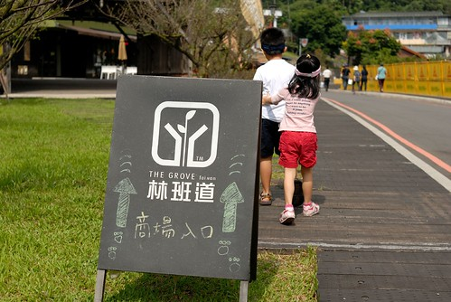

林班道位於車埕的商圈 曾為振昌興業的木業加工廠，為延續振昌興業的營業精神及理念 結合木業及光觀，打造購物及體驗活動的商圈 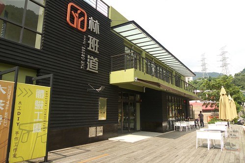

"商圈"整體的規畫很漂亮 很有人文氣質 但卻與這純樸小鎮一點也不衝突 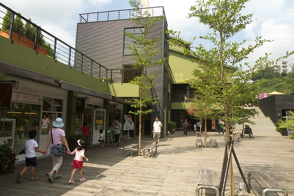

從商圈的頭繞道尾總算讓我們找到可以吃飯的地方了 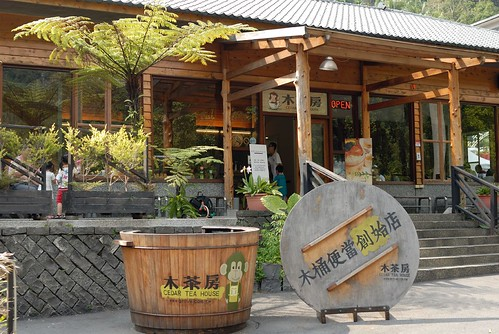

雖然肚子咕嚕咕嚕叫 但是要先跟大門口的可愛木桶照過相後才能放飯 愛愛很有百貨公司小姐的架勢吧 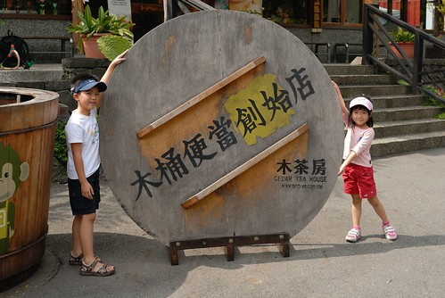

這餐廳的原木建築以及大片窗的明亮 完全對我的胃口  即使價格還真不太便宜... 

等上飯的可愛百貨公司小姐 

以及父子倆 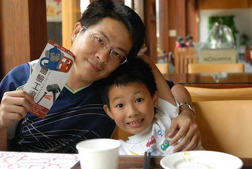

猴子是林班道商圈的商標 到哪都看的到猴子 筷子套上有 

餐墊上 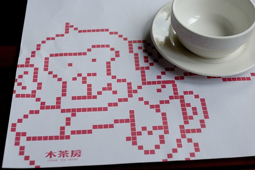

連木桶上也有... 這是木桶套餐的全貌  本來還擔心吃完油膩膩的木桶怎麼帶回家 餐送上來後才發現飯菜其實裝在紙盒裡  老實講有點失望說...這樣飯菜就沒有木桶香啦 

這是木桶便當外 雙人套餐的其中一樣主菜 

整體說來飯菜都還不錯吃 只是價格真的不便宜   沒擺滿一桌的菜色...四個小孩...會心疼 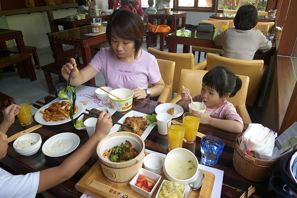

不過氣氛無價啦!   這樣的窗外景致 

這樣的愜意  值得啦(花錢的時候都得這樣安慰自己的啦) 

這是園區裡的蓄木池 木業繁榮時期整池木頭應該很壯觀(我一堆難以想像的事) 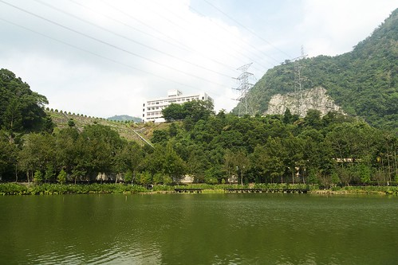

吃完飯後阿徹更是破不急待想要趕快去DIY 爸爸說"你知道的 越吵越是要考驗你"  "先照一張相而且必須笑的很開心的樣子才可以去" 恩!  這樣敞胸開懷的樣子有合格 可以去DIY了... 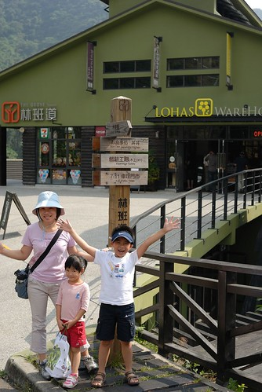

走吧! 快去DIY了  吃飯前早就已探好勘嚕... (商場建物的這種綠 很明亮但很溫暖 實在很漂亮) 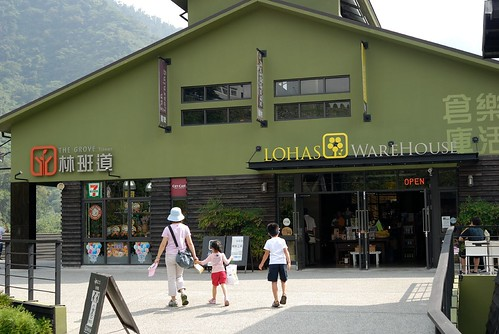

去到可以做DIY的工房  一個穿著工作服的哥哥就熱切的比著愛愛手上裝木桶的袋子說來烙印吧 雖然木桶的"歸屬"畫分在愛愛 但是由阿徹哥哥代為執行這神聖的烙印動作 只是阿徹的力道還是有點太小 最後被工作人員補烙後的結果不是太令愛愛滿意 小嘟嘴了一下 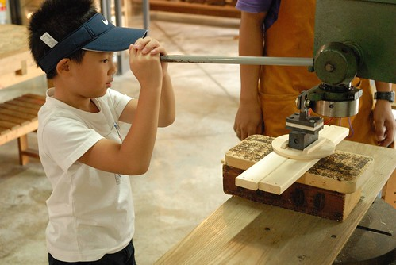

烙印好木桶便當後 阿徹在店內為了挑選他要DIY的東西三心二意好久 一下要A一下要B  什麼都想要什麼都捨不得 逼得我們最後下通牒 最後阿徹選了個經服務人員示範可以當提籃  小桌子的小椅子(而且考量阿徹能操作的技巧 ) 把椅子組裝起來前一樣可以先進行烙印 向來有自己想法的阿徹請服務哥哥幫他印了上下兩排的猴子(本來他說要繞一圈的) 技術很好的哥哥 準確的烙印 讓猴子看起來就像一排手牽手牽的很好的樣子 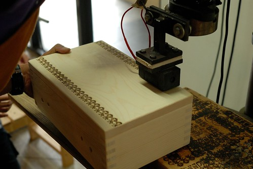

烙印好之後便進行椅架的組裝  阿徹選的這產品只需要簡單的釘樁 約莫10分鐘的時間便能完成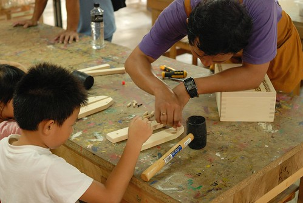

很有質感的木紋 

完工後 兄妹倆各自展示今日的"禮物" 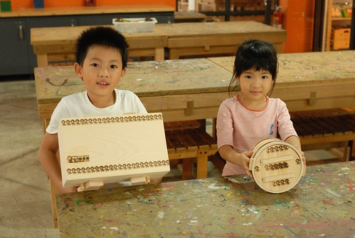

店員推薦此產品時說 她們產品外銷到日本 很多人都會在賞櫻季節時 用這當野餐籃裝著食物去賞櫻 賞櫻時再把食物置於這小桌子上 光想像就覺得好像自己正也這樣優雅的賞櫻中ㄋ...真有FU的... 

當作小椅子的樣子 耐重40公斤 如果不坐人就可以當作小桌子使用嚕  不過應該真人用的機會小家家酒時用的多吧 

或許等到哪天我跟徹爸想出來家裡哪裡可以擺舒服的小躺椅時 我們會再來 也來DIY我們自己的東西  而且這的環境跟氣氛會讓人想再次拜訪的 

其實我們趕著去小半天跟徹爸家的人會合  並沒有好好的 愜意的坐在這享受 只是對於這樣的fu 不照一張很可惜 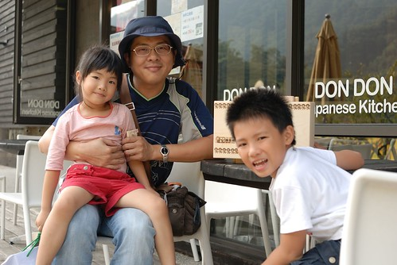

準備離去時才發現車站旁的木業博物館是日月潭國家風景處管理的而不是林業班 裡頭也有木桶便當 還便宜不少而且用餐者就免博物館的40元入門票  下回再來一探究竟 

背後就是傳說中 那個出來後會讓人彷若來到桃花源的隧道 

只是目前一旁的維修鐵欄跟繩條 讓人感覺有那麼一點陰森 不敢也不行趨近一探 

臨走前跟火車的最後合影..  我們家的愛愛照相時真的越來越會裝摩做樣了 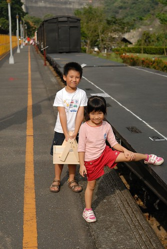

順道貼個幾張家族旅遊的照片 今年的家族旅遊在小半天  晚上是每年例行性的烤肉大會 每回家族旅遊 阿徹都會玩的不像我們的小孩  因為總膩著三姑姑家的哥哥團團賺 今年依舊如此  我們又只剩下愛愛這個女兒了 

第二天的鳳凰谷鳥園 依然只有一個女兒 哈 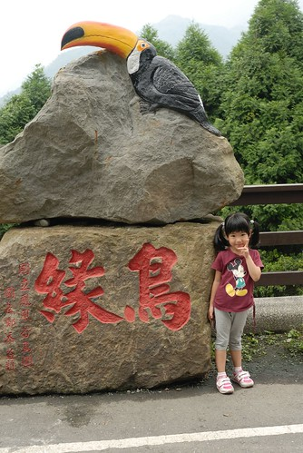

愛愛拿著寶特瓶橫掃含羞草  第一次這樣豪邁的玩含羞草 

雖然對於阿徹有點小生氣 不過偶而享受一下只有一個小孩的時光倒也輕鬆愜意啦 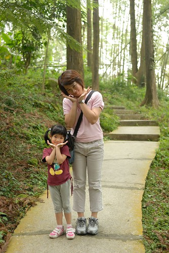

尤其又是可愛的小女生 

徹爸應該也這麼覺得吧 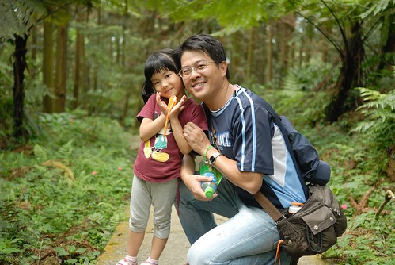

雖然如此 還是得趕緊去找我們家那個不見的哥哥   走走走! 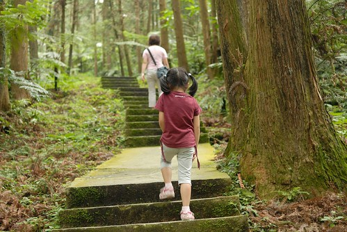

幸好最後那個走失的哥哥還有跟我們回家.................................... 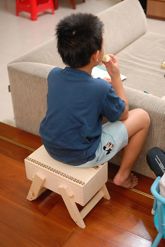
