不若這幾年的一年好像只有兩季(夏&冬) 今年的秋天很明顯 很舒服! 白天秋老虎發威 藍天白雲加上徐徐的涼爽微風 一整個令人心情愉悅的好天氣 而日夜之後帶點冷的寒意 穿著薄衫 裹著薄被 多麼讓人睡場好覺的溫度阿! 我說"秋天真是讓人想賴床 想出去玩的季節" 徹爸回我"想請假的季節" 嗯! 因為要請假才能賴床 才能出去玩... 我們這對夫妻的想法原來是有因果關係的! 前幾天看著窗外的藍天 我突然想起什麼似的在心裡念著: 秋天真是多采的季節 有金黃色的稻穗  或黃或紅的楓  白色的芒花.... 每個都是數大就是美的好景色! 這麼美的季節 這麼棒的天氣 大手牽小手一起去郊遊吧! 這陣子不知怎的突然很想去擎天崗.. 最近一次去擎天崗是阿徹一歲初時 跟陳大哥 二哥們一起去的  那時後阿徹還在草地上 舅舅身上到處爬 或許是突然想留下我們四個人一起在擎天崗的回憶吧! 我想 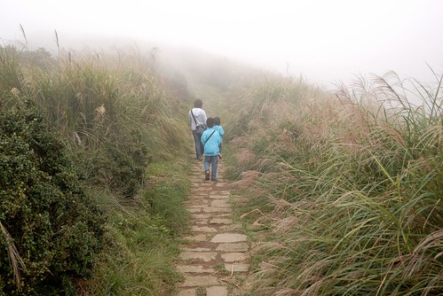 

那個週日是那一週裡難得的好天氣 藍天白雲加涼風 於是一早上與徹爸忙完各自負責的家事後 四個人貼騎著一輛機車 去吃中餐去開車去郊遊 搞不清上陽明山的路到底有沒有管制 我們依著GPS從仰德大道上山 奇怪的是 山下雖然有交警站崗 雖然似乎設有管制點 但警察示意著一台台車過去 於是我們就這樣傻傻地 順力地上到陽明山  我還笑說"可能大家都去週年慶 所以上山車少吧" 不過來到冷水坑後 看著停滿滿的車 忍不住懷疑上陽明山的車是都來這裡了嗎?

從冷水坑進入擎天崗的路果然如書上所言 有交通管制  於是把車停在冷水坑停車場 準備走個30分鐘的冷擎步道上到擎天崗 可就在出停車場後 那麼剛好的看到往擎天崗的小巴 於是我喚著大家一起跳上車 我跟阿徹說"讓你賺到 可以少走30分鐘的路"   阿徹一臉賺到的臉 笑的很開心 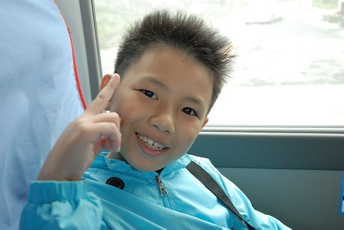 於是我們順利地 很快地就抵達擎天崗  可是山上的霧很濃哩 現在才下午二點說 這山上會不會起霧起的太早點了(山下真的還是藍天白雲的說) 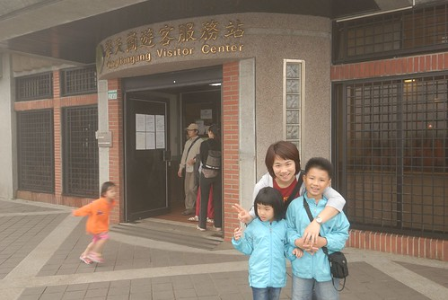 不過既來之則安之!  去遊客中心買了兩包零食後 開始我們今日的健行 我跟阿徹小愛強調"今天是來走路的喔!" 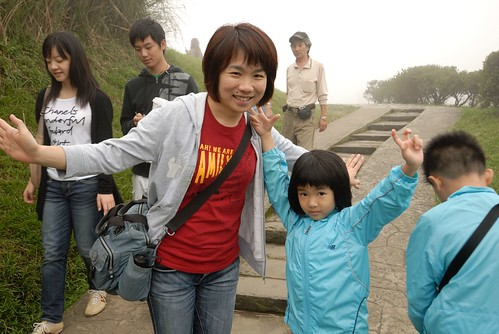 擎天崗的遊客不少 尤其在入口處後的這段碎石路段 這段路應該是最為熟知的擎天崗大草原  天氣好時 視眼可見擎天崗步道的起伏變化 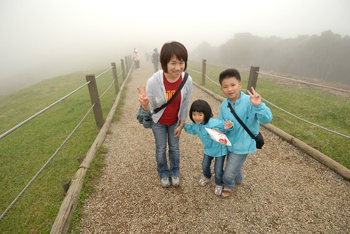 不過今日的大霧 讓眼睛的能見度大約只有50公尺吧!   山巒美景全被這一大片霧給藏起來了 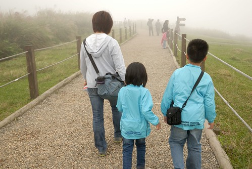 據說擎天崗以前真是畜牧用的農場 而現在則是國家公園旅遊休憩的用途 我們在遊客中心內蓋章的時後 剛好聽到有遊客問志工現在的牛隻有多少 服務人員說"只有10來隻 純粹就是象徵意義" 而這段碎石路兩旁的鐵絲網就是為了避免發生牛隻衝撞遊客的事情再度發生而設立的 只是我們一路走過 看到每隻牛旁都有大人帶著小孩一起餵草或是坐在一旁野餐   ㄟ.... 我跟徹爸只能笑說 大家真是太勇敢了  我們家沒一個人敢做這樣的事 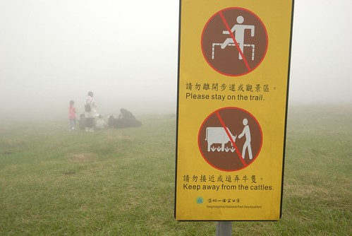 雖然阿徹看著一席席野餐的人很羨慕  可是我說"應該藍天白雲的時後野餐 氣氛才好" 阿徹同意的說"嗯! XXX(什麼時後) 我們一大早來這裡野餐一定很好玩!" 嗯! 媽媽相信一定很好玩 不過下次再上山 還真不知道什麼時後了 也許就是心情對了的那一天 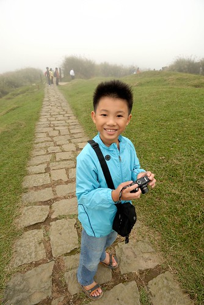 走沒多久 阿徹小愛(連徹爸)便開始喊著要吃蝦味仙  要吃貓耳朵 我們打開零食 邊走邊吃 這樣也算是行動版的野餐吧 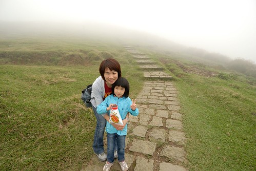 (有夠皮的小三吧) 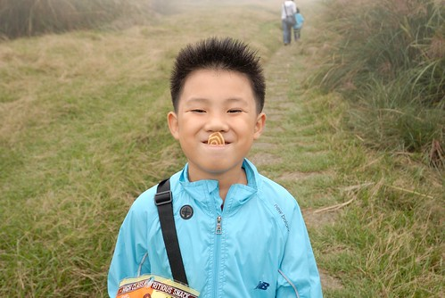 擎天崗環狀步道共2.4公里  今日我們的目標就是走這麼一圈便收工 整個環狀步道 除了碎石子路那 很多牛 很多人外  其餘地方遊客兩三隻 甚至中間有約5-10分鐘的路程完全沒遇到人  徹愛有點小害怕地說"好偏僻 都沒有人哩" 我說"對阿 像不像突然會有大野狼會冒出來的地方"  然後伸手往愛愛的肩上一搭 "哈"了一聲 愛愛咚的有被嚇到一下 大笑著"媽媽 好壞!" 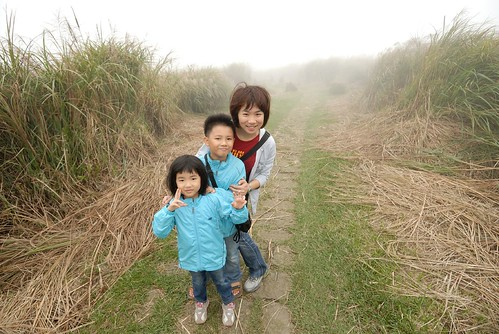 雖然大霧以致看不到週遭的山巒起伏美景 不過走在秋芒叢生的路上  這樣的霧 反倒增添許多意境 感覺挺棒的! 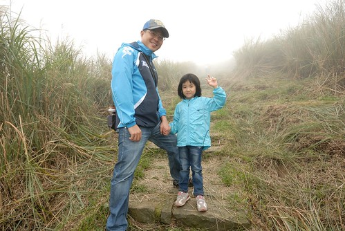

往竹篙山的叉路口是環狀步道的最高點  天氣好時 這裡的視野應該很棒 因為這裡立了個"看山"解說牌 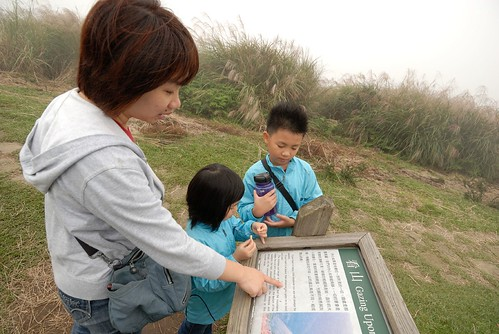 我喜歡開頭的那幾句話  忍不住念出來跟阿徹好好"分享"一下 最後再補了句"就像你的心情會影響你覺得功課難不難 多不多..." 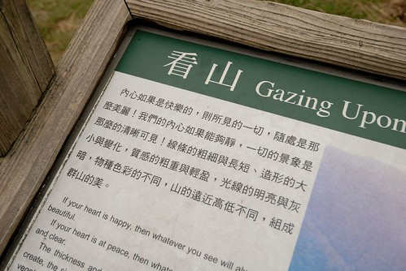

擎天崗的牛雖然數量少 不過活動範圍還挺大的  因為沿途常可見牛黃金阿!(除了人煙罕至的那段) 傳說中的牛糞是插鮮花 但有人把這的牛糞給插芒花  這...還真應時應景... 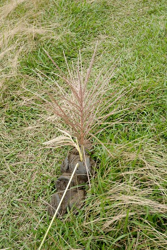 而看到冒出許多小草的這團 我們四個人忍不住蹲下身看個仔細 邊看還邊嘖嘖稱奇"真是好營養" 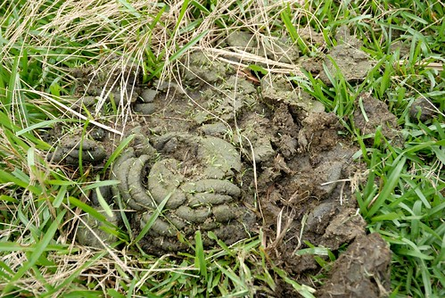 看了一整路的牛糞  愛愛問"好奇怪喔 為什麼他們的形狀都不一樣" 我們忍不住回問"你的形狀會都一樣嗎" 愛愛想了想"ㄟ..好像也都不一樣 不過為什麼書上畫的都一樣" ㄟ..也對! 愛愛應該只看過書上那畫的像冰淇淋形狀的牛大便 大象大便 然後阿徹跟愛愛兩人竟然便說起 自己都曾經努力在馬桶上大出像冰淇淋的.... 阿母我臉上三條線的大笑著 這就是在大自然裡的樂趣 永遠有讓人意想不到的聊天話題可以發生! 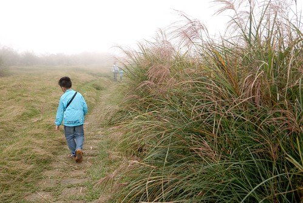 阿徹總說他不愛走路 不愛爬山(其實我們只能算是健行) 而我總說 可是每次出去玩都有很多好玩的事發生 發現 大家也都很開心阿 就像今天這樣! 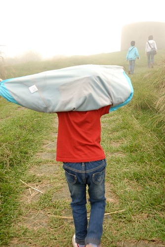 所以我堅信 人該多走進大自然  敞開心胸 大口大口呼吸新鮮的空氣!  心情會很不一樣的! (我都是這樣跟徹愛洗腦 "遊樂園去過一次有紀念就好 這種不用錢的大自然才是最有益身心的阿") 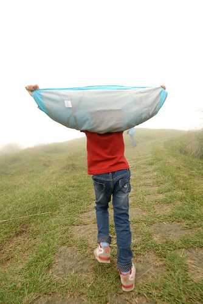

擎天崗以前曾經駐守國軍部隊 以防共軍降落這片大草坪 攻陷台北城 所以擎天崗裡還留有不少的碉堡 更增添些許的神祕感 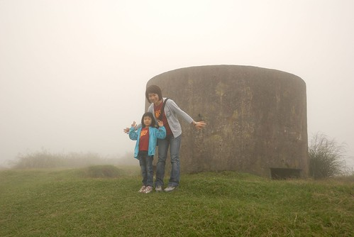 途中還會經過金包里城門 從這可以下到金山的八煙!  原本以為要2小時的路程 我們一小時便走完 四個人更是開心可以早早去泡湯了(宅男徹就是被泡湯給吸引出門的) 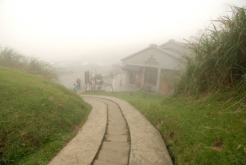 要下山時 看著等候公車長長的人潮 忍不住感嘆"上山容易 下山難阿" 想說乾脆走道路走下山算了 可是10分鐘的車程走起來應該真的挺遠的 所以還是決定就排隊等公車吧! 幸好排隊的都是等著直接下士林的 我們很快地便搭上有往冷水坑的車子 後來徹爸用GPS算算 下山的這段路竟有4公里多 更是慶幸我們的懶阿!

離開冷水坑 我們順著陽金公路到金山的八煙溫泉會館泡湯 其實我跟徹爸是比較喜歡另外一家的 但是徹愛比較愛這裡的兒童設施 所以就配合小人 不過愛愛泡完湯後說" 我以為是要去上次跟萱萱 還有阿嬤她們一起去的那個溫泉 我其實喜歡的是那裡" ㄟ..愛愛阿 那個在泰安哩... 你還真是越來越懂得比較 懂得享受了! 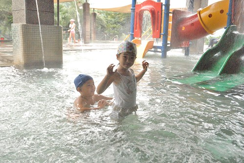 我們買了泡湯+晚餐  所以泡完湯後直接在會館的餐廳裡吃好食材的日式火鍋 這時候放鬆的身心 加上暖呼呼的一頓飯  真是舒服! 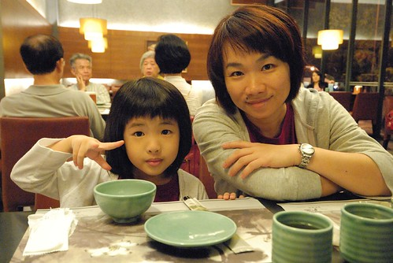 一家子 好久沒在台北這樣的小旅行!  成功圓滿!! 棒!!! 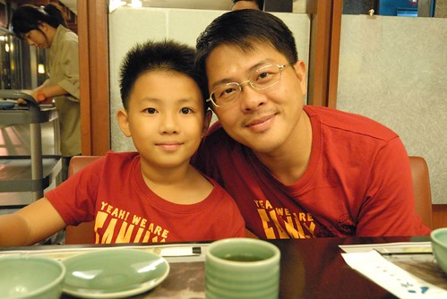
