不可思議! 我們竟然真的連續第四年"來"武陵賞楓了!!!! 不過其實我本來是打算今年要換去大雪山賞楓的  安知入秋後徹爸跟阿徹陸續問了我好幾次 "今年什麼時候去武陵賞楓?" "今年不去武陵賞楓嗎?" 看大伙這麼殷殷期待的樣子(其實我心裡也很想去) 於是我們又來武陵賞楓啦! 只是才10月初 武陵賓館的11月訂房便滿滿滿! 能讓我們上山的日子寥寥可數(週末的房間更是連想都不用想) 鑒於前兩年11月底的武陵幾乎已是落葉掉盡的深秋狀態 且我賭(每次訂房真的都是在賭)今年應該冷的早冷的多 於是訂了11月中的週日上山賞楓 結果, 果然再次應驗了所謂的人算不如天算 尤其在這氣候異常變化多端的年代 今年的秋天溫暖怡人的讓楓遲遲捨不得變色 不過就如我上山前跟準備同行的玟姿說"武陵的美在於群山環繞的那氛圍" 所以即使今年的楓不優 但我還是覺得武陵好美! 好個讓人可以補充電力的桃花源!!! 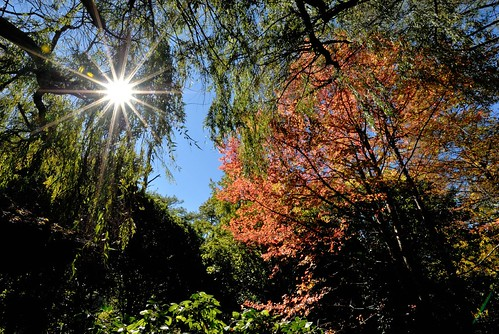 

這回的武陵行 我們很難得地多了一個人同行 只因為從沒去過武陵的玟姿(後來我們笑她大學念中興沒來過武陵 真是一整個遜掉) 突然在11月初的某天MSN問我武陵什麼時後楓紅 於是訂不到房間也找不到同行人的玟姿便這樣當了我們此行的玩伴 玟姿向來都稱呼徹爸為老闆(跟攝影相關的典故) 所以徹爸說就這回是員工旅遊啦! 而我這個老闆的老婆也就多賺到一個可以照相 幫忙照顧小孩的"瑪麗亞"同行 至於阿徹跟愛愛則是從聽到後就一整個開心有阿姨同行!

此外 因為只能訂到週日房間 阿徹為了賞這楓得向學校請星期一的假 而且還得在周六前把那週末以及週一預訂的功課給全部完成 雖然因為阿徹月考成績的不理想 我略有掙扎一下是否要讓他因為玩而請假 但最後我還是決定貫徹我們家玩的"理念" 藉此也訓練阿徹如何補足缺的課 不過請假的基礎還是在於我們要對阿徹有足夠的信心 所以如果阿徹後來表現不佳 以後當然就得避免這樣的請假事由了

(拉哩拉雜寫一堆 總算要進入主題了) 早上八點我們如預期時間的出發 預計中午抵達武陵然後可以在草坪上先來個野餐 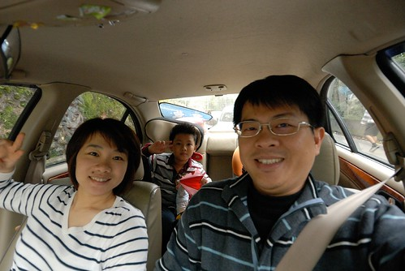 結果想不到竟在離武陵只剩半小時的路上 遇到修路而全面禁止通行 中間我們忍不住打電話去武陵賓館詢問 而人已到達武陵的玟姿也幫我們向遊客中心詢問 答案都是"知道有修路工程 但大都是10來分鐘的定時放行 這麼長時間的禁止應該是工程剛好進行到非常關鍵而無法中斷" 因此沒人知道路到底什麼時後才會通...而我們就這樣被擋了一個多小時 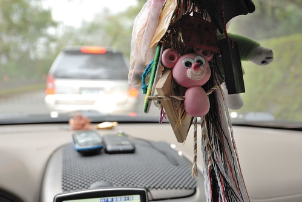 等到路通 到達武陵已經是下午一點半多 而為了銜接2點半的在賓館出發的生態解說 我們直接先去賓館後方吃中餐及賞楓 到達武陵前的沿途所見 早已讓我們心裡有數今年此刻的楓況慘烈 但人真的抵達武陵且還是在每年色彩最繽紛的賓館後方廣場時 才不得不坦然面對且接受這樣的事實  今年整個武陵農場內 最紅最盛的楓便是這一株 這顆楓 四年來始終如一的小巧 每年都很紅但今年她最鮮(先) 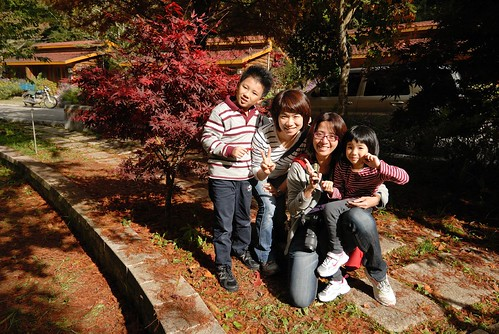 相對於玟姿還有其他遊客拿著相機拼命的拍 徹爸拍得意興闌珊 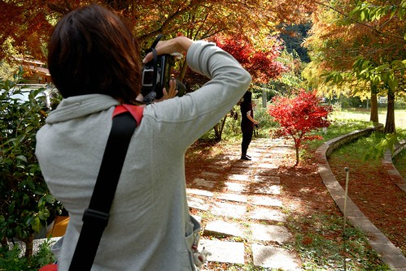 他說"以前就拍過啦" 還說了好幾次的"真的都沒紅 沒紅" 口氣與表情盡是失望 而由最後的照片也可以感受出他這回拍的不是楓 是太陽還有藍天 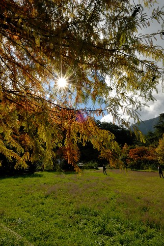 雖然我們一家四口都對今年此刻的楓況有點失望 但心情倒也還是愉悅 徹愛兄妹倆東跑西玩 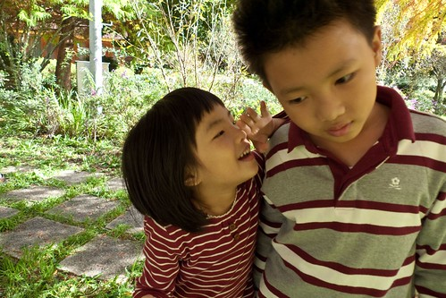 吹吹浦公英 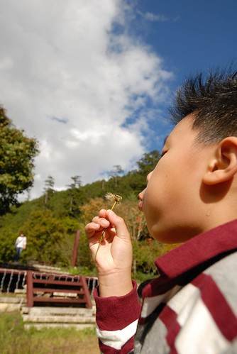 置身在高山環繞的武陵裡 人就是一整個的放鬆! 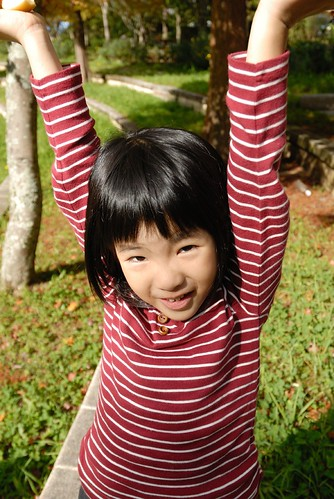 或許"賞楓"只是個我們可以去武陵的藉口吧! (這兩天多了個攝影師隨行 要好好利用 多拍點全家福) 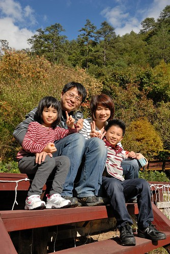 來武陵這麼多次從沒參加過生態解說活動 這回受了苦苓書的影響 參加了那天下午的南谷步行生態解說 解說員是由台南而來的志工伯伯 雖然我們因此而多注意到不少植物 也經由他的解說更明白武陵不同時節會有的美麗 但比例上似乎有點過重的人生體驗分享 讓我對於這回的生態解說有小小的失望(怎麼沒有像苦苓書上那樣的故事聽..) 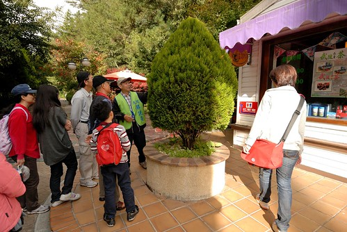 我們常有意無意的落在解說團外圍 或找楓葉 或拍照 (右下角的那個路人甲很羞於露臉的樣子喔) [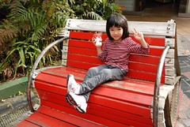](http://www.flickr.com/photos/hmchen0328/6356072503/in/set-72157628031788367)[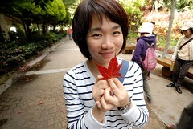](http://www.flickr.com/photos/hmchen0328/6356072365/in/set-72157628031788367) [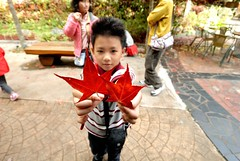](http://www.flickr.com/photos/hmchen0328/6356072227/in/set-72157628031788367) 雖然整個園內楓紅的比例很低且零零落落 但紅的葉子都很新鮮 而其他的花花草草也都很豔麗 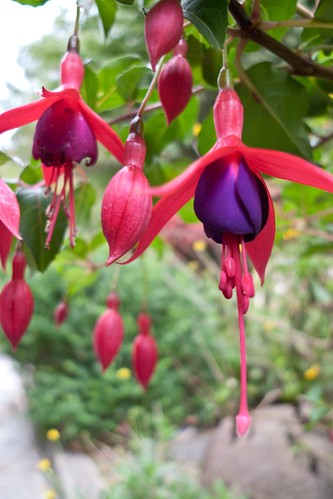 迎賓橋口的這棵楓是農場楓紅的指標 出發前一天徹爸在農場的官網上看到的"20%楓紅" 指的應該就是這一顆  解說員伯伯說 通常必須經歷兩波的平地最低溫地區(例如嘉義及淡水) 最低溫低於16度冷的3-4天後 這顆楓才會有80%以上的楓紅 才是武陵楓最美麗的時刻 那個時候先打電話來武陵問房間 然後再衝上來 絕對包君滿意... 可是伯伯阿! 你有所不知武陵的房間真是越來越難訂了 尤其賞楓賞櫻時節 房間是秒殺阿 加上有工作 有小學生 真的很難說衝就衝哩! 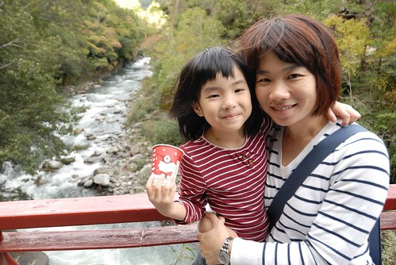 所以每年我們只能想辦法預測 然後跟老天爺賭 賭什麼時後冬天來 什麼時後春天來... 雖然沒賭對會有點小失落 但其實真的也沒關係 因為武陵 一年到頭都很美而且風情萬種 (我承認我有中毒 說的話不能盡信) 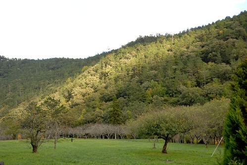 兩天裡 玟姿除了空 攝影外 最常的就是幫愛愛拍照或是拉著愛愛照相 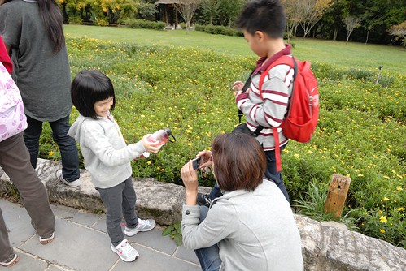 所以這回我們有好多的側寫鏡頭 我跟愛愛看著玟姿鏡頭的同時也被徹爸捕捉入鏡了 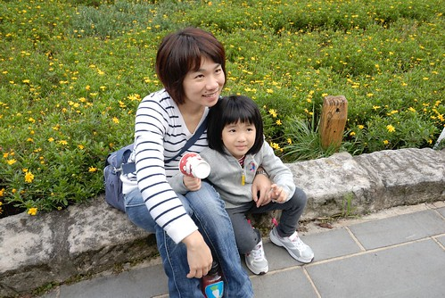 而第一次來武陵 常認真 拼命照相的玟姿也成了徹爸照片裡的最佳配角  有時後多了個志同道合且跟我們全家都熟的玩伴真的還挺不賴的 (瑪麗亞 謝謝你!) 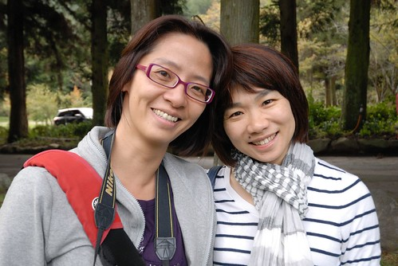 我們跟著解說團從賓館走到醒獅園再走到行政大樓前以及復育中心 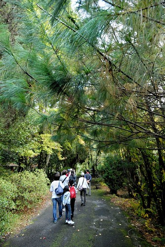 沿途的楓紅真的很少很少 但幾顆加拿大黃楓卻都正閃亮的黃著 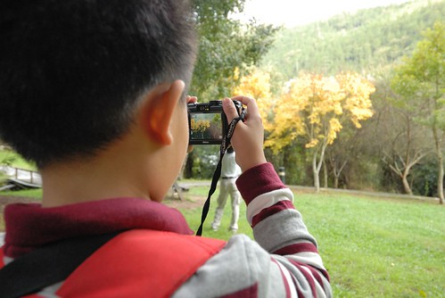 而即使是青綠綠的楓 也別有一番風情 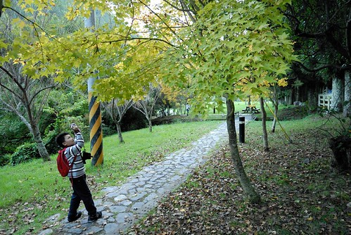 這些都是不同於我們往年所見的秋色 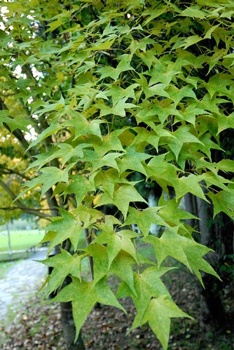 另方面 松果都還結在樹上含孢待射 尚未成熟落地 沒有松果可拾 這是除了楓紅外 徹愛的另一個失望 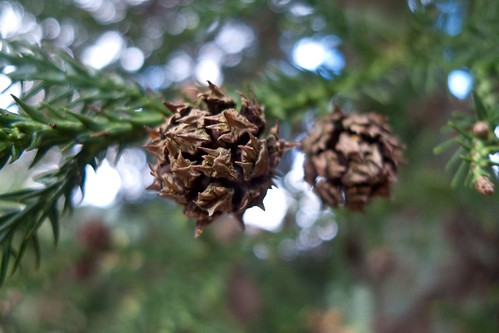 解說團走到復育中心已經近五點 在這裡我們正式的脫隊 留在這休息 我跟玟姿正坐著呆時 徹愛兄妹倆突然幫我按摩起 然後也服務了阿姨 我跟阿姨說 "阿徹按摩的力道正剛好 很舒服的喔!" 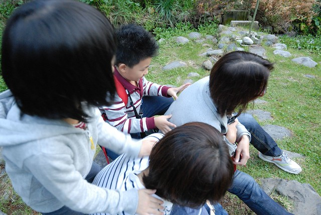 被馬一節後的阿姨果然精神為之一振阿! 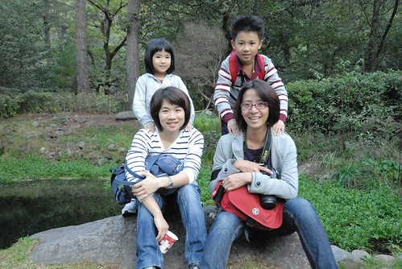 復育中心前多了個櫻花鉤吻鮭的木雕像 這年頭的風景區 好像沒立個大石頭或雕像就會顯得不夠正式似地 但有時候真的有點突兀說... 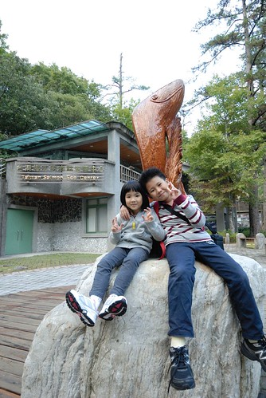 往回走的路上 我們特意去看行政中心旁的銀杏是否變色了 結果一樣的青綠綠 再次驗證今年的冬天真的來晚了(真的不是我們來早了)  那天晚上吃完晚餐 洗完澡後 阿徹硬是要玟姿阿姨一起玩一場大富翁的美食大主廚 阿姨果然是從小玩大富翁長大的箇中好手 輕輕鬆鬆就跟徹爸併列冠軍 只可惜那晚的雲層有點厚 沒能讓阿姨看到滿天星斗的武陵 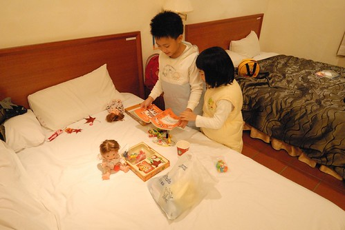 第二天早上我們睡到快八點才自然醒來 收拾好準備去吃早餐時 哇賽! 農莊外的晨景真是棒! 山中的早晨真清新! 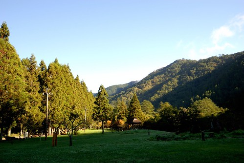 一片安靜的松林大道 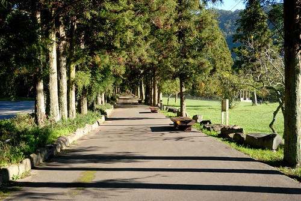 武陵的日夜溫差很大 夜晚最低溫10度有吧 所以當太陽出來 陽光強射時 草上的露珠頓時蒸發 形成這樣的"氣化"美景 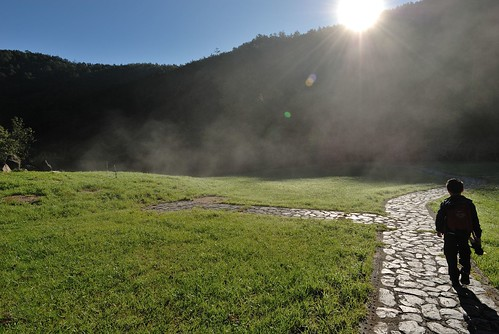 夢幻的讓阿徹也拿著自己的相機去拍照 然後有了上下這兩張走向陽光與從陽光走出來男孩的照片 我很喜歡這兩張照片! 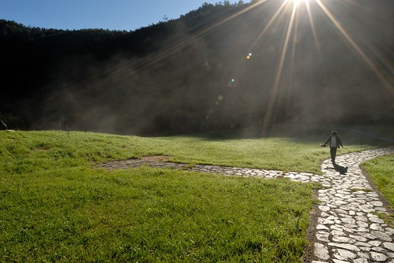 早晨 另一個露珠的現場是徹爸的車子 鋪滿小露水的車面平整如一張畫紙 讓徹愛忍不住揮毫起來 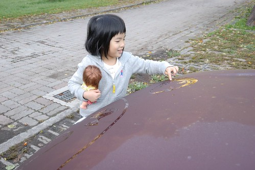 然後小紅最後變成這亂七八糟的模樣! 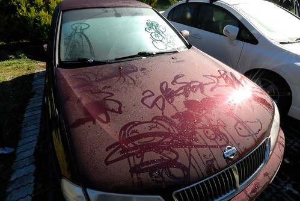 兇手就是坐右後座的那個男生 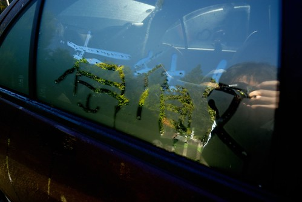 還有左後座的那個女生 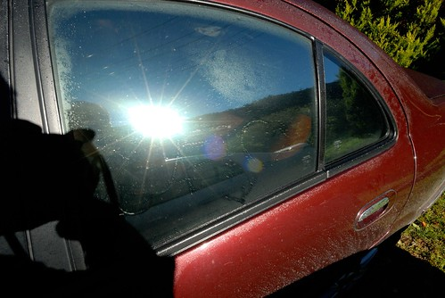 就是他! 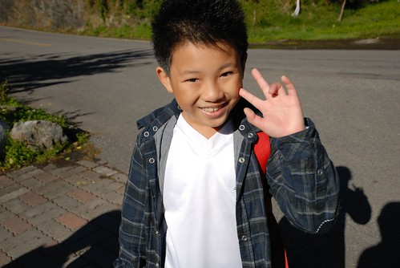 還有她! (小的那個) 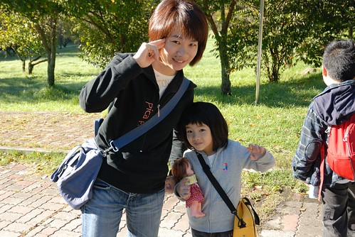 吃完早餐後 我們再度徒步於醒獅園到行政中心間的賞鳥步道 散步的第一個重點停留是前一日傍晚想拍但光線不佳的黃楓 可早上十點的陽光竟也烈的不太適合拍照了... 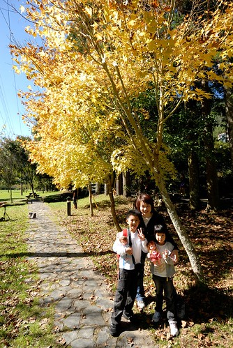 這兩片不是楓 可是是這回徹爸照的照片中我最喜歡的一張植物照片 光影的感覺很棒 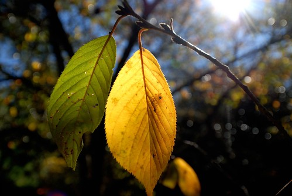 

來這麼多次武陵 愛愛第一次說要跟醒獅園的這頭獅子照相 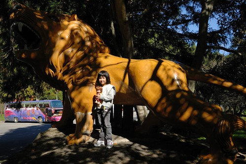 散步第二個重點是行政中心前池塘旁的那株楓 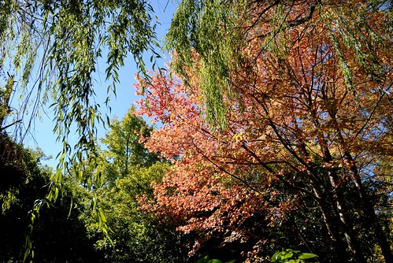 昨天傍晚顯得沒什麼的一顆樹 今早卻因為光線充足而變的超閃 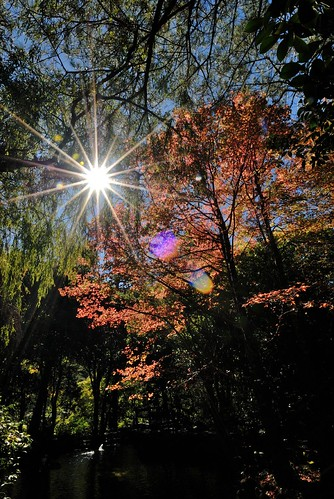 陽光照射下 柳葉陪伴下 這是我看過最光感 最嬌嫩的楓紅 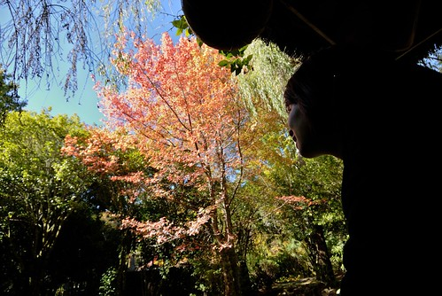 我們賴在池塘中央的涼亭裡看個過癮 徹爸與阿姨嘗試各種角度下捕捉這美麗的一幕 只是好像真的很難拍哩...很難完全呈現出那當下我們眼睛所見的光與影 雖然今年楓紅的比例真的歷來最低 但這株真是我見過最耀眼的楓了 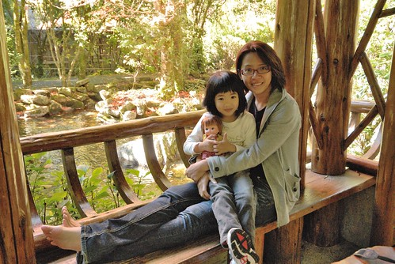 阿姨應該也有跟我ㄧ樣賞的很開心吧! 開心到直拉著愛愛一起拍照 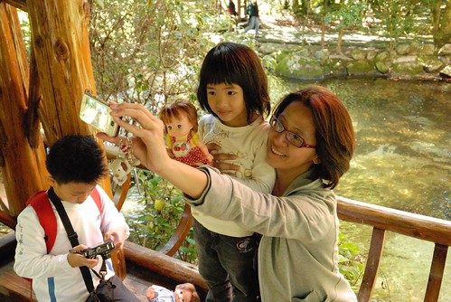 我們接著又繼續漫步到茶莊對面的茶園步道 到那個人煙罕至 很靜的涼亭裡"休息" 阿姨在這又再次展現拍照的帥氣與拼勁 看的徹愛擔心的直問我"阿姨這樣很危險 掉下去怎麼辦" 呵呵! 阿姨下回再一起出門時 記得要多注意身教啦! 要不然我得解釋好多徹愛的為什麼 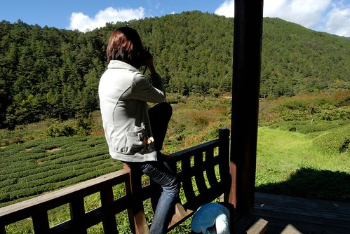 一如以往的每次 坐在這涼亭裡人就鬆了 呆了.. 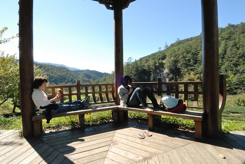 徹愛應該已經對於大人這樣的行勁見怪不怪了  自己想辦法找樂子 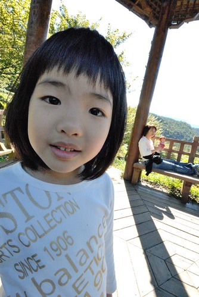 離開茶園後 換開著車子往最裡頭的山莊方向走 我一直覺得武陵最美的就是這段往裡頭的路 沿途可飽覽綠山 藍天及白雲  可以的話 最好還是用騎腳踏車或是電動三輪車的方式 用超低的速度一點一滴地慢慢感受 我非得讓第一次來武陵的玟姿走過這趟路 但受限於時間卻只能用開車  我們一家子坐在玟姿開的車上時  我們這一家忍不住輪流喊了好幾次的"開好快! 開太快! 慢一點!" 回家後 徹爸看著照片又忍不住說"真應該把玟姿拖去騎電動三輪車的" 真的! 我們真覺得來武陵要這樣慢慢感受過這段路後 才能深刻體會武陵的美  到達山莊停車場時是正中午十二點  太陽正烈 可是天好藍 雲好白!  我超喜歡武陵的山 覺得那個山的線條好順 好滑 好柔美 而且隨著白雲的變化 映在山頭不同的光影變化  千變萬化 讓人百看不膩  每年走一趟武陵 這樣看山看天  人就好fresh  到達山莊時 看到人家吃泡麵 看著看著也超想來個香噴噴泡麵 幸好玟姿前一天買上山準備當消夜的四碗泡麵還躺在她的車上 因此我們也得以興沖沖的佔據一桌 來個大自然下的泡麵午餐  很少吃泡麵的阿徹直嚷著好好吃 把湯喝光光  而愛愛則是呼嚕呼嚕的一口接一口  (吃正常麵從沒看她這麼好吃過)  吃飽後趕緊離開山莊 要趕我們的最後一個而且超級重要的場景 那就是在醒獅園旁的松樹下草地上來個野餐約會  雖然今天只有武陵蜜蘋果跟豆干相佐 但鋪個野餐墊看山 看小人玩家家酒 東跑西踢 這是每次來武陵一定要的那"味"阿  此外 阿徹大概把這草坪上的浦公英全吹禿了 (這動作其實會破壞生態平衡 該禁止的 但......... 噓! 別說!!)  我陪著徹愛玩躲避球以及亂踢一通的足球  還有徹爸陪著玩他兒時記憶裡的"摩救"  雖然意尤未竟  可是不想摸黑開山路的話  非得離開了 下午二點半 收拾好東西以及心情 跟武陵說BYEBYE 下山嚕  雖然今年的楓很不紅 但我們的心還是一樣滿滿的!   

補充:  下面的照片 是玟姿用她相機拍的 挺喜歡別人鏡頭下的我們這家子!  而且不同的攝影師展現不同的武陵楓情  玟姿路過清靜時 還特意帶了杯星巴克的抹茶拿鐵給我們喝 而且還用充滿聖誕味的紙杯 有種似乎提早過聖誕節的FU  第一次 四個人在松林小徑上同時入鏡  只是那個小三的表情很搞怪 很破壞哩!  一大片的鼠尾草雖然已是花季末期  但玟姿很堅持用他的長鏡頭這樣遠遠拍的感覺一定很讚  玟姿跟徹爸兩人在這裡還尬了一下攝影技術 這是徹爸的變形版  一樣難得的楓下的我們這家子  而且原來平常我們四個人在別人的眼中是這模樣阿 很有趣!  阿姨and阿徹  and愛愛  徹愛吹浦公英的惡行 原來也被阿姨看到 留下證據了  玟姿自己一個人開著車 從台中到埔里 到清境 到全台公路最高點的武嶺 到合歡山 到梨山 然後最後到武陵 然後再又一個人倒著從武陵這樣開回去 (台中到武陵的時間比台北過去多一小時 而且山路比例高很多)  就像他自己給自己的明信片上寫的 自己一個人開車有點孤單 有點害怕... 辛苦玟姿了! 希望千里迢迢的這趟能讓她活力滿滿 用到放寒假 而今年沒看到的武陵滿天星斗 桃山瀑布 有機會的話! 明年....
