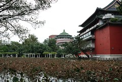
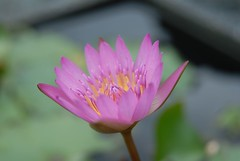
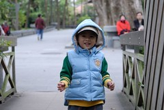
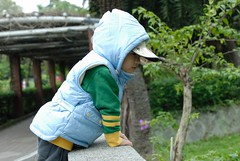
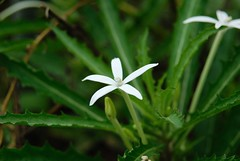
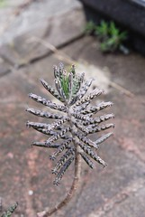
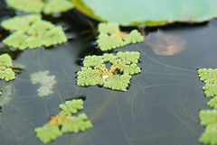

媽媽又晚了一個多禮拜才寫下這次的植物園半日遊  
出日記的速度實在遠遠落後於徹爸出照片的速度...

因為天雨場地濕滑 這個週日的早上徹爸沒能去打球  
早上在家打掃鬼混 下午實在需要去外頭走走透透氣  
去哪ㄋ~  
植物園突然從媽媽的腦袋裡蹦了出來  
然後大家快速的吃午餐 上網查地圖  
輕裝簡便的搭乘捷運前往植物園  

住在捷運站口附近果然真的很便利  
家裡到捷運站走路2-3分鐘  
加上等捷運坐結運到西門站的13-15分鐘  
然後轉乘小南門線(轉接等的時間有點久5分鐘加上阿徹臨時尿尿錯過班次又多等了8分鐘)  
轉乘一站到小南門站1-2分鐘  
3號出口走到植物園3-5分鐘(捷運裡無障礙空間實在有點繞路)  
總共花費交通時間30-40分鐘(回程時一切順利 只花了25分鐘)  
這樣一家子愜意的搭著捷運出遊感覺還挺像"觀光客"的  
尤其是徹爸可以輕鬆自在的走走看看 不用擔心開車停車問題 真是讚  
以後實在可以多多安排這樣的捷運半日遊  
  
  
  
  

阿徹前陣子美語課的主題教學課程為"In the pond"  
所以最近只要找他去戶外走走  
他就會問"有In the pond嗎 有water leaves嗎"  
今天當然也是用植物園裡的荷花池把他騙來的  
大片的枯萎蓮花池看起來還真有點蕭蕭然的  
幸好池邊有幾個小盆栽開了一些荷花(冬荷嗎)  
總算可以對阿徹交差 (爸爸媽媽沒有騙你喔)  
  

今天的天氣有點冷 寒風陣陣吹  
但小愛還是不敵睡意的睡昏在推車上  
而阿徹則是整路的蹦蹦跳跳 嘰嘰咂咂講個不停  
雖然內容大部分都是在"練笑話"  
但主題卻真的都跟植物園裡的事務有關  
"你看這個葉子好像寶劍喔"  
"那是\*\*\*樹 那是\*\*\*花"  
好奇到爆 天馬行空到讓人快招架不住  
但媽媽真的得說 因為阿徹讓我們的郊遊豐富精采又有趣  
透過阿徹的眼睛讓我們經歷許多原本不以為意的驚喜發現  
兒子~繼續保持下去ㄚ  
豐富你的視野也豐富全家人的視野...  
  
  
  
拿著地圖 衝勁十足的小子  
  
  
  
  
不放過園裡的任何花花草草 小魚小蟲  
  
  
回程只被讓了一個座位 哥哥膽小堅持一定要媽媽抱著坐 妹妹跟爸爸只好站著多保重啦  

顏色白的嚇人的荷花  
  
  
阿徹發現的植物 (第一個實在有點像蟑螂腳....)  

