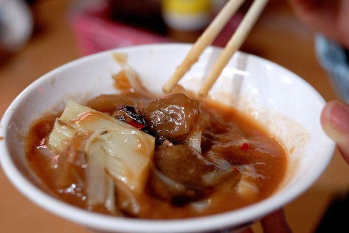

逛夜市~逛夜市~來去逛夜市~   真的好久好多年沒逛夜市了... 我跟徹爸對夜市的印象應該一直停留在大學時的逢甲夜市 買了塊雞排 買了杯珍奶 邊走邊吃 吃完也逛完便是打道回中興 而阿徹對夜市的印象則停留在新莊阿媽家那每週五一次的夜市 從以前嬰兒時期每回保母舅公舅婆總會假借送他回家名義 沿著夜市邊逛邊看邊回家 後來搬到板橋後也曾經刻意在週五回去阿媽家好去逛夜市 可惜自從3年前阿徹在玩完釣鴨鴨遊戲選玩具時過於激動整個人栽到鴨鴨水池濕淋淋後 夜市從此跟他無緣 無論他怎麼渴望 怎麼暗示+明示 爸爸的回應永遠是'等你學會控制自己後再說吧' 甚至愛愛還會悠悠的說'對阿 上次你還跌到那個鴨鴨的個水裡去...' 哈哈! 我相信這件事將會是跟著阿徹一輩子的夜市'小故事'  甚至流傳至他的兒孫... 這回趁著宜蘭的一天一夜小旅行 一家四口去羅東夜市體會好久沒有的'逛夜市' 而blog裡也難得的出現食記

憑著行前旅遊書的惡補 再加上民宿DM上的夜市導覽圖 我們一家四口於週五晚上六點開始'勇闖'羅東夜市 老實講因為完全不清楚羅東夜市有什麼 加上阿徹那常堅持到有點傻的個性 我們心底其實有那麼點擔心這一夜會不會有什麼驚人或是令人不悅的事發生 徹爸原先甚至打算先去海產店吃個晚餐後再去羅東夜市沾一沾即可 但這回的旅行是從傍晚抵達宜蘭後才開始 難得有這樣的機會與心情可以去逛夜市 不好好逛個徹底實在是說不過去  (這是天時) 因為我們壓根不會為了逛夜市而殺去宜蘭 而去宜蘭玩的時候也往往沒有留到晚上逛夜市的渴望 綜合以上總總 所以這回我們當然要好好來'逛夜市'嚕

首先先從台中肉圓開始 原本看到肉圓上的筍絲乾還真有點嚇到 因為第一次看到這樣的組合 但是吃了第一口後就喜歡上他的醬汁 沒錯是醬汁 醬汁可真是肉圓的靈魂阿 不過QQ的外皮加上不油不膩的內餡  讓我們的逛夜市有了一個美好的開始 希望接下來的也都能如第一砲般的令我們滿意  

我跟徹爸各自吃了一顆肉圓 而阿徹跟愛愛則是共享了一碗滷肉飯墊墊胃  

愛愛吃的津津有味的樣子好像這滷肉飯也挺不錯的 而我跟徹爸實際搶食了一口後也真覺得還不錯吃 

接著第二攤是現做潤餅皮的潤餅 雖然包的東西跟嘉義潤餅不太一樣而且沒有柴魚湯可配 (在嘉義不管鱔魚麵店或是潤餅店或是肉圓店..都有免費柴魚湯可喝) 但是潤餅又大又好吃阿 而且還不會ㄔㄡㄔㄡ滴  

吃潤餅的同時則又去夜市口的米糕攤點了碗超級熱騰騰的米糕(也就是油販) 

我跟徹爸還有阿徹努力吃著兩捲潤餅而愛愛則努力地扒著米糕 吃完剛剛的半碗滷肉飯加上現在的半碗米糕 我想愛愛的晚餐應該就已經飽了 

趁著愛愛最後珍惜地 一口一口地吃著美味的油販  我則帶著阿徹去排好吃的羊肉湯 

來回經過時就發現夜市裡排隊人潮最多的就是這緊鄰的兩家羊肉湯店 而在吃肉員時看著隔壁大老遠端來的羊肉湯跟臭豆腐好像真的好好吃的樣子 於是不愛排隊的我便出乎徹爸意外的去排隊等吃羊肉湯 所幸排了10多分鐘便輪到我們 沒太考驗我們的耐性 

就是這滿滿是肉的羊肉湯阿  鮮而不騷難怪人氣No.1 至於臭豆腐則因為其像嫩豆腐的口感加上不夠臭被徹爸打了XX 

為了犒賞小人們截至目前的配合以及鼓勵他們接下來的表現  花了100元讓阿徹跟愛愛丟了三籃球 我想或許是因為羅東夜市可以玩的遊戲攤太少(除了打空氣槍便是這個而已 這點算是地利) 所以阿徹才會如此安分地享受吃這件事 沒有吵著要玩啥要玩啥的脾氣出現 (今晚的天時地利人和全到齊了)  

至此我們竟然已經逛了一個多小時的夜市... 7點多的夜市人潮反倒比六點多時少了些 莫非這是夜晚高潮前的空窗期 不過對我們來說這樣的人潮還是多 只是幸好不算擁擠所以逛的還愜意 實在很難想像週末夜晚人聲鼎沸 人擠人的盛況阿 

買現打果汁時看著旁邊這攤  眼睛實在很難不被吸引過去  這真是太太奇怪的'五顏六色'了吧 不過竟覺得這樣的畫面還真的很夜市 很熱鬧很龍虎雜處... 

看著愛愛展露的小小渴望加上自己的莫名想買  讓愛愛挑了隻草莓口味的糖葫蘆 當我付完錢 年輕美麗的老闆竟然慎重的直接將裝好的糖葫蘆交給了愛愛而不是我 那刻我是有點驚訝到想笑 不知道愛愛接下時的心情是什麼 會不會是抱著'老板娘 你放心 我會好好照顧 吃完這串糖葫蘆'的決心 

看著愛愛手上的草莓糖葫蘆 阿徹好像忍不住在吞口水了 

連媽媽也都好想吃一顆草莓口味的糖葫蘆看看阿 

最後在我們各自吃了1-2顆嚐鮮後 剩下的全進了愛愛的嘴巴裡了 看著他把最下面的草莓一顆顆的沿著長長竹籤咬上來然後進入她的嘴巴 真是認真 真是滿足 真是幸福阿! 

好像沒吃什麼但是我們都已經開始覺得飽了  但是還是打算買些東山鴨頭回民宿吃 挑了間之前看到有人排隊的店買 結果結果...竟然是... 後來回民宿後因為忘記吃 大半也在隔天被那個了....(噓 不要說 會被雷公打) 

此外還去很多人排隊買的 似乎超有名的超大雞排店買了半斤的無骨雞排 口味覺得還OK但賣的年輕人臉挺臭的 

最後要離開夜市前 兄妹兩又去吃了從一開始就唸著的豆花 照平常都是我們搭著兄妹分食著各一碗的紅豆豆花以及粉圓豆花的 今天我跟徹爸的胃都快滿了且還要留空間給東山鴨頭 因此點了多加5元的紅豆粉圓豆花給兄妹兩一起吃 

兄妹兩努力吃著各據一方的粉圓或紅豆 

好好吃的樣子阿 看的我也真的好想來一碗喔 可是我要留肚子吃烤甘蔗汁阿 

最後愛愛甚至把碗整個的捧起來往嘴裡倒 連一滴點也不放過 超好笑的 

離開夜市準備去開車時 阿徹一直嚷著'今天真是吃的太過癮了 太開心了' 是的 今天真是給他吃的有多樣有豐收阿  媽媽也從來沒這樣吃過夜市阿 而且阿徹吃的好像還比媽媽多哩...起碼就那碗好喝的羊肉湯都是被愛羊肉的父子倆嗑掉 我只能最後撿肉屑阿 

回到車上後徹爸說來張成功出擊紀念照吧!   我說這可以在夜市口拍更具紀念意義吧 

補充: 回民宿後無聊算了算今晚在夜市的花費  挖賽這樣隨便吃吃+只完一攤竟然全部花了700多元 一攤一攤幾十元的累積下來原來這麼可觀阿 可見逛夜市真的挺花錢的說
