徹爸問說武陵二天一夜寫了漏漏長的一篇 爲什麼一天一夜的宜蘭行卻可以寫三篇阿 我說主題不同ㄇㄟ... 武陵怎麼分都不好 一氣喝成最適合 而宜蘭行因為主題不同寫三篇比較好 所以不要抱怨這徹媽的網誌有時後怎麼這麼長 長到滾輪得一直滾阿?! 我也是得花好幾天寫完小累的哩

除了夏天的外澳沙灘戲砂外 這幾年宜蘭對於我們來講路過的機會多 很久沒有專程為了宜蘭而去宜蘭 這次為了在年底前消耗掉徹爸剩餘的公司旅遊補助點數才安排了這一天一夜的宜蘭小旅行... 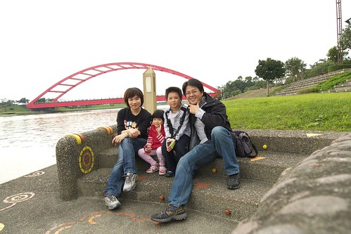

就如同我跟徹嬤說的這次就是為了把補助花掉所以找個地方睡覺而已 睡個一晚溜一溜然後就回家了 要不然就如同徹爸在逛完羅東夜市時候說的 逛完八點回到台北家也才九點初而已 不過照我們家不可以晚歸的生活習性實在也不可能為了逛夜市專程跑來宜蘭的 所以這一晚是住之有理啦.. 只是本來想說週五中午就可以從板橋出發 難得地來個"雙鐵"小旅行的 卻礙於媽媽臨時的課程加上台北的天氣有點陰霾只好放棄原本的雄心壯志 最後還是徹爸開車且只帶了阿徹的腳踏車出門 3點多才從板橋出發到宜蘭都已經快天黑了 所以就直接去民宿辦理住房休息等待晚上的羅東夜市

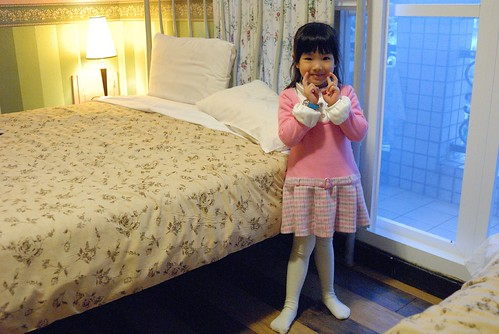

週五是愛愛的穿裙日怎樣都不肯換下裙子 因此難得的穿裙子出門玩 而今日這身衣著跟民宿的風格還挺搭配的 所以刻意地多幫她照了幾張 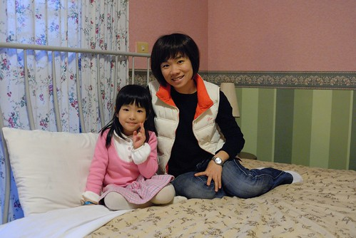

愛愛中場還客串當了一下老師 說故事給媽媽聽 "愛愛老師"很喜歡也很會表現當老師喔 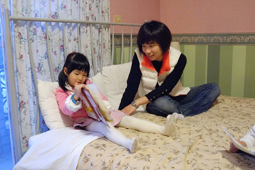

這次民宿的選擇考量得在PAYEASY名單裡 冬山河附近 且較接近徹爸剩餘點數的價格(就是自己貼的錢越少越好) 因此選了家英式風格的民宿  週五四人房2200算是非常不貴的價錢 房間的擺設跟網路照片一模一樣 民宿呈現出的風格也如網路上所言 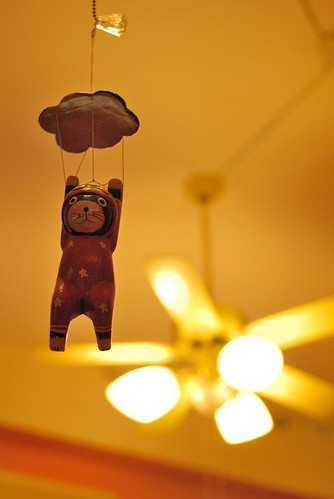

只是房屋的通風性跟採光讓向來很重視這兩點的我們有點失望 所以我跟徹爸兩人心底都偷偷只打了個及格的分數 而在隔天的早餐 雖然負責的員工阿姨也很熱情但男女主人的缺席讓我們的"失望"又雪上加霜了 我們真覺得早餐時間是房客與民宿主人最好的交流時機 主人們真誠的問早款待以及對於房客之後行程的建議或是話家常是一個民宿最能感動旅客的地方阿

(這是房間陽台出去的景 就是標準城市中樓房式的民宿) 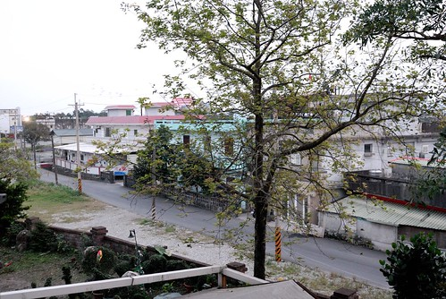

民宿離冬山河很近 因為預期民宿應該有腳踏車可借用所以就沒把我跟徹爸的車載出門了 民宿也真的有提供車子只是最後準備上路時才發現腳踏車後頭的安全椅實在很不適合愛愛 於是後還是只能花錢到冬山河親水公園大門口的腳踏車店租車 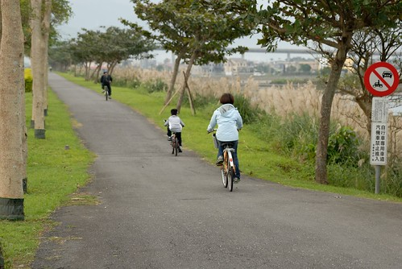

為什麼只帶阿徹的車出門 實在是因為小孩子的車很難租 不是可以選擇的款式超少就是超難騎 怎麼樣都比不上徹爸為阿徹量身調整的小小紅 所以如果可以還是盡量帶小孩子的車出門 這樣半途騎得累了或不開心起碼小孩就不能牽拖是車子的緣故 至於我們大人從小騎到大 又是這樣平緩的河堤便道 租用的腳踏車就算不好騎也都還應付的措措有餘 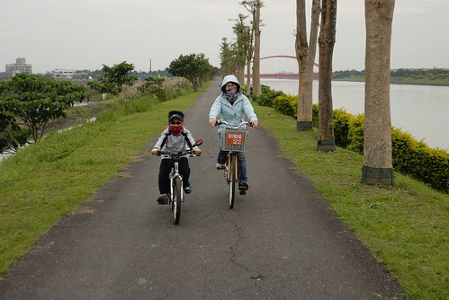

本來以為沿著美麗的冬山河自行車道騎車是愜意的 很沒有什麼的 結果想不到才剛轉入車道沒多久便開始遭受沿途小飛蟲的侵略 如果開口講話蟲子絕對就大口大口的進去嘴巴裡了 而就算不開口鼻子也還是會遭殃 這樣騎了幾分鐘後實在受不了於是徹爸回到車上拿了領巾   大家把眼口鼻都遮好後重新再出發 

我們先沿著親水公園這岸往南朝冬山方向前進 沿途一邊是冬山河一邊是芒草/稻田或民宅  不算大美但有種平易近人的小美 

久聞號稱全國最美麗車站的冬山河車站很久 今日總算有機會一探究竟而且親身體會在轟巄轟巄鐵道下騎車的感覺 

老實講覺得冬山車站的造型很像古化石哩...尤其那灰色系的鋼骨以及水泥牆感覺粉冷說 我心裡還是覺得在那些在花東田野間的小車站比較美麗說 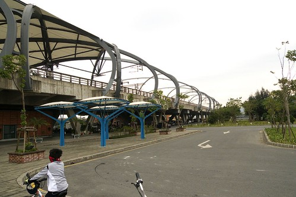

不過當然還是得不免俗的來張地標照嚕 (實在不是我的菜以致連買月台票上去晃晃的意願也低落  可惜了期間有兩班火車經過的說) 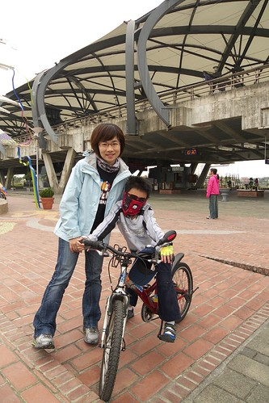

冬山鄉是風箏的故鄉(可能因為有風箏博物館的關係) 車站廣場的地標便是這樣一個風箏 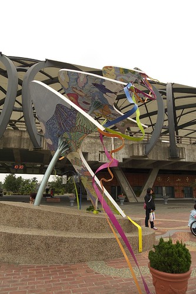

(愛)好大的風箏阿...真的可以飛嗎? 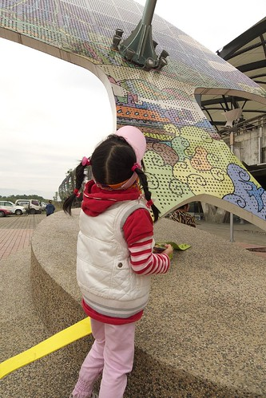

(媽媽OS)爸爸抱著飛可能實際些吧 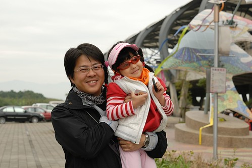

愛愛很愛她的太陽眼鏡 一直帶著怎樣都不願意拿下 只是今日這身打扮怎麼一整個很有像貴婦歐巴桑的FU阿 (騷包橘色太陽眼鏡+領巾+遮陽帽) 

離開冬山車站後接著走親水公園對岸(左岸)自行車道往回走 沿途依序可見不同的連接冬山河兩岸的便橋及橋墩 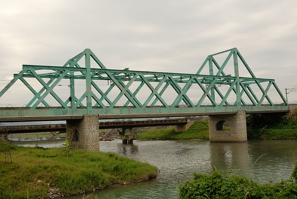

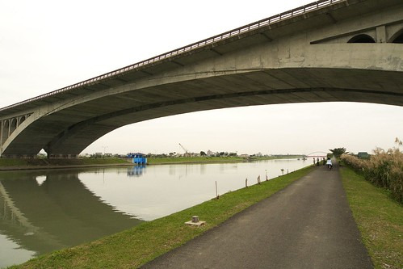

當中最美麗的當然就屬這親水公園地標-利澤簡橋 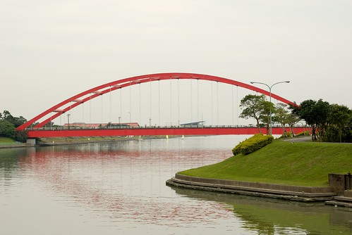

這角度不錯於是拉著阿徹來張紀念照 只是兒子阿你真的看起來變老了(好聽的說法是變man啦) 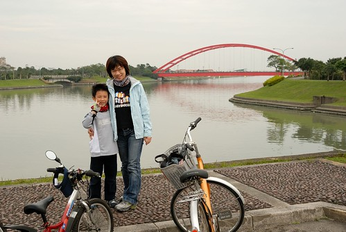

經過親水公園後我們繼續往五結清水匣門騎  途中還經過了傳藝中心 相較於親水公園區內那整理的有序又精巧的車道景觀 其實我比較喜歡這樣芒草叢生的車道 真的! 超級明顯的 感覺就像富人跟窮人的院子 一看就是差很多 給人感受完全不同 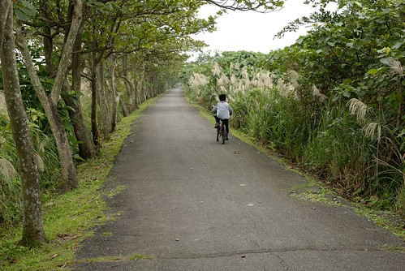

清水匣門是冬山河自行車道的底端 從最南的冬山車站到這裡大約10公里 騎到這裡時阿徹傻傻分不清為什麼要轉彎騎回右岸 我說 因為要回頭回到親水公園去開車阿 阿徹開始嚷著那怎麼不是剛才就回去(指利澤便橋那)  然後小子開始生悶氣加速猛騎 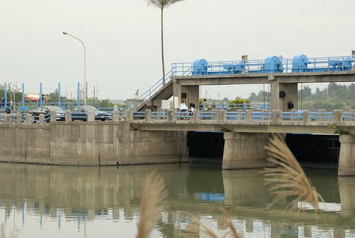

他難得的騎快到時速20公里以上 讓跟著的我也得認真的騎才跟的上 更別說落我們很多的徹爸一整個難以想像我們到底騎多快也得拼了命了猛追 沿途因為沒什麼人車 阿徹競速競的也忍不住開心了起來 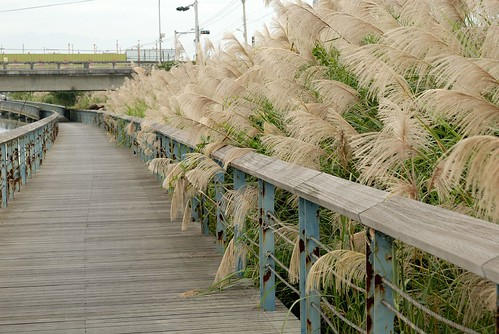

而且沒一會兒我們便又回到親水公園內 準備坐著翹腳等徹爸他們 本來我們還得意地想說 我們起碼要等5-10分鐘才會等到徹爸 結果沒想到才剛把裝備都卸完 3分鐘不到便看到徹爸喘呼呼的出現在我們眼前 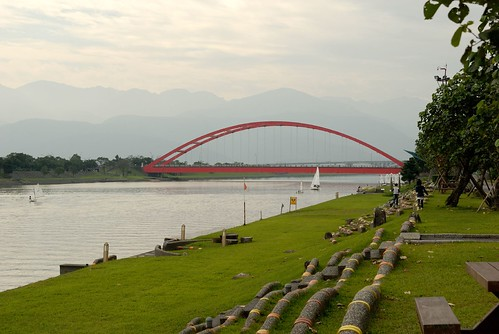

徹爸說 想不到你們這對母子竟然能騎這麼快 讓他追的好趕好辛苦阿... 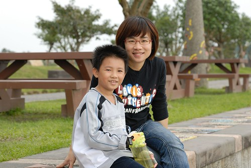

嘿嘿 開玩笑 我們可是熱血少年哩 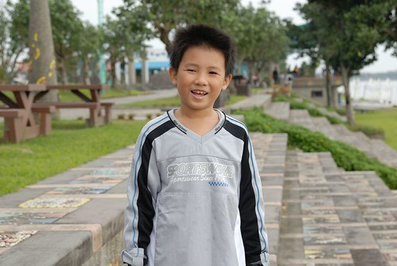

坐了一上午後座的愛愛也總算可以下來活動活動  只是蹲的很醜哩... 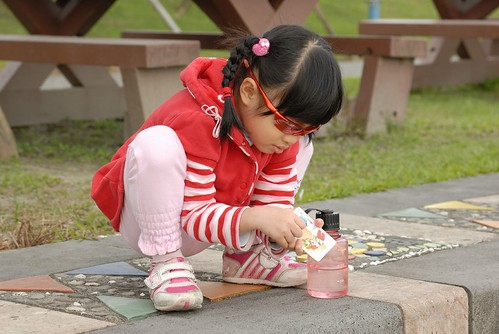

前一晚在羅東夜市玩遊戲換得的5張真珠美人魚卡片是愛愛今天早上打發無聊的利器 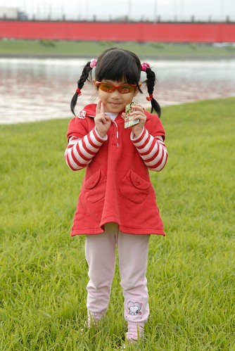

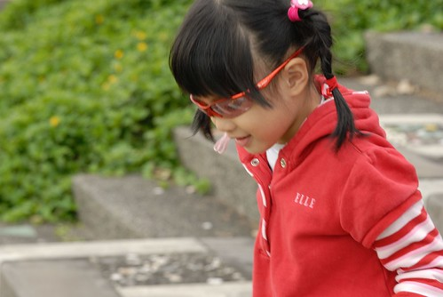

今天的天氣不冷也不熱  天空不藍也不陰 而人潮也是稀稀疏疏地剛剛好 很適合這樣的坐在冬山河畔 欣賞蘭陽平原美景 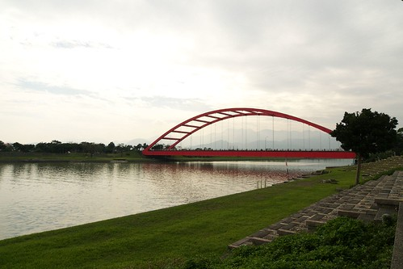

來張情人照 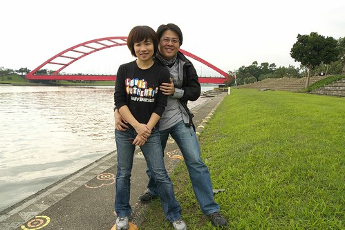

再來個自拍全家福 漂亮地結束我們的冬山河自行車道之旅~ 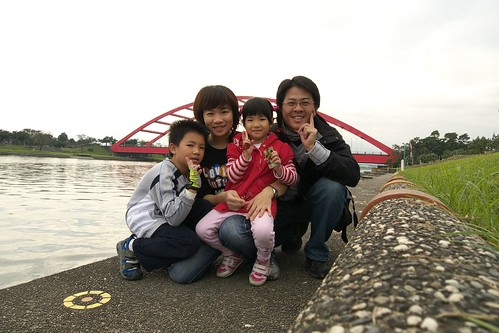

冬山河自行車道從最右邊的匣門到左邊的鐵道處 左右兩岸來回總共約21公里 很適合親子騎乘的家庭路線 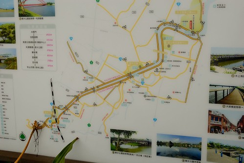

還好車後已經是12點初 為了1點在玉兔學校的課 我們去7-11簡單地解決我們的中餐 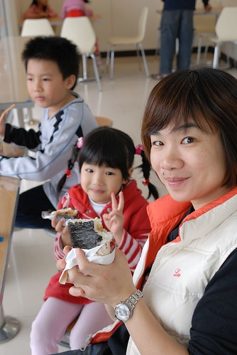

上完鉛筆課([blog.yam.com/hmchen1975/article/33426759](http://blog.yam.com/hmchen1975/article/33426759)) 接著我們去徹爸慕名很久的勝洋水草館 徹爸原本滿心期待的想要自己DIY個自己風格的水草瓶 可是淡水水草只有團體可以DIY  一般遊客只能做海水的生態瓶 於是最後只讓阿徹跟小愛一起玩了個生態瓶 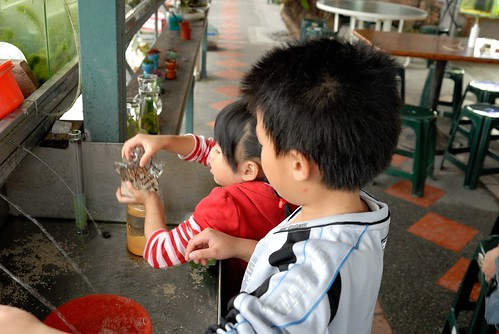 

DIY的過程其實就是 數次的洗砂 放珊瑚樹 倒水 倒蝦(一隻150的蝦回家隔天就陣亡) 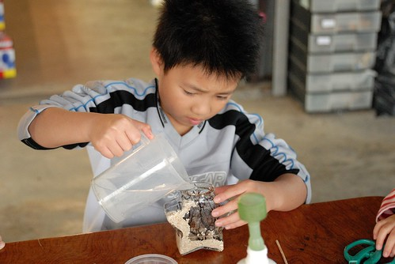

然後封蓋 裝飾...真的就是純粹到此一遊的DIY紀念 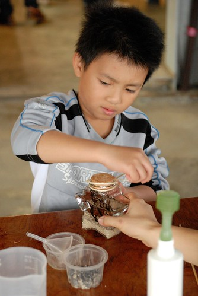

而除了生態瓶外 我跟徹爸又忍不住買了個淡水水草瓶 (這對夫妻其實很容易衝動買東西的) 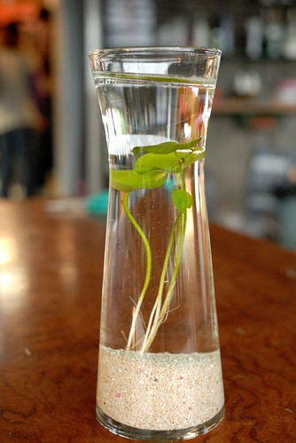

購物完畢接著去參觀農場的水草博物館 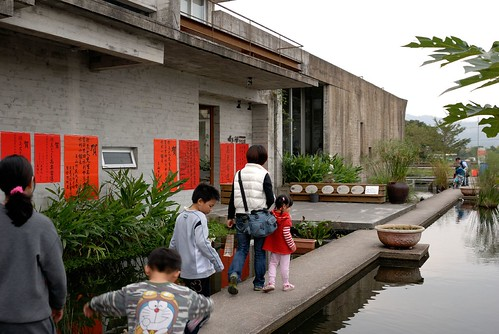

館內有一些水草的展示及介紹 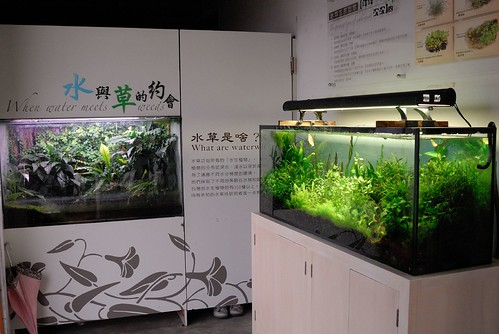

當中最引人注目的就是這澡球 據說這樣一顆球需要20年的時間養成 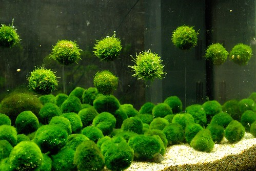

水草館其實很小維護的也覺得不甚佳 但是館後方的夕陽窗景是各意外的收穫 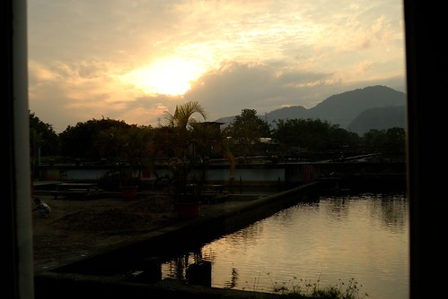

美景當前忍不住要愛愛在餘暉下裝模作樣來一張 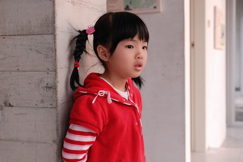

農場整個的腹地並不是很大 起碼就可以參觀的部分真的不大 而農場內的活動也並不多 可是竟也看到好多的遊覽車載來一批批人 如果遊客密度大大降低 我相信這裡會是個值得的農場體驗 只是...所以..覺得很可惜.... 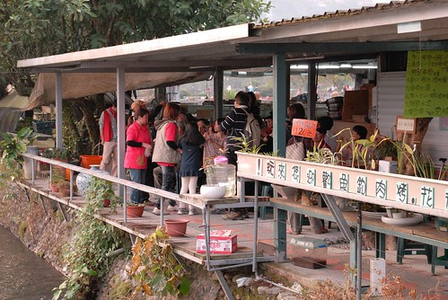

或許是因為我們的"口味"真是越來越重了 所以對於宜蘭那昌盛的"休閒農場"式玩法實在很難適應 總覺得有點太"弱"了  很難真正撫慰城市人那空虛的心靈及滿爆的壓力 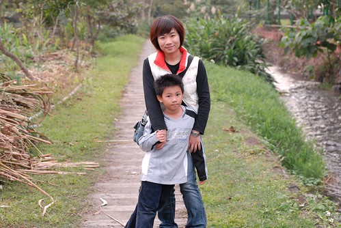

宜蘭的田園風光是真的也很漂亮 (重點是從台北過去真是太太太方便了) 不過我想多花點時間 用走的或自行車的方式絕對更能體會宜蘭特有的田園之美的 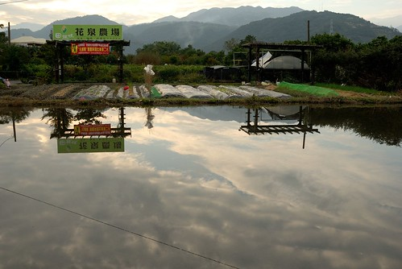
