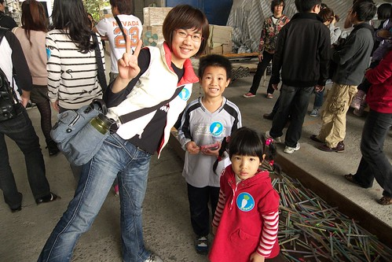

講到玉兔鉛筆大家可能還沒什麼印象 可是看到這樣的原子筆筆身 5-6年級生的我們就絕對有印象了吧! 之前唸著打算去宜蘭走走時 同事介紹了這間學校 她說小朋友去應該會玩的很開心 於是這回的宜蘭行我們一家子一起去玉兔鉛筆學校上學~ 

玉兔鉛筆學校位於宜蘭五結鄉  參觀必須先預約 本來只想說在宜蘭隨意走所以其實行前並未把鉛筆學校列入一定要去的地方 只因為民宿主人在我們辦理登記時特別介紹了玉兔 民宿也提供了代預約及門票優惠的服務 因此在上課的當天早上我們才透過民宿幫我們預約了下午一點的場次 剛好可以讓我們在騎完車後接著去上學 所以又是好個天時人和讓我們今而個大手牽小手 一家子難得一起去上學~  

快一點抵達時已有許多同批次的遊客抵達 等待約莫10分鐘 等工作人員點完名也準備完畢便領著我們這一班開課去 全班來到工廠某建築物的二樓一個活生生就像是我們小學教室的地方 教室前有黑板 風琴 後還有國父遺像哩.. (真是好久不見國父了) 

首先工作人員先是發下這堂課學生的名牌  接下來的課程裡就是認這張藍蘿蔔貼紙啦 

3歲以上的愛愛也有報名一口 所以今日這堂課她難得的可以跟爸爸媽媽還有哥哥平起平坐 

課程的一開始是約莫15分鐘'下課花露米'到玉兔學校的影片 老師問'現場有沒有人看過下課花露米' 結果就我家的低級小學生阿徹開心的舉手喊著'有' 而看完後還超興奮的跟我說'我比我同學多看一集的下課花露米了' (這年頭小學的多媒體教學就是包含這幾乎每周一次的電視時間)

看完影片開始對鉛筆的製作過程嘖嘖稱奇了 尤其是那筆蕊得經過烘烤及豬油油炸過 挖賽...難怪大家考試寫不出來時這麼愛啃筆 原來是豬油香在作祟啦 第二堂課大夥人來到工廠的小廣場進行體育課 

體育課的內容是'釣筆'比賽 阿徹釣的很認真 愛愛完全使不上巧 而媽媽則因為太有趣釣的漫不經心 

徹爸最後實在看不下去便也跳下海釣筆去 只可惜時間太短實在難挽頹勢 因此最後的大人小孩組皆斷羽而歸 

雖然阿徹對於沒能拿到小孩組第一名鉛筆一隻的獎勵有點介意 但是媽媽說開心就好啦 

第三堂課是進入到目前仍還在運作的工廠內實際走訪參觀 

仍然保留傳統工廠的原始風貌 讓徹爸看的直呼'這分明就像張爸以前的製本所阿' 那一台台的非自動化的機械式機器都勾引起徹爸無限的回憶與思念 只是礙於商業機密工廠內禁止一切的攝影照相 所以好奇的人只能真的來這上學才能親眼目睹一番 

第四堂課是DIY創造屬於自己風格的鉛筆 

開始製作前 先聆聽工作人員的解說 

瞧 我們一家子都有很認真地在上課吧 

然後在開始彩繪前先挑選等會要用的鉛筆套模 

每一個報名的學生有三隻的白鉛筆可以DIY  所以我們這家子總共有12枝筆 20分鐘的時間其實還是會讓我們有點手忙腳亂  因為除了得用自己的還得處理小人的大小問題 下圖愛愛的表情應該是在想'要畫點什麼好ㄋ' 

'嗯~ 就是那個啦' 

哪個? 當然是愛愛的招牌小女生或小男生嚕 

噹噹~愛愛完成的第一隻  可能因為鉛筆實在太小太難讓愛愛的小手掌握以致這個娃除了臉外其他線條亂亂走 

可是愛愛還是很努力且堅持地自己完成了她的三隻筆 

不要誤會 這不是阿徹做的筆 他還不會寫這麼多字 這是徹爸的筆 很有乃子之風吧! 

完成好的筆套好有顏色或是透明的模後待過熱壓塑即告完成 

而最後還有這精巧又有質感的小立體三角盒可以包裝自己DIY的三隻筆 

噹噹噹! 我們的作品都完成了 

從把鉛筆裝進小盒子後 愛愛拼命的想要把入口處也封的像另一頭一樣漂漂亮亮 一直弄一直弄 即使照相時還是不死心的一直用(上圖) 可惜她的手指還不夠靈巧未能成功 

直到徹爸幫忙她弄好 弄得漂亮後才露出完工後的笑容 

第五堂課是來到風雨走廊的木板塊堆疊的能力&耐力考驗課 

沿著逆時鐘逐一堆疊一塊塊的製作鉛筆的木板塊 我們這一組除了我們一家子外還有一對老婆大腹便便的夫妻 因此實際戰鬥力只有那位先生以及我與阿徹(徹爸忙著照相跟口頭指導) 

隔壁組的年輕人粉利害 時間內把所有板塊都堆疊完成 可是老師對她們說'等會你們就哭笑不得了' 到底接下來會發生什麼事 會有什麼考驗  搞得大家好好奇喔 

原來就是要各組派出兩名壯丁把剛堆疊好的木板塊抬起來 如果有照規定一片片依序的堆疊好 是可以順利地把木板座給抬起來的 

而抬起來的木板塊中間還應該會有一個人可以進入的空間 

這遊戲真是太精采刺激了 

不過遊戲還沒結束喔...  瞧 徹爸緊張冒汗的樣子 

接著得抬著這座木板塊繞走廊一圈阿... 剛說的堆的最高的那群年輕人又真是太猛了 竟然又跑了第一名每人獲得禮物鉛筆一隻 

完成上述的各項挑戰回到原點後就是最後的破壞跟歸位啦! 

然後緊接著是今天的第七堂也是最後一堂課 回到紀念館處做工廠的歷史介紹 玉兔創立於1947年以製作大頭針等文具類為主 工廠本來位於台北木柵 後因都市化台北市內禁止工廠的設置才搬遷到羅東 講到這工作人員問了在場小朋友 地圖上從台北到羅東這段距離總共有幾隻鉛筆 阿徹好努力的數阿 即使後面的大人早已說出數字阿徹還是沉浸在自己數數的思維裡 結果連工作人員姐姐最後也笑他說  我看你好認真的數了3次 怎麼還是錯阿 哈哈!  有認真的小孩最可愛啦  不過姐姐你也真小氣沒給個安慰獎... 全部七堂課裡陸續送出了有20隻左右的筆吧 可惜徹爸徹媽太不才一隻也沒能掙得 只好最後去販賣部讓阿徹跟小愛各字挑選一隻鉛筆作為今日上學禮物才適懷 (這是今日全程帶領講解的工作人員  雖然個子小小可是中氣十足又活潑生動ㄋ) 

最後在紀念室裡講解完所有玉兔的歷史發展後結束我們今日的課程 恭喜阿徹跟愛愛都從玉兔鉛筆學校畢業了! 

原先我跟徹爸認為這樣的導覽課程應該約莫一個鐘頭左右便可結束 可是這扎扎實實的二小時課程讓我跟徹爸一致覺得這CP值實在很高阿 包含深入的鉛筆製作過程了解 有趣的實作以及每人共5隻鉛筆的帶回 真的讓人覺得很不虛此行~ (門票也是一隻鉛筆削過代表撕票退回保存+3隻DIY以及最後的一人一隻紀念筆) 尤其連阿徹小愛也都玩的這麼開心 可見這裡除了是我們這些中年人回味歷史的地方外也是小孩子開心遊戲的好地方 

今日鉛筆學校 上學成功! 
