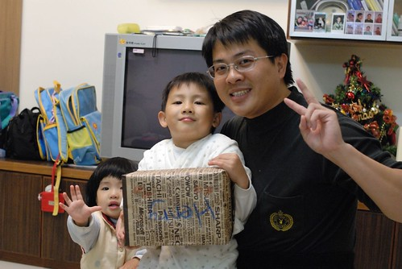
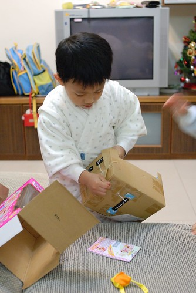
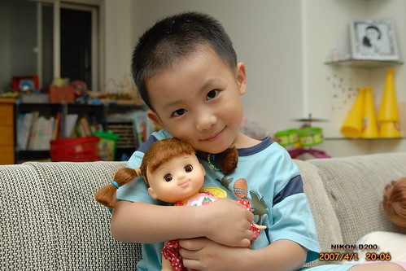
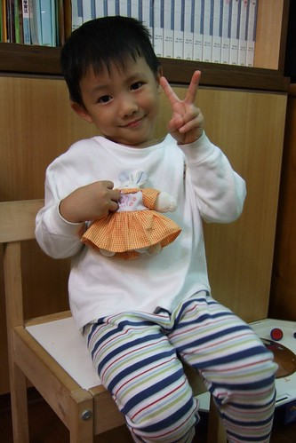
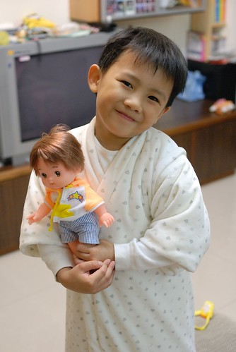
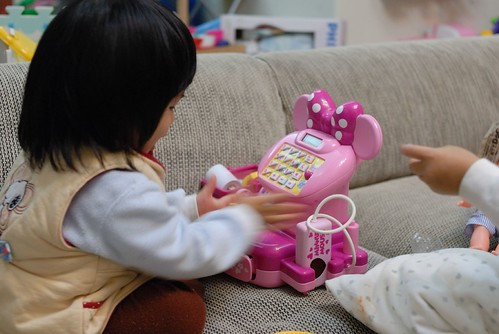

盼了好久總算盼到聖誕節了  
其實12/25對我們來說既不是行憲紀念日  
也不是吃火雞大餐 開狂歡派對的聖誕節  
不過是個可以讓徹家"名正言順"買份禮物送大人小孩的日子  
尤其對阿徹來說 每每望著百貨公司裡 櫥窗裡 別人手上的玩具流口水時  
爸媽總都是無情冷淡的回應"今天是聖誕節嗎 不是吧...那為什麼可以買禮物"  
所以聖誕節可是個大日子ㄋ...  
一年中兩次可以買大玩具的重要日子ㄋ... (另一個是生日)  
  

阿徹好不容易盼到了聖誕樹點亮的12月  
一心想著即將到手 想望已久的禮物  
偏偏爸媽這個月更是嚴酷的刁難著他 動不動就用禮物威脅他  
"不乖 打人 不認真....小心把你從聖誕老人的好人名單中剔除"  
阿徹無奈又生氣的嘟著嘴回說"我也要把你從我的好人名單中剔除 不要送你禮物了"  
呵呵~~爸媽無所謂 看誰損失比較慘重  
所以阿徹還是得接受這無情的考驗對待 忍辱負重的過著為"五斗米折腰"的日子  
  
12/24原本是開開心心要頒發禮物的日子  
可是媽媽又故意設下關卡考驗阿徹了  
那天媽媽下班後先回家包裝禮物 然後大剌剌的放在聖誕樹旁邊  
想也知道 阿徹回到家一定會對這禮物又驚又喜又迫不及待的  
果然進到家門後的阿徹急著要打開禮物  
我說"要等到爸爸回到家後 吃飽飯忙完後才可以全家一起開禮物"  
阿徹說"為什麼要等到爸爸回來才能開"   
我說"因為禮物都是爸爸買的 所以爸爸要一起開禮物"  
阿徹很難以接受所以當然有點番  
果然等徹爸回到家後 阿徹督促著爸爸趕快去吃飯  
爸爸才在餐桌坐下來就又嚷著要開禮物 又問爸爸"為什麼我要等你吃完飯才能開禮物阿"  
徹爸說"因為錢是我出的 禮物是我買的" 有夠現實又無情的回答  
果然阿徹的筋一如往例的"啪"的斷掉了   
當然的今晚不能開禮物了 明天再說吧  
  
徹爸私底下忍不住跟我嘀咕"你明知道你兒子會這樣你還故意先拿出禮物"  
徹爸本來想等他吃飽飯後再突然拿禮物出現 送出禮物的  
我說我是故意要考驗阿徹的 誰知道他真的就沒通過我的考驗....  
  
12/25從學校回家的路上 阿徹跟我說"我今天有一點忙 要\*\*\* 要&&&"  
絕口不提禮物的事 甚至回家後也沒去多望禮物一眼  
完全表現出一附"超然"看開的態度  
不過就在徹爸回到家坐下來吃晚餐後 阿徹好心的提醒徹爸"爸爸 你趕快吃飯喔"  
呵呵~~還是有肖想禮物的啦  
等到徹爸吃完飯 洗完碗 躺在沙發上裝死一會後 (阿徹今天有給他有耐性等禮物)  
發禮物的時間到了喔~~~  
  
首先是阿徹頒發禮物給徹爸  一個他胡亂充數的小別針  
媽媽沒有禮物 因為媽媽最近比較兇所以不在阿徹的好人名單中  
爸爸雖然偶而有一點兇但是這樣還可以接受 所以可以領到阿徹的禮物  
  
  
  
接下來是阿徹的禮物  
阿徹搖了搖 開心的說"一定是\*\*\* " 他想了很久的一樣東西  
  
  
  
小愛妹妹也有喔    
這是媽媽幫她跟爸爸爭取的   
  
  
哇哇哇~米妮耶~  
  
  
  
阿徹的禮物是什麼東西阿...  
一個月前徹爸就拜託去日本出差的前同事幫忙帶回  
除了便宜許多外 這可是爸爸媽媽一份心意ㄋ  
  
  
  
大家還記不記得阿徹2007年上半年的時候阿徹有一個開心娃娃 綁著頭髮的小女生娃娃  
阿徹會幫她換衣服 佈置溫暖的家 甚至陪著睡覺  
可是有一天當我跟徹爸悠哉的躺在沙發上裝死的時候  
阿徹突然匆忙的從房間裡跑出來說"電燈冒煙了"  
冒煙? 電線走火了嗎?  
 進到兒童房一看  睡覺用地檯燈果然在冒黑煙  
而開心娃娃正躺在燈罩的上方 半邊的頭髮黏在燈泡上 燒個精光見頭皮  
問阿徹在做什麼 他說"因為想要幫娃娃燙頭髮"     
令人又好氣又好笑的"燙"頭髮  
這下娃娃真的被燙的要打包進垃圾袋送走了（半邊頭髮燒焦的娃娃真的有點嚇人）  
  
  
   
自從開心娃娃上天堂後　（阿徹說是上天堂）  
阿徹也如我們告誡的"要等到他生日或聖誕節可以買禮物的時候才能再買"  
認命甘願的把一個巴掌大的小白兔當作他的娃娃  
給它穿上以前娃娃的衣服　給他以前娃娃同等級的對待照顧  
  
  
  
本來以為阿徹應該習慣這樣的小白兔娃娃了  
想不到在１１月徹爸跟阿徹打探想要什麼禮物時  
阿徹竟然說　他想要娃娃而且這回要買跟妹妹一樣的娃娃　不過是男生的  
就是這個男版"美路醬"。。。上回去日本時我差點要買回來自己玩的小男生  
＂他＂果然命中注定早晚有一天會進我們家家門的  
  
  
  
小愛的禮物　米妮收銀機  
小愛看到打開後的禮物　望了三秒鐘後開心的說＂一百錢＂  
就是去買東西老闆會刷刷刷的一百錢啦  
很奇怪只要玩買賣的遊戲　問小愛多少錢她都會回答＂一百錢＂  
所以一百錢對他來說就代表著付錢收錢這件事吧  
  
  
  
這是徹爸的禮物的產出成品  
徹爸禮物是什麼阿？　一台可以接相機的印表機　（徹爸自己補充說明這是啥東東）  
可以享受著照完相的當下　選張滿意的照片即時的沖印出來　然後看著它慢慢顯影   
雖然這感覺挺不錯的　照片色彩也很有FU   
但我還是覺得這比較像是＂把妹機＂（就是借這玩意把妹啦）  
徹爸說＂對阿　把你這個妹＂　  
咳咳～老夫老妻了　不用甜言蜜語了  
  
  
  
咦～～媽媽的禮物ㄋ　怎麼沒有看到媽媽的禮物ㄋ  
也真不知道該說自己是清心寡慾　還是膚淺到連個可以滿足心靈的期望都沒有  
偶而想想還頂羨慕阿徹她們這樣期待新玩具的心情  
徹爸買個新手機或是新科技產品的新奇心情  
我喔...只能當個膚淺的永遠缺一件衣服一雙鞋的女人...  
不過還是謝謝徹爸給了一個令我滿意的刷卡額度　三Ｑ啦~
