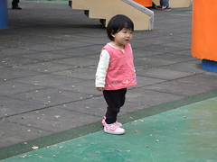

這個年來的比往年晚 但假期很長很長...  
不敢想像放這麼多天假後 阿徹會皮成什麼樣  為娘的我會被操成什麼德性...   
  
為了避開人潮 跟徹爸決定今年開夜車回家  
除夕前一天星期五跟徹爸下班後 就急著安頓好一切 然後拿紅包回新莊 然後趕路回嘉義  
晚上10點多一些上了二高的鶯歌交流道   
沿路車況比想像中好很多 所以半夜一點多一些便抵達嘉義  
真好~ 一覺醒來就可以在嘉義開始這長長的假期嚕

除夕早上張嬤忙著拜拜  徹爸忙著體驗徹伯買的wii  
大大小小各自展開屬於自己的忙碌假期  
小愛回到嘉義也很忙了  
忙著騎摩拓車 玩玩具 爬樓梯   
越來越有大寶寶的架勢...  
  
    
  
這麼長的新年假期過的最爽的應該是阿徹  
每天都有人帶出去玩 玩到後來都皮的很欠修理  
不過也好在他願意跟著阿公阿嬤四處玩  
讓我跟徹爸才得以清靜的偷睡覺補眠  
除夕的下午..年假的第一天...阿徹的放風地...中山公園 (因為爸媽都在家睡覺所以沒有照片)  
  
吃完年夜飯徹伯賞了小愛跟阿徹紅包  
徹伯還故意的塞在小愛屁股上的小鉤鉤  
人家給小愛紅包她都很開心 亂丟地上她也很開心 不過最開心的應該是最後收紅包的媽媽  
呵呵~小孩治裝 玩具費有人贊助了  
  
   
  
年初一早上很無聊的想要去排福袋  
前一天還刻意打電話去遠百問"10點開始發號碼牌 500個名額"  
想說純樸的嘉義排福袋的無聊人應該不多吧  
結果10點一到遠百就被排隊人潮給嚇到了  
原來嘉義也不純樸了 像我這樣無聊的人還真不少ㄚ  
雖然早超過500名額了 但來感受一下年味也還不錯啦  
看看鳳陽花鼓的表演總算有了點過年的氣氛  
  
  
  
放假這幾天每經過樓下漫畫店阿姨的桌子  
阿姨就會嘟來一些餅乾糖果  
阿徹也很順手的自己拿幾顆糖果吃  
每當警告他會蛀牙時 阿姨總說"過年ㄇㄟ"  
ㄟ...過年好像可以做很多事哩...怪怪哉  
  
(左)小愛吃完巧克力餅乾後的猙獰樣 (中)喬裝巨乳的阿徹 (右)就是兩個"它"讓阿徹胸部長大的  
    
  
今天阿公阿嬤有點小累 只好由我跟徹爸還有徹伯帶著兄妹倆再度前往中山公園  
四人還灑了100多元"報ㄎㄡ阿"  
幸好最終提了滿袋食之無味棄之可惜的小玩意回家  
  
   
  
雖然厚的薄的衣服塞滿一大箱的行李箱  
嘉義還是出乎意外的熱  
帶下來的羽絨睡袍讓阿徹小愛睡的滿身汗  
幸好衣櫃裡還有掛了很久張嬤買的小睡袍可以充當睡袍  
而阿徹跟小愛都很愛這深粉紅色打扮ㄋ  
  
   
  
年初二早上 跟著張三姐一家人還有徹伯到民雄中正大學放風箏  
學校裡不少人 挺像個觀光地的  
居高臨下的大草坪可以讓人隨心所欲的放風箏 享受南台灣的陽光  
可是今天損失慘重 風箏飛了 飛盤遺失了....小小傷心  
  
   
  
    
  
   
  
    
  
結婚四年多從沒初二回過娘家  
一來平常就住台北三天兩頭往娘家跑了  
二來初二徹爸的三個姐姐都會回娘家  
其實夫妻協調好就好 讓彼此都能讓對方家庭大團圓就好(話雖如此 頭一年自己還是偷偷掉淚)  
  
  
  
年初三午飯過後 很無聊的跟徹爸提議來個高雄高鐵半日遊  
大家打趣說如果沒有到高雄的票 那就到台南吧 如果再沒有那台中新竹也可以啦  
跟小姐說"給我五張有票的就好 哪都行"  重點真的就只在那高鐵  
半天的高鐵行花了不少錢 但還蠻新奇的體驗啦 (另敘)  
  
年初四一大早 阿公阿嬤帶著三個小男生去獨角仙農場玩沙  
剩下的大人難得清靜的在家休息(這幾天人多真的鬧哄哄 客廳永遠收了又亂)  
這幾天人來人往的訓練 小愛比較不怕生了  
今天媽媽煮飯時 竟然還願意讓三姑姑抱跟餵吃飯  
很大的進展 不錯不錯~   
(阿公阿嬤常說 小愛長的跟三姑姑小時候很像 徹爸說"是ㄚ 愛哭愛ㄉㄟˋ路 很像")  
  
  
  
初四下午三姑姑一家四口打道回台北了  
精力旺盛的阿徹沒有午覺 跟著阿公繼續征戰中山公園  
年假第三次去中山公園了  
去公園"報ㄎㄡ阿" 打彈珠 開賽車 玩大溜滑梯 難怪阿徹這麼愛  
  
年初五早上睡晚晚 看漫畫 等著中午跟大姑丈她們家族的午餐約會  
媽媽肖想很多年的對面"真北平"餐館 總算在暌違7年後得以再去大嗑美食  
不過不知是寄望太高還是過年吃太油膩 有點小小失望...  
  
   
  
   
  
今晚二姑姑回了第二次娘家 打亂了大家原訂的計畫(呵呵 徹爸念了幾次"還有人回來兩次哩")  
(左)大阿徹四個月的典彦姐姐 看他的穿著讓人想起小時後過年很期待的"過新年穿新衣戴紅帽"  
(右)小愛今晚也願意讓二姑姑抱 跟姑姑們很有緣喔  
  
   
  
年初六要打道回台北嚕  
在嘉義睡了7晚 睡眠品質不太優 超想念台北的床的(睡習慣好床的缺點就是越來越認床了)  
可是今天要先去台中探望正在坐月子的小溫學姊  
然後接玟姿阿姨一道到桃園拜訪燕華阿姨的新家  
有了燕華阿姨家的小艾在 小愛成了小小愛  
小艾跟小愛都是11月25日生 只是小艾早小愛一年  
玟姿阿姨常說她有大艾跟小愛還有阿徹了 哪還需要自己生ㄚ...  
  
  
  
前一晚讓燕華阿姨作東請吃客家菜  
年初七的中午就換徹媽我做東嚕  
選了尾牙時留下好印象的關渡自然公園那的"水鳥92"  
望著窗外的大片自然景觀 吃著西班牙菜真的挺享受的  
尤其沙發座椅讓阿徹都輕鬆的有點放肆了  
放假太多天越來越皮的阿徹已經讓爸媽摩拳擦掌等著修理他了  
大艾今天穿上漂亮的小洋裝  成了阿徹很哈的小公主  
要他跟大艾妹妹照相笑的可開心...  
  
   
  
吃完飯 一行人到關渡自然公園裡走走  
三個小孩的行進速度果然慢...慢...慢....  
  
   
  
阿徹跟大艾不扭捏的牽著小手走路  
還臉貼臉一同照相 ~很像拍婚紗照喔  
你們這些大人果然很無聊...哈哈  
  
   
  
   
  
   
  
今晚總算回媽媽的娘家嚕    
可是從阿公家帶回的一堆糖果總算引爆媽媽好好修理阿徹一番  
很像阿兵哥收營時的"收心操" 不開扁一下都忘了規矩在哪  
這年總算是過完了 大家還是開始繃緊一點過日子了吧   
豬年~希望真的諸事大吉~  
  

