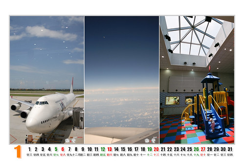

每到年終, 都想要來做個屬於家人或作品的桌曆.  
  
但是礙於沒看到可以接受的印刷方式與價錢,  
  
所以一直提不起什麼勁...  
  
這個構想也一直停留在"講講階段"...  
  
直到今年有次回嘉義時,   
  
知道了一家嘉義蠻有名的沖洗店-"高毅"...  
  
它有提供印刷一套30張名信片的服務, 價格好像400元上下...  
  
店裡有擺sample可以參考...  
  
覺得印的不錯...價錢也還可以接受...  
  
缺點是...小張了點, 桌曆好像沒那麼小的!!!  
(但是小也有好處....比較不佔桌面位置...哈哈哈....)

工作又湊巧進入"一小段"空檔,  
(我在此強調...真的是"一小段", 我絕對不是米蟲歐...)  
  
於是緊鑼密鼓的製作就此展開摟了...  
  
  
初步構想是從8月北海道旅遊中, 選出還不錯的照片來做成桌曆..  
  
在經歷...挑照片...選工具...排版...一審...修正..二審(老婆審)...跟最後修正..之後  
  
終於有了初稿...  
  
  
照片的先後順序, 大致跟我們去日本北海道的旅遊順序一樣....  
  

這是從最後一天住的"東京新大古飯店"窗戶看出去的早晨景色...  
  
用這張來做為日曆的封面我覺得還蠻適合,   
  
"準備好, 北海道之旅要開始摟!!!"...  
  
現在, 請大家跟我一起往下看吧..

  
  
這3張都是跟出發有關的照片,   
JAA的班機, 飛機上的景色, 中正機場的遊戲區...  
  
  
  
  
  
台場的電影海報, 彩虹橋, 跟有名的摩天輪...  
  
  
  
  
  
奧入瀨溪流的瀑布...  
  
  
  
  
  
奧入瀨溪流旁的餐廳, 長壽水  
公路休息站, 路旁的販賣小屋....  
  
  
  
  
  
青森車站站前廣場, 車站內候車亭..  
  
  

  
  
函館的清晨, 纜車站, 世界三大夜景之一...  
  
  

  
  
高速公路上原野風光, 好吃冰淇淋的販賣部, 有名的女子修道院...  
  
  
  
  
  
大沼國立公園...  
  
  
  
  
  
有名的小樽運河...  
  
  
  
  
  
小樽市中心街景..  
  
  

  
  
舒服的鄉下景色-層雲峽溫泉區...  
  
  
  
  
  
東京迪士尼樂園...大城堡, 花車遊行...  
  
  
  
其實, 還有蠻多張照片礙於版面與張數限制, 所以沒能擺進來...  
  
大家可以去看看摟...  
  
[http://www.flickr.com/photos/hmchen0328/sets/72157603451835302/detail/](http://www.flickr.com/photos/hmchen0328/sets/72157603451835302/detail/)
