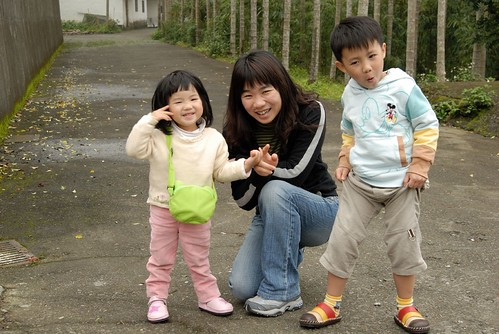

這次旅行的事前準備 我只要上網訂房然後給徹爸匯款  
不用查景點也不用安排行程  
因為就兩個點而已 日月潭&九族文化村  
而且高速公路上就有明確的道路指引  再不好歹大學也去過好幾趟了應該不會迷路吧  
所以星期日一大早睡到小孩自然醒叫起床(九點也不早了)  
帶著簡單的行李 豐盛的早餐 愉悅的心情 展開春遊嚕...  
  
  

踏出家門時的台北天空是陰陰的  
想不到車子過了桃園後變成這大片的藍天  
心情更是給他大大的好阿...  
  
  
  
下了二高進入南投山區 天空卻又陰霾了起來  
果然是"春天後母心"天氣變化多端難臆測阿  
  
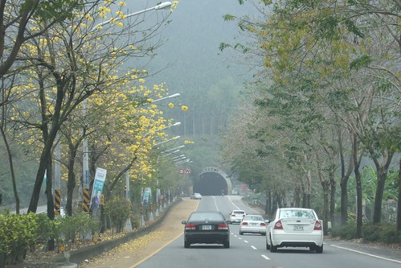  
  
小愛要嗯嗯於是停在山路旁撇方便順便舒筋骨  
回家看照片時才發現鏡頭下的阿徹竟然這麼的"痞"  
要"現"新鞋也不用這樣吧...那表情跟動作未免太寶了 (寶到很台)  
  
  
  
不到3小時的時間果然就到日月潭了  
過座山天又開了 好天好山好水好風景阿  
  
  
  
一進入日月潭區域就被好風景給吸引停車了  
看著一旁垂釣的漁人 忍不住驚呼日月潭怎麼這麼美  
(小愛最近很愛手插口袋 裝大人...)  
  
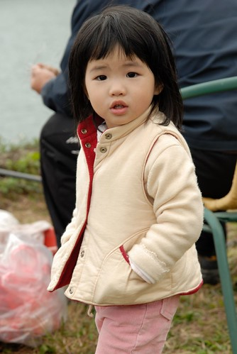  
  
微風輕拂 慢慢走 慢慢呼吸....  
  
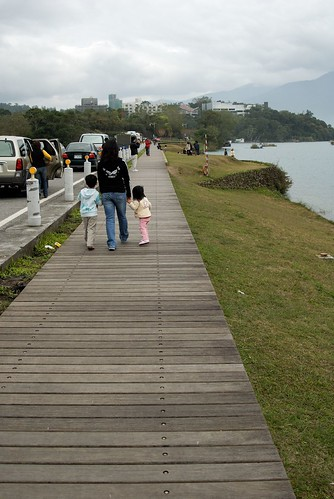  
  
升級為"國家級"風景區的日月潭果然跟以往很與眾不同 整個煥然一新的感覺   
  
~旅客服務中心~  
  
  
  
~水社碼頭購票亭~  
  
  
  
~水社碼頭~  
  
  
  
~日月潭最熱鬧的地方 水社碼頭街道~  
  
  
  
~水社碼頭渡船頭~  
  
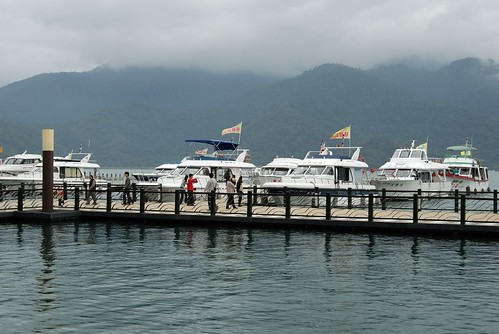  
  
小愛看到船直嚷著要去坐船 可是阿徹說他不要(不敢坐啦)  
妹妹一臉狐疑加請求的跟媽媽說"我很勇敢 我敢坐..."  
  
  
  
捱不住膽小的阿徹哥哥  所以只能在碼頭邊望船興嘆  
  
  
  
三點多到達今天要住宿的地方 霧社碼頭旁的民宿  
倚著碼頭的民宿 真的就在潭邊  
(陽台還有電視可以看哩 不過畫面有點小而且聲音被玻璃擋住了)  
  
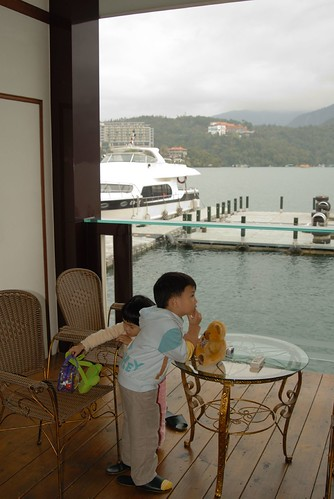  
  
倚著欄杆日月潭的湖光山色盡收眼底  
雖然這沒有那些高檔飯店的豪華享受 但跟潭同一個水平面的感覺真的很好  
  
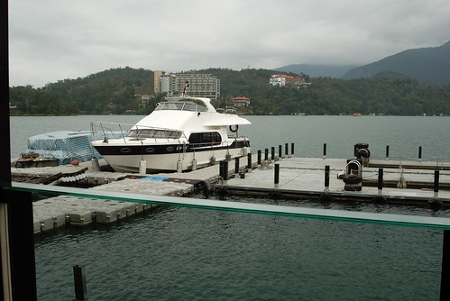  
  
房間的內部擺設   
除了view跟傍潭而居這優點外 其他的感覺就普普了  
不過老實講衝著那唯一的優點就很值得了  
  
  
  
民宿送的下午茶: 日月潭有名的台十八號紅茶與紅茶餅乾  
跟原本預期想像的蛋糕或是鬆餅有些差入  
不過紅茶真的好喝 跟印象中的立頓紅茶茶包差很多  
天仁茗茶在這有賣限地發售的日月潭紅茶包   
只有這才有賣的喔 別的地方都沒有喔  
  
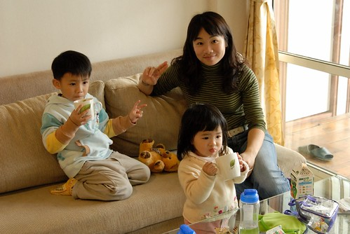  
  
慵懶的坐在陽台上小憩  kimo一級棒  
如果沒有小孩嚕無聊 可能就這麼坐他一個下午發呆了  
  
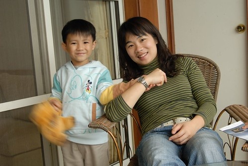  
  
小愛努力僑著他的小短腿 想要跟媽媽一樣慵懶放鬆  
乖...這是懶大人做的事  別太免強自己了 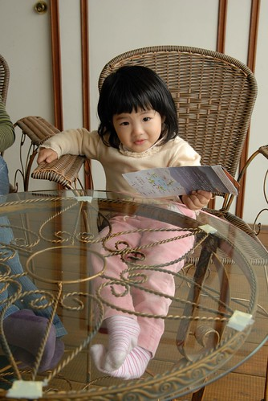  
  
研究一下地圖 看看等會怎麼玩日月潭  
  
  
  
拍完照後的徹爸也開始發呆冥想  
(咦...這表情怎麼很熟悉阿...怎麼好像在我們的婚紗照上看過ㄚ....)  
  
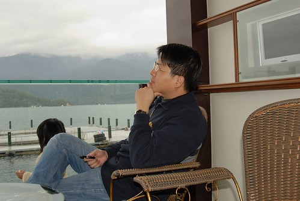  
  
每次出去玩住外面的時候  阿徹小愛很少有認環境失控失眠的情況發生  
好像都很期待開心的樣子畢竟難得有機會可以去住漂亮 甚至是阿徹稱為城堡的房子  
只是金窩銀窩都不比過自己的狗窩  
即時出門在外吃的飽住的爽還是喜歡自己的家  
所以踏上歸途的時候全家人總是開心的大呼"哇...要回我們的家嚕..."  
只是下次還要不要去玩? 當然還是要的嚕~  
  
(在爸媽發懶的時候 倆人玩著假裝睡覺的遊戲)  
  
  
PS. 最近照片產量突增 要努力消照片阿....
