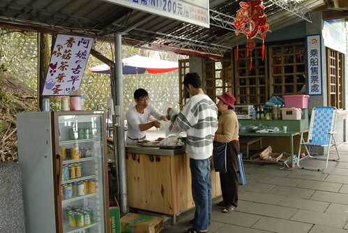

原本我跟徹爸是打算騎著腳踏車環湖的  
可以說是搞不清楚狀況+不自量力  
興沖沖的要跟民宿借腳踏車結果只剩一台有兒童座椅的  
雖然不死心的慫恿阿徹坐在沒有安全椅的後座    
但果然在騎了5分鐘後阿徹的小屁股就提出抗議了(這是百分百預期會發生的事)  
且考量沒有環潭專用自行車道 必須跟大小客車爭道下  
我們最終還是放棄了腳踏車  免去了可能騎的半死的慘案發生  
  
也幸好阿徹願意拿出勇氣搭船遊湖  
要不然來到日月潭卻沒享受過搭船遊湖的樂趣就真的太枉然了  
  

當我們臨時轉向要搭船遊湖時已經是下午四點  
最後一班的航班都人員就妥準備要出發了  
幸好民宿有自己的遊艇所以老闆硬是讓全船的人多等我們十分鐘  
喘呼呼的跑上船 連救生衣都還沒穿妥船就要出航嚕...  
  
  
  
船從朝霧碼頭出發 離水社碼頭大約只有5分鐘的車程  
船長建議如果水社碼頭人太多可以走一小段環潭歨道來朝霧碼頭 沿途的歨道風景挺不錯的喔  
  
這是有名的涵碧樓 聽說入夜後燈火輝煌煞是美麗  
週遭去過的朋友都是因為公司旅遊或是招待而來的  
我想我跟徹爸這輩子大概很難有這樣的招待  
如果是要自己拿摳摳去住...OH...子兒真的吐不出來...  
  
  
  
整修中的光華島  
比想像中小很多很多 感覺就像是海中凸起的烏龜背殼  
  
  
  
基於安全考量本來就應該 我也很樂意穿救生衣  
但是救生衣真的得這麼不合身 這麼醜 這麼不清爽嗎???  
  
  
  
徹爸甚至把阿徹救生衣上的繩子繞過他的胯下以免真下水時  整件救生衣從頭逃脫了  
  
  
  
接近傍晚時分天空變化多端    
  
  
日月潭一共有四個碼頭: 主要的水社碼頭 我們住宿&搭船的朝霧碼頭  
還有玄光寺碼頭以及德化社區碼頭  
第一個停靠的玄光寺碼頭   
  
  
  
船長大力推薦賣的數十年的阿婆茶葉蛋  買了兩顆品嚐果然是香濃入味阿  
上船後船長說阿婆的茶葉蛋從以前的\*元賣到現在的好像要十元  
徹爸問我說 是十元嗎 我說不知道哩  
因為我拿100元給老闆找剩的錢就直接放進口袋了 所以不太清楚一顆多少錢  
再次突顯 媽媽最近花錢給他很不知米價喔 這樣實在不行阿  
(之前徹公徹嬤來我們家時 問說這麼好吃的蓮霧要多少錢ㄚ  
  我說好像60多元我也不清楚  徹公就說阿你買東西不用問價錢的ㄚ  
  嗚嗚....我信任老闆...我就很少問價錢ㄇㄟ....)   
  
離開碼頭要再走一小段路才能到達玄光寺  
雖然我們走錯路多繞了一圈才到達玄光寺  但這長長的階梯很有FU  
  
  
  
小愛最近很愛走樓梯 常常走平地時要人家抱 看到樓梯卻掙扎著說"我自己走"  
  
  
  
很孤單的櫻花樹  不過透過鏡頭果然就美麗加一百倍 (再次驗證照片可是會騙人的)  
  
  
  
阿徹最近好像有比較長肉些  難得的可以看見一絲雙下巴跡象  
  
  
  
玄光寺很小 老實說我真的忘記要瞧瞧它  
  
  
  
因為目光都被寺前的12生肖石座給吸引啦  
這是小愛最近很愛模仿的小白兔 (小愛會把手放在頭上裝耳朵 然後邊跳邊說"小白兔跳跳跳")  
  
  
  
阿徹屬的老山羊  
  
  
  
小愛一座換過一座  如果不是趕要上船的時間應該會把12生肖都坐過才甘心吧  
不過媽媽卻像是去年八月去日本玩一樣 緊張的猛盯著錶害怕錯過集合時間  
  
  
  
這是老鼠吧 我猜  
  
  
  
這是蛇啦   
  
  
從玄光寺 居高臨下遠眺光華島  
我跟徹爸說"哇 這麼剛好 三條船以這麼漂亮的弧度排列"  
徹爸頗不恥+驕傲的說"什麼 我可是有抓timing的哩"  
  
  
  
拿著熱呼呼的阿嬤茶葉蛋趕船去喔  
  
  
  
再次出航往下一個碼頭前進  
  
  
  
上船後的阿徹很臭屁 一臉沒什麼的表情說"坐船一點都不恐怖 還蠻好玩的嘛"  
(夕照已經灑上潭面嚕)  
  
  
  
德化社區碼頭  不清楚正確的名稱不過就是有原住民歌舞表演的地方啦  
  
  
  
很喜歡碼頭邊的這大片廣場  
尤其週日的下午人潮不甚多   一整個舒服的讓人只想賴坐著  
  
  
  
廣場通向湖面的那頭  
  
  
  
隔條街過去的市集街道   
  
  
小愛愜意的跟徹爸坐在階梯上聽著原住民歌手演唱  
  
  
  
其實...我真的覺得小愛的妹妹頭挺可愛的..  
  
  
  
媽媽帶著阿徹去市集晃時  一時失算引起阿徹買玩具的殘念  
本來想說要安撫+鼓勵阿徹 所以同意讓他買一個小東西紀念  
結果阿徹猛指著店裡的一般玩具說 這個好那個好  
哇勒 跑這麼遠來這買這種玩具 媽媽說不能買了 所以阿徹哭了....   
徹爸說是我害的 那壺不開提那壺  所以徹爸雖然沒有安慰阿徹 但給阿徹很大的包容等他情緒回復  
  
看到哭哭的哥哥 妹妹想要去秀秀  
  
  
  
可是哥哥不領情...  
阿徹大概在OS "不要管我 讓我一個人靜一靜"  
  
  
  
愛: 爸爸 哥哥他在哭哭 他都不理我...  
  
  
  
爸爸: 沒關係 讓他哭一哭就好了...還是小愛最可愛了  
  
  
  
殘忍的父母竟然還高高興興的在搞自拍  
  
  
  
小愛也來參一腳吧  (小愛最近很愛抿嘴唇)  
  
  
  
再上船要回去吃晚飯嚕  
總算在最後的航程裡 小愛要站起來看船看水了 (本來都有點緊張的坐在椅子上的)  
小心點扶好哩 可別一個震盪不小心掉下去了  
  
  
  
加速馬力返航...  
  
  
  
回到一開始的朝霧碼頭 (建築物便是民宿的外觀)  
2個小時的遊湖感覺真的還挺不賴的說 大力推推推~~~  
  

