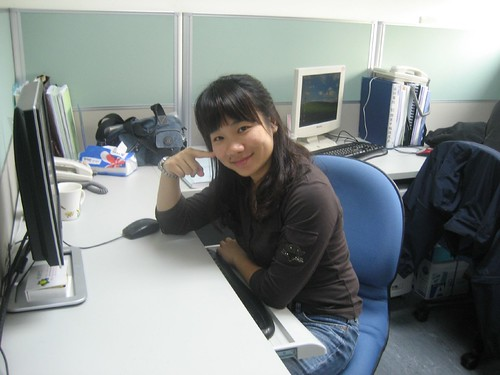

在日劇交響情人夢裏的野田妹本來一直認為彈琴快樂就好 單純的只是快樂的彈琴有什麼不對? 但荷士登老爹 千秋學長都跟她說"你需要正視音樂" (正面面對之類的話) 誠實的面對音樂後雖然有沮喪 有辛苦 有挫折 但卻讓她成長 甚至更喜歡音樂 更能享受音樂帶來的快樂

我想我大概真的也想好好正視自己的工作人生了吧!!

我想我的親友很少有人明白　what is my job 甚至永遠搞不懂  where I work 熟的朋友久未見面會問　"Do you still work in \*\*\*?" 雖然得到的回答往往是"Ha...That was my last job, I had left it long time ago" 但他們似乎也見怪不怪了....

我常說"人往往不清楚自己要什麼" 我自己其實就是這句話的最佳代言人 但因為不知道自己要什麼所以更該讓自己明白自己到底不要什麼 而且天生反骨的我很多事不自己走一遭 沒讓自己嘗到苦頭是不死心的 於是"成就"了現在這麼個"一事無成"的自己

大學聯考時考的不如意　想要唸的學校進不去 於是志願卡上填的的志願沒超過１０個 只填了我那分數可以落點學校的數學系（應數系）或是化學系 應數系念了兩年明白興趣是不能當飯吃的(自己是沒有那勇氣與愛心去當老師的) 乾脆降轉至商學院的統計系 除了是跟喜歡的數學相關的科系外 另方面也可以修些商學課程替自己謀後路

大學畢業理所當然&滿懷壯志的想要做證劵金融相關工作(還在大三暑假就考好初級業務員證照) 可是我喜歡的大公司看不上我  而看上我的小公司我看不上 永遠記得最後一次去某小證劵公司的面試 看著兩個油光滿面 錢字似乎就刻在他們臉上的主管一搭一唱著 剎那間我害怕起我以後是否也會變的跟他們一樣 我不要阿…我那天真純樸的臉不適合大大刻上"錢"字的

對證劵徹底死心之後找到了一個也可算是統計相關的生管工作 只是在工廠裡跟著/追了兩天的生產單我又想"難道我以後的日子就是這樣每天追單嗎?"

老實講大學剛畢業的我一整個的不知為何而戰 對於研究所(完全的沒考慮過) 對於工作 對於自己的人生都是 一整個的慘……….

這麼的晃盪兩個月後 有一天突然接到了一通電話 對方說'"我們這裡是台大流病所在徵研究助理 你有沒有興趣來面試" 在那之前我從沒聽過流病(流行病學)這種東西 電話中也聽不懂他在說什麼 只聽懂 "台大" "當研究助理" 這幾個字 (那個我高中時很嚮往的學校) 這通電話就這麼著改變了我的一生... 那時候根本不知道我的大老闆原來是這麼有名的學者 後來甚至成了衛生署長(讓我有機會穿碩士服跟大人物合照  哈哈) 也更難想像在那工作兩年後我真的進了我嚮往中的學校唸研究所 而且唸的還是我大學畢業前從沒聽過的生物統計 然後之後的工作就這麼一直跟公共衛生或生物醫學研究相關 雖然我們這些唸生統的人都會嚷著 生統在台灣沒有前途&錢途 但老實講生統卻讓我們不愁找到一份可以糊口的工作(如果甘於當研究助理的話...) 徹爸常這麼形容我"憑著點SAS功力到處騙吃騙喝" 研究所畢業後 我好像應該大鵬展翅 衝衝衝了 但事實好像並沒有... 我依然"遊戲"於眾工作間  (原諒我用這個辭 但我真的不知道該如何形容我這樣的行為) 只是這些年多了"家庭因素"作為我辭職時'冠冕堂皇'的理由 可是每次換工作寫面試資料時 也不好意思每個工作離開理由都寫家庭因素 連著四五行同一欄位都這麼寫會不好意思的

研究所畢業six years 我做過的工作恰巧的也跟這數字一樣(衷心希望這數字能停留久些) 我常想這是我的幸運卻也是我的不光彩 (幸好面試資料表最多只有3-4列可以填寫) 徹爸曾經說(還是我自己說阿)我就像是那打不死的蟑螂  好像到哪都有自己的生存之道 可是我不想當蟑螂阿… 不可否認我一直希望能有份可以兼顧家庭的工作(就是不准加班還要有彈性離家近) 但我也一直在想是不是自己沒有工作價值 (找不到自己的工作價值啦) 所以才會這麼理所當然的拿家庭因素一個換過一個工作 其實我是真羨慕徹爸的... 唸完書後就一直這麼在同一家公司跟著對的人一起做著喜歡的工作 我想也許這也可以算是夫妻間的一種互補吧

上一份工作是從小愛在娘胎5個月大時開始的 是我這輩子迄今呆最久的一個工作 2年又8個月 其實打我決定去那工作的第一天起我就明白那只是個過渡期 但也沒想到自己可以撐那麼久 雖然自己抵死不承認 也不愛聽徹爸或是找我去那工作的那同事說的 "真是委屈你在這工作了 你其實可以有更好的發展的" 但心裡偶而會有個小黑人跳出來出來嘲笑自己的

雖然那的"環境"真如外人說的好(我也承認真的好啦 這輩子再也找不著了) 可以利用中午時間去跳有氧  去剪頭髮 去百貨公司週年慶血拼 還可以幾乎沒有限制的隨時請假去看場下午的電影或是帶小孩上診所看病 但這樣的"好康"卻很難支持著自己就這樣一直下去 雖然我描繪不出對於10年後的自己的期望 但我清楚明白我萬萬無法接受5年後 10年後的自己還是像現在這樣 所以翅膀硬了還是想要飛走了...

輪迴了這麼多次 這回徹爸總算語重心長的說'你要不要乾脆換個領域 我看你們生統實在沒啥出路' 徹爸大概真受夠我還有我週遭那些生統人三不五時在那唉來唉去了... 這幾年經歷過的工作有: -醫藥品查驗中心的統計審查員(名與利最好但最短命的, 時間三個月) -國民健康局癌症防治組研究助理(跟統計最不相關的, 時間接近一年) -@@基因科技公司(公司外強中乾 工作量最少,時間九月月 ) -和信醫院研究部研究助理(制度最嚴格 地點最遙遠 但最臥虎藏龍 最令我懷念,時間一年) -台大研究助理:委託執行國健局癌症登記計畫 (時間最彈性但卻也破了紀錄帶工作回家熬夜) 公家單位 醫院 生技公司 學校都去過了 講真的我也很困惑我還能再做什麼樣的生統工作

於是開始留意銀行相關的分析工作 雖然職缺實在比生統多很多 但自己年紀已大加上沒相關業界經驗 願意給面試機會的少之又少 讓找工作從來沒有碰過釘子的我跌了很大的跟斗 可是我還是故作瀟灑的早早就跟老師提辭職 (50天前提辭呈 我真是夠有良心的) 然後隨著離職日子一天天的逼近 失眠情況越來越嚴重 有天徹爸下班回來突然興沖沖的跟我說 "我覺得銀行的工作應該需要時間等待機會 你乾脆休息三個月 像誰誰誰一樣去上英文課 這樣也蠻不錯的阿" 剎那間我的眼睛亮了起來 一再的問徹爸"真的可以嗎?" 在感謝過後就給他毫不客氣的準備放長假了... 這麼多年來很多想做卻礙於時間無法做的事在這次的長假中一一實現了 上了英文會話課 烘培課 還有密集的體適能瑜珈課 每天搞的比上班還忙還累但很爽

可是每天還是得上104巡巡田水 履歷一俢再俢 一丟再丟 但一再的石陳大海.... 雖然白天往往忙到忘了這檔事 但夜晚失眠的次數越來越多卻是無法否認的事實 總算總算等到這回的第二次面試機會(距離第一次相隔兩個月) 還是聽說福利很好 美國繼微軟以外的第二大軟體公司 (統計人很熟的SAS啦) 我心情之戒慎恐懼前所未見 不過果然我的底子不夠好 信心也不夠堅強 被面試官評的彷若我不自量力高攀人家 面試結束搭著電梯離開時 電梯門一關就不爭氣的紅了眼眶 我真的懷疑也困惑還要這麼等待機會下去嗎  是否該回頭才是岸阿....

公司剛好離行天宮不遠於是順道(其實自己想很久了)去請示老天爺 很順利的(幾乎都是笑伓)求了一張籤還請師兄解籤 師兄看了看籤皺了一點眉"要問什麼的?" "問工作 換工作的事" 師兄問"以前是做什麼的? 不好嗎" "ㄟ...想要做不一樣.." 然後師兄很保留 很暗示的說了一些 舊愛還是最美之類的話 嗚嗚嗚.....感覺老天爺乘勝追擊的要徹底把我的美夢 我的希望給敲碎阿.... 真是..真是..太殘忍..太超過了 不過這樣也好啦  讓我釋懷點認命點打算下一歨該怎麼走.. 怎麼走...就是再找個研究助理窩嚕

雖然這麼想但後來有了\*新銀 兆\*銀的面試機會還是又給他去了 \*新銀 塡了15分鐘資料 等了10分鐘  面試談了10分鐘後經理說"你的學經歷OK 唯一擔心就是家庭考量" 然後花了10分鐘了解彼此需要加班 無法加班的理由 最後在有點尷尬但彼此卻似乎也明白彼此的答案下結束面談 我想這次面試後我應該是徹底認清自己是不適合金融業了吧

可是一兩週後當兆\*銀打電話來約面試時我卻又不死心的去了 不過我很慶幸我有去才能遇到一個一語驚醒夢中人的面試官 面試官對於我的可不可以加班不感興趣 但他很好奇為什麼我在做了這麼多年的生統工作後就這麼放棄要換領域 他提醒著我 雖然我說因為對於統計有興趣 對於金融有興趣想嘗試 但我真的了解金融業的工作在做什麼 真的有信心自己可以升任 可以持續興趣在金融業嗎 起碼對他來講他還是無法體會 如果在我了解金融業後是否還能有我現在口口聲聲說的興趣 他希望如果我有第二次的面試機會 要好好想清楚這個問題 要讓下一個面試官感受到我除了興趣外 還有更深的了解或決心毅力...

以前自己也曾經面試過人家 曾經遇到一個剛畢業念數學的大男生 什麼都不會也完全不明白生統/癌症登記在做什麼 十多分鐘的面試他最多的回答是 我也不知道 甚至問他真的對這工作有興趣嗎 他也回答我也不知道 那當下我直接跟他說 我覺得你來做這工作很可惜 你應該好好想想你的興趣 你的專業 你未來想走的路 事後一起面試的同事跟我說 我講話真直接 這麼就給人家當頭棒喝 可是我真覺得 我不希望我們只是事後打通電話告訴他"對不起 你不適合我們 " 可以的話我真的希望以過來人 甚至可以說是學姊的身分 讓他多明白點實際工作 尤其生統工作的狀況 也許真是有點殘忍 但如果真的可以對他有所啟發那也算功德一件

我很高興自己最後也能遇到這樣的面試官 花了一個多鐘頭仔細介紹他們的工作也傾聽我的想法 雖然之後在他打電話通知第二次面試時間時 我回絕掉了他進一步給我的機會 但電話中我誠心的跟他道謝 感謝他在第一次的面試中給我啟發 我想他應該也是照著他的本能就跟我說那些話吧 因為他很好奇的問我 他有說了什麼話嗎 然後我跟他說 因為他的一席話讓我明白自己其實是真的放不下這幾年累積的生統專業 也真的無法有把握說自己對金融是有興趣的 其實比起金融裏的計算怎麼撈出有花錢潛力的顧客 我想我真的比較喜歡生統工作的研究疾病...對社會的意義可能大一些

雖然這麼晃盪幾個月 完全出乎當初自己期盼的進入金融業 但面試過這麼幾回後也算對金融的分析工作及環境多了一份了解 我想我這輩子應該再也不會考慮換領域 尤其是金融業這事了 感覺這次換工作的心路歷程像是替自己打了一劑"換工作/認真工作"的預防針 第一 自己經驗累積的同時也是種折舊 所以沒有本錢再換了 第二 Job is job, 能有個有點興趣的工作便是福阿

故事的最後... 因緣際會去了自己研究所畢業時曾經有機會去但卻沒去的生技公司 從CRO公司(生技顧問公司)的統計分析專員正式開始我的業界生活 雖然工作上一定還是有遇到機車主管 機車老闆 機車sponsor的機會 但這回我真的很認命要乖乖工作了 我有期望/要求自己起碼要呆個幾年以上的(嘿嘿...好像還是有點不安分) 現在偶而跟美賢抱怨工作上的事時 美賢都會很緊張的問我 勸我 不要隨便再離職了.. 我聽的都有點不好意思 呵呵~~ 不會的啦...經過這回我真的有變堅強 (其實應該說認清事實啦)

很久以前曾經看過一句話 自己一直把這話當作是自己工作的座右銘 "工作是為了生活 但工作不該是生活的全部" 我想我應該沒有能力也沒有興趣當女強人 讓我的生活都是工作 真的只想有個有點興趣且能力可及的工作 賺份薪水養家過日子 每天下班後跟小孩們的搏鬥才是我生活的重心與重點 工作...對我來說真的像個屁..... 只是阿...我想我還是會貪心的...還是有一丁點的小夢想吧....哈哈....

以前曾經在陽光阿櫻網站上看到他的一段話很喜歡 她說

不要忘了還有夢

不要忘了還能飛

讓夢漂浮在想漂浮的地方...

氧氣夠了...就浮出台面了....

[http://www.wretch.cc/blog/worldsakura/9861818](http://www.wretch.cc/blog/worldsakura/9861818) 希望自己這回真的有吸足氧氣可以在檯面上撐久一點

(攝於上一個工作最後三天的新辦公室) 
