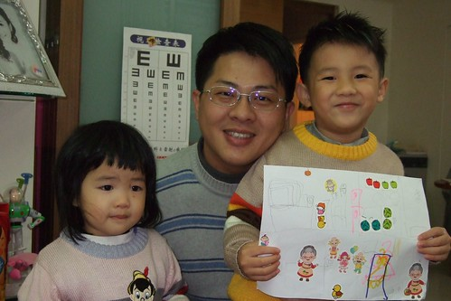

最近懶病上身...大概被太陽公公傳染的吧...  
文章更新的速度似乎在跟太陽露臉的次數比少的  
MSN三不五時傳來親朋好友關切的問候"最近還好嗎?"  
看來大家好像不太習慣這樣懶的徹媽  
所以還是乖乖交作業吧 (只是不小心又寫了好多天)   
簡而言之  這個年有點短 有點悶 有點不平安....  
不過幸好日子還是天天過  
所以闔家大小平安 健康 快樂 最重要  
有沒有年味 有沒有紅包 有沒有新衣服穿都不重要啦  

過年的氣氛就從年前的最後一個週末 父子三人新剪的髮型開始  
這回設計師阿姨枉顧徹爸的意願  硬是幫阿徹與爸爸剪了個龐克風的父子頭  
不管是大龐克 小龐克 還是小愛的妹妹頭 都令人有煥然一新  一附要過年的感覺  
  
  
  
徹爸請了一天假 所以小年夜的早上就驅車回嘉義過年嚕(出乎意外的沒有車潮 3個小時就到了)  
拜台北濕冷天氣之賜 今年狂想早點回到嘉義享受溫暖的天氣   
不過趁著進家門前還是貪玩的繞去松屋百貨吃飯 吃冰淇淋  
難得的冰淇淋就是爸媽今年送給阿徹小愛的新年禮物啦~  
  
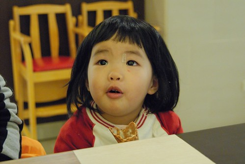  
  
小年夜回到嘉義後 我跟徹爸就開始認真的看漫畫看日劇醫龍啦  
徹嬤也有備而來的做好了所有的打掃採買 準備工作  專心陪小孩  
不過該拜的還是少不了  
所以除夕徹嬤忙著大小拜時 我跟徹爸還是該聊盡父母之責 帶小孩去公園溜溜的  
  
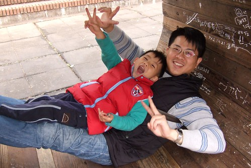  
  
雖然嘉義的天氣比台北溫暖些 但也是冷颼颼  
加上除夕夜大人都團團轉的忙著吧 嘉義公園裡人潮稀疏  
向來搶手的桶穴難得的可以讓我們霸占著  躲在裡頭果然可以躲避不少寒風  
  
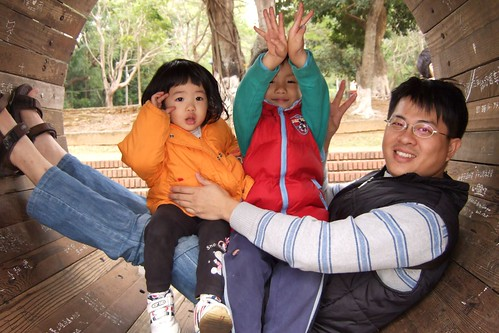  
  
不過阿徹的調皮度應該是完全沒有受天氣的影響  
依舊熱情澎湃 整尾蹦蹦跳  
至於小愛 在心智急速的成長與天冷降溫的交錯下   
調皮度也緩緩上升中 (跟徹爸一致覺得怎麼過個年 感覺又長大了不少 ) 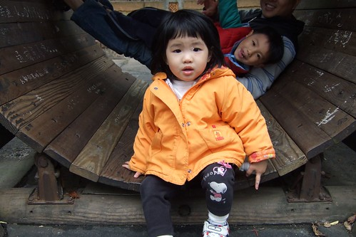  
  
其實嘉義還是有點出乎我意外的寒冷  
我攜帶的唯一外套似乎比較適合有點夏天的嘉義  
  
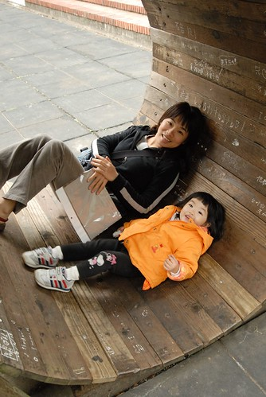  
  
今天我們也第一次親眼目睹了阿徹做砂畫  
勾勾紙塊  上砂 繼續勾勾紙塊...果然有像徹嬤說的有認真有進步  
再多累積10來次的經驗 我想應該就可以做出像sample(最右圖)那樣美麗的砂畫了吧  
可惜還沒做完 警察就來趕攤販了 老闆說"歹勢啦~明天再來補~"  
  
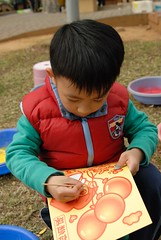 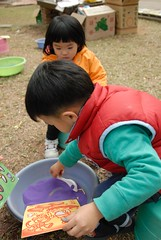 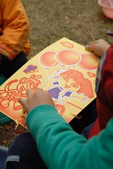   
  
做砂畫前 還先去玩了電動車跟套圈圈   
小愛耍酷的堅持要自己開一輛  橫衝直撞嚇的一旁套圈圈老闆衝出來要以身護攤  
果然不失大膽愛的名號   頗具女阿飛的氣勢  
玩套圈圈時 本來只是打發性的拿幾個圈圈讓小愛扔一扔  
想不到小愛的圈圈竟也誤打誤撞的套進三個小玩具 收穫比老手阿徹還豐富  
尤其最後一扔可真是經典  
被扔到地上的圈圈立起來滾了幾圈  我們都做好要走人的準備了  
霎那間 圈圈停了 向左倒了倒 然後一個彈跳後往右邊的小雪人攤了下去    
很不可思議的讓她套到了她想要套的小雪人  
看的我忍不住拍手叫好  一旁的小情侶也哈哈大笑直呼神奇  
小妮子似乎還真有天賦異稟勒~  
  
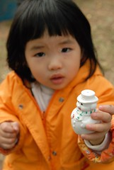 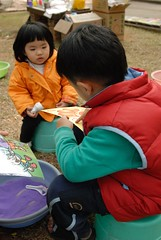 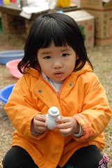  
  
接著當然就是溜滑梯嚕  
嘉義公園或是中山公園的大小滑梯 (那個2樓高的巨大滑梯除外)都難不倒小愛了  
尤其有人看的時候 更是"拼命"滑阿  
  
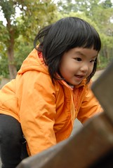 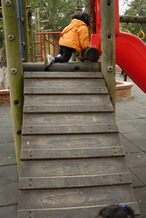 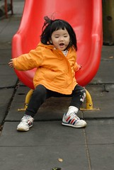 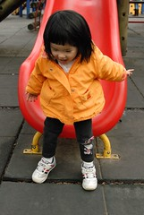  
  
而阿徹哥哥溜滑梯的花樣就又更多了  
先是趴著倒著溜...  
  
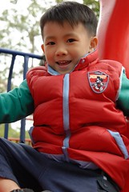  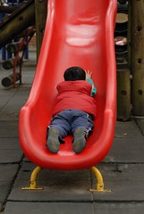 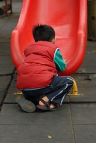  
  
然後迎面趴著溜下來...  
幸好天氣夠冷 衣服穿的夠多 要不然細皮嫩肉哪禁得起這樣摩擦阿  
不過小男生有點疤凶狠點無所謂啦  倒是娘洗衣服很辛苦的哩... 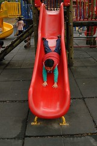 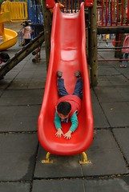 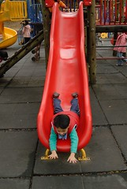 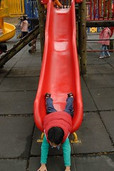  
  
徹公徹嬤真的很愛跟兄妹倆玩  
即使已經忙了一整天(其實只有徹嬤忙) 好不容易忙完加上天氣冷颼颼  
還是拎了腳踏車跟滑板車來公園找我們  
然後不厭其煩的跟著阿徹小愛玩著競賽遊戲  
阿公喊"開始"  阿嬤推著小愛跟阿徹比賽看誰先到達終點  一趟又一趟的   
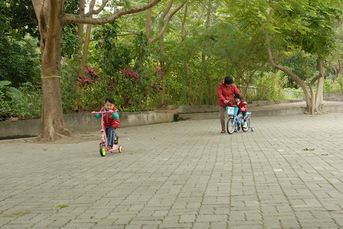  
  
最近常會看的阿徹的側臉或是阿徹的照片  
看著看著就忍不住搖起頭來  
真的還是很難置信 我的小孩竟然已經這麼大了  
越來越脫奶味的臉...越來越像小帥哥的臉...越來越會放電的眼...  
唉~一個不小心 可能就被自己兒子電到了  
(怎...突然覺得阿徹這表情很像 惡作劇2吻裡的直樹阿)  
  
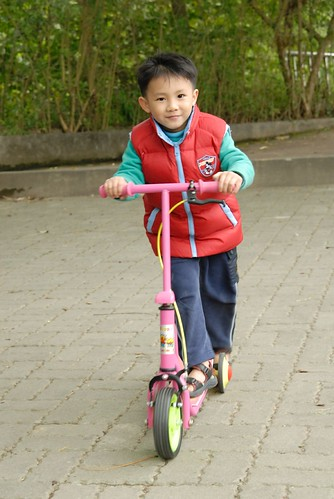  
  
咚咚咚...四連拍...  
  
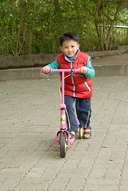 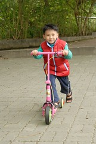 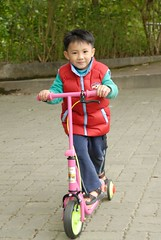 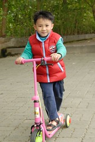  
  
大概只有徹嬤才會這麼任勞任怨的當小姑娘背後的那雙推手  
  
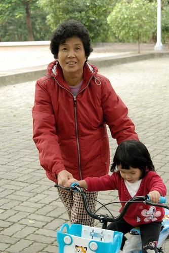  
  
這是準備回家時 看到在一旁矗立 驕傲的鳥  
鳥明不詳 牠就是這麼執著  一動也不動的望著前方  
徹爸說牠大概跟同伴打賭 有沒有人類會跟牠一起看牠在看什麼  
  
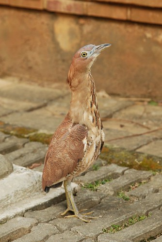  
  
咚咚嗆~年初一嚕  
今天徹爸他們去了兩間廟拜拜 然後去徹祖墓走一走  
而我理所當然的在家陪膽小不願去廟裡的阿徹  
幸好有在傍晚阿徹跟徹公他們去公園的時候 有出門跟徹爸去了趟全聯買東西  
晚上徹爸帶了阿徹去樓下跟漫畫店的阿姨還有哥哥們玩牌七  
這是阿徹第一個會玩的撲克牌遊戲  
阿姨跟哥哥對阿徹讚譽有佳 有小孩加入的牌局爆點增加不少  
  
雖然這幾年來還是會有一點不習慣沒跟自己阿爹阿娘過年 (每逢佳節倍思親阿)  
但今年的心情更是特別的@@@...  
其實很融入徹爸家的生活習慣了 也很喜歡徹爸家五兄弟們聚在一起的熱鬧樣  
就是突然間 而且還很強烈的懷念起自己小時候的過年  
也許是因為父母漸老 小孩漸長引發的感觸吧  
也也許是因為太久沒看到太陽公公 身心發霉作祟啦 (一定是這樣的)  
  
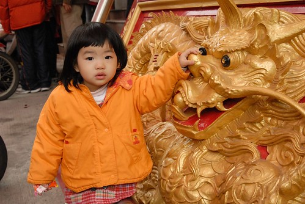  
  
幸好年初二徹姑們紛紛回娘家  熱鬧的讓人沒空再裝blue啦  
下午去了年前看新聞介紹的嘉義大學昆蟲館  
120的全票 唉嚘~真的粉貴  粉貴  
比木柵動物園的門票還貴上一倍   
雖然昆蟲標本很新 數量也不少 不過真的很不值回票價  
裡頭晃了半個多小時後不如去校園內散步  
1 2 3 4 5 6 這是徹公家所有8歲以下的孫子  
至於另外四個8歲以上的孫子則窩在徹公家看死亡筆記本  
  
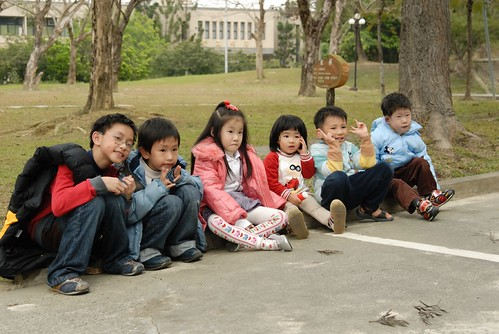  
  
過年前徹家特意跑了一趟三重玩具反斗城買風箏(實在對一年前的那個風箏念念不忘)  
結果...玩不到半小時就又陣亡了  
這回不是飛走而是斷翼了  風箏很不堪一擊的被撕裂了  
莫非我們真的跟風箏緣淺  唉~  
  
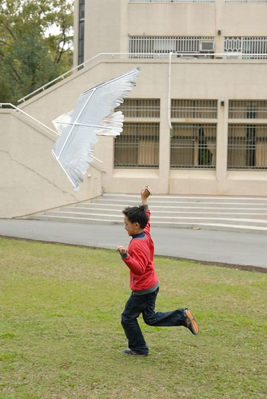  
  
嘿嘿~雖然小愛還是豬哥亮式妹妹頭  
但是打薄後(真的剪了滿地的頭髮)看起來應該有清爽些了吧  
年初二起床後 發現小愛的左眼腫了起來  
以為就像之前被蚊子叮咬 紅腫個1-2天就可以消  
想不到這一腫可還真不簡單 不可輕忽阿  
  
  
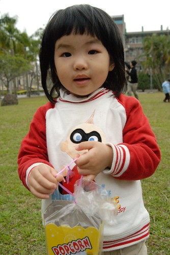  
  
小二的維維哥哥是孩子王 帶領弟弟妹妹們玩飛盤  
不過有沒有上小學果然腦袋還是很不一樣  
維維哥哥明明花了不少時間與耐性解說 請大家站在大四方型的四角  
大家還是一個逕的圍著哥哥  
這麼近 怎麼丟接飛盤啦...飛盤隨便扔就都跑了人的身後了   
揀飛盤的時間遠多於丟飛盤的時間   
孩子王真的不是挺好當的  
  
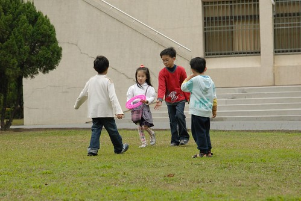  
  
典澂一如往常的 靜靜的沉浸在他自己的遊戲中  
希望有一天他也可以蹦蹦跳的加入大家的遊戲中   
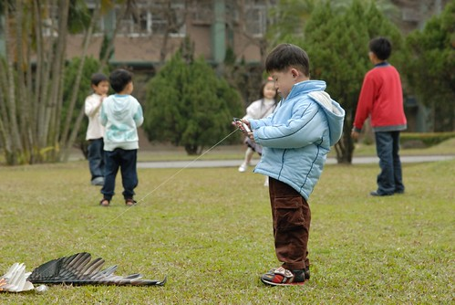  
  
回嘉義四天了 阿徹很爭氣的都沒有哭哭鬧鬧 讓爸爸媽媽生氣  
雖然偶而還是皮的快要爬上你"頭尾頂"  
但心智表現上還是成熟不少 值得嘉許一下  
  
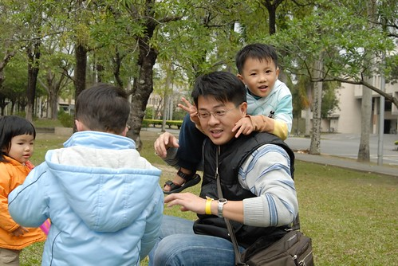  
  
雖然從學校畢業很多年了  但還是很喜歡走在這種廣闊美麗的大學校園裡  
不用擔心車輛來往 不用擔心人潮擁擠  
小孩在前方盡情的跑跳  而爸媽就牽手慢慢的跺著 回憶著我們自己的年少輕狂  
  
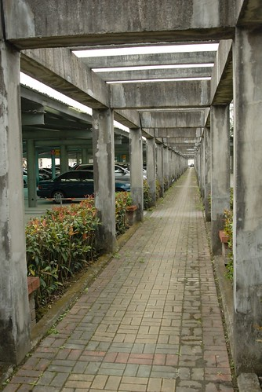  
  
這幾天的早上雖然太陽偶而會露臉  
但中午過後氣溫便會開始緩慢下降  
尤其4-5點過 還是呆在家裡吃吃喝喝溫暖點 所以回家嚕~  
  
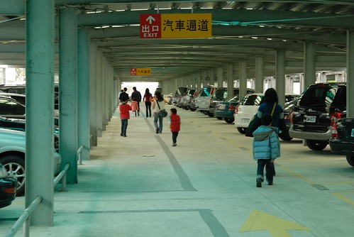  
  
還略顯荒涼的嘉大昆蟲館 有朝一日應該可以像木柵動物園那樣蟲蝶鼎盛的  
只是阿...那個票價真的要回饋鄉親一下啦...  
  
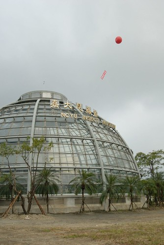  
  
年初三一早起床後 小愛的左眼已經被眼皮上方的紅腫壓擠成一條線  
雖然精力依舊旺盛 也不見抓揉眼睛 但那像是畫了爆紅眼妝的眼睛還頂嚇人的  
於是帶去嘉義聖馬爾定醫院看診(年初三就開始門診了)  
小兒科醫生一看一臉緊張的說"這是蜂窩性組織炎阿...這樣不行阿...要馬上住院阿"  
然後邊說"身上是不是也有疹子"邊翻看身體 (小愛這兩天其實是深受疹子癢之擾而不是眼疾)  
聽到醫生這樣正確的推斷 我更加相信醫生的判斷與建議了  
幸好當我還在傷腦筋 剩下那少量乾淨的衣服是否足以應付多留嘉義的需要  
徹爸問了醫生要住幾天 醫生說要先打兩天抗生素後觀察看看  
然後徹爸果決(竟然也都沒跟我商量)的說 我們是回來過年的 所以我們還是回北部住院比較方便些  
於是醫生先開了一天的抗生素藥讓小愛馬上服用  
然後叮囑我們回台北後一定要馬上去醫院掛急診住院  
  
聽到醫院說眼睛那是三角危險地帶  一個不小心細菌就會侵害到腦部  
我跟徹爸火速回徹公加收拾行李還召回正跟著姑估出門玩的阿徹回家  
考量住院將會有扎針 打藥等一連串的混亂緊張忙碌  
所以只好忍痛請阿徹多在嘉義住一天 隔天再坐三姑姑的車回台北 (我們第一次跟阿徹分開這麼久阿)  
  
幸好那天下午的車流量不大 大約4個鐘頭多一些就到達台北馬偕  下午5點多掛了急診    
急診驗檢時 護士看到小愛直接說眼睛有問題ㄚ 掛眼科  
我說是蜂窩性組織炎而且身上有疹子  
護士還是自問自答的說"眼科還是外科ㄋ? 還是先眼科好了" 於是我們被領去眼科的診療室  
等了好一會後 看到一個拖著涼鞋還像是個學生的嬌小女生進去診療室  
徹爸問我"難道她就是醫生?"  我說"急診室都很菜ㄇㄟ 更何況是過年..."  
果然她就是醫生....  
看了小愛的眼睛後 醫生說"看樣子應該只有眼皮部分 所以吃抗生素就好"  
吃嘉義醫院開的抗生素即可  只是嘉義開的劑量果然有問題  
早上徹爸在餵小愛吃藥時 看到藥袋上寫的半CC    
還直嚷著半CC的抗生素怎麼吃  還讓小愛多吃了一倍的藥量 1CC  
所以醫生花了一些時間 認真的在紙上算著該吃多少CC的藥  
答案是4CC 是嘉義藥袋上半CC的8倍  
實在有點不放心這醫生的診斷加上小愛身上疹子發癢的情況實在有點嚴重 於是我們要求會診小兒科醫生  
醫生有點無奈 一臉像是"好吧既然妳們不信任我 那我只好幫妳們會診"  
  
會診小兒科醫生後  醫生說"精神 語言 反應看起來不像是有傷害到腦部 先吃抗生素觀察兩天"  
不過小兒科醫生說  原先開的那個抗生素沒有效啦  又改開了另外一個抗生素  
( 隔週一眼科回診時 我問了那看起來比較資深的醫生 為什麼眼科跟小兒科醫生開的藥會不一樣  
   醫生ㄣㄚ了一下說 她們眼科的藥比較慢  小兒科醫生開的藥應該是比較新的藥 )  
還開了一些抗過敏止癢的癢  且衛教了異位性皮膚炎的日常護理  
然後我跟徹爸鬆了一口氣的帶著小愛回家嚕  
只是知道不用住院後 我跟徹爸對於把阿徹留在嘉義懊悔不已開始深深想念可愛的阿徹了...  
不過還是得承認這樣只需要帶一個小孩  尤其是不太吵鬧 慾望又很低的小女生  
感覺真的挺悠閒愜意的.... 好懷念...好享受阿....  
初四傍晚總算盼到阿徹被送回來了    
怎麼才30小時不見感覺又長大了  還有小別勝新歡的感覺ㄋ......  
  
  
初四早上去馬偕拿了前一天漏掉的眼科藥水藥單後  
媽媽今年過年的shopping 之旅正式展開~~~  
戰果如何ㄋ....我只能說不刷則已  一刷則獸性大發阿  
把從聖誕節累積到過年的徹爸犒賞額度用的一滴不剩阿....  
只是奇怪...怎麼懶病還是在身阿....看來敗家真的不是治病的良方阿.....  
  
還有初四晚上回娘家吃晚餐  
難得回娘家還能看到陳媽陳爸以外的家人  
因為往年都是快要開工前才會回台北然後才回娘家  
所以回娘家的時候 阿徹的舅舅們不是還在他們的娘家就是已經過完年回自己的小窩嚕  
家裡多些人還是熱鬧些的...  
  
年初五早上帶了小愛回馬偕回眼科跟兒科的門診  
眼皮上的蜂窩性組織炎在吃了兩天的抗生素後已經消了許多  
只要再吃4天的抗生素 點一週的眼藥水  
眼不紅不腫 身體不癢就一切OK 不用再回診了  
這個年假總算平安 圓滿落幕.....  
明天過後 老的認命上班 小的認真上學嚕~~~ ( 媽媽還有多一天的假 嘻嘻)
