武陵的第二天早上 不怕死的徹爸徹媽帶著阿徹與小愛想要去挑戰單程4公里來回約莫要3.5個鐘頭的桃山瀑布步道 雖然最後阿徹與小愛果然中途就落跑了 但來回走了近4Km的路也算很棒的嚕 (尤其對短腿愛來說) 沒關係...今年挑戰失敗來年再戰!!

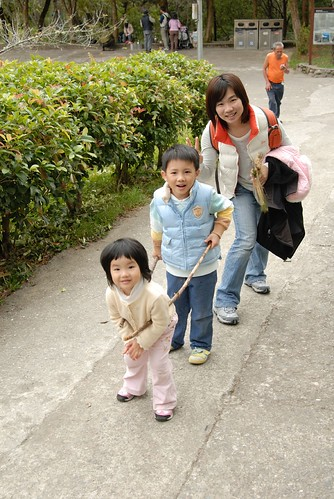

桃山瀑布位於農場的最裏端 從賓館那算起約莫二十分鐘的車程才會到達步道的入口

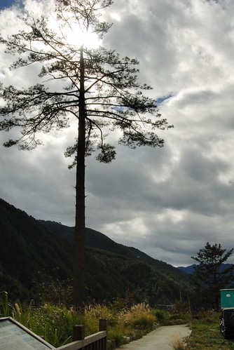

為了要誘騙阿徹跟小愛抱著愉快的野餐心情去走步道 媽媽準備了裝滿著餅乾 海苔 麵包還有果汁的野餐盒外加兩顆橘子 只是才從停車場走到武陵山莊(可能才200M吧) 連步道口都還沒到 阿徹跟小愛就開始嚷著"到了沒 我們可以野餐了沒"

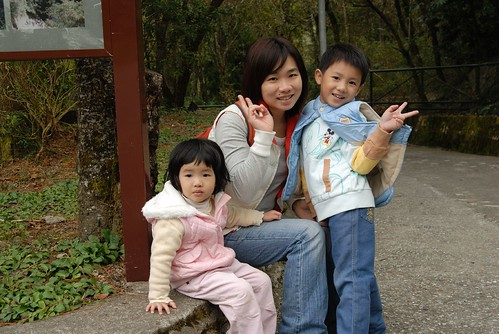

還沒...還沒...汗都還沒開始流怎麼可以就開始吃東西了ㄋ....

(滿心期待著野餐的阿徹 完全不知路的終點在哪裡 一路被媽媽騙上去...)

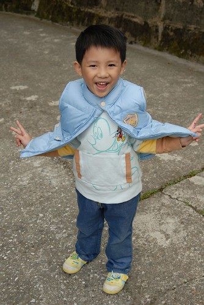

武陵山莊之後先要過個武陵吊橋

(看照片才發現 我與阿徹小愛三人原來各踞一方各自觀賞橋下的山谷美景)

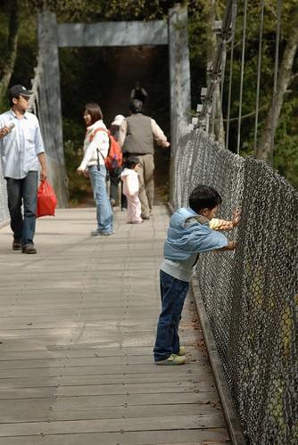

過了吊橋 步道算是正式的開始了

走!走!!走!!! 一開始展現強烈企圖心的母子三人

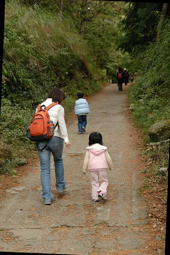

(每次看到照片中自己那強壯的背影 連自己都深深覺得媽媽真偉大 每次出門都得把孩子們一路上用的 吃的 喝的全揹在身上 於是媽媽的胸圍跟著出門旅行的次數同步厚實中)

離開吊橋後開始進入茂密的林間

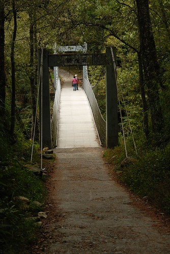

一進到步道後看到一旁數十隻以上的大砲同時對著地上的一堆枯木石頭對焦 阿徹好奇的大喊"他們在照什麼阿" 那群人哈哈大笑了起來 可是當阿徹興沖沖的想要過去一探究竟時 卻也被她們大聲的噓喊"不要過來" 原來她們在等待陽光透過樹間的光影 不想讓誤闖叢林的阿徹壞了那景

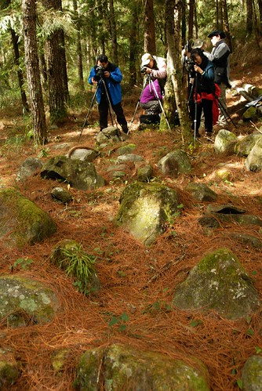

因為好奇我們等了幾分鐘看到她們等待的光影之後才離開 (看完之後真的只覺得她們真可憐 在拍這種東西) 但老實說我很不喜歡她們那種"攝影人"佔地為王的口氣 雖然徹爸說要不是因為他們在那拍照我們也不會停下來看 所以他們的行為是可以理解接受的 但我就是不喜歡她們那種像是"ㄘㄟˊ 小孩子閃邊去 不要破壞大人好事"的樣子 而且當我回頭找愛愛時才發現一個女生拿著鏡頭直對著小愛 我看到小愛已經眼神害羞不安 想要閃躲的樣子 但那女生直到我發現 小愛躲到我背後後才放棄 雖然那女生看到我之後笑笑的 我也不知道她到底照到了沒 但我不喜歡她這種未經同意 甚至也沒有再多做解釋或是道歉的行為

數位單眼相機越來越普遍的同時 攝影的本質與樂趣卻越來越讓人難懂了....

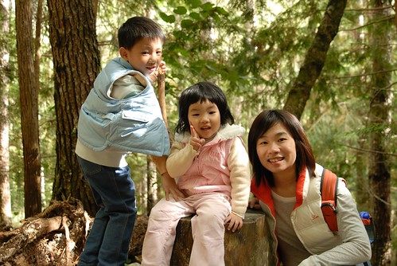

看完熱鬧 認真的開始行軍...

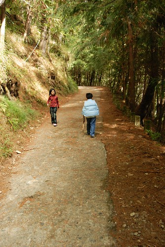

步道是採Z字型設計的 很少的階梯 坡度也都很平緩 但海拔1700M上 加上平常少運動的我們走久也是會累的

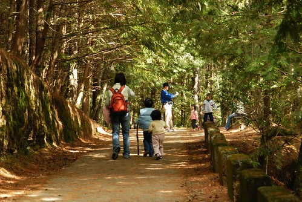

阿徹應該會想如果有A夢的時光機或是任意門該有多好阿

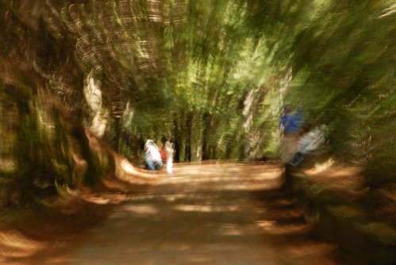

累了喝點茶後 還是得繼續走...

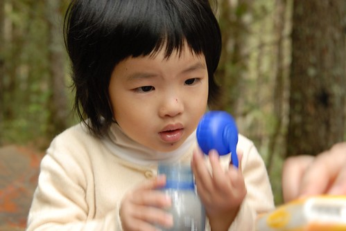

雖然阿徹三不五十喊累 但還是堅毅不拔的賣力走著

(徹爸很愛這張的意境 很像苦行的僧侶)

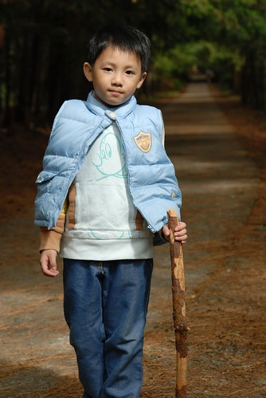

1000M!? 原來是才走了1000M 不是只剩1000M啦

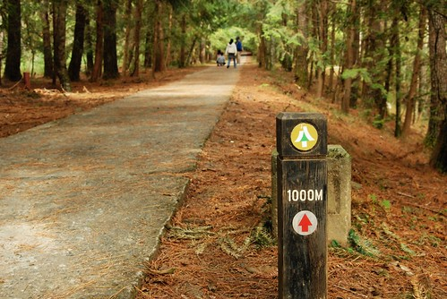

過了1000M 小愛開始沒力跟不上前方的媽媽跟哥哥 徹爸: 快! 給我走! 走!走!走!!!

最後小愛總算跪在地上耍賴 雖然一句話都沒說但甚過任何的哭哭鬧鬧阿 看的過往的行人都忍不住停下來關切....

(徹爸說小愛其實有點跪趴到地上了 看到他在照相才故意像是在檢東西的樣子)

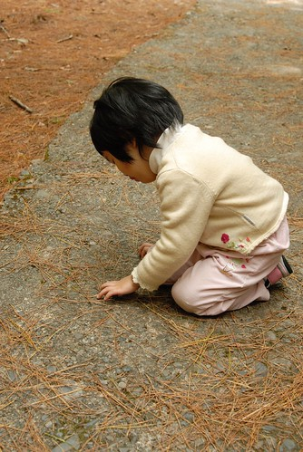

在徹爸抱了1-200M後 小愛總算又願意下來自己走 自己慢慢走 慢慢看 這樣才好玩嘛~~~

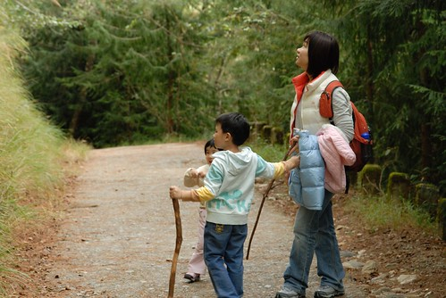

又沒力了... 這回換爸爸的薄荷棒出馬  吸一吸後果然又精神百倍

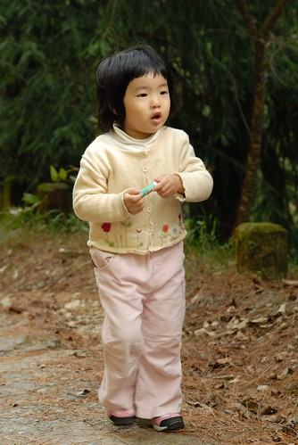

走了1個小時後 為娘的我已經明白也認命今天是無法攻瀑布成功的了 不過還是得想辦法誘騙他們再多走點路 阿徹/小愛: "走不動了 可不可以野餐了...還要多久才可以野餐..." 媽媽:"走到涼亭(地圖上接近一半的地方)就可以野餐了..."

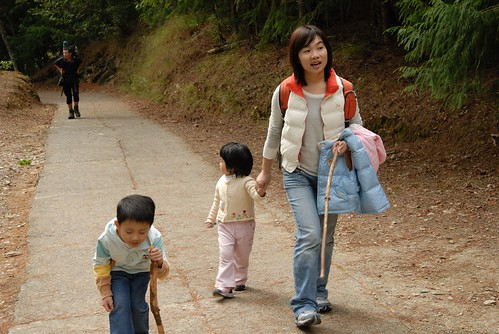

總算...走到了涼亭 阿徹小愛開心的開始她們的野餐 徹爸帶著我們全家的期望繼續攻上去嚕...

(這是徹爸12月登山的行頭 趁著這次全穿出來測試)

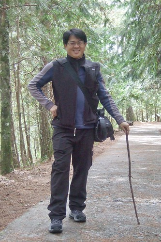

徹爸行軍的同時 我們母子三人在涼亭裏野餐玩遊戲 休憩了半個多小時後再緩步下山 邊走邊玩邊等徹爸的歸來

玩法一: 牆上的青苔成了阿徹小愛們作畫的畫紙

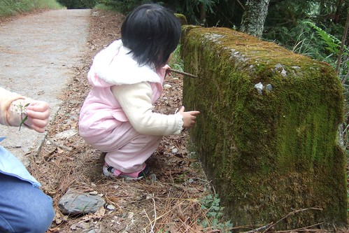

畫的很開心的小愛

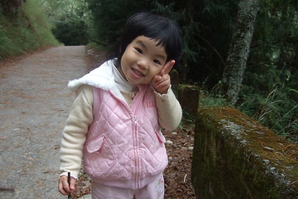

玩法二: 撿枯枝當掃把 當清道夫

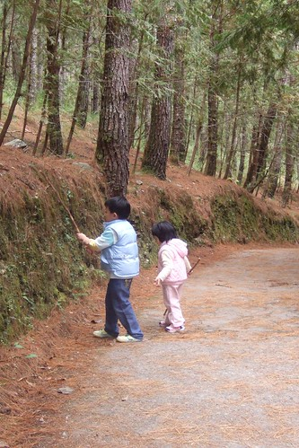

玩法三: 落羽松掃把 (我不知道有沒有說錯)

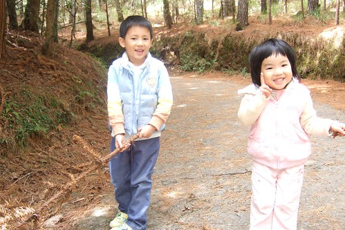

不過落羽松刺刺的 一個不小心小愛就被扎到了 這種粗重的還是比較適合粗皮的男生啦

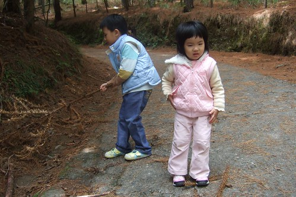

我們玩的很開心的同時 徹爸也到達桃山瀑布了 徹爸說幸好我們沒走 後面的路還真有點陡峭連他都走的喘呼呼

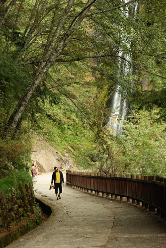

徹爸說水流量與印象中大學看到的相比少很多

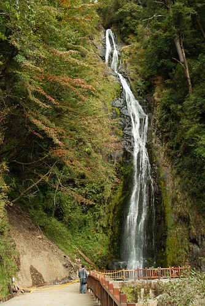

徹爸還看到了耳聞很久的竹節蟲

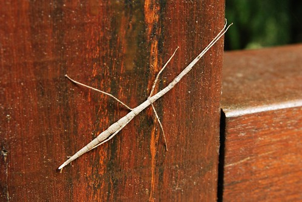

稍做停留10分鐘後 徹爸就歸心似箭的下山找我們嚕

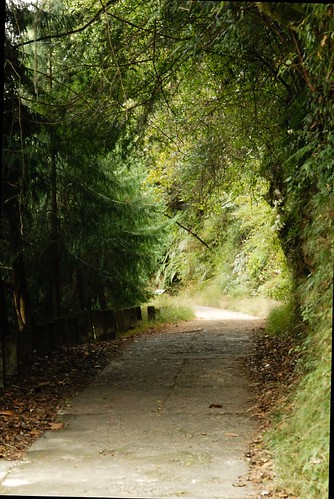

沿途看到茂密的林間 明顯看的出這幾年的保育的成效

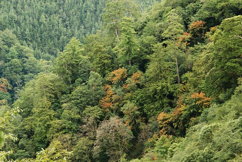

玩法四: 炒菜菜 "客人你要吃什麼阿"

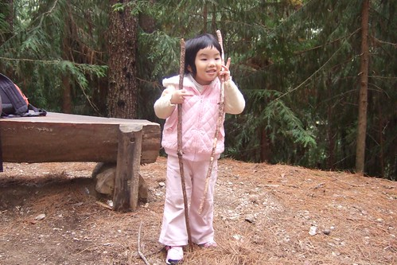

玩法五: 撿落羽松 松果 各式各樣能撿 阿徹要撿的東西

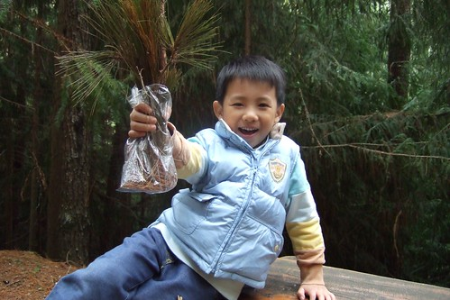

母子三人開心的玩整路下來 吸引每個路過行人的目光 不知情的她們應該很疑惑 我這媽怎麼有勇氣自己一個人帶小孩來這步道吧 呵呵 我不是單親媽媽 也沒有吃了雄心豹子膽啦....

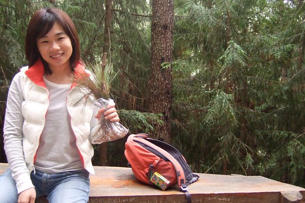

上山1小時的路 下山我們花了2個鐘頭  可見我們玩的很兇

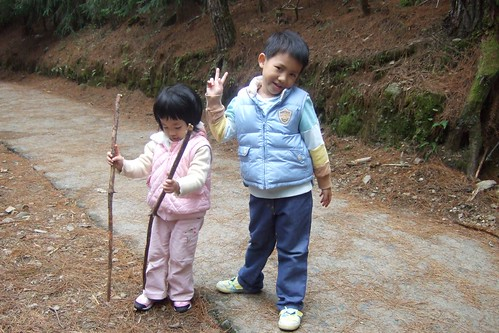

玩法六: 火車嘟嘟嘟

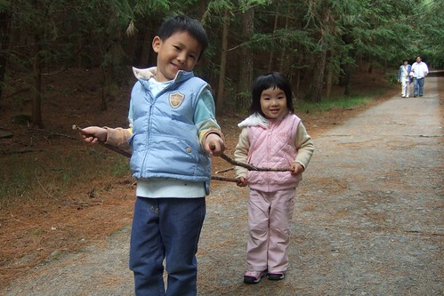

因為這火車 兄妹倆High整路的衝下山 讓小愛甚完全沒討抱沒喊累的自己走下山

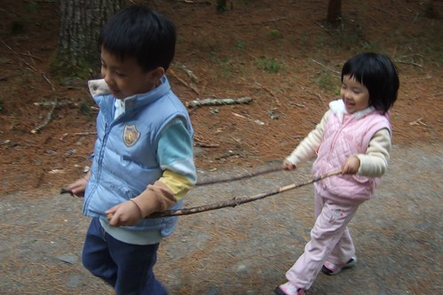

不過火車還是需要停站載客 休息一下的

玩法七: 落羽松堆愛心圖案 (可是徹爸回程時壓跟沒發現)

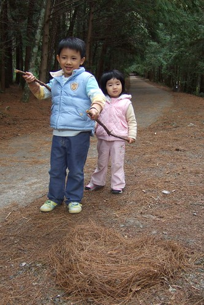

兄妹兩這火車開了半小時以上 很多路過的阿姨驚喜的問"哇 你們在開火車阿 我可以坐嗎?" 有位中年媽媽說"這代表媽媽很有智慧 用兩跟棍子就讓小孩開開心心的自己走" 哈哈!!! 沒錯 我也覺得我這天外飛來的創意真是高招 媽媽只要輕輕鬆鬆的在後面趕火車就好

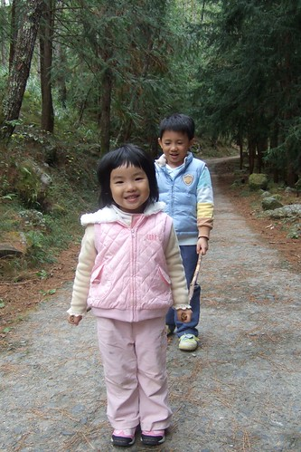

雖然玩的很開心 但媽媽不時還是會念著"不知道爸爸看到瀑布沒 不知道爸爸走到哪裡了"

就在我們回到吊橋沒多久 就看到徹爸歸來的身影嚕 阿徹飛奔而去給了爸爸一個大大的擁抱

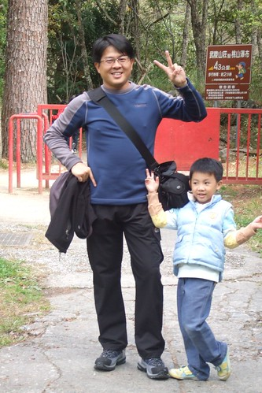

最後我們在武陵山莊第二次的野餐

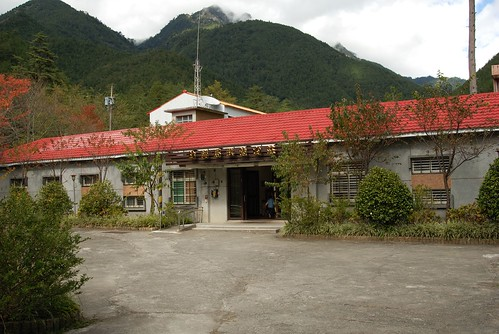

流汗過後的天空 看起來更藍更美

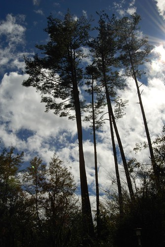

從早上9點半多到現在的1點半 大家都餓了 野餐盒裏的東西只夠塞牙縫 等會要去遊客中心吃泡麵 挑戰阿徹小愛的第一泡 (突然驚覺阿徹不知道是好命還是歹命 長到六歲竟然還沒嚐過泡麵的美味) + 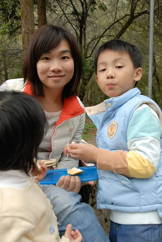

加好油的火車繼續完成最後的路段 往停車場邁進...

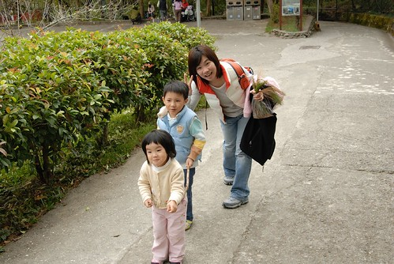

嘿嘿 很俗的來張地標照 (這是愛愛照的)

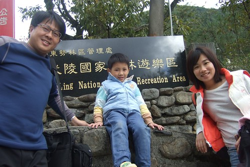

阿徹照的

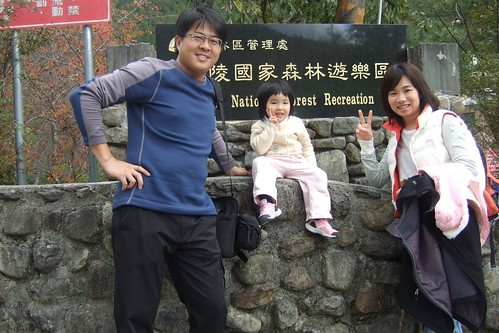

阿徹小愛怎麼樣都不肯幫爸爸媽媽合照 我跟徹爸只好搞自拍了

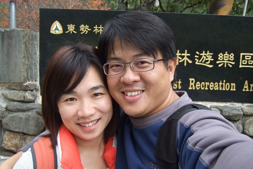

YABE!  很愉快的火車之旅!

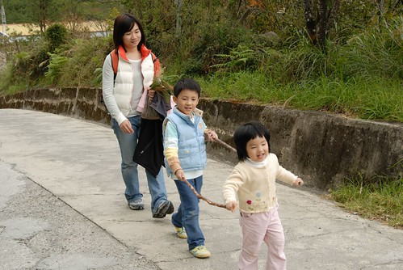

尤其是小愛 很棒悠 只是那天回到家上樓時 小愛喘了口氣跟爸爸說 "我腳好酸喔 爬山好累喔 可是爬山對身體很好"

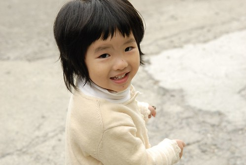

下次再來武陵 一定要把步道走完喔...

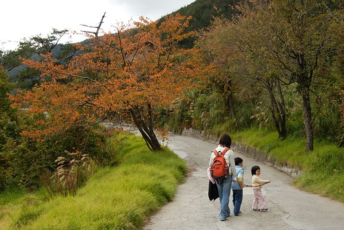

沿途美麗的小花小草 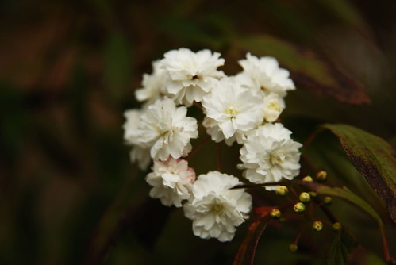

