11月22日的那個週末徹家去了武陵賞楓 一個很美麗  想要好好紀錄下來  深深刻印在腦海裏的地方.... 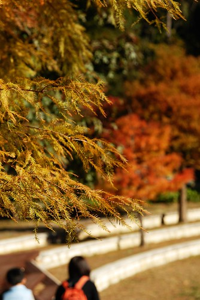

徹爸思思念念好多年的武陵農場總算在今年給他成行了 雖然九月徹媽總算下定決心來去武陵賞楓也叨念著該準備訂房了 但徹媽還是歸歸毛毛拖到10月6日才去訂房 上網查武陵賓館的訂房 11月的週末竟然都給他滿滿滿了 (看到這大家應該就能意會為啥我上一句要強調是10月6日了) 我不死心的直接打了電話去問 幸好小姐說'''\*\*房還有1-2間 應該是電腦登錯了' 有了房間就可以安心期待我們11月末的賞楓行嚕

大學時曾經去過兩次武陵農場 一次是夏天一次是冬天 因為大學在台中所以都是從中橫梨山再到武陵 印象中總是要坐一整天的車才能到達 更何況那時候是窮學生大家都是靠著兩輪摩托車上山下海的(雖然我都是被載的 但後座坐很久也不好受) 感覺就是遠遠遠啦.... 而那時候雪霸國家公園也剛成立不久山林保育尚未有成效 所以老實講我對武陵並未有太深的印象與嚮往 要我拖著兩個小的 千里迢迢的跑到那遙遠的梨山的鄰居武陵去(雖然可以從宜蘭走中橫支線過去 ) 我真的要考慮很久 歸毛很久....

因為只有兩天一夜加上活動範圍就都在農場裏 行前可以很輕鬆的不用作任何的功課與準備 只有在出發前幾天上網站查看山上的高低溫以及路況 11/22(六)我們難得的八點半準時從家裡出發(徹家從來不早起出門玩的) 有了北宜高讓我們不到一小時就到達宜蘭 然後穿過宜蘭轉進台七甲 進入台七甲沒多久就遇到兩公里的沒有柏油面的河床便道 真的是便道 簡便到到讓人的五臟六府都快移位了

穿過宜蘭市區後就是2-3小時的連續山路 其實路不是太彎也不會太窄 只是路況真的不好  因為坍方維修中的路段不少 一整個上山的路顛坡到讓人不好受 尤其明知這麼下去自己肯定會暈車 但怎麼樣卻都無法入睡時真的給他超痛苦的

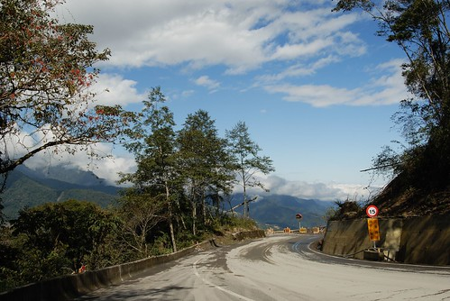

看著車子越爬越高 視野越來越好 我忍不住一再的看路排標示 到底還要多遠才能到武陵

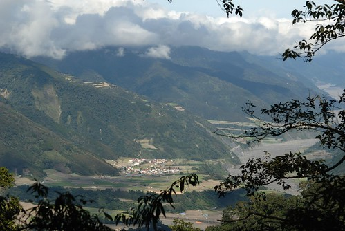

果然最後1/3的路程裏愛愛還是被顛醒了 然後開始抓兔子了 而且還抓了好幾隻 停車休息了好幾次整理愛愛後  我的暈果然也爆發了 雖然沒有也去抓兔子但得大大呼吸好幾口新鮮的冷空氣後才有力氣繼續前進武陵

(抓完兔子後一臉正常的愛愛 vs. 在後方'冷靜"的媽媽) 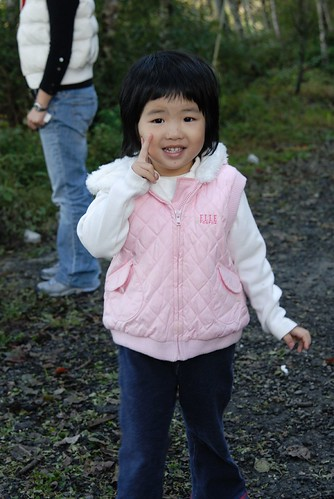

阿徹則是一如搭船去綠島時一樣勇猛 照常在車上躺來躺去爬來爬去外加說說唱唱 一整路只小睡30分鐘卻生龍猛虎

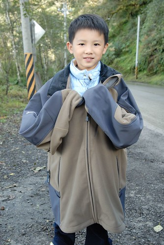

千里迢迢 辛苦的跑來武陵 為的就是這楓阿............................................................................................

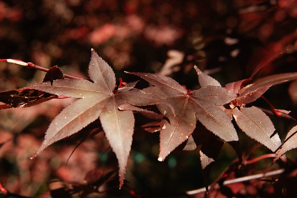

到達武陵時已經是中午一點  開了四個半小時的車算是預期中的 (大家應該又明瞭爲啥我們要八點半就出門了) 實在沒有勇氣在暈了一路之後直接去餐廳面對飯菜 於是就先在武陵賓館旁的楓林小徑晃晃

(暈歸暈 一家子恢復的還蠻快的 ) 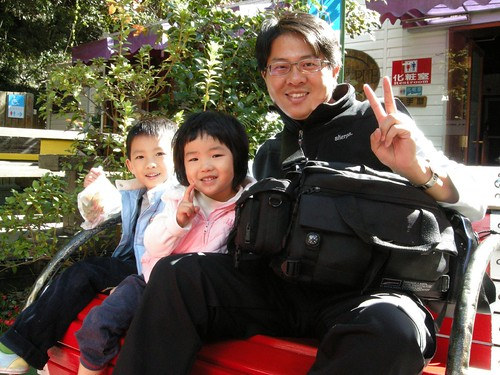

看到樹下掉落的楓葉 阿徹已經迫不及待開始撿了

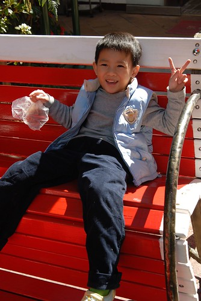

其實還有點虛弱的小愛愛戰鬥力尚未開火

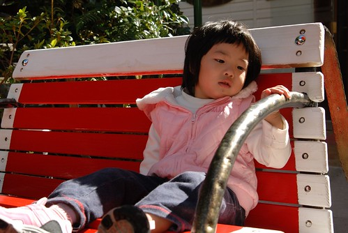

今天武陵的天空很藍很乾淨 櫬著藍天绿葉的紅葉更顯得耀眼美麗

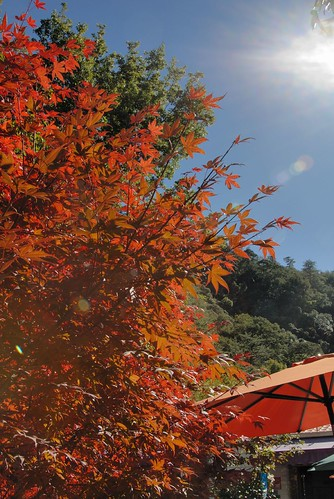

一家子心情一整個的好 (尤其是阿徹...)

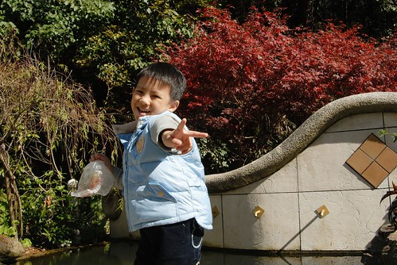

不過還是得先去賓館內餐廳吃中餐嚕 接下來的三餐都得靠這餐廳了 (武陵農場裡除了貴三三的武陵富野有吃住外就只有賓館這有餐廳)

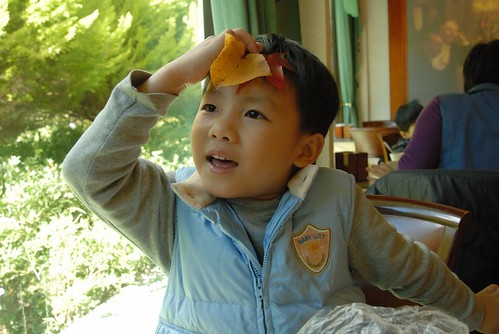

到了吃飯時間的愛愛又有點憂鬱了 一再告誡'不吃飯 下午沒有其他東西吃也沒有ㄋㄟㄋㄟ喝喔....'

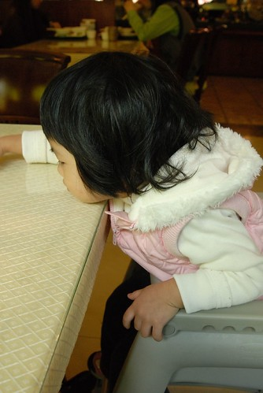

看起來頗為精緻的套餐 跟印象中公營的農莊餐廳相比真的有質感許多 徹爸說應該是受武陵富野的競爭影響吧 只是現在外食都需點三客餐的我們  750大洋就這麼沒了還是忍不住嘀咕一下

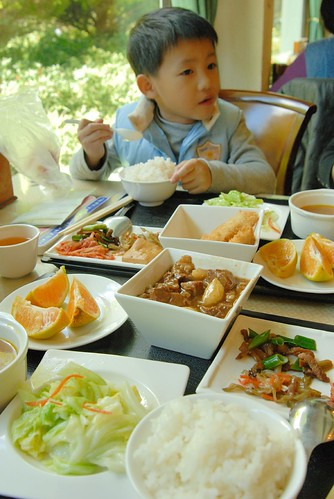

吃完飯 正式開始賞楓....

雖然網站上說這時節的武陵高低溫為4-17度之間 而武陵賓館內的溫度計也只顯示著13度 但陽光灑射的地方很溫暖一點也感受不到寒意

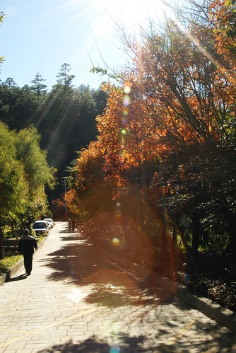

武陵賓館後方的木屋區有著各式各樣 各種顏色的"樹" (因為不全都是楓) 看到這些有著美麗顏色的樹葉 我跟阿徹真是High到不行 而當媽的又忍不住機會教育一下"你看 就是因為要看這麼漂亮的紅色樹葉 所以我們需要開這麼遠的車 你覺得值得嗎?" 早上出門前還在嚷著不想坐這麼久車的阿徹(因為只想去阿嬤家跟好久不見的萱萱玩)開心的點點頭 不過他問我"值得是什麼意思"....

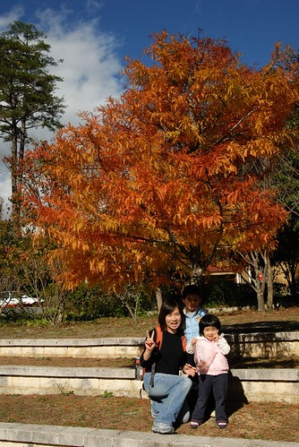

紅楓葉雖然美麗 但我跟徹爸比較喜歡黃澄澄的樹 讓人感覺更溫暖舒服

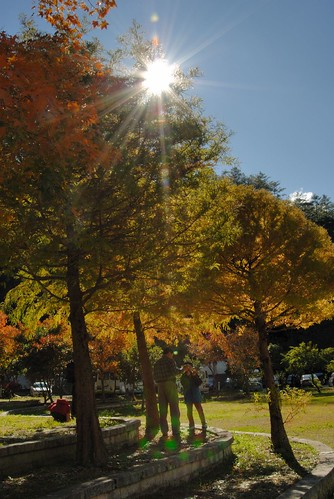

連這麼小的楓也這麼紅

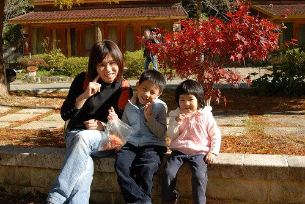

看到媽媽拿出小相機要拍全家福 小愛熱切的說她要照

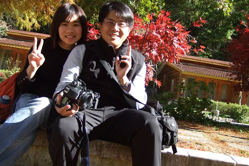

今天徹爸拍了不少逆光的照片 他說這樣很匠器  但講真的如果不這樣逆光照實在很難顯出楓的美麗 雖然匠但匠的好匠的美啦!!!

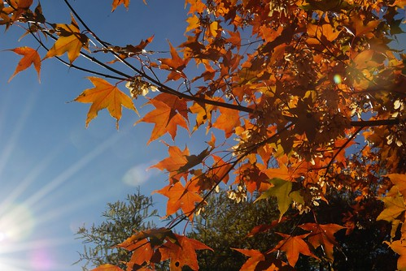

美麗的楓景 溫暖的陽光 讓人只想慵懶的坐在樹下享受這一切

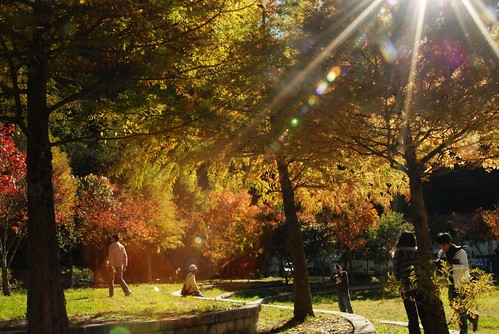

感謝徹爸努力的拍照幫我們把這美好的一幕紀錄下來

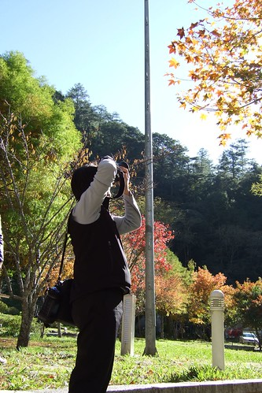

也不知道到底是為了小孩 還是為了自己這麼辛苦跑來看楓 都有吧!!!

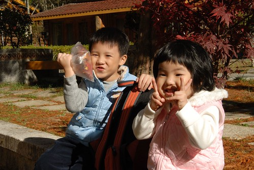

下面這張是愛愛照的喔 以後看到我與徹爸還有阿徹同時出現的照片大概十之八九都是愛愛照的 雖然她拿相機的姿勢讓人很懷疑她到底有沒有對焦 但從照片卻看的出她有盡量把人的頭塞進去

這是阿徹照的

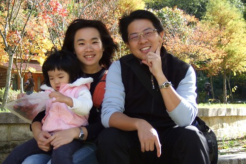

這又是愛愛照的

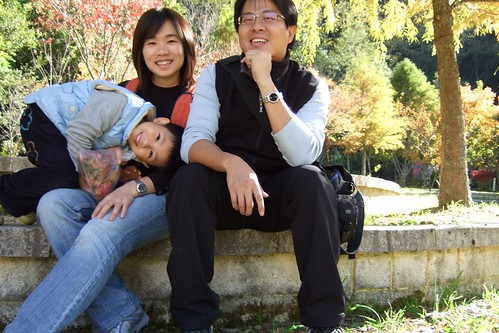

一家子這麼拍拍照 撿撿樹葉 很愜意...

而地上滿是掉落的枯葉 踩上去後發出"莎莎莎"的聲音就跟故事書裏形容的一樣 尤其當愛愛一路踩過時  原本停在枯葉上的螳螂如放鞭炮般的紛紛跳離 那場面甚為壯觀 笑翻了我與阿徹 而當事人愛愛仿若無事的樣子讓人搞不清他到底是不知道還是故意去享受這一切的 因為她的嘴角明明掛著一抹淡淡的笑意的

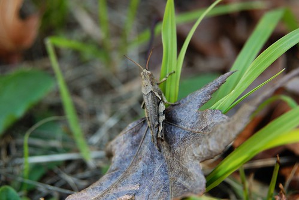

被大自然上色的廣場

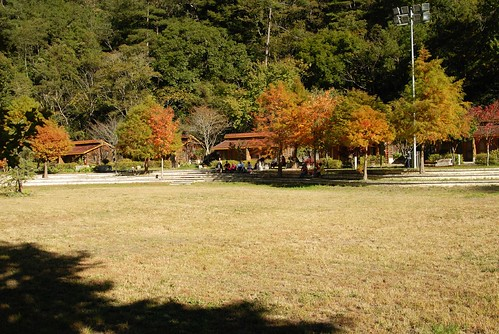

我已經想不出辭要再怎麼形容這些了(只能怪自己植物名不識幾個 實在無法介紹)

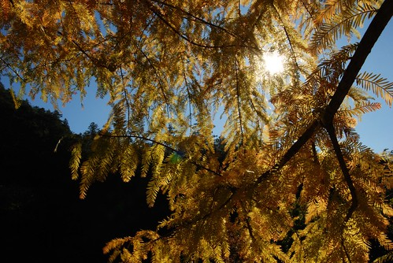

一科坐落在賓館旁很高聳的松木 但徹爸怎麼樣就是無法拍出那個感覺

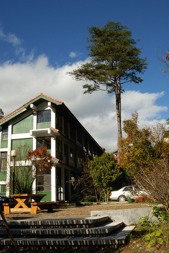

不只各種顏色的樹葉美麗 連小花也嬌俏可愛

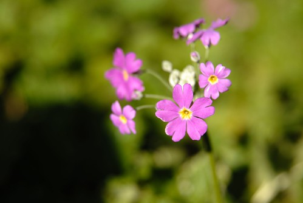

這是徹爸撿到最滿意的楓葉 雖然可以拿回家乾燥後保存 但這顏色只能留待照片裏追憶

 即使賓館後方美麗的讓人捨不得離開  還是得繼續探索其他地方 先轉去賓館前方的迎賓橋 那有科很有名(攝影師必照)的楓樹

(徹爸說我們母子三人活像三隻不安分走路 蹦蹦跳的猴子)

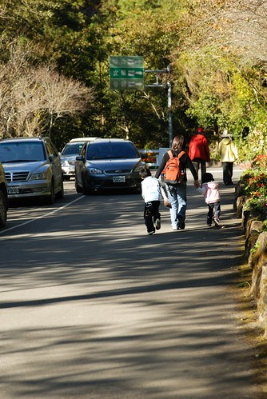

就是這棵啦 因為陽光未直接照射加上底下滾滾而下的七家灣溪 色調一整個的冷 算是走冷艷派的吧

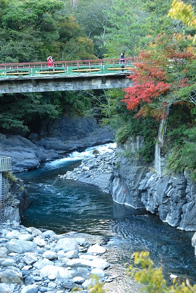

很多專程來武陵拍楓的人好像都是衝著這幕來的 隔天一早我們甚至看到迎賓橋上10隻以上的大砲同時對著她 阿徹回來後在電話中跟阿公形容"我們看到好多好像望眼鏡的照相機喔" 這回在武陵看到的人 十個中大概就有8-9人就揹著台單眼相機 (而且行頭一個比一個猛) 我嘆為觀止到只能搖頭 也許這時節玩攝影的人都會想來這拍楓景吧 但我卻只有在迎賓橋這附近看到這些大砲 (進入農場其他地方就很少看到大砲了) 忍不住懷疑這些人是不是來這武陵農場的入口拍拍照後就走了 或是趕往下一個拍楓聖地 福壽山去了 如果是這樣 我真的替他們覺得可惜 因為自己進入農場後才知道原來武陵的美不止於賓館那 迎賓橋旁的楓而已.... (等接續的遊記出爐後 大家應該能體會爲什麼我會有這種感觸的)

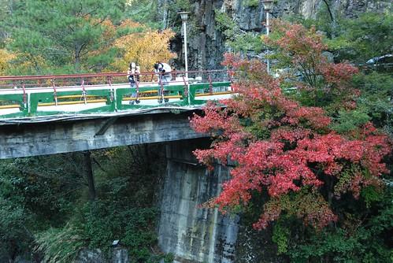

很難拍出感覺的七家灣溪

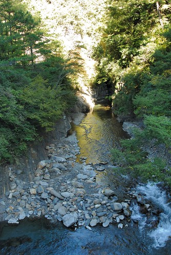

不免俗的來張武陵賓館的正面照

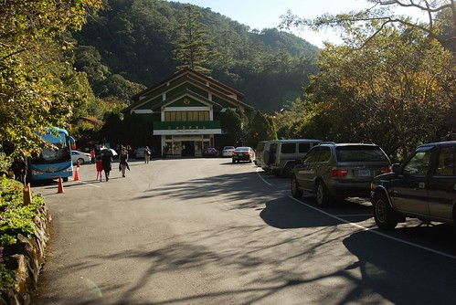

第二天早上從我們住的農莊區再來賓館吃早餐時 徹爸一直哇哇的喊著"今天又更紅了"

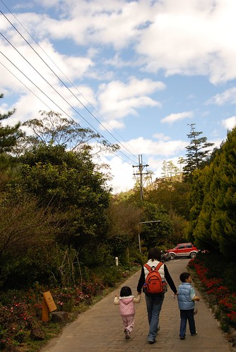

好像有又紅了一點 也也許是早晨清新感的錯覺吧

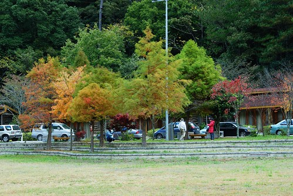

一樣是個有著美麗藍天白雲襯托的好風景

唉! 雖然我已經說了無數次的美 但我真的還是忍不住說"美 美呆了"

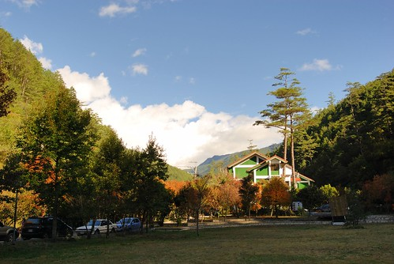

可以享受著這些的我們是多麼的幸福阿.................

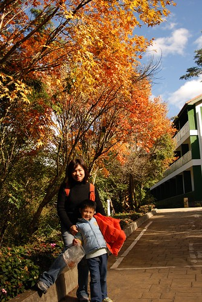

預告: 武陵遊記將分三篇貼出 雖然徹媽的工作狀況有點難以掌握 但我會想辦法生出來的 這樣美麗的地方實在很想跟大家好好分享分享 所以....徹媽加油..........
