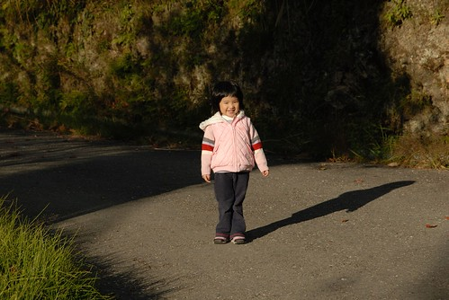
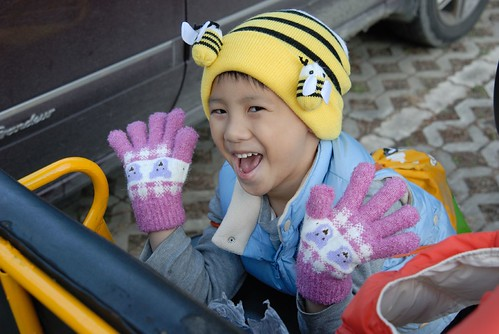
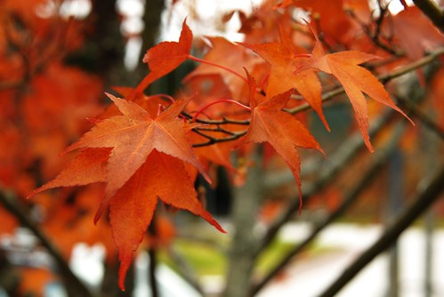
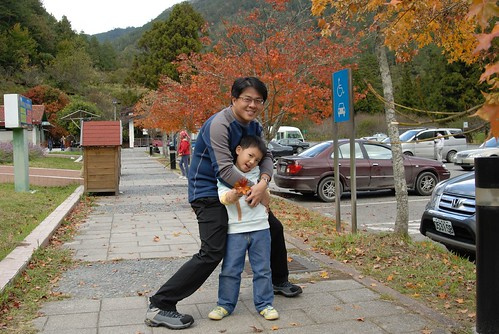

在武陵的兩天感覺一整個舒服 白雲很白 天空很藍  溫度+陽光也配合的很剛好 加上清爽乾淨的環境 不會令人感覺擁擠的遊客(除了在武陵賓館的晚餐時間感受到人潮) 一切的配合造就了令徹家難以忘懷的旅行 回來後的阿徹三不五時嚷著"好想再去武陵  好想再去看星星喔"... 姑且不論這小子講話的動機如何 實踐力如何 但阿徹應該是真的喜歡武陵這個好地方的 真的希望以後可以多去武陵體會不同的春夏秋冬四季美景~

以下就開始一連串的看圖說故事嚕 透過照片再次回味武陵的一草一木

++++++++++++++++++++++++++++++++++++++++++++++++++

武陵富野下方入口處至遊客中心的步道 遊客中心這一帶是農場裏除了賓館外人口密度較高的地方

遊客中心正前方的楓樹火紅的開著

遊客中心販賣部前方有這麼一片紫色花海 長的很像"茅根"的花有點怪 不過所謂樹大就是美 所以也有很多攝影人在這裡取景

遊客中心廁所後方的楓也別有一番味道

農場現在推廣騎車遊武陵 畢竟農場實在有大 光靠雙腳是很難走遍的 但上下坡起伏的連綿山路要光靠雙腳騎也是需要非普通人的體力與技巧的 所以除了一般腳踏車出租外 還有電動車的出租

父子倆騎著車 輕鬆愜意的享受美景

捱不過阿徹跟小愛的好奇慫恿 徹家也租了台三人電動車晃晃 不用押租金也不用押證件(可能很難有人有本事把車幹走吧) 一台車400元可以騎1小時 但服務人員好心的交代我們"不用急 超過沒關係"

坐上電動車遊園就真的有劉姥姥逛大觀園的傻樣與闊樣 不過感覺還蠻不錯的啦 因為如果用走的不可能走這麼遠 若用開車的就也無法細細品味沿路的一草一木 甚至享受微風佛臉的清新 只是電動車的馬力似乎還是不足以應付這起伏的山路 我們只騎了大約1/3的路程就回頭 然後專心玩前1/3的點

茶莊前面的楓也正火紅著

雖然自己這輩子也才去過韓國跟日本  對照組太少講這話似乎不甚客觀 但我跟徹爸真的覺得這景色絶對不遜於日本 而且踏在自己國家的土地上 心頭更多了份親切溫暖的感覺

(慢慢的走 享受著這一切多麼的幸福...) 

看到(雪霸國家公園?)警察局那有人在油畫寫生 好奇的我們停車觀看似乎有點打擾到人家作畫的寧靜 還真的很訝異竟然真的有人會這麼大老遠跑來寫生 不過這也是另一種旅遊的心情與紀錄方式吧

徹爸依著跟她們一樣的角度照了一張 畫畫的想像空間果然比較大.....

不像警察局的警察局 人+狗的背影更顯得這警局的愜意

兆豐橋上開心的母子倆

難得愛愛一馬當先 不過我們沒要走這小道啦

愛開心的往回頭衝

下午四點多後 冷意越來越明顯 準備的禦寒手套帽子總算可以派上用場 愛看著自己那戴上手套後的小短手很是開心 (小手套是哥哥兩歲時戴的) 不過那頂在專門登山用品店買的毛帽可能真的太保暖了 愛愛戴了十多分鐘後就喊著"頭燒起來了"

阿徹也很滿意行前媽媽特意去添購的紫色小手套

來到武陵當然要順道給阿徹來個生態小教育 跟徹爸兩人又講了一堆 這裏的魚多麼的獨一無二 乾淨的環境多麼的重要等老生常談話

生態中心裏可以很清楚的觀察了解櫻花鉤吻鮭

中心前的小水畦證明著真的只有這樣乾淨的水源才能培育出國寶

被大家保護護育 生長在這裏的魚是幸福的

武陵農場只有二人/四人/六~八人房的選擇而且沒有加床服務 對我們來說 二人和室房是最適合且划算的選擇 但訂房太晚只剩下農莊區的二人和室可以選擇 我們住的房間就位在這小徑上去的地方

雖然房間小到在舖了床後(兩條單人床墊+ 一條雙人棉被) 只剩下門前跟廁所前的一小叮活動空間 但很整潔乾淨 與大學時代的農場山莊印象差很多

在武陵的那天晚上果然如我們行前跟阿徹宣告的一般 看到滿天的星斗 雖然果然沒輕易的如阿徹願可以看到流星許願 但這輩子第一次看到這樣的滿天星斗 甚至與星星的距離感覺是那麼的近 好像可以伸手隨便一抓 阿徹與小愛 還有十多年沒這樣看過星星的媽媽看的呼呼叫 雖然徹爸的行頭無法照下這滿天的星斗 雖然那滿天星斗早已深深落印在我們的心頭 但還是想放一張這樣黑戚戚的照片以玆紀念

早晨的高山上果然很冷 讓人只想躲在溫暖的厚被窩裏 (因為沒提供加床服務 我們還自己從家裏扛了一條雙人被上來)

不過怎麼可以浪費時光躲在棉被窩裏ㄋ

美麗的山 美麗的武陵還有待我們探索ㄋ

因陽光照射不同產生的陰影 讓山頭的色彩更富層次感 而通往農場底端桃山瀑布的路這麼的直 這麼的平坦 這樣深層愜意的搭配是我最喜歡的景....

因為上武陵的路 小愛兔翻了 所以在山上的兩天中得以有坐在前座的特權

置身其中越來越羨慕那些在武陵工作的人

用世外桃源形容武陵真的一點也不超過

美! 真的美呆了!!!

雖然還是嚮往國外的月亮 國外的楓 但真的深深覺得台灣好美 好美 只是大部分的人不願意花時間 花金錢好好發掘體會台灣的美 眼裡只有Taipei 101的台灣人很難衷心說出"台灣好美"這種話的

我們不能給阿徹有電梯的房子 無法讓他隨心所欲的買他想買的各式玩具 唯一能做的就是帶著他一起在台灣大小旅行 媽媽我貪心的希望 這樣的生活體認可以讓阿徹自然而然的體會生命的美好 學得生活的態度 (很八竿子打不著的期望 哈哈)

出發前我跟徹爸上網survey各家好手拍的武陵楓景 很奇怪! google到的好照片很少  且大部分的楓都顯得乾枯沒生氣 也許因為這樣  自己上到武陵後才會這麼大大驚訝 但也更加疑問 怎麼網路上沒有很多人說 很多人討論ㄋ???

枯黃掉落也是種美麗

看楓葉看到膩了嗎?

那就換個紫色的瞧瞧

過去10年一直覺得很遙遠的武陵  這一次完全的改觀 兩天一夜的往返其實還是有很多的時間可以細細品味武陵的

尤其阿徹小愛兄妹倆也玩的超開心　　路再癲波都是值得的

離開武陵前　不免俗的當然要跟遊客中心前的黑熊照張相嚕

走了一上午的愛其實已經有點累也想睡覺開始有點起番了 一下子嚷著不要照相　一下子又拼命要媽媽去照她

僑了好一會　小姑娘總算願意開開心心拍全家福 七～笑～

小姑娘又kimo不對　不願意入鏡了

＂最後一張　照完就可以上車睡覺回家了＂．．．．

除了小姑娘外　剩下的三個人其實都戀戀不捨

最後．．．送你一束葉．．．

最後的最後．．．我們要回家了．．．．

第二天冷鋒面來襲　天氣開始變壞 因此下山的路上幸運的看到美麗的雲海 美麗到讓人忍不住冒著危險停車照相

因為３點多才從武陵下來加上北宜高塞車及石碇休息站吃晚餐 我們很難得的晚上九點才回到家（徹家的旅行安排通常都是傍晚回到家的） 一趟下來　平常就很不常洗澡的小紅已經髒到讓路過的行人都忍不住會小心不要碰到她．．． （徹爸隔天就請了下午假專程帶小紅去洗澡　犒賞她一番）

那束葉還留在小紅車上讓我們回味無窮 就像當初台東的油菜花一樣．．．．．

後記： 今天徹爸給我看最近雪山３６９山莊火災的相關blog紀錄 結果我眼賤又多逛了那版主的網 看著在武陵工作的版主貼了許多美麗冬梅冬雪春櫻的照片 心又好癢好癢喔．．．． 看著那些美麗的照片　心竟然忍不住蹦蹦跳了起來 唉～ 殘念．．．殘念．．．殘念．．． 怎麼辦．．．怎麼辦．．．怎麼辦．．．
