三月的時候徹媽在書局買了一本台北近郊健行的介紹書 看著書上介紹的各條健行路線 會驚訝於台北盆地裏竟然這麼多的森林步道 而看著一張張綠意盎然的照片介紹更是讓人想要一一征服這些山頭阿 跟徹爸說有機會的話 我們來把書上介紹的34條路線都走過吧 於是徹家的週末多了一個可以"奮鬥"的目標

不知道為什麼徹爸選了內湖的大崙頭山當作第一砲...

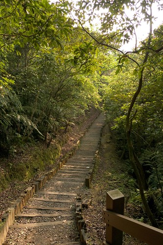

雖然春天的天氣變化多端難以預測又容易讓人生病 但出太陽的時候卻又是超適合出門遊玩的 週末早上完成一週的清掃工作及宅在家的愜意後   出門吃飯曬太陽去...

最近只要要外食 問阿徹想吃什麼 他一定回答"烤肉飯" 於是我們最近幾乎每個週末都會去巷口的韓國烤肉飯報到一次

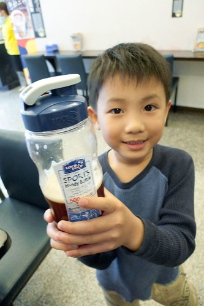

可能這是除了我們家飯桌外  阿徹小愛最熟悉的餐桌了

吃飽飯2點多 過了正中午的大太陽時刻 出去踏青剛剛好

從登山口到達今天的目的地大崙頭山只有0.5公里 路標寫著只需17分鐘 莫非這就是徹爸選他當做第一砲的原因?! 只是17分鐘的路程竞也被我們走了一小時之久 哈哈!!

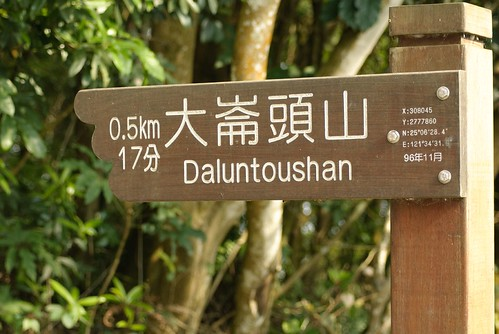

去野外果然還是該穿布鞋的好 才在登山口 阿徹的涼鞋就已經跑小石子進去

等徹爸的空檔 小子剛好自個清他的鞋子清了好一會

鞋子舒適 才有辦法走阿...

之前問過阿徹"你明明去郊外時都很開心 為什麼每次一聽到要去爬山卻都說不要 臉澳嘟嘟" 阿徹想了一下說他也不知道 然後他說"那你們不要跟我說要去爬山 把我帶去就是了" 呵呵~ 也許這是個好辦法  免得每次出門前彼此為了這事不開心

而今日因為在往大崙頭山的路上有經過內湖的草莓園 有草莓園當誘因 小子當然就對爬山顯得"興致勃勃" 嚕

石階上路程指標很小巧可愛

沿途的小花也嬌小美麗 (我們就是這樣所以走了這麼久)

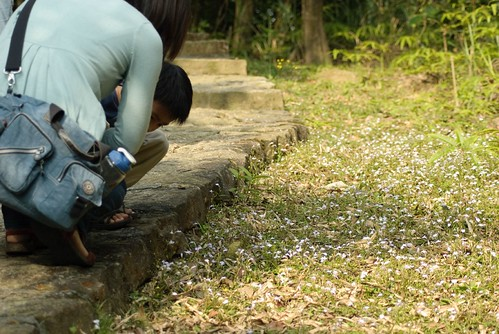

很像蝴蝶蘭的小野花

平緩的水泥路之後 接著是連續的石階路

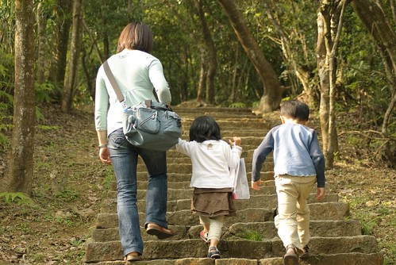

果然還是太少運動 100公尺走下來便氣喘噓噓

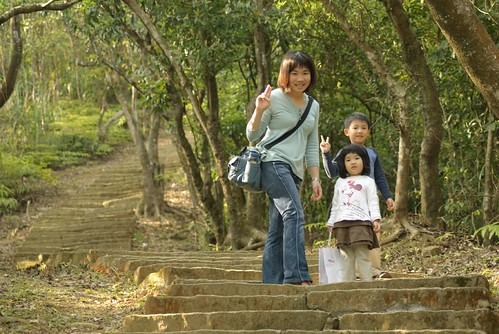

不過臭小子的體力果然還是好 跑上跑下的

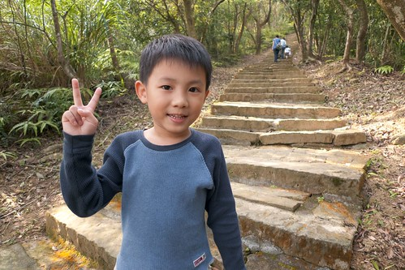

邊走邊聊其實很快就到達大崙頭山頂嚕 山頂上有個白色瞭望台

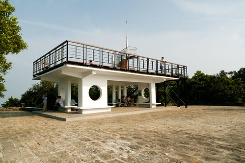

站上瞭望台 360度的視野全開了 (這個角度望去的是七星山系)

才下午4點多 月亮就已經探出來了

才一小時的路程便攻頂實在有點不足為道 但是還是開心哩

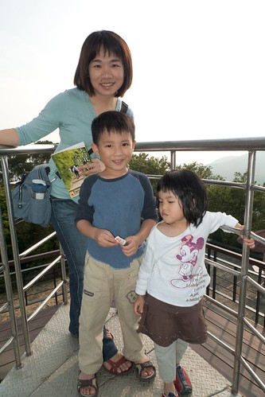

兄妹兩吃著從板橋帶上來的布丁點心 (誘惑走路的條件之一)

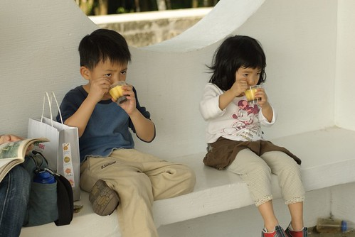

跟爸爸玩丟小石頭遊戲

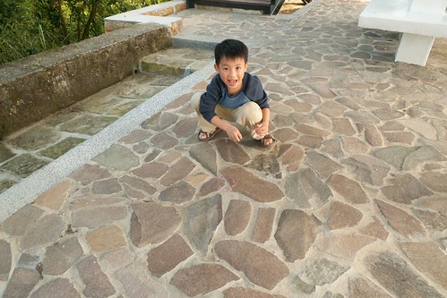

不會玩的小愛硬是湊熱鬧的來搗蛋

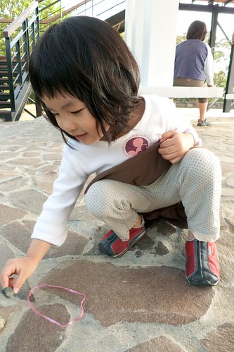

山頂上有一個打印台讓我們在書上烙印上第一個紀錄

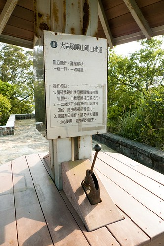

下山的路有森林步道及自然步道兩個選擇 前者架棧道後者舖枕木  我們選擇了離我們停車處較近的枕木步道

(這條是通往森林步道的 下次有機會再走) 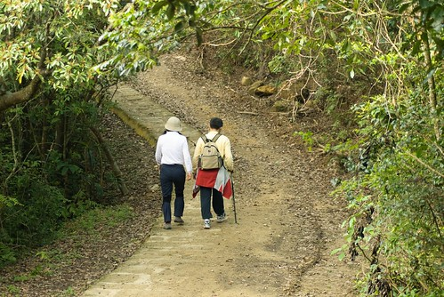

所謂的枕木步道想當然爾就是用木頭舖的路嚕

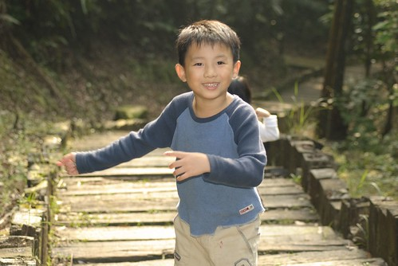

起先高低階落差並不大 走起來輕鬆愜意

但後段階梯落差就有點大了 對於短腿愛來講有點吃力

兩旁枝葉扶疏 很美的森林小徑

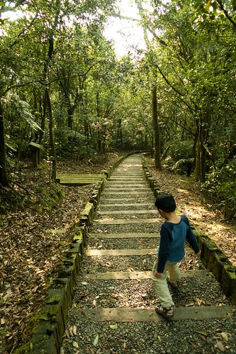

大崙頭山步道沿路蕨類生態豐富 各式各樣可愛的 茂盛的 或噁心的蕨類很多

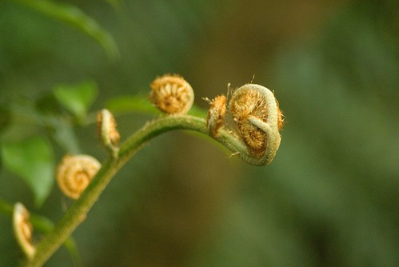

摸起來觸感像地毯一般柔軟的蕨類

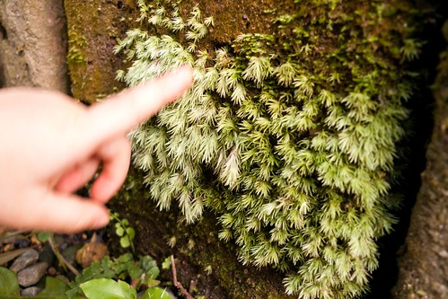

這應該不是蕨類 是從樹上垂吊下來的小怪東西

下面是阿徹發現的"樹葉蟲" 大小比10圓硬幣還小而且還呈現靜止狀態 竟然還是被眼尖的阿徹給發現 視力號稱1.5 果然不是說假的

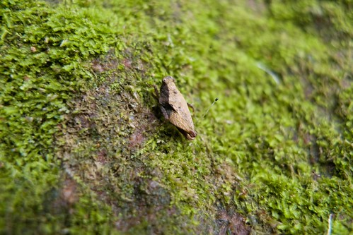

兩旁的直立枕木 中間刻不知是刻意還是無意的被挖空變成一個個的小盆栽

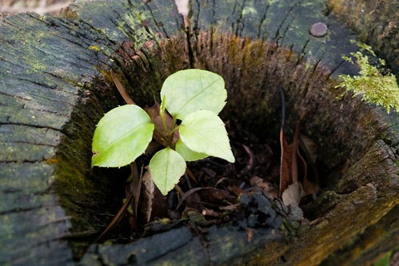

沿途就這麼邊看邊摸邊休息

短短620公尺的下山路 又被我們走了一個鐘頭

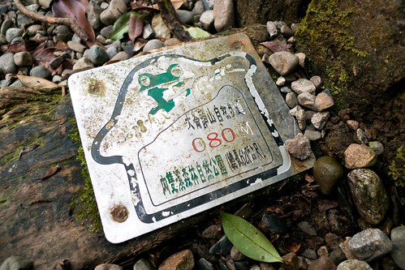

雖然路程才短短620M 但連續的下階梯還是讓膝蓋小小的不舒服

對於阿徹來講這點小路當然不算什麼

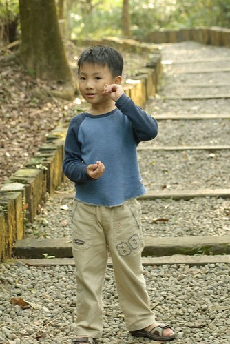

可是小愛就得常讓媽媽牽著一起走了 其實小愛真的蠻厲害的 跟著我們這樣到處走  很少沒力討抱也很少在唉 每次跟他說要去爬山她也都興致勃勃的說好 甚至週末窩在家時還會嚷著 好久沒去爬山 好想去爬山 真不知道她是真愛 還是故意愛哥哥不愛的 想活生生把她哥給比下去 哈哈!

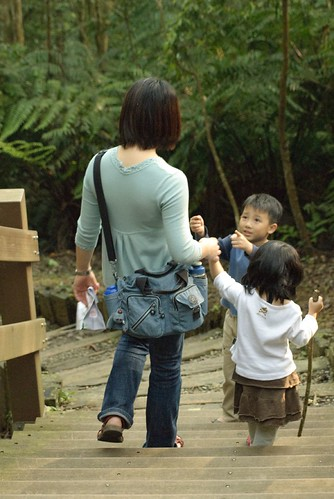

YA! 徹爸難得入鏡了

哥哥的照相技術果然還是有比較好些

總算總算看到產業道路了 連續的下階梯就要結束了

只是這最後的階梯還真抖哩 階距都快跟小愛的小腿一樣高了   小愛走的超吃力...

嘿嘿! 完成大崙頭山的枕木步道

只是下到登山口後 仔細研究地圖才發現這離我們的停車處還有一大段距離阿 所以還是得繼續走...

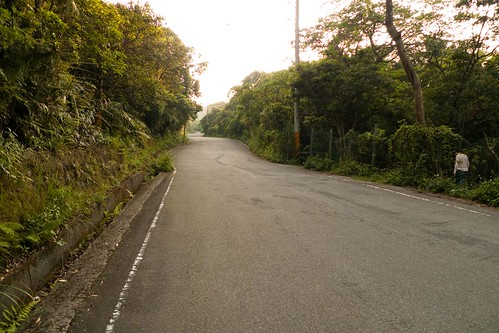

媽媽不小心改到相機設定過亮 徹爸只好後置成黑白 但還蠻有Fu的說

途中經過內雙溪自然公園 這有往大崙尾山的步道可通往內雙溪

產業道路上過往車輛很少 可以隨意的在馬路上亂走亂跑 5點多伴著餘暉這樣走在馬路上 感覺還蠻好的說

感覺再好 好像還是會小累 呵呵!!

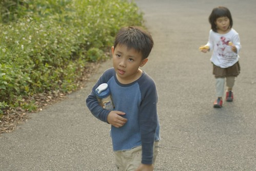

累了 吃餅乾振奮一下

沒力氣的小愛吃了旺旺後 精神就旺旺了

乖阿徹!  今天很棒都沒唉

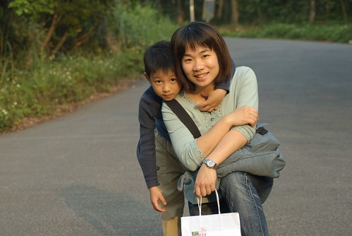

晚點爹娘不會虧待你的

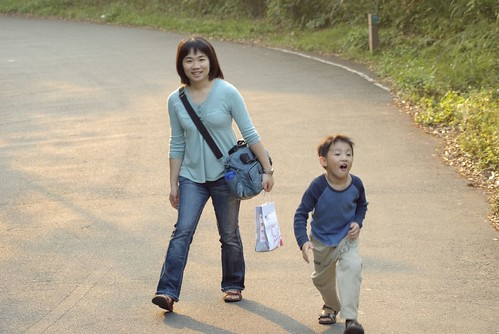

今天徹爸帶長鏡頭出門 長鏡頭拍人的Fu感覺又不太一樣了

走了半個多小時的產業道路 總算總算快到我們停車的地方嚕 (一家子有夠手舞足蹈的)

為了犒賞阿徹小愛今日很棒的表現 下山的時候讓她們去內湖草莓園區採草莓嚕 阿徹嚷了一整個冬季要去苗栗採草莓 可是都被媽媽不積極的態度拖延著 雖然內湖的草莓園真的小粉多 但總算趁著草莓季節結束前了了阿徹今年採草莓的心願

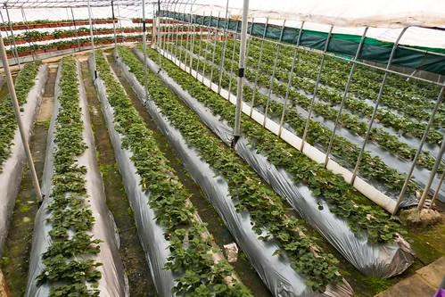

白色的草莓花

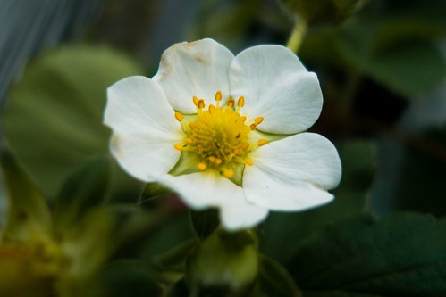

沒有花瓣的草莓花 綠的很可愛

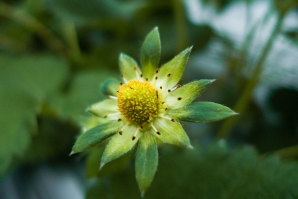

還未成熟的白草莓

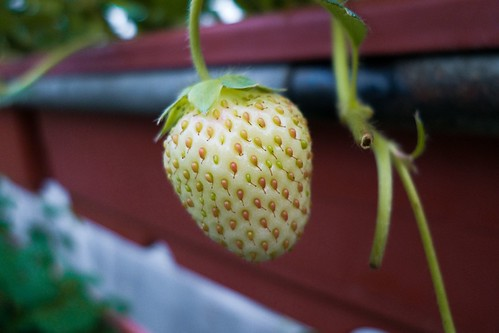

成熟的紅草莓 因為已經是草莓產季結束期 所以大部分的草莓都很小顆 記得以前去採草莓老闆交代的"草莓大不大顆不重要 重點是一定要紅 越紅越甜"

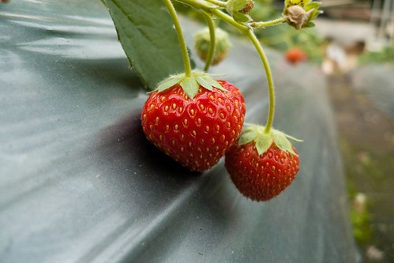

在寥寥無幾的草莓園中  我們還是很努力的找出這些紅澄澄的"小"草莓

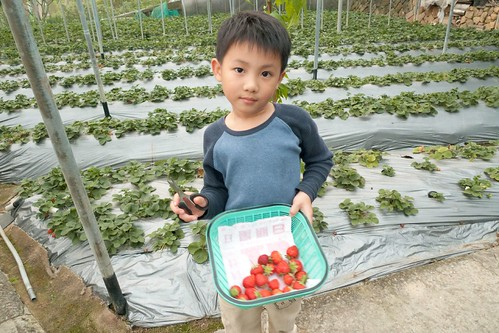

結帳時 我們採的草莓竟然還不足一台斤 為了補足一斤 老闆娘很阿沙力的多送了我們一半多她們採好的草莓 (老闆娘可能想要早點送光回家休息吧 呵呵) 草莓小歸小 但是新鮮又好吃喔... 而且這可是阿徹想了一整年親手採的草莓ㄋ  入口後格外的香甜好吃

