是的...我們又去武陵了 這回賞的是梅花臘梅香~~~ 上網查了網友們往年賞梅的時間 加上前幾週一波波的寒流來襲 (所謂梅花越冷越開花阿) 行前農場網站的最新消息已寫著"臘梅已開8分" 讓我對於此次的梅花行更是期待與自信阿... 我與徹爸更是非份的想望著"武陵會不會冷到下雪阿?!" "會不會在武陵的一覺醒來後窗外滿是白茫茫一片的雪景"或是霜景也好 可惜! 一切都只是我與徹爸的"肖想" 既沒有雪也沒有繽紛美麗盛開的梅花("聽說"也從別人照片證實梅花在農曆假期間盛開) 雖然心底著實有點失望失落 但這回看到了比上回更壯觀的滿天星斗也可算是不虛此行啦

  

冷了很久的天氣 在我們往武陵的前一天開始放大晴 所以心理早已有準備 這雪/霜景是無緣了 不過在宜蘭與台中交界的台七甲啞口路段還是發現了一些殘餘的冰霜 傳聞中這裏比合歡山更容易下雪似乎所言不假

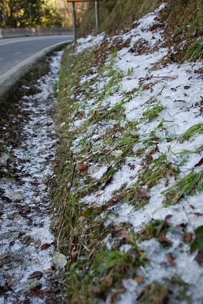

很難相信在這大太陽下 車上的溫度計竟然只顯示著6度 更別說陽光照不到的地方...冷阿~~~

不同於上次台七甲沿路的河床便道及坑坑洞洞 這回河床便道已經舖上柏油路面  大部分的坑洞也都已補的一片平坦 所以我們得已一路順暢加上"平安"的以4小時的時間抵達武陵農場

今天農場裏依然烈陽高照 白雲沒半朵

為了節省開銷 這回從山下買了7-11的御飯團以及泡麵上山當做這兩天的中餐

烈陽下 邊走邊吃另種野餐風味

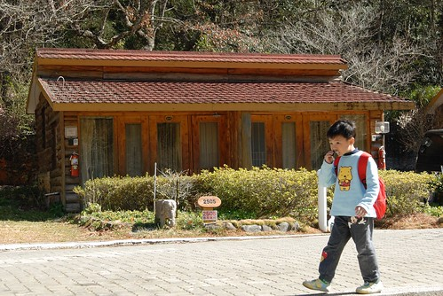

很快的嗑完飯團後 阿徹就翻出他的傢師頭開始畫畫 是野生嗎? 是畫樹沒錯啦! 不過能不能稱為寫生就有點保留了...

2個月前美麗的楓葉全都枯了 掉落了 樹全都光禿禿的

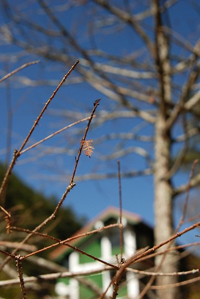

廣場邊只剩幾顆梅樹開著花 不過涵苞待放的花苞數量明顯比已開的還要多許多 心理已經有準備 這花期應該還沒盛開吧

不管白的 粉的花都是乾乾枯枯缺水的樣子

再次驗證照片果然還是比較美 照片中的梅花比實際上嬌豔許多 不過也許該說是徹爸的照相技術好吧 拍出梅花在陽光照射下的透明光亮感 嘿嘿~

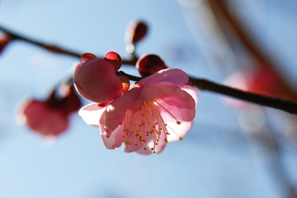

這兩天武陵的天空真的看不到任何絲豪的白雲 全是這樣的藍天 雖然對於原本期待的梅花有一點點的小失望 但還蠻喜歡這種滿是枯枝枯樹 蕭蕭然的感覺的

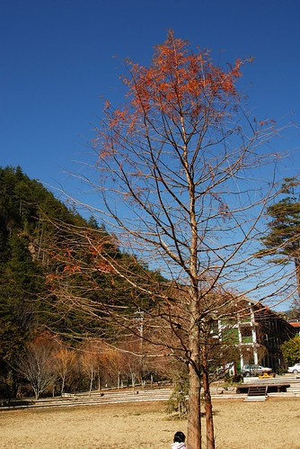

掉在地上很久的枯葉踩起來的聲音更是清脆了

坐在廣場邊曬著太陽 突然響起高中國文課本上的一段話 '枯藤 老樹 小橋 流水...' 哈~ 我知道這既沒有小橋也沒有流水 硬是聯想在一塊實在很牽強

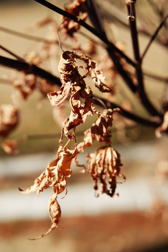

午餐完後 徒步前往遊客中心前賞梅

才走不到100公尺在迎賓橋上 阿徹就開始哇哇叫了 直嚷著想要去晚上睡覺的地方了

一路上就像斷筋般的一直吵 一直心不甘情不願的走著

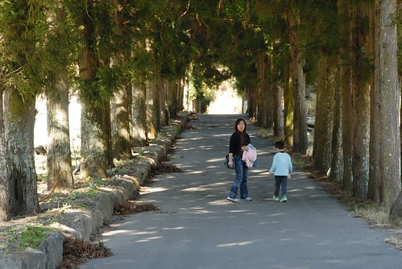

然後越吵 媽媽越是要走  走在前面一直走走走 讓阿徹在後頭急著跳腳卻又只能跟著走

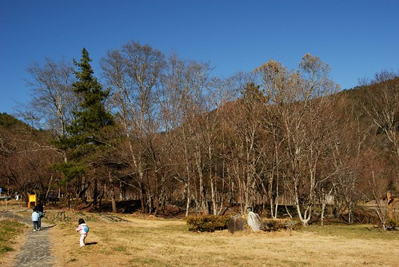

小子完全的破壞了今日郊遊的好心情 辜負了這樣冬日裏的好天氣 好陽光 好景色

遊客中心前方的花況還不錯 只是還是不能稱上盛開

10度左右的溫度裏 伴著溫暖的陽光走在林間 其實只有一種感覺 就是越走越想睡覺 如果可以 好想找一個可以曬到太陽 可以躺下來的地方 好好睡他一覺

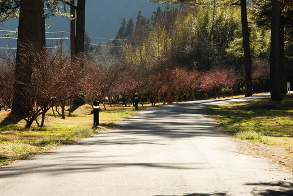

當初就是被人家blog裏的這片梅園照片給'遐'來的 可是花期不對 色彩粉嫩度一整個差很多

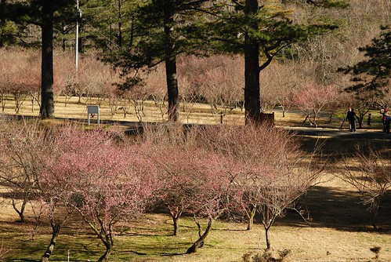

這是去年同時間的花況  [http://www.wretch.cc/blog/wulingyen/9948479](http://www.wretch.cc/blog/wulingyen/9948479) 今年過年的花況 [http://www.wretch.cc/blog/wulingyen/11873508](http://www.wretch.cc/blog/wulingyen/11873508) 實在有夠粉嫩吧 大家應該多少可以理解為什麼時隔不到2個月徹家又去武陵了 只是賞花賞了這麼多回 真的覺得賞花需要碰運氣 可是考量訂房的問題後 要賭對運氣真的很需要運氣 只是講真的看到過年那樣的人潮  我應該也沒有動力在過年期間出門的

這次賞花最大的感想是 賞花還是衝動比較重要 別期待太多 別想太多 就等網路上有人活生生貼出盛開的花況後 給他憑藉著衝動殺上山去就對啦~ 就連賞雪也是...計畫永遠比不上運氣 比不上衝動的...

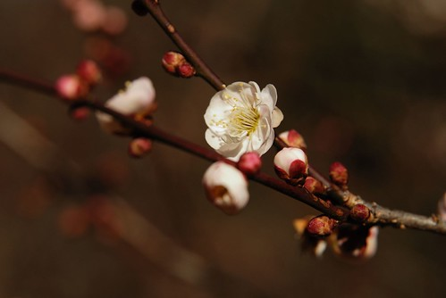

雖然花況不 佳 還是不死心的走上步道想要站得賞花最佳至高點

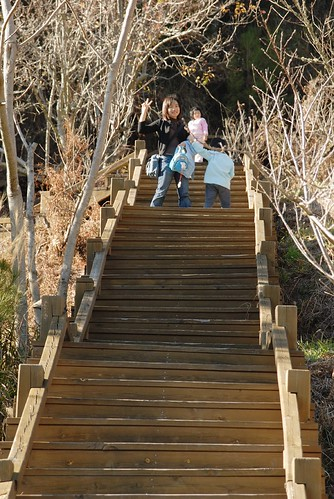

視野果然開闊許多

小愛心機很重 每次阿徹哥哥鬧鬧的時候 她的表現卻反而會特好 今日一馬當先的努力走走走 一直說要爬山 爬山很好玩

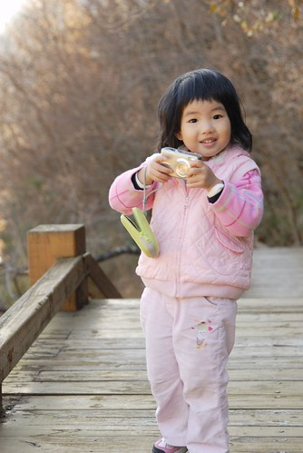

還興致勃勃的要拿相機拍花 拍爸爸媽媽

然後爸爸媽媽就更忍不住+故意的直唸"以後帶愛愛來玩就好了 把哥哥留在阿公家..." 小妮子的心機真的很重吧

如果不是因為原本的期望太高 其實這樣的美麗冬景是很令人心曠神怡的 值得這樣路途迢遙的一再上山來的

尤其大家補上班的週末 沒有人潮沒有車潮 心情更是讚

沿途看到那些像櫻花的枯枝 我跟徹爸兩人一再猜想那會不會是櫻花阿 看著這些枯枝 我腦海裏都可以想見那盛開的花況景象了 ([http://www.wretch.cc/blog/wulingyen/10069641](http://www.wretch.cc/blog/wulingyen/10069641)) 會不會心動? 當然心動!  只是我實在很難啟齒再跟徹爸說"我們上武陵賞櫻吧" 就算徹爸不瘋 我想阿徹也會抓狂吧!!! 所以賞櫻留著明年吧! 哈哈~ 到時候我真的不靠運氣 要靠著衝動等到盛開後再給他請假殺上山的

在農場裏晃盪到接近5點 媽媽總算甘願去check in 讓阿徹進他想了一下午的房間休息 這回房間選擇很多 所以這次下榻賓館本棟後方的歐式小木屋 連小紅都有專屬的停車位喔

接近5點到賓館辦理check in 時 溫度計顯示著六度 我跟徹爸又忍不住幻想著一覺醒來後已是0度以下

進到房間休息後的阿徹就像修補好了一般 一切恢復正常 接下來的晚上及隔天盡情享受

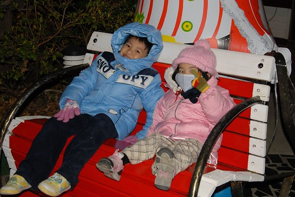

天氣冷 所以5點多就早早洗澡 吃晚餐了 然後窩在棉被裏等著8點多去富野渡假村觀星

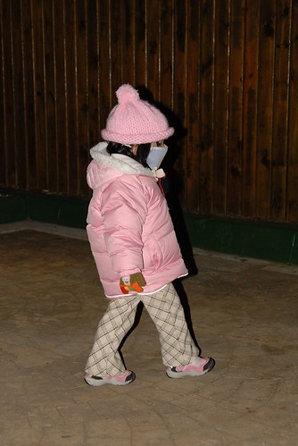

接近0度的低溫下 小愛所有的裝備 帽子口罩手套圍巾全上了

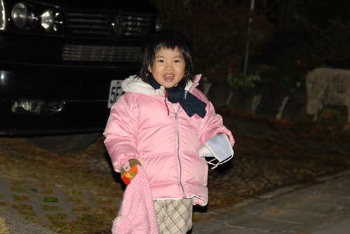

小猴子阿徹也是雪人裝扮 只是單薄的一件褲子還是讓他在下山回家後燒了兩天

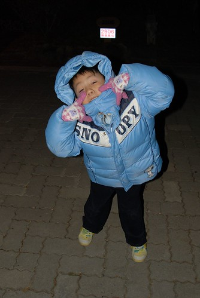

我跟阿徹一樣上半身暖和了 可是下半身都太單薄以致後來都感冒了 自己都忍不住自嘲 這樣的裝備還想去賞雪勒

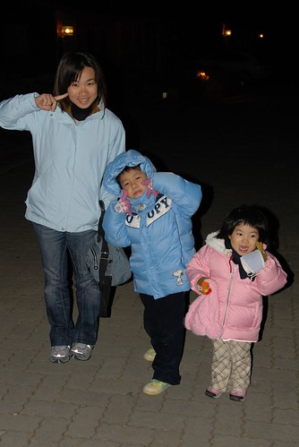

歐式小木屋比起上回住的農莊和室房豪華許多 重點是有葉片式電暖氣 要不然這樣的0度低溫下實在不知道該怎麼存活

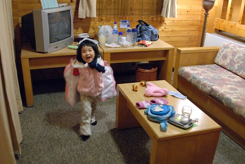

木屋上層的床鋪+廁所 整體感覺蠻不錯的小木屋

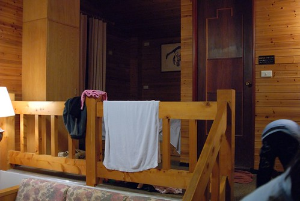

準備前往富野渡假村觀星時  明明就很冷 阿徹跟小愛兩人還硬要坐在門口的石象上 兩人在房間裡玩太High 有點瘋過頭了

媽媽還搞錯以為8點半就可觀星 結果硬是讓一家子撐著眼皮聽了一小時的音樂會到九點半才有觀星活動 音樂會聽到9點多 阿徹明明已經哈欠連連還是堅持的要聽完音樂會 聽完音樂會當然就一定是要給他留下來觀星啦 聽完台北天文館的志工解說員的半小時室內解說後 由解說員帶領來到大門外的廣場觀星

當飯店人員將所有飯店外的電燈關閉時 哇塞~ 滿天星斗多的讓人忍不住大叫 而當解說員拿出雷射筆射向天空中他說的那一顆星時 全部人更是歡呼大叫了起來 哇勒~那感覺真的好像在天文館的180度立體影像館中觀星一樣 超級超級誇張的!!!! 解說員說冬天是最佳的觀星時間點 真的! 星星多到不可數 就像沾了墨水的毛筆往畫紙上灑過留下的滿張點點一樣 且星星離自己的感覺是那麼那麼的近 好像大手往上一伸就可以抓下滿把星星一樣 下回來武陵 一定要再來參加觀星活動!!!

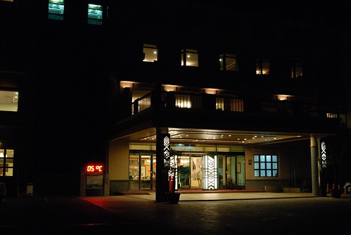

星星很美沒錯 不過半小時抬頭望星下來 連阿徹都喊累說"脖子快斷掉" 看來下回要觀星要多帶個睡袋躺在地上觀會更舒適愜意的 呵呵... 10點半多觀完星時 飯店外的溫度計顯示著3度 哇~好冷~~~~  (怎麼隨隨便便這樣就3度) 趕快回去睡覺 希望房間裡開了一整晚的暖氣可以帶給我們一夜好眠~

