今年的二月的天氣熱的有點誇張 各地的櫻花也野火似的陸續盛開著 我的日記卻還停留在過年前的賞冬梅... 呵呵! 也許這也是一種固執的表現吧! 明明心都已經飛到櫻花去了 卻還執意的不管如何都要寫完這篇賞梅記... 

~ 接續上篇賞星時的3度低溫....

為了不辜負清晨可能有的零下低溫 徹爸特意調了鬧鐘早上6點起床拍晨景 一大早鬧鐘響後我拉開窗簾沒能看見一片雪白景色便又窩回溫暖的被窩裏 而可憐的徹爸卻還是被交予重任去戶外拍照 室外被染白最多的是小紅  整個車身都被舖上白白一層

地上的小花小草也被清輕薄薄的上了妝

連枯葉也難逃

但還是不夠冷 水氣也不夠 梅花沒有"蕩"露水

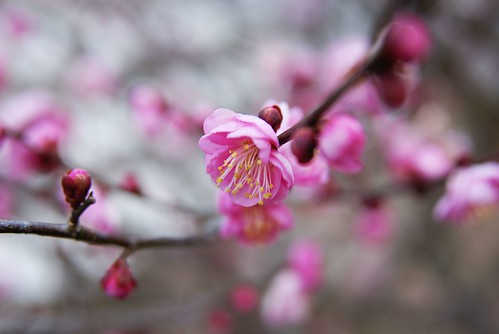

早上八點多去賓館內用早餐時 溫度計顯示著0度 哇~ 破了在台灣體會過的最低溫了 溫度雖低但不若在台北的寒流那樣讓人不舒服 阿徹小愛兄妹倆還興致勃勃的要跟聖誕老公公合照

雖然沒有雪可以打雪仗 堆小雪人 那起碼起碼可以用這白白的畫布塗鴉一番吧

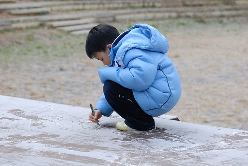

淡淡淺淺白白的草坪看起來還是很有Fu的阿

趁著徹爸小心翼翼的在幫小紅除霜 母子三人凍著手 開心的塗鴉著 (ㄟ..那照片誰照的?! )

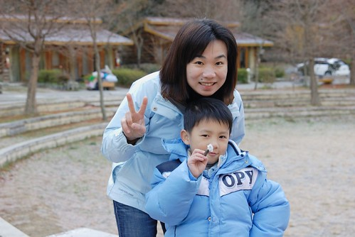

阿徹畫的小天使 如假包換的白色小天使

呵呵 連小紅也難逃我們母子的毒手 但是沒那麼斗膽用樹枝做畫筆 而是用我跟阿徹那快凍傷的小手指畫的

就這麼薄薄 薄薄的一層... (徹爸很喜歡這張的FU)

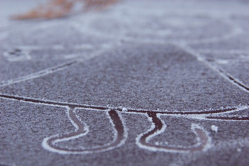

上一次來不及去的雪山登山口  這回不管怎麼樣一定都要去 上山的那一段路很窄  開車向來小心翼翼的徹爸其實很不想自己開小紅上去 可是遊園巴士除了我們這家子詢問外 0人報名 所以徹爸為了不辜負心愛老婆的期望還是硬著頭皮自己開上去了 一路攀升的山路 讓自己離高山越來越近了

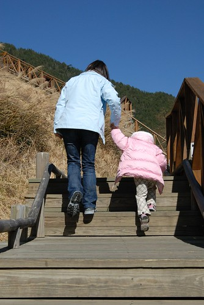

站在雪山登山口管制站前方  自己離藍天/群山是這麼的近 希望有一天我有機會可以攀登上背後那些高山

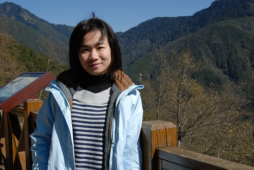

跟阿徹小愛說 爸爸上次去爬雪山就是從這裡開始的喔...

YA!  沒爬過雪山 起碼一家子也來過登山口了.... (小愛顧吃著別的阿嬤給他的餅乾)

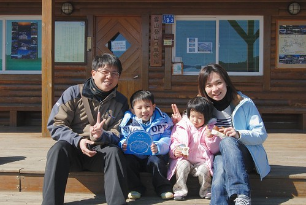

其實登山口除了群山 什麼都沒有 可是眷戀這冬日裏的太陽 捨不得離去 跟著小孩在這玩殭屍拳也好 只要阿徹們不要吵著要下山就好

不知道阿徹小愛們是否也能越來越能在大自然中怡然自得?!

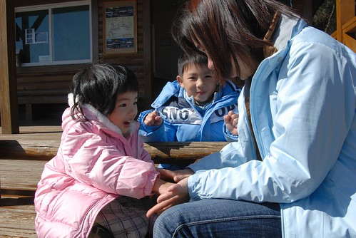

管制站的後方有個大水池 有著很美的風景片view 想要偷偷進入瞧一眼 但管制站內有人所以也不敢冒險進入 就在徹爸笑說著"叫小愛進去 你假裝進去找小孩"後 小愛竟然真的(有隔一段時間後)給她好奇的衝進去了 我這媽媽當然只好"不得已"的進去抓小孩嚕

放慢腳步 在這才抓到小孩 YA! 有看到我得意滿足的表情嗎?

就是這個view 就是這個view.... 真的有美...

(徹爸攝於雪山下山時) 

呵呵! 我想小愛應該是無心插柳的幫媽媽了了這心願 但媽媽還是想高呼"小愛萬歲!"

阿徹今天的情緒一整個好  跟前一日起番的樣子完全不懂 事後我跟徹爸一直試著想要釐清 到底是什麼原因讓阿徹起番 我們一直覺得他應該是喜歡旅行 喜歡大自然的阿

原來武陵山路前方看到的也是百岳裏的桃山

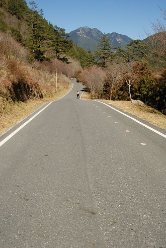

雖然冬日的色彩不若其他季節來的繽紛 但有一種淡淡憂愁的感覺 也是很美啦....(我真的中了武陵很深的毒)

前一天受阿徹壞心情影響沒能好好享受的梅園 今天要重新體會一番

問阿徹前一天為什麼不乖壞壞 他"阿就"了老半天 雖然一再跟他恐嚇著"下次再這樣就不帶他出門旅行 要把他送去阿嬤家了 " 但心裏其實好希望他真的喜歡這樣跟著爸媽上山下海 沒有他或小愛的話 我跟徹爸哪有辦法真的玩的放心 玩的盡興ㄋ

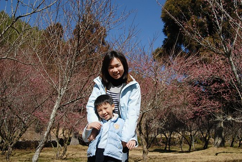

四個人一起的旅行才會幸福滿滿 回憶滿滿阿...

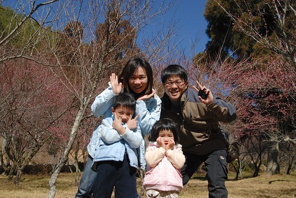

(小子拍照的怪招越來越多 爸媽也要跟進要不然會有代溝)

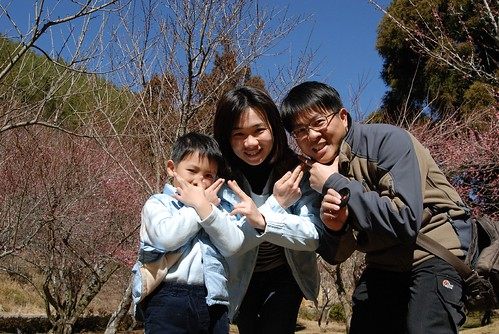

阿徹發現的一根長細竹竿讓兄妹倆玩的愛不釋手

小愛說 她在曬衣服 這位歐桑洗很了超多衣服 衣服曬了10幾20分鐘都還沒法曬完

雖然這花況跟過年時盛開的樣子真的差蠻多的 (主要應該是白色的梅花都還沒開) 但這樣的景色配上稀少的人群(沿途遇到的人<10)卻很剛剛好

梅花似乎真的不好拍

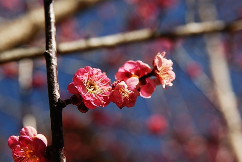

忍不住跟徹爸借了小倆 想要拍出萬叢梅花一枝突出的感覺 呵呵~ 果然出一張嘴簡單多了

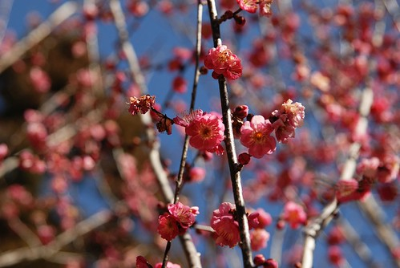

藍天是梅花的最佳背景色

只要小孩子的心情對  大人的興致也會跟著高昂 大人小孩的眼裡看見的便都美景

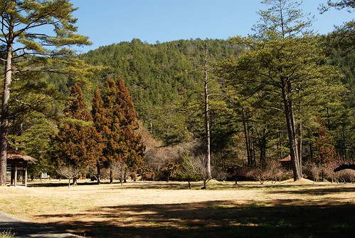

最近看到一個喜好高山的媽媽在他三歲半兒子登合歡東峰後(爸爸背上還揹一個奶娃一起上山) 寫下的一段文字很是心有戚戚焉 "  隨著孩子懂得的事情越多，知道辛苦知道累，爸媽要面對的挑戰才真正開始"

是阿....孩子長越大 也許越來越貼心懂事 但也越來越堅持己見 甚至固執叛逆阿 爸媽再也無法管他願不願意要不要  小孩哭了反正抱了扛著就能走 扛不動也抓不住了  只能威脅利誘甚至千拜託萬拜託 想盡辦法 費盡心思就是想讓小孩能依著父母的期望

雖然過程中有時令人沮喪  生氣 不解 困惑... 但我總相信有一天 阿徹她們會懂的 或是在不知不覺中早已變成我們所想望的那樣子

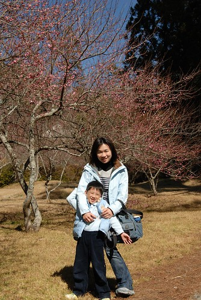

阿徹說他還想去看櫻花鉤吻鮭 可惜等我們一路玩下去時展示館剛好閉門午休中

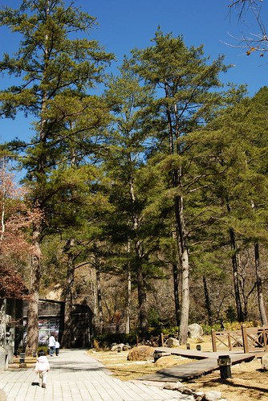

雖然沒見著魚有些失望 但意外的發現 地上到處可見的松果 喔~原來是這棵樹結滿了松果

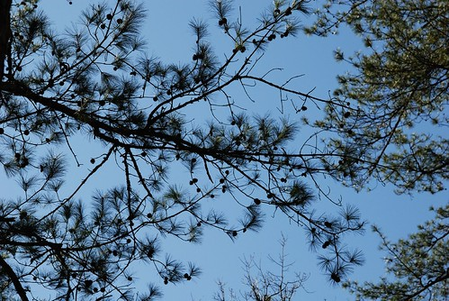

以前難得撿到一顆松果我們便會雀躍不已 今日卻可以在滿地的松果中 享受挑松果的樂趣 阿徹說他需要17顆 因為他們班上有17個人 小愛說她要4顆 要給阿嵂 Kitty媽咪 Freda還有Eileen 幸運的 最後都讓他們達成了

(爸爸總算出現在照片中了)

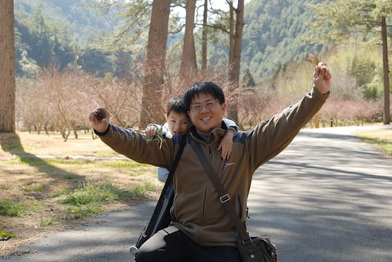

今日的午餐依舊是泡麵兩碗+遊客中心販賣的茶葉蛋/調味乳/飲料 填飽肚子後的兄妹兩悠哉的躺在椅子上做起日光浴

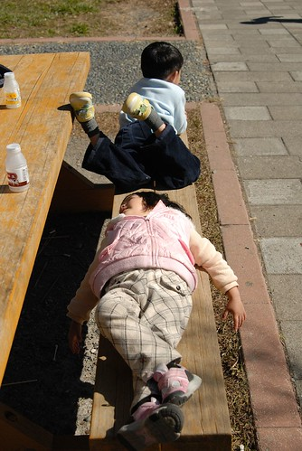

看到阿徹今日這樣怡然快樂的樣子 我跟徹爸對於阿徹前一日的起番更是難以理解想要釐清

午餐過後 阿徹們拿了球棒到草地上玩耍 可是小愛霸著球棒不肯給哥哥玩 寧可自己一個人拿著棒子 就這樣賴坐在地上

看著爸爸們拿飲料瓶子玩打棒球  踢足球遊戲

嘻~傻笑...想一起玩就下來唄 下回別再這麼小氣了

謝謝我們家的老張司機在這樣的好天氣帶著我們出遊

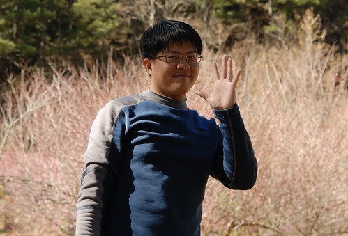

徹爸的相機包 我的萬用袋 徹家旅行的最重要配備

即使眷戀這樣的冬日美景 還是要下山回家了 希望下回再到武陵可以住在照片中的那個渡假村... 呵呵

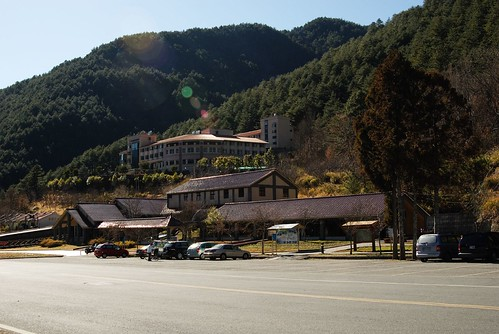
