春天跟秋天都是適合好好出去玩一場的好季節 可是徹家的春遊卻蕩阿蕩蕩到5月底都算夏天了才成行 除了因為三四月小愛住院 還有一些拉哩不撘不知道在忙什麼的忙碌外 最主要原因是因為徹媽想上合歡山 想帶阿徹去走有最簡單(也應該是唯一簡單的)百岳之稱的石門山 想一探合歡山境內唯一民宿落X山莊盛開的法國菊 還有想讓阿徹小愛去海邊好好的玩一場沙 綜合總總徹家的年度大旅遊就在似乎早有預定但又有點緊迫的狀況下於端午假期第三天出發 為什麼端午節第三天才出發ㄋ? 除了因為徹媽沒有彈性放假外 最主要原因是因為徹媽很怕人啦  很怕出去玩的時候滿山滿坑的人啦 果然大假過後各地人潮稀疏阿! 讚讚讚! 這樣最適合徹媽孤僻的個性了(徹爸說的)

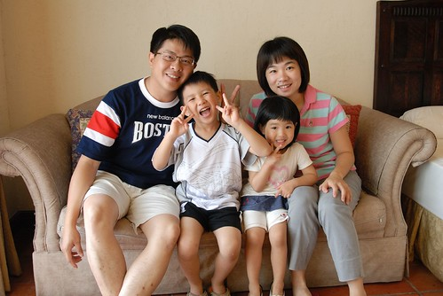

徹爸說或許可以把我們的行程貼上來 讓大家以後規劃旅行時參考參考 知道帶著小孩子能去的點就這麼少 ....

(導遊愛愛小姐舉著上山下海旗 帶領台灣黑熊班出發旅行嚕 )

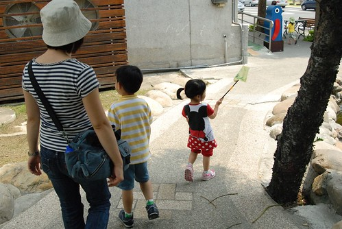

第一天 (5/30，週六) 台北-> 草屯：台灣工藝研究所-生活工藝館 埔里：桃米紙教堂 宿：瑟桃米民宿 (因為要上合歡山 前一晚一定要住南投才不會太累)

第二天 (5/31，週日) -> 清靜小瑞士花園 (為了適應攀升的海拔 以免上合歡山後發生高山症) 合歡山主峰：登山口台14甲30.8K    登山口海拔3275M  

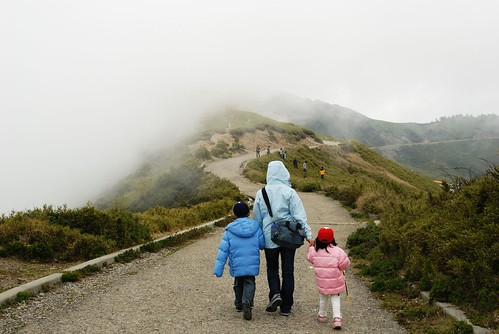

石門山：台14甲33.5K   登山口海拔3120M   峰頂3237M    百岳八小巒   最易攀登的百岳

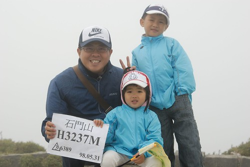

宿：落X山莊(台14甲38.7K  海拔2830M)，花蓮縣秀林鄉富世村關原X號

(落X那打開房門就可以看到的日出讓懶人著稱的我們輕易的就賞到日出) 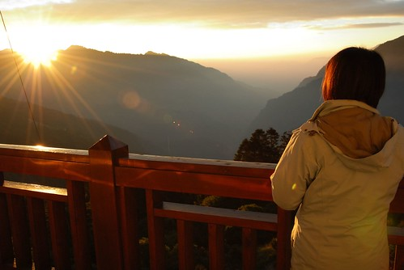

第三天 (6/ 1，週一) -> 花蓮   太魯閣國家公園遊客服務中心  花蓮鵝肉先生午餐 鯉魚潭環潭單車道 宿:理想大地渡假村

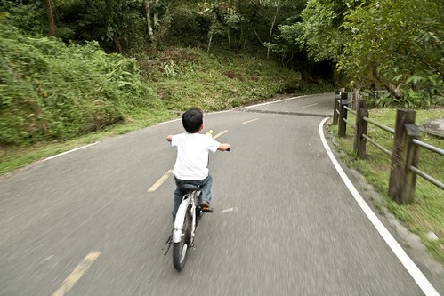

因為大假剛過讓徹媽第二天在合歡上臨時更改接下來三天的行程安排 如我們意的對調後兩晚的住宿  讓我們恣意的在花蓮東走西走亂亂走

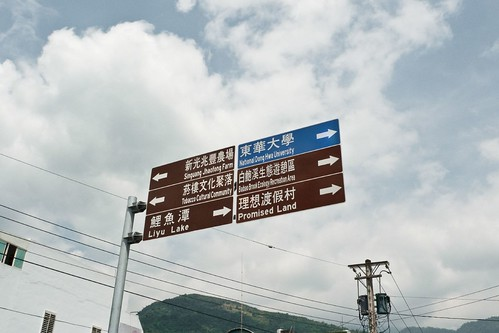

第四天 (6/ 2，週二) -> 搭乘壽豐->至學->吉安平快火車旅

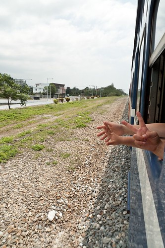

光復糖廠阿嬤的照相館 (比賽開始的追星之旅阿)

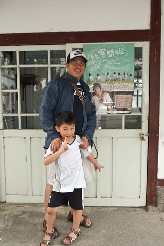

11甲光豐公路->磯崎國小 磯崎秘密沙灘

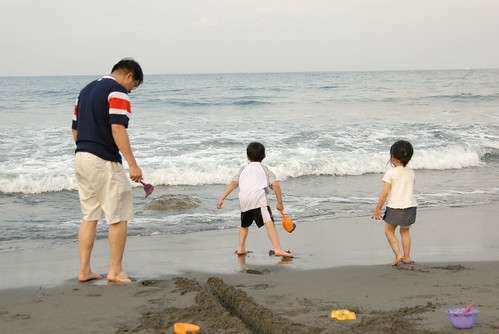

宿後湖水月，花蓮縣豐濱鄉磯碕村7鄰後湖19號

好愛好愛這樣的沿廊

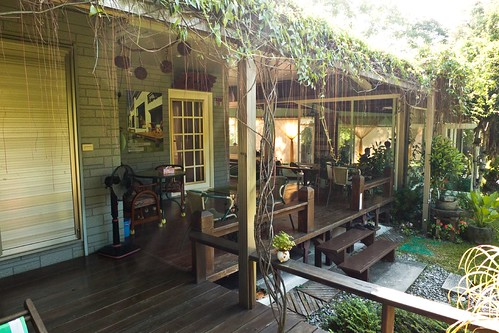

讓徹媽感覺好像到了宮崎駿電影裡的場景 那樣的愜意那樣的自在那樣的純真....

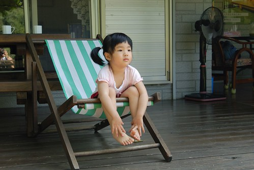

第五天 (6/ 3，週三) -> 花蓮海洋公園

那幾天很像春天天氣的天氣在去海洋公園那天突然很夏天 一整個艷陽高照 好像說著來海洋公園就該是這樣的藍天 這樣的夏天

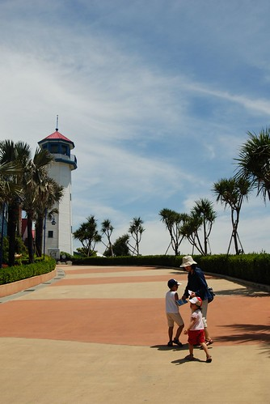

不多的遊客讓大夥在等看海豚表演時盡情的玩 讓徹家也躍上螢幕成為焦點 嘿嘿!

6/3下午3點 帶著滿滿的贓衣服/行頭/單路  進入蘇花回台北嚕 (還沒進入蘇花前 除了徹爸以外的三個人都早已睡暈 只有徹爸看到這樣的大景)

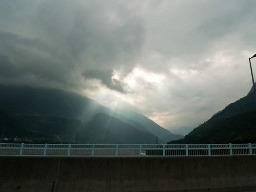

既然是序(=敘 亂亂說) 就是很大略很大略的介紹 甚至有點沒重點 哈哈! 希望接下來徹媽可以好好的逐一介紹各地方 覺得這回去玩的地方都很棒 住的地方也都很像玩的地方也很棒 想要好好的紀錄下來 甚至與大家分享作為大家日後的參考 所以要加油 要加油! (只是現在大半都要利用晚上寫日記了感覺靈感跟文筆怎麼超不順/不好阿?! )

Ps.有感興趣 希望徹媽先介紹以免胎死腹中的點 可以留言告訴徹媽喔!
