都已經2009/1/8了 我辦公桌上的桌曆卻還依然停留在2008年 可能因為景氣不好所以今年保險業務員沒有送  而公司竟然也沒有 不過最主要的原因是一直在等待徹爸親自拍攝自製作的桌曆阿... 等了好久 等徹爸工作忙個段落 火影忍者看個段落.... 總算徹爸把徹家的桌曆給製作出來了 雖然做完後徹爸才說"其實我本來只打算做去年(2008)的桌曆而已..." 但我真覺得桌頭上擺著那些用徹爸照片做的桌曆 每當工作煩躁或是忙個段落後 頭一抬看看桌曆幾眼就會覺得好溫暖 有時後甚至再發呆一下 回想起有關這張照片的旅行...

徹爸謝謝你的桌曆.... 謝謝你的照片... 來年繼續承蒙你照顧了...

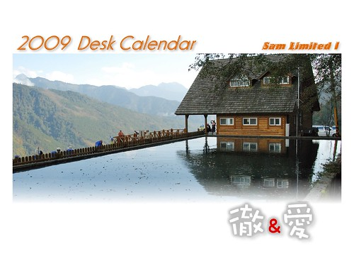

這是徹爸版的桌曆 徹爸自己從2008年所有照片中選出且排版製作的 徹爸在安排照片時問我 是夏天的時候看到冬天的景比較好 還是夏天的時候就看到夏天的景比較好? 我說看自己喜好嚕~

徹爸自己做了兩個版本 這是徹爸自己喜歡多一點的版本

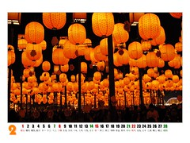 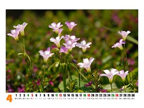  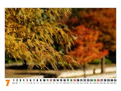  

這是徹媽我選的版本 我的版本好像比較明顯一點看出四季的變化 春天的時候就想在桌頭看見櫻花 夏天的時候就想有大海相伴 而秋天的時候當然就要秋意/楓景上心頭嚕... 其實我一直很想做個阿徹&小愛版的桌曆 可是這麼擺在辦公室裡好像獻寶獻的太超過 所以還是低調點....

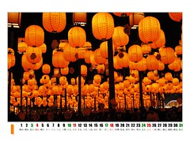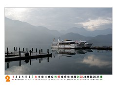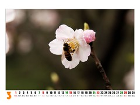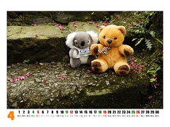 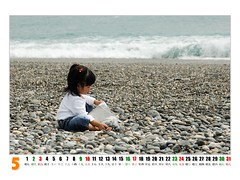 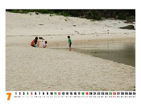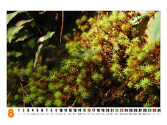 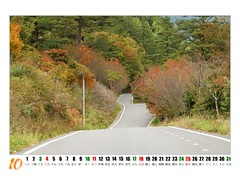  OHYA! 桌曆昨天已送照相館(徹爸凹平日幫忙洗照片的同事送洗)沖印 很快的 就有2009新桌曆伴我嚕~

不過老實講每天看著這些風景照心很容易就飛了 想著"好像好久沒出去玩了 又該出去走一走了...."

更多更仔細的桌曆照片請見Flicker
