是滴~ 又去武陵賞楓了... 不過這回可是阿徹提出的喔 11月初阿徹提出是不是可以去武陵賞楓阿   因為爸爸車上的楓花該換了 既然小子提出這樣的請求 媽媽我當然就順水推舟的去訂房嚕 不過才11月初週末的房間卻都已定滿 因此最後敲定了跟去年差不多的時間 11/20週五下午上山住了一晚上看到滿天星斗  以及不同於台北陰霾的藍天白雲好天氣 只可惜今年的楓實在很不優  徹爸只打了25分(去年80) 阿徹更狠說今年只有1分 因為去年有100分 不過不管如何 對我跟徹爸來說可以上山放空就很令人滿足 幸福嚕~

(數量稀少的楓葉照中唯一令人滿意的一張  暖暖的色調越看越溫暖美麗) 

那天下午2點半多才從板橋出發  4-5點往武陵的台7甲濃霧滿天 能見度大約只有5-10公尺 加上天空飄著的雨 徹爸這車是開的有點辛苦 不過最擔心的還是上武陵後 下雨天星星沒了 藍天沒了 興致也會沒了 幸好在過了台北宜蘭的交界後 我們像是來到了另一個世界 雨沒了 地是乾的 且還有月亮伴著我們  雖然上弦月看起來這麼的小但卻也閃耀動人阿

6點多平安抵達武陵下車時  愛看到天上的星星後告訴我們 有星星耶 四個人忍不住都大聲哇了起來  真的就像徹爸說的"好一個奇妙的地方阿~"

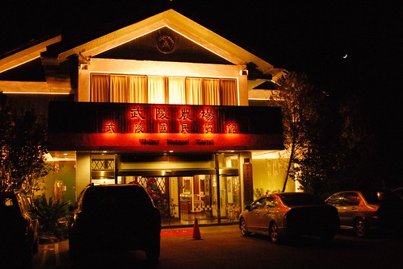

那兩天阿徹久違的感冒+咳嗽 所以當阿徹想喝冰品時 徹爸總警告說"我可不想半夜送你下山找醫生" 不過神奇的是阿徹的咳嗽並沒有因為山上的低溫而加重 反倒在睡一覺醒來之後似乎都不藥而癒 因此徹爸下了這樣的結論 "武陵的空氣真是好阿! " (OS:或許可以認真考慮一下移民去武陵好了)

愛在暈車藥的加持下一路從北二高睡到武陵 足足睡了3小時之久免去暈車之苦 幸好在睡了這麼多後 那晚她依舊在9點多就又跟著全家一起上床睡覺了 上山的疲累+山上的環境=難得的一家四口早早都入睡    簡單生活的感覺挺好的...

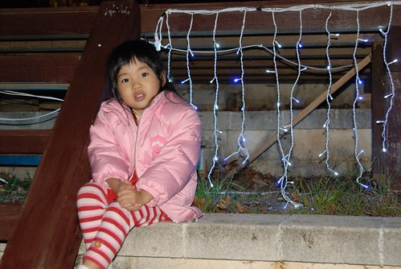

晚餐飯後在賓館後方的楓林小徑散步時  阿徹看到地上的楓葉便開始亂撿一通 看著地上有限以及即時黑戚戚也可以看出醜的楓葉  我們開始擔心著今年的楓況似乎不甚樂觀阿

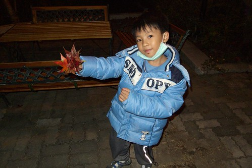

隔天早餐過後 正式開始的楓之巡禮 嘿嘿~ 今年的楓果真不怎麼樣 覺得不是時機不對 來的太晚或太早 而是今年的樹很枯 很焦黃哩 同一棵樹同時存在著乾枯跟翠綠的葉子 感覺挺詭異的

雖然再看照片還是得說很colorful  但現場的景象真的很蕭蕭然

不過不管怎麼樣 還是得來張背景是紅的照片  哈哈!

不放棄的去看武陵的招牌七家灣溪那棵楓 幸好依然燦紅但茂盛度也不若去年了

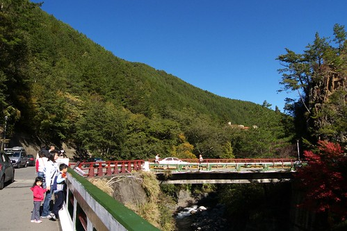

而去年讓我們撿了好多美麗楓葉回家保存的遊客中心前面那排楓   今年楓況卻很慘烈

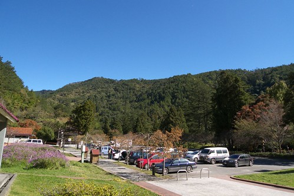

一整排都這樣枯了 還掛了一堆像這樣的小葉子 那種枯樣根本不會讓人懊惱是自己錯過楓期  反而是深深懷疑今年根本沒楓紅過 直接就這樣枯黃去了 果然後來在生態教室跟志工阿嬤問起這事時 阿嬤也說今年的楓樹不知怎麼了就突然像是"耖灰搭"去了

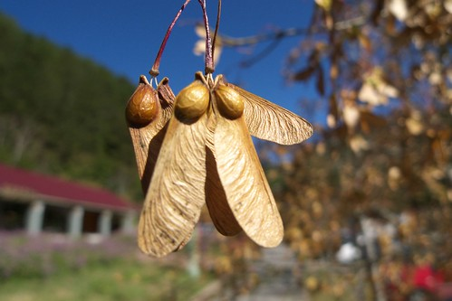

從賓館到遊客中心巡視下來  只剩醒師團旁的這顆楓讓人有想拍的衝動

雖然沒有很紅 但是襯著竹林 透著陽光 煞是美麗

雖然沒有如願賞到漂亮的楓 有點小小失望 遺憾 但一反台北陰霾的爆藍天 還是讓人開心 不虛此行 所以這趟的目的從"賞楓"改成"看天 放空"

我跟徹爸說 這樣的爆藍跟兩年前在北海道看到的天空好像   都藍的好假 好不真實喔

雖然今年的楓況不佳 但今年的小花小草卻長的很好 很美麗

而池塘裡的楓況也不錯 黃黃紅紅亂中有序的舖滿一整片 陽光灑落一樣煞是美麗

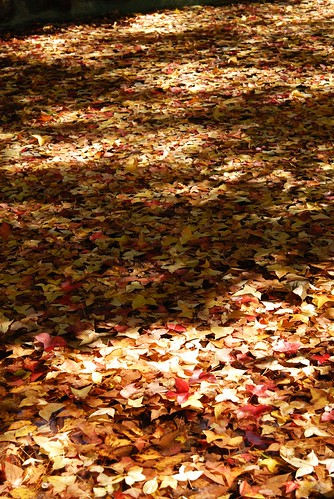

應阿徹的要求我們看了遊客中心早上9點半放映的櫻花鉤吻鮭人工復育之介紹 也再次探訪鉤吻鮭生態教室

我很喜歡教室前面那塊池塘旁的草地  去年1月我們還在這撿了超多的松果 今年這時候 松果尚未成熟掉落 少數掉落的幾顆也不甚美麗 所以被愛愛她們拿來當球踢 當球玩了

(別看陽光普照的 愛愛可是穿了四件衣服抗寒阿)

阿徹哥哥則忙著四處撿楓葉

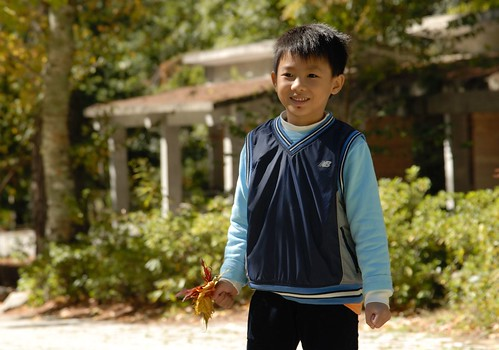

玩蝌蚪

踢松果

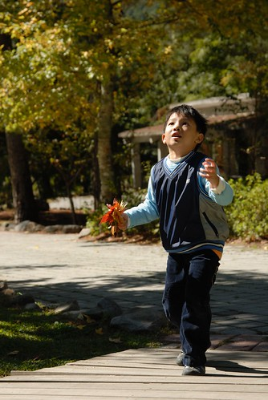

還有來攪亂爸媽的愜意

說放空一點都不為過 因為這樣小小一個場地竟也讓我們在這裡呆坐一小時(兩小忙著玩 我跟徹爸聊天放空)

志工阿嬤交代農場本館後方的銀杏很漂亮喔 一定得去瞧瞧

雖然只有一株 但金黃閃耀動人哩~

離開生態教室我們又開拔到茶莊前的歨道

走了10多分鐘便抵達預設目的地涼亭   在涼亭裡四個人繼續各忙各的

小愛忙著野餐 吃餅乾零食

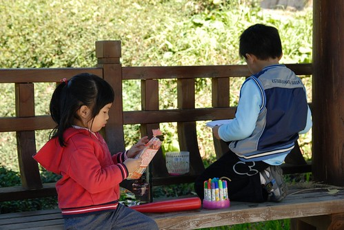

阿徹忙著寫生 作畫

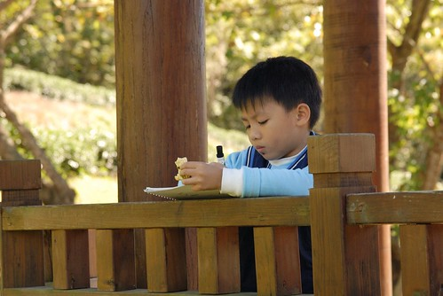

寫不寫實 美不美麗 看官們就把答案放心上嚕 起碼阿徹畫的挺認真投入的ㄋ

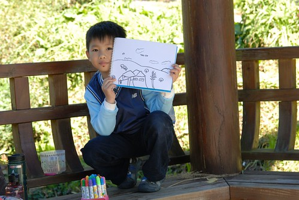

我跟徹爸當然又忙著放空 relax啦

一樣停留約莫一小時 各自都滿足後繼續下一站

奇怪 每次上武陵用晚餐時都可以看到不少的用餐人潮 可是白天在農場裡卻依然感覺人煙稀少阿 尤其是遊客中心以外的地方 沒關係 空蕩剛好合我們胃口

徹爸喚住在走路的我說 "來一張唄  這背景你一定愛" 是滴 陽光小子的媽就愛這種爆藍陽光味

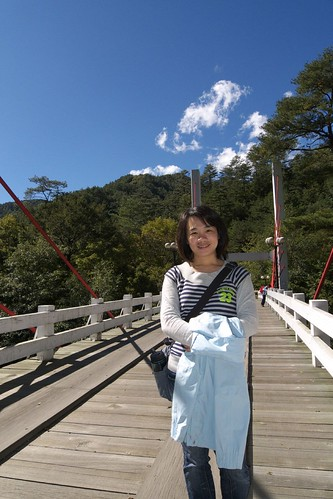

接著我們開著車往農場內部探訪楓機   沿途狀況一樣慘烈但藍天依舊美麗

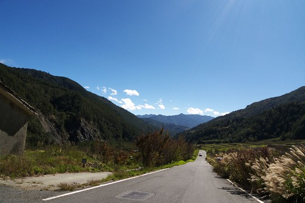

刻意在去年讓我們很難忘的一個點照相  其實還是很多采多姿的

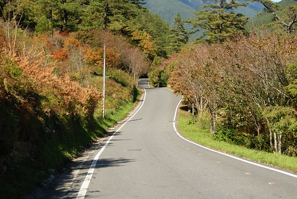

茶莊前的色彩也美麗 只是工程讓這不像楓的楓看起來更糟了點

最後最後我們當然是來到遊客中心前面的那片梅園的草地上野餐嬉戲嚕

1 2 3 木頭人 達陣~

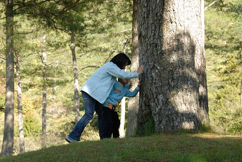

其實今年阿徹自己主動提出要去武陵時 我很訝異 因為武陵路迢遙 且武陵除了大自然什麼都沒有 阿徹卻還是想要再去武陵看那讓他難忘的美麗楓 滿天星斗 而且最後雖然只有看到他評為1分的楓 也沒有賞星活動可參加 但阿徹依然玩的很忙碌 很開心

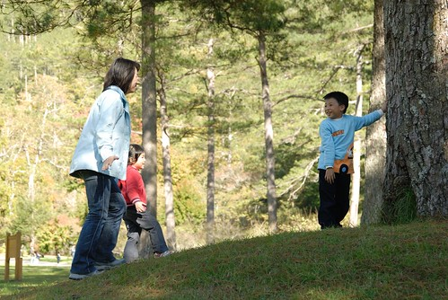

我很高興他喜歡武陵這片淨土 也尋得(或許是只是湊巧)他在武陵的快樂方程式 希望可以像他跟愛愛那天嘴巴直嚷著的"明年的4月 明年的9月我還要再來" 希望可以像徹爸說的 我們每年都來趟武陵當作我們這四口小家族的家族旅遊

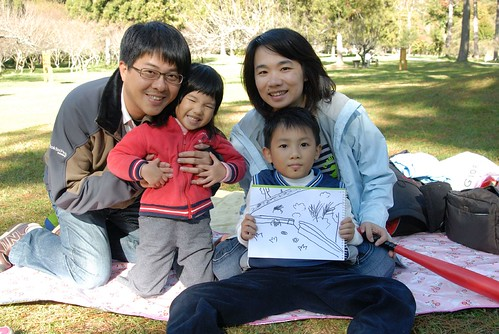

雖然今年的楓葉花太醜 不太夠格去把去年的楓葉花換下 但此行依然"成功"   YA! 放空成功!郊遊成功!

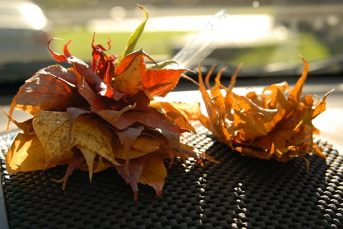

即時最後還是得穿過濃霧回到原本的陰霾世界中.......... (OS: 唉  回到平地後果然地是濕的 天是灰的)

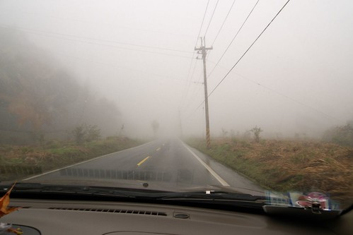
