前陣子我跟徹爸兩人又三不五時就在唉著 "好想出去玩啊" 於是用了徹爸今年開始的旅遊補助上網訂了六月中杉林溪的房間(因為得透過PAYEASY 房間數很少) 而我竟然在六月初的時候才發現 那週剛好是阿徹的期末考前週末說 呵呵.. 基本上阿徹這小子是不搞周末念書複習這種事的 所以我們也不介意考前兩天還出門玩 倒是那周末的高速公路順暢無比  似乎很多家庭都因為考試沒出門喔..

大學在台中時跑了不少地方 杉林溪是我難得的沒去過的地方 本來猜想應該跟溪頭差不多(因為是隔壁ㄇㄟ) 頂多再好一些吧 但這兩天的走遍遍(真的幾乎把杉林溪可以走的地方都走了) 覺得杉林溪還挺不錯的說 很乾淨的大環境 很多的樹 很多的芬多精 重點是很涼爽的避暑地方  推!推! 推!!! 周日傍晚回到家後看到陽台上曬枯垂垂的花草 對照在山上的涼爽 第一次體會到"避暑"的意義 下回被台北的炎炎夏日烤的心煩氣躁時  就去上山"避暑"吧!!! 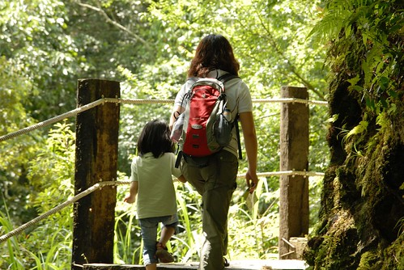

去杉林溪的"動機"本來只是單純想去山上住一晚 去走走步道吸收芬多精 後來竟成了我們七月"193挑戰"的模擬行(什麼是"193挑戰"  噓! 天機還不可洩漏也) 模擬什麼ㄋ?  也就是第一次把三台車給同時載出門了 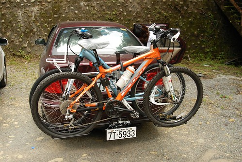 

客人發問"明明只有看到兩台車子啊?" 主人回答"阿徹的車子前輪快拆放在後車廂啦" 徹爸應該想了好一陣子 該怎麼安置車子 該怎麼安全無虞的載出門 經過這次的模擬/實驗   YABE 成功! 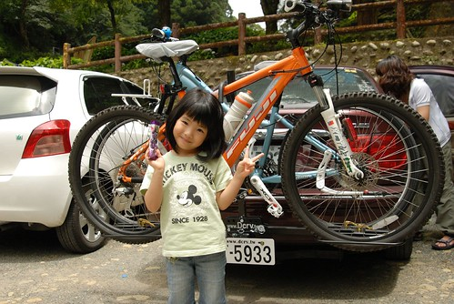

拜沒有塞車之賜 我們只花了3個小時多些就抵達杉林溪 買了門票進去後(假日全票250 停車費50元) 先找地方吃中餐 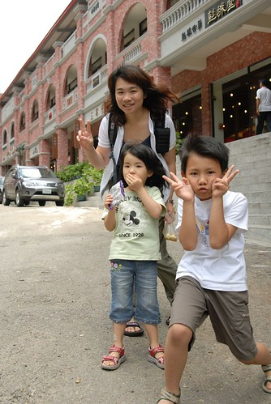

午餐的地方應該是新成立(還是整修)的老街商店  但其實一點都不老而且店鋪很少也很難構成"街" 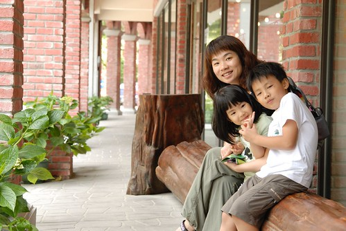

不過環境很明亮乾淨 且以竹子為主題的設計感覺很清爽雅緻 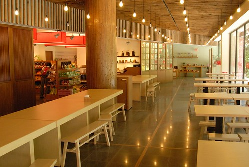

只是餐點價格就有點貴了...  這樣兩客竹筒飯套餐得要300大洋 (我們一家子只吃這樣!? 當然不是 還有另外一個養生鍋套餐) 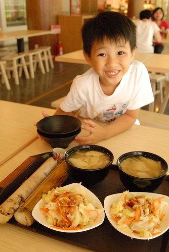

過溪頭後到杉林溪的沿路上 陸續有著介紹杉林溪各時節風景的招牌 現在5-6月是繡球花季 所以園內看到最多的花就是這樣一團團的繡球花 球直徑比阿徹跟小愛的臉都還要大 開的有美麗 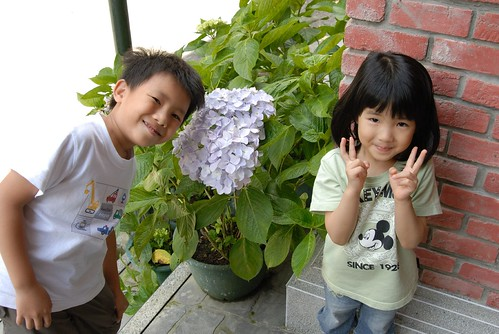

買門票時夾帶了兩張12生肖遊園集章的單子 阿徹聽到說集滿12生肖的蓋章後可以換精美小禮物 便發下宏願要走遍12個可以蓋章的地方 於是吃完中餐後我們便從餐廳正對面 張貼有"狗"的登山步道開始 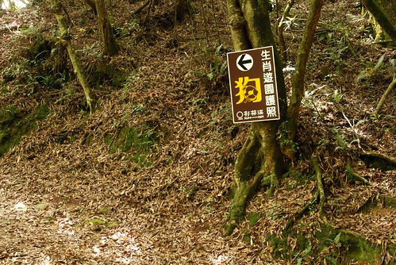

跟阿徹說往返要走大約一小時才能蓋到喔 阿徹不怕難的直說沒關係 徹爸笑說 阿徹真是禮物導向的行為模式 不過如果因為這遊園章可以讓阿徹願意多走點路做森林浴 那也算美事一件 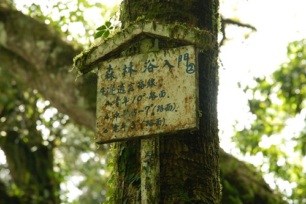

走杉林溪的第一條步道後對這裡的評價又更高些了 步道不算好走也不算難  有點原汁原味但卻又整理得宜 清爽宜人 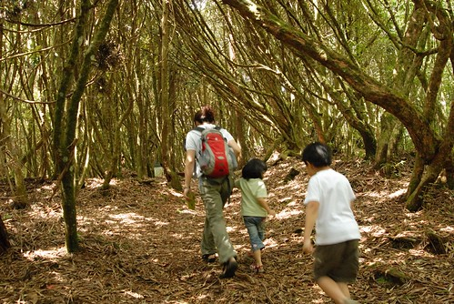

而在步道中也偶而就會出現個讓人心曠神怡的好view 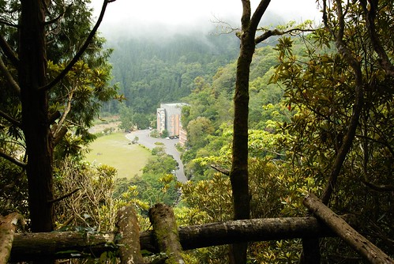

只是走了半小時還沒看到可以蓋章的涼亭  感覺這個集點活動還真不是隨便唬人的哩 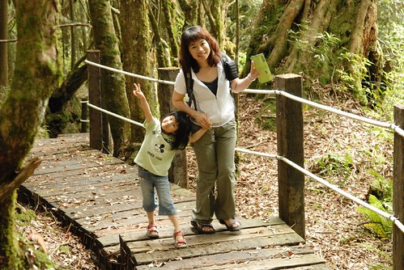

總算在步道的中點 蓋到我們的第一個生肖章了..  (每個蓋章處都是這樣維護的很好的小木屋 ) 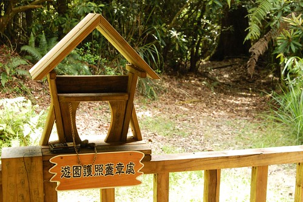

蓋了章小孩滿足雀躍了 就更有力氣跟心情繼續走下去 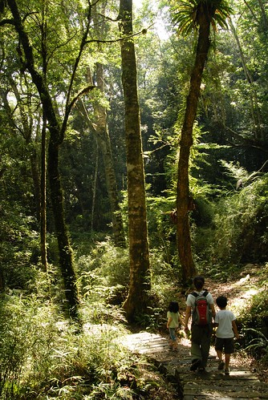

花了一小時完成第一條步道 第一個章後 我們便開始騎著單車遊園逐一蓋章 只是很多地方還是只能靠腳一步一步走到阿!!!

往青龍步道跟石井磯的路口 一進去就是雲煙飄渺 深山仙境的感覺 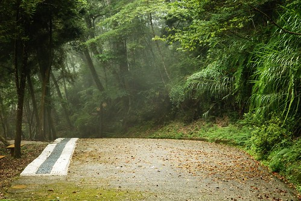

我趕緊CALL了本來在外頭顧車的徹爸也下來走走  錯失這樣的美景就太可惜了 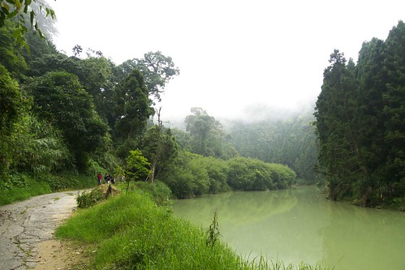

短短一條路 就包含多種不同風格的景緻 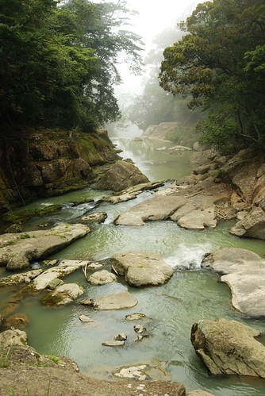

(八八吊橋) 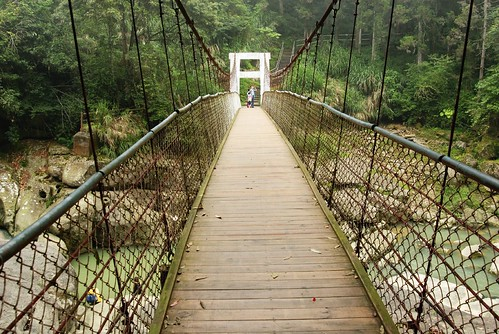

與我們分開走的徹爸 竟然會錯意+愛子心切的獨自走上這通往"羊"的步道 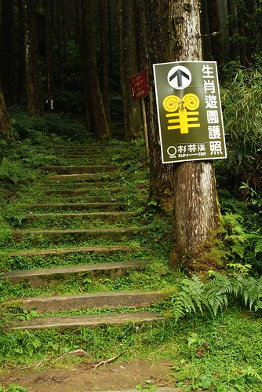

只是真的太遠也太人煙稀少 最後還是半途折返跟我們會合 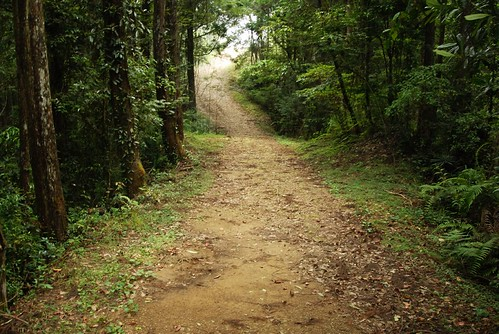

蓋完清龍瀑布跟石井磯的章 我們繼續騎著腳踏車先去把不需要走路的章都蓋了 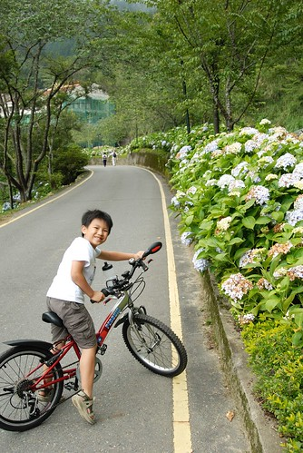

然後開始我們的第一次山區騎車體驗 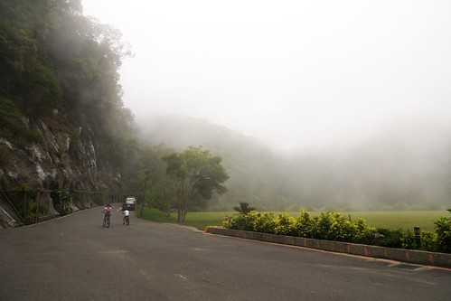

雖然單程短短2公里左右而已 但連續的上坡路段對我跟阿徹來講都是新體驗 第一次的挑戰 (山下30多度的高溫 可是在山上騎車竟然還會覺得有點小冷 連阿徹這火爐都主動要求要穿外套) 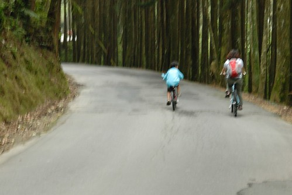

途中只有一坡段阿徹騎不上來 得牽著走上來 我跟徹爸兩人在前頭等著時  很高興阿徹沒有生氣也沒有抱怨 坦然的接受自己騎不上來這事 並且在接下來更注意換檔的時機 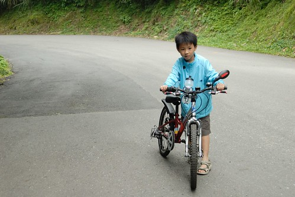

YA! 抵達杉林溪最深的地方 松瀧岩瀑布販賣部 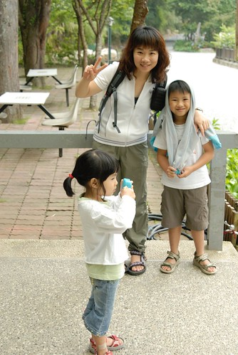

這次杉林溪是我們三台車第一次的出征 也是我們的第一次單車山路體驗 雖然路程很短 時間很短 但是帶給我們全然不同的體驗與感受 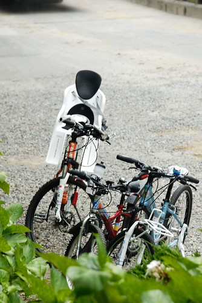

短暫休息的同時我們等著最後一班接駁公車下山  這樣等會我們就可以包路了 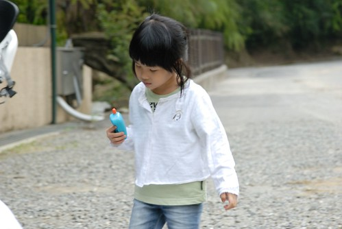

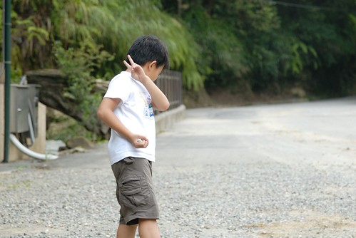

因為全包 所以恣意的在大馬路上照起相 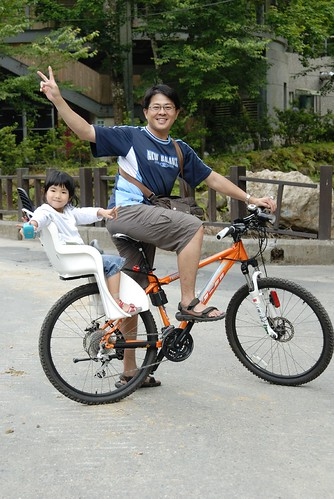

開心的哩~ 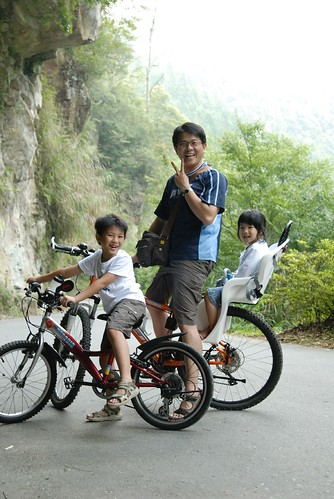

回程時候接連著的下坡讓我跟徹爸忍不住直驚呼'我們剛有爬坡爬這麼多嗎?' 下坡的快感會讓人油然而生一種 "哇 自己真是了不得 爬了這麼多" 的成就感 徹爸笑說 也才2公里左右而已 就這樣開心得意 我說 這樣來回也4公里了 鯉魚潭都快可以環一圈了ㄋ!!! 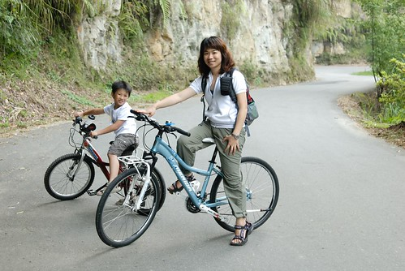

新鮮的空氣 涼爽的微風 下坡的快感  讓人忍不住愛上騎山路的樂趣 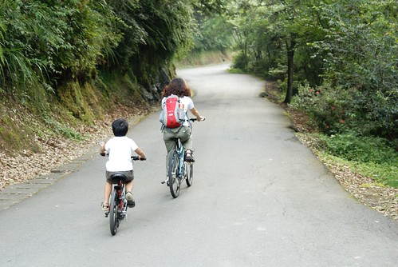

從午餐過後我們進行了4個多小時的健行 騎車  然後才回到我們的小木屋休息 等到六點多再步行到遊客中心附近吃晚餐 此時此刻才發現遊客也還真不少 遊覽車好多台哩  可是怎麼一大半個下午卻都不太見著人 這點跟武陵農場很像  除了吃飯時間的餐廳跟遊客中心可以感受到人潮外 其他地方都沒啥人  標準的台灣人旅遊方式 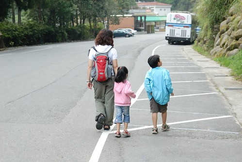

(父女倆不知安怎的竟然就隨路自拍了起來) 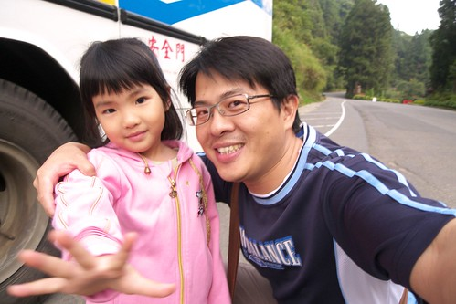

我們豐富的晚餐 三人份套餐750元 山裡盛產竹子加上現在又是產季 所以魯竹筍 竹筍肉羹 竹筍湯讓人盡享竹筍美味 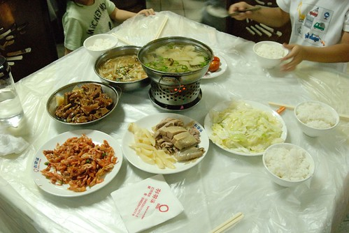

阿徹吃的津津有味直呼真是太好吃了  我們說因為一下午下來你餓了.... 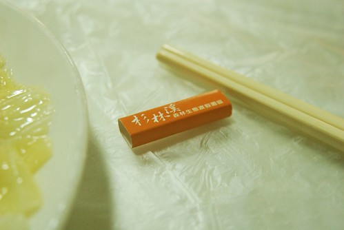

吃飽飯回到房間休息洗澡  八點多玩"美食大主廚"(大富翁系列產品)玩不到十輪阿徹就哈欠連連 精神不濟 那晚上我們全家人破天荒的九點就一起上床睡覺(是爸媽比較難得這麼早睡啦) 直到隔天早晨七點 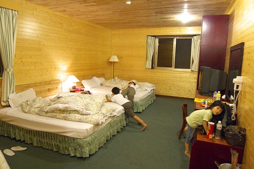

經過一夜充電的阿徹 清早第一個起床後看到窗外的大太陽竟然就坐到窗台上看起他的喜羊羊了 看到他怡然 自得的模樣 我想他是真的越來越能享受旅行的樂趣了 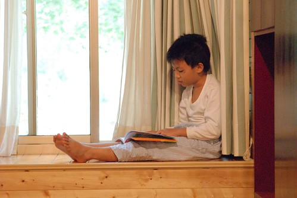

打開窗看看停在小木屋外的車子有沒有被偷阿  呵呵 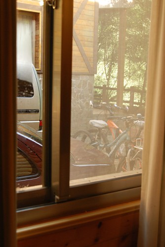

沿著木屋區旁的道路散步去飯店的餐廳吃早餐 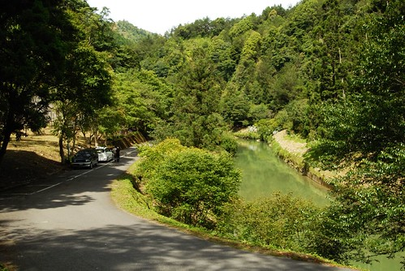

今天依舊是個晴郎的好天氣 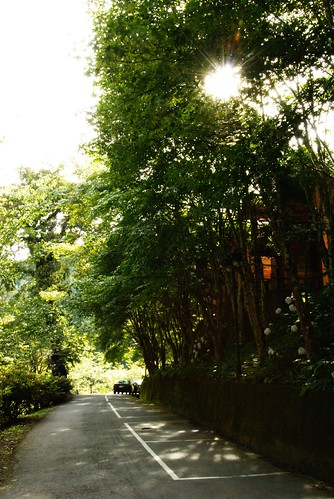

杉林溪大飯店的外觀 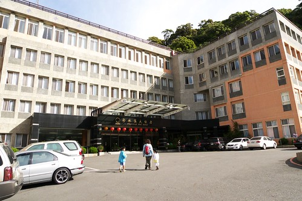

飯店前的廣場 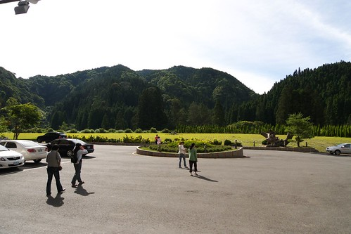

早餐吃飽飽才有力氣繼續我們的蓋章之旅 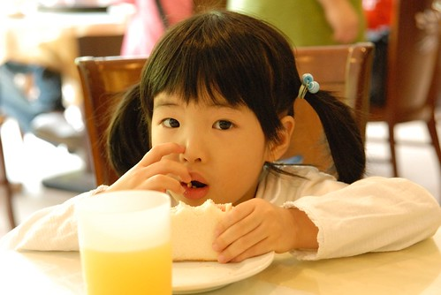

還剩下的5個章 都有點困難度 也就是說今天早上得要很拼命走很多路... 首先去昨天徹爸緞羽而歸的'羊'處  今天從穿嶺古道的另一端進攻 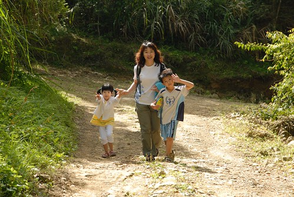

歨道上看到走起路來搖搖擺擺的蜥蜴　一家子忍不住哈哈大笑 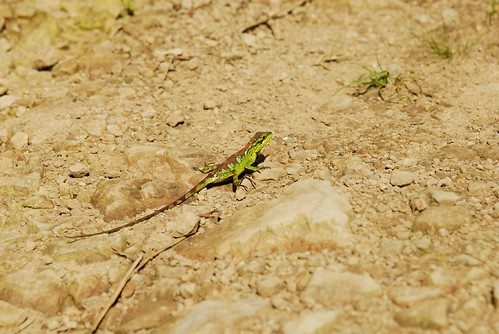

嘿嘿~從這端好走也快多了(只花30分鐘時間往返)  在出呼我們意外下很快的就看到蓋章小木屋 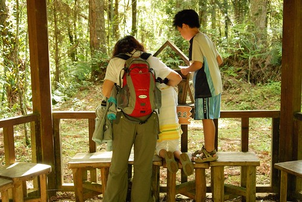

阿徹小愛一人一張集點卡  每一關都小心翼翼的蓋在自己的紙上 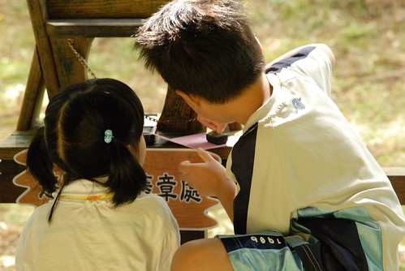

看到兄妹倆這麼積極的想完成12生效的集章 我跟徹爸也只能拖著老命奉陪嚕 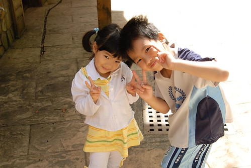

然後我們搭乘接駁車到昨天騎車前往的藥花園跟松瀧岩繼續追章 (得抱怨一下 單方向40元的接駁公車費用真的太太太貴了啦) 

'兔子'位於樂天歨道的中間涼亭  為了蓋這個章我們剛好曾藥花園走到松瀧岩 

一公里的路程我們又大約走了4-50分鐘  沿途的路況困難度相對高了些(對小愛來講) 

不過小愛有'吸盤腳'加持 一歨一歨都走的很穩當 

不負我跟徹爸向來對他好腳力的讚賞 

不過小妮子還是需要給她點動機 獎勵 鼓勵她走下去 這回旅行用的'蠻牛'便是洋芋片  用著'等會蓋到章/ 等會走到XXX 給你三片洋芋片喔' 愛愛便又會開心的 認命的繼續走下去 直到到達後馬上伸出小手跟我說'你不是說到XXX就可以給我吃洋芋片' 所以說這是愛愛的精力補給蠻牛一點都不為過 

昨天騎車到松瀧岩時純在販賣部休息 未進入探訪 今早再訪有點被這的風景給大大震撼到 

這裡號稱著全國芬多精濃度最濃的地方  難怪有自然氣功社之類的社團在此吸收大地精華 

(穿插: 愛愛跟阿徹看這美人魚看的好認真阿....'' 媽媽 美人魚是做什麼的阿''  媽媽說 賣魚飼料的啦) 

官網上說: 松瀧岩瀑布水花飛濺，氣勢磅礡，岩洞及森林景緻秀麗，號稱「杉林溪首景」 

果然走近岩洞後便會開始讚嘆這洞的巧奪天工 

夏日瀑布之磅礡氣勢 

以及站在洞裡望出去的景緻 彷若武俠小說裡退隱高人隱居的秘境一般 

連阿徹跟小愛都看的嘖嘖稱奇 

很久沒有用小兩照很多照片的徹爸 這回在杉林溪用小兩照了很多甚至還在這瀑布也來了張長曝 

我們母子三人'很乖得'在瀑布下等著徹爸 

呵呵...其實 其實是因為我們想跟爸爸一起走過這段路啦 徹: '愛 你準備好了嗎'  愛:'可以了 我做好準備了' 

哈哈! 還是被瀑布的水花及磅礡氣勢給震到了 

漩渦鳴人真是太強了 竟然可以在瀑布這麼強的切力下練習忍術 我心裡頭忍不住想像起阿徹盤坐在這瀑布下練功的樣子 嘖嘖嘖!!! 真是好樣的阿! 呵呵 

在松瀧岩讚嘆逗留了半個多小時後 我們繼續循著路接上天眼歨道為我們的倒數第二個章努力 

哇  過個山洞後便變成另種風味的小溪景緻 

兄妹倆到此時11點多 精神跟興致竟然都還不錯 還不約而同 裝模作樣的擺著pose讓徹爸來一張 

走了一長串的階梯後 總算得到12章中高度最高的天眼"虎"章了 

這這這..真是太感動了 只剩一個'蛇'章了... 不過此時已經12點我們的肚子已經開始咕嚕咕嚕叫嚕 看著所剩不多的洋芋片 我跟徹爸就算肚子餓也只能吃個一片吃心裡慰藉的 

實在有點累了 所以媽媽沒有很反對的順從了阿徹的建議 又花了錢撘接駁車回到藥花園吃中餐 這的餐跟前一天的老街一樣又點貴三三 不過整各花園的戶外景緻還不錯 幾座大風車擺的還蠻有fu的 (這是室內的小小小小風車) 

休息半小時吃完中餐後 我們便又接著要走穿林棧道去蓋蛇章 順便回到山下飯店處 

真的是'穿林' 沿途盡是直挺挺 高聳的柳杉 

而且樹常就橫在路的中間  走在其下就像是穿過一層層的'林'門 

老實講到此時四個人都累了  都只想趕快蓋到最後一個章 趕快結束這12生肖遊園集章阿 ㄟ...也沒有四個人都累啦  起碼小愛還能唱唱說說一整路的走這最後的歨道 真是我們家的No.1阿 

走!走!! 走!!! 趕快走到蛇章處 只是怎麼走了3-40分鐘還是沒看到阿  到底在哪裡阿?! 

所幸在還沒崩潰前 總算蓋到我們的最後一個章了 OHYA~ 我們花了1個下午+一個上午又多些 完成了12生肖集點章 

當阿徹信誓旦旦的拿著空白集點卡說要集滿12章換小禮物時 我跟徹爸壓根不看好 因為集滿12點就等於是要把杉林溪所有歨道走過哩 抱著就陪著小子玩 看他能堅持到哪裡的心態 我們一起一個章一個章的蓋下去 想不到 我們竟然真的完成了.... 走出歨道口回到車子能走的路上時我們真的High到手足舞蹈了起來 

趕緊拿著我們集滿的點數卡去飯店換精美小禮物嚕... 話說我們路上偶而會談論起 精美小禮物是什麼東西阿 阿徹就會超high又超期待的笑咪咪說'我想一定是很有紀念價值的東西吧' 蓋到只剩2-3個章 真的覺得兩天中要完成12章很拼的我說'會不會是在販賣部看到的12生肖壇木杯墊阿' 爸爸說'咦~ 有可能喔...這很有紀念價值阿'  阿徹又更開心了 說'好耶 好耶 ' 可是那個杯墊要賣250元 基本上我很懷疑園區會有這麼大手筆啦 只是做個這個夢 大家就會好開心 呵呵~

結果'精美'禮物是什麼..................................................................................................................... 看倌們 大家睜大眼睛看阿...就是這印有杉林溪三個大字跟一些美麗照片的L夾阿 

老實講剛拿到這精美小禮物時 我有愣了一下'阿! 那ㄟ是這....'  我第一個擔心的就是阿徹會不會失望 問了阿徹喜歡這嗎  阿徹說'喜歡阿 剛好我書包沒有L夾' 於是兄妹倆開心的跟著這得來不易的精美小禮物合影    呵呵~ 小人有開心就好 不過講真的能透過這樣的蓋章集活動激勵小孩多走歨道是很好的點子 我跟徹爸兩人不忍自嘲''從來沒有像這樣把一個森林遊樂區走遍遍過'' 嗯~這回的芬多精吸收很多  希望可以讓我們在台北撐很久...

下午二點 吃點餅乾補充體力便要驅車回家嚕...(果然愛愛跟阿徹上車沒多久就睡著了...) 
