從安排好12月的苗栗小旅行後 阿徹便常唸著"可以去三義看木雕" 因為他們的課本裡曾經提過苗栗的三義木雕與獅頭山(書唸的不頂好 對玩的事卻挺注意的) 雖然兩天中 徹爸常拿"怎樣..就不去三義.."來脅迫阿徹  但我們也知道這是"行萬里路勝讀萬券書"的好機會阿 於是在大湖的草莓樂之後 我們接著去三義的木雕老街以及木雕博物館.. 只是回家後才發現 唯一的相關照片卻因不怎麼樣而被徹爸給刪了(博物館內禁止照相 所以只在老街照一張) 這下子還真不留下一點足跡了  木雕的情景只能留在我們的心頭回憶裡... 而逛完三義後的原本該回家的時間 卻因為看到路邊往勝興車站的指示牌標示著3KM 而又多繞進這山中小站裡 第一次我們家行程塞的這麼滿 跑了這麼多觀光地 也難得的三餐不正常 回家後問徹愛喜歡這樣的旅行方式嗎 愛愛打了98分的高分 而阿徹也很滿意的打了90分 不過他皺著眉說"可是以後該吃飯時間就要吃飯 而且要有菜" 嗯! 正常的三餐對我們家來說真的很重要! 以後的旅行會多多注意與落實的!!

其實對於像勝興車站這樣的夯點 我是有點期待又怕受傷害的 全台各地大同小異的老街景象不說  那個熱鬧的人擠人是最容易讓我害怕與敗興的(敗興的時候 父子三人就倒楣了) 但這回這個意外來的勝興車站卻讓我感覺挺好 挺喜歡的 雖然人潮不少但起碼不擠 而且不知怎的就是覺得多了個FU 徹爸笑說"你擺明是因為這在山裡 所以才喜歡 要不然你怎麼不喜歡集集" 呵呵! 或許吧  因為這樣的群山環繞讓我格外喜歡這小站吧! 在這裡的我們很觀光客 但玩的很開心~

一進入老街後 看到有店家提供可免費照相的頭偶 阿徹馬上衝進去自己套上 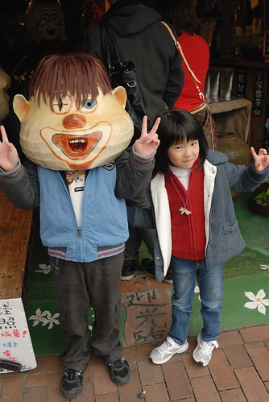 戴一個後不過癮 又戴了老夫子 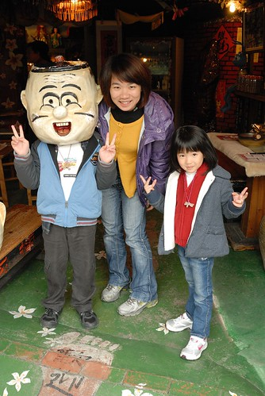 愛愛看的躍躍欲試 於是哥哥當大番薯 她當老夫子 只是愛愛的頭真小 不稍微幫忙扶著頭偶的話 老夫子就噹的頭身分離了 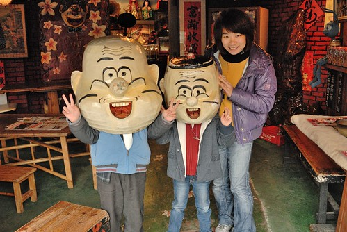 走到外觀雅緻溫暖的香草鋪子  一家子忍不住進去瞧瞧 看到裡頭琳瑯滿目的章以及販售的明信片  我們母子三人各自挑了一張 蓋上喜歡的章寫下給收信人的祝福 因為寫明信片的桌子被一群讓人搞不懂在玩還是在寫字的青年男女霸住 我們母子三個人只好倚在一旁的展示桌上 克難寫著明信片(張媽媽忍不住要碎唸一下"現在年輕人喔...") 阿徹寫給嘉義阿嬤 祝阿嬤長命百歲(明信片寄到後 阿公吃味他怎麼沒有) 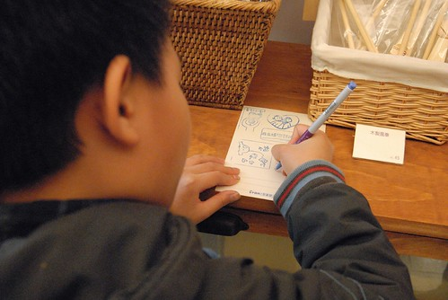 愛愛堅持要寄回家給她自己 上頭蓋了像是一對爸爸媽媽 還有像是一對小孩子的章 代表我們四個人一起旅行 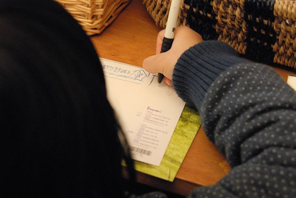 而我破天荒的獻出我的第一次 寄了張"好好愛自己 是讓自己幸福的第一步"給超級適合這張明信片的人 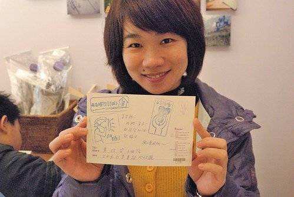 寫好明信片 投到店外的郵筒裡 一個傳遞快樂 一個寄送希望 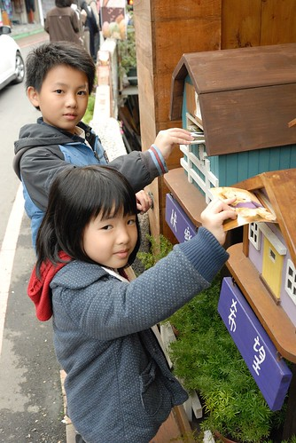 不過我們三個人都選擇了快樂    希望遙不可及但快樂是活在當下的每一刻 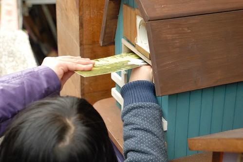 寄完明信片繼續老街巡禮 看到了一攤用腳踏車擔著的臭豆腐店 排隊人潮綿延 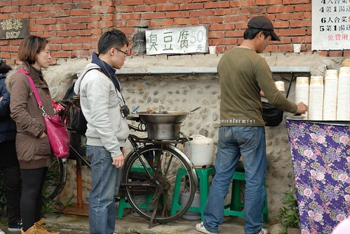 真可愛 就這樣的小小一攤也能做起生意 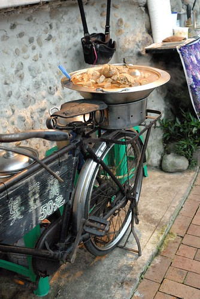 回程時 不需要排隊於是我們也買了杯臭豆腐 嗯~ 真的好吃 而且美麗的老闆娘還很熱情的讓我們拍臭豆腐 只是她很堅持不可以拍到她喔  我們又在老街上看了蜜蜂 買了蜂蜜 又再買了兩根香腸邊走邊吃 吃到鐵軌上去 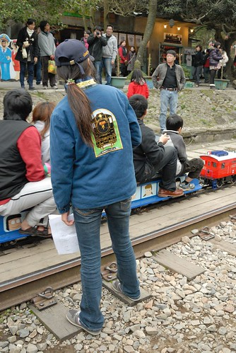 勝興火車站已經廢站 沒有真的火車行駛  但有超級觀光的小火車版 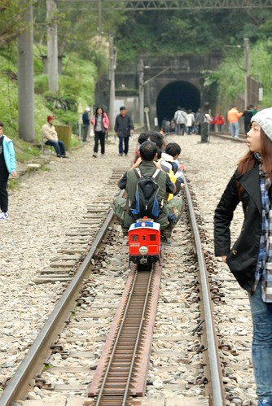 一群大人小孩坐在比自己屁股還小的小火車上 而且到山洞那頭還得起身換方向坐 真是可愛 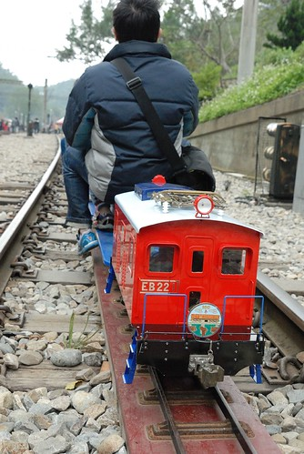 徹愛當然看的也很想坐 但媽媽說這次的藝術之旅真是太花錢了 所以要省... 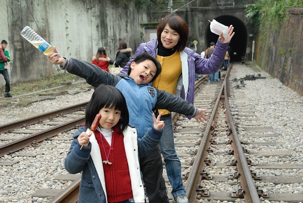 幸好徹愛都能接受這樣的理由 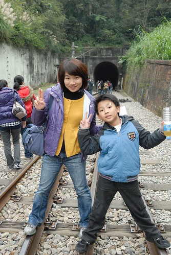 (自拍二人組 再度出現) 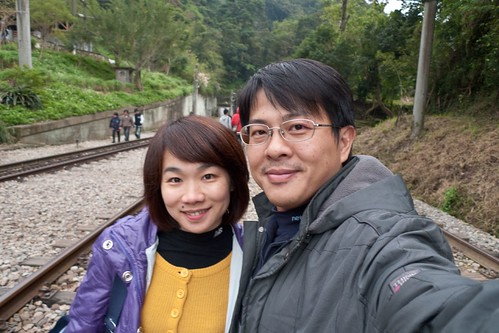 因為是來當觀光客的 所以當然得多照些地標照 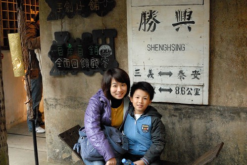 小孩子真的很愛照這種人形看板 連原本跌倒在哭的愛愛也能馬上破啼為笑 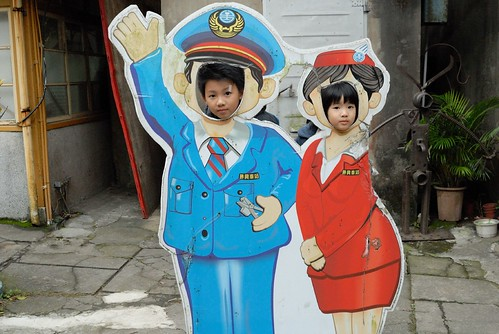 YA! 勝興車站我來過嚕... 只是來到勝興卻沒去龍騰段橋有點小缺憾 來日有機會得再走一遭 (話說在鐵軌上時我問小火車的工作人員龍騰段橋在哪裡? 他們竟然跟我說順著山洞走4-5公里就到了 大哥! 天快黑了耶 這笑話實在不太好笑哩! 不過這是個蠻棒的建議) 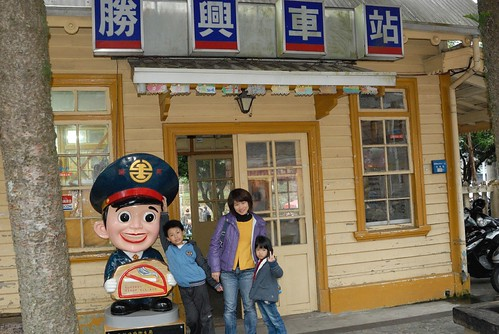 準備離去前 在老街上看到陀螺大王的表演 我們忍不住駐足觀看了好久 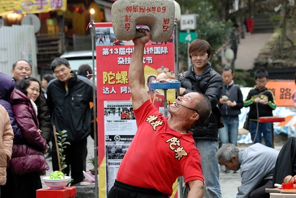

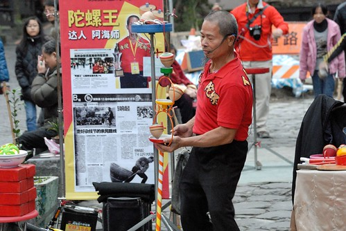

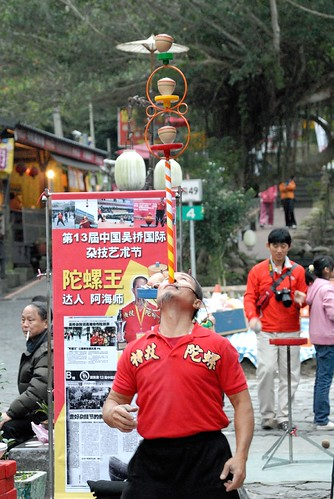 阿徹看的嘴開開 嘖嘖稱奇 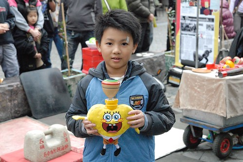 而每當陀螺大王開放給遊客拍照時 阿徹也超積極的要爸爸幫忙拍照留念 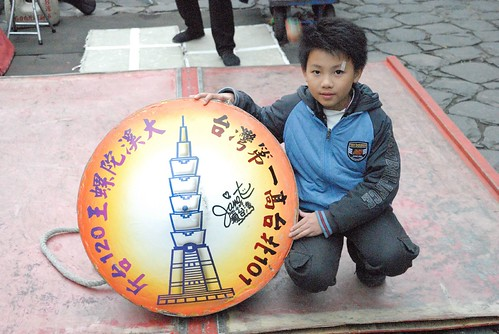 今日 我們在勝興就是這樣的觀光客  但挺不賴的!!!
