12月不只是歡樂的聖誕月也是草莓開始盛產上市的月! 其實我並沒有特別喜歡草莓的味道 但是我喜歡看到小孩子喜歡草莓的樣子 殷殷期盼大半年 總算盼到草莓季的開鑼 徹愛開開心心在草莓故鄉採草莓! 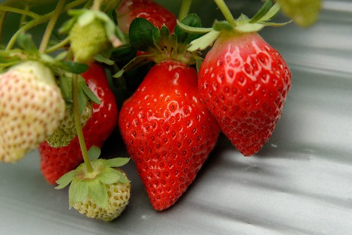 

從泰安溫泉離開後 我們來到清安產業道路上的大湖草莓園(每次都去同一家) 雖然越來越多農園採高架方式種植草莓以減少農藥的使用量 但我還是喜歡來像這樣的傳統草莓園採草莓 比較有採草莓的FU... 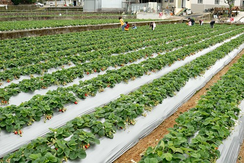 今年因為多雨 草莓季比往年晚了一些 園內的草莓也都還青青紅紅不等 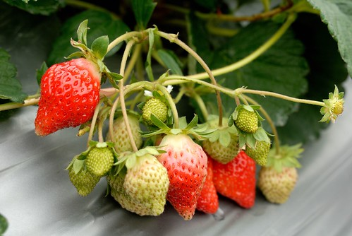 雖然大半的草莓不紅也不很大顆 但仔細看認真找還是有好多鮮紅的草莓可以摘  已經有多次採草莓經驗的徹愛 都知道草莓紅不紅最重要 有紅就會甜! 阿徹跟愛愛此起彼落的喊著"哇! 這顆好紅! 可以嗎?!" 然後小手迫不及待地拿著剪刀  剪下一顆顆紅咚咚的草莓 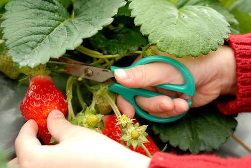 鑒於往年的經驗 帶回台北的草莓都會"ㄎㄡˋ傷"嚴重 因此在一開始便跟徹愛講清楚 只能採一點點草莓現場吃或帶回家就好 可是徹愛看著一顆顆的紅草莓 越剪越是開心 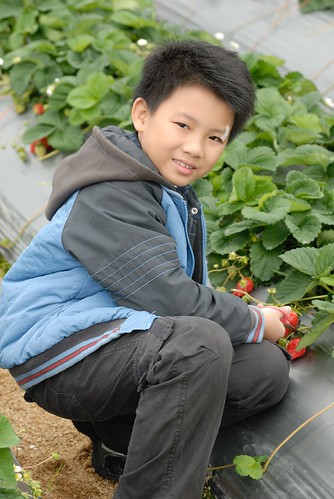 下手之快狠準 讓我忍不住一再呼籲"夠了 夠了...." 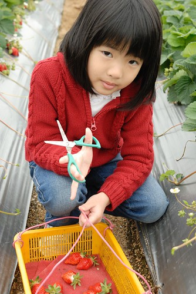 總算徹愛在幾次的"再一顆"後 願意收起剪刀 可是每當看到一顆又一顆的又紅又大草莓 徹愛又忍不住直說"好紅喔! 好想剪喔!" 愛愛最後甚至仔細 一顆顆地數他跟哥哥的籃子裡各有幾顆草莓 深怕自己剪的比哥哥少 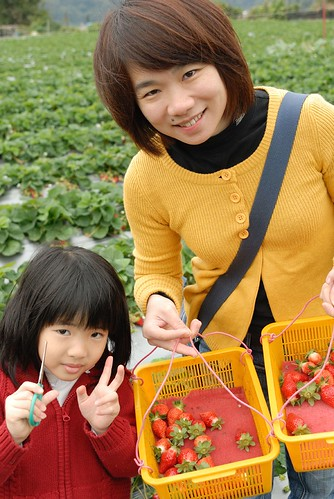 總計最後兩人總共採了36顆  重量剛好一斤左右  有達到媽媽最初下達的標準 Good job! 其實不只徹愛喜歡採草莓 我也好喜歡採草莓 尤其走在草莓園中 看著白色秀氣小巧的草莓花  尋找一顆顆紅咚咚的草莓  一整個就是令人開心又舒服! 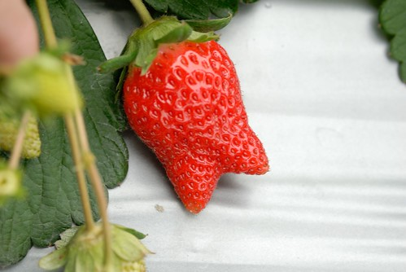 草莓秤重計價完後 徹愛便當場嚐鮮起來 嗯! 好吃的草莓 這也是重要的冬日味道之一!  採完草莓 接著我們來到巧克力雲莊準備吃移山倒海草莓冰 正中午12點 雲莊的人潮不少 門口甚至有專人引導停車並收入園費(只有假日收取 一大人100元 可抵園內消費) 雖說入園費可完全在園內消費使用 但給人的感覺就是多了商業氣息... 而入園後 我們直攻販賣移山倒海的巧克力屋  才在門口就被下面這張公告給嚇到了 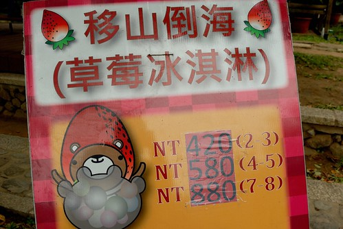 啥咪! 這價錢足足比兩年前貴了5成哩!  這物價上漲的幅度會不會太大了?! 我們猶豫了三秒鐘 到底要不要吃 但不吃移山倒海的話 又不想吃其他東西以花掉200元的入園費 所以我們還是點了一份小的移山倒海! (連點餐也改成在巧克力屋外面像是泊車櫃台的櫃台 另一殺風景處)  所幸雖然莊園遊客不少 但入巧克力屋內吃草沒吃巧克力的人並不是太多 我們也得以選擇一個靠窗的位置 好好享受我們的草莓大餐  等候的時間 我們四個人一如平常亂聊天一通 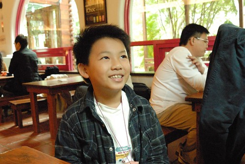 或是母子三人玩著一些小遊戲 超人拳  烏龜翹 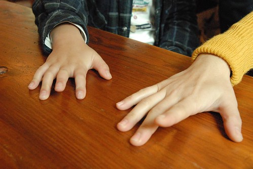 很快地 我們的移山倒海就送上桌嚕! 兩年再見移山倒海 我們依然驚嚇於那鋪滿滿的草莓氣勢 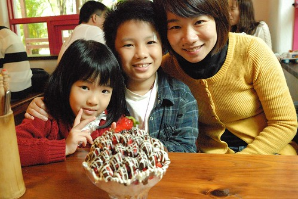 趕緊照張動工前的照片後 我們每人一手叉一手匙 開始大快朵頤起來 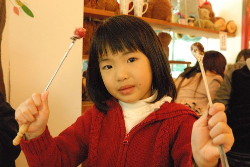 叉插果 匙舀冰 一起入口 口口都是滿足! 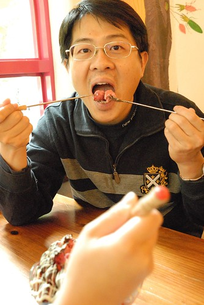 要不然用著湯匙同時舀起草莓+冰淇淋 或是冰淇淋+香蕉也可以 反正就是讓巧克力味 草莓味 香蕉味 煉乳味...在口中排山倒海而來 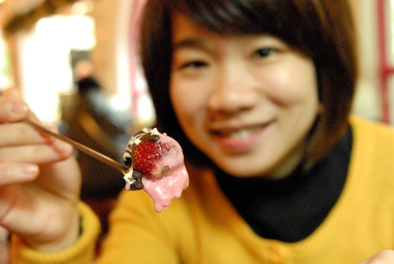 酷愛草莓的兄妹倆就不用說了 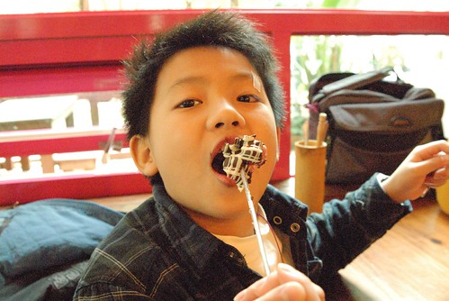 嘴巴張大大一口接一口不停歇  尤其愛愛 挽起衣袖一付準備大戰一番的模樣與氣勢 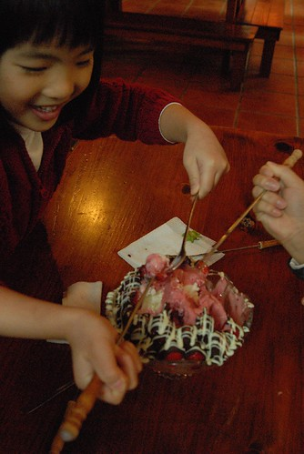 說大戰 真的一點也不誇張!   瞧~ 愛愛多認真 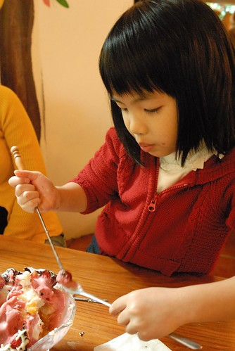 多賣力阿! (看的出來媽媽有多驚嚇吧) 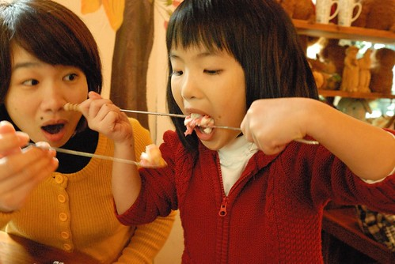 最後碗底剩下的玉米片 融化的冰淇淋液 也一絲一毫都不放過 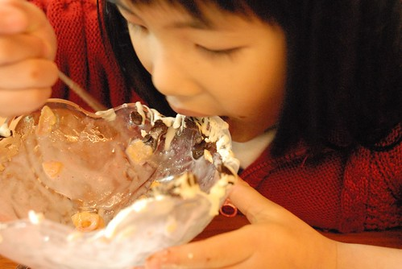 直到盤底一乾二淨  喝杯白開水簌簌口  這場大戰方結束  只是中午12點一家人來了這麼一大碗的移山倒海後 中餐顯得尷尬了.... 以致我們直到下午兩點才感覺肚子餓 然後只能去SEVEN買泡麵當中餐 我笑說原本中餐預算被挪去吃移山倒海了 所以要簡單點省著點 不過很少吃泡麵的愛愛好開心 她又可以吃她喜歡的泡麵嚕 而且還是指定的玟姿阿姨買的那種口味......................... 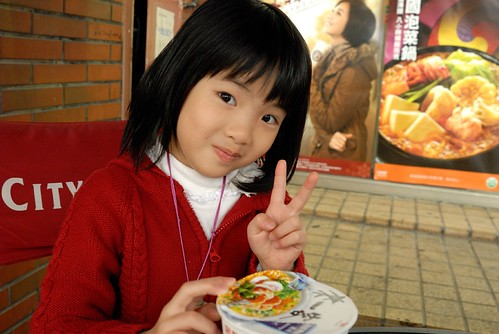 ps 因為兩年前就來過巧克力雲莊少了新鮮感  所以吃完冰後我們只在園區內散步個10分鐘便離去 雖然莊園不若兩年前那樣給人份愜意感 價錢也越來越不親民了 但我想 有機會的話我還是會想再去吃移山倒海吧! 尤其是看到愛愛那樣滿足的模樣...
