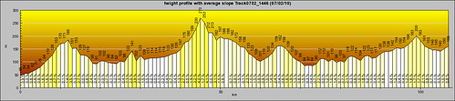

以前每次在花東看到路上賣力騎單車環島的人  我們都會在車內笑喊"加油" 雖然嘴巴笑著他們傻 但我想我跟徹爸心裡是羨慕他們的 "單車環島"-- 現在很流行的自我挑戰方式  可是對我們來講是個短時間內很難去實現的夢想 曾經徹爸對著他兒子說"等你小學畢業我一定要帶你去環島" 也曾經徹爸跟我說"等阿徹小三小四我要帶他去參加洄瀾兩百" (我相信徹爸是真有這念頭的)

曾經有一天徹爸開心的跟我說 他看到一本書在講分段環島的 然後兩人興沖沖的買回來看 看著書裡的介紹 雖然羨慕歸羨慕  但作者每日近乎70-100公里的騎程還是讓人感覺好遙遠的夢想 而想不到真有這麼一天 (徹爸四天中常忍不住這樣喊著) 而且是出乎我們意外的來的快 我們一家四口騎著三台車在花蓮的台九上  縣193上 從壽豐到玉里短短的90K  卻是我們家的大突破大創舉... 徹爸說騎車分兩種"吃吃喝喝團"跟"競速團"  而我們家兩者都不是 我想我們依然是"徹家式的團"  只不過是多了另種方式跟不同體驗

(前後四天的時間 總共騎了100K多一些 爬升高度250M) 

出發前的一周 我跟徹爸每天都有或大或小的事情得準備著 從攜帶物品清單的列表 後兩天衣物的寄送 最後各種防曬/盥洗/醫藥/衣物/工具的整理 車子的檢查保養... 因為行李全得靠單車跟揹包所以得盡量精準精簡  加上帶小孩出門該有的各種準備/預防又不可少 光整理準備每晚就耗費我跟徹爸不少時間跟心力 每晚我們倆總忍不住互揶對方"真是涯給...真是瘋了..."

(模擬後貨架的狀況) 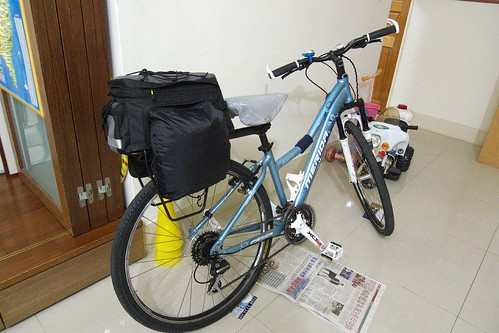

忙了& 緊張了一周 總算在7/2早上八點我們帶著大包小包的行李跟車子出發往花蓮嚕 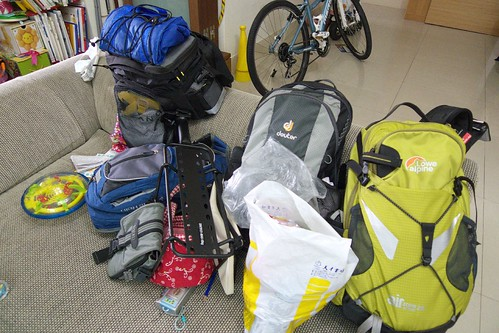

12點多抵達花蓮時看到這樣的藍天白雲心情一整個的High了起來 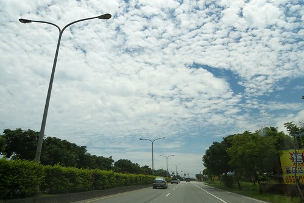

我們先去最愛的鵝肉先生吃中餐  吃了豐盛又超飽的一餐以迎接接下來不知道會怎樣的日子.. 考量了停車 回程火車載運 以及單車牽運等的問題  我們從壽豐火車站開始我們的行程 在壽豐火車站附近尋覓了好一會稍微陰涼的地方停好車後  我們開始行頭上身準備出發嚕~ 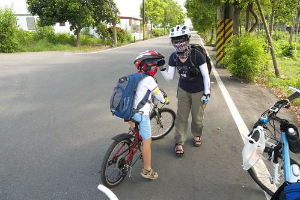

原本是要走台九到鳳林的  但幸運的遇到一個路過問候我們的阿嬤給我們指引了附近的鄉間小道 於是我們得以繞經壽豐環鎮車道再切往台九線 在這裡意外的看到即將收割如黃金般的黃澄澄稻穗 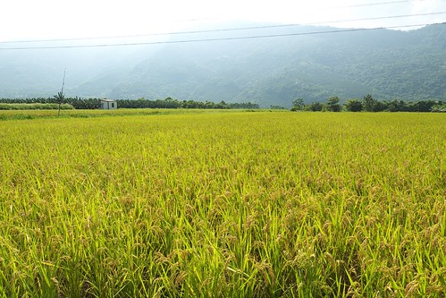

第一次看到稻穗的我們好開心 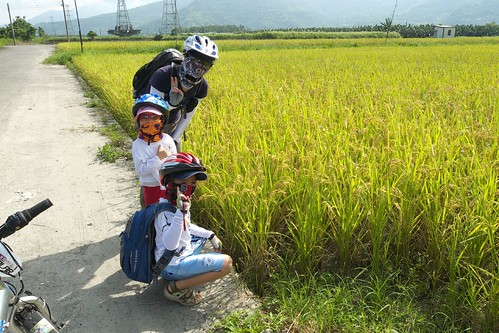

切回台九後挑戰似乎才正式的開始 首要挑戰的便是阿徹得忍受一旁呼嘯而過的車輛且習慣於大馬路邊騎車 雖然第一天才短短10K的路程 可是車子+裝備+人的身子都未最佳狀態 所以騎的小累... 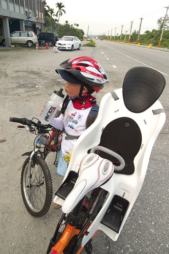

第一天原本最佳的安排應該騎個20km左右的 可是為了達成許阿徹的承諾讓他每天都能泡到湯 因此今晚的落腳地選擇兆豐農場附近的樟之園民宿 (本來想住兆豐的可是竟然3-4週前就訂不到房間了) 花1個半小時騎了10KM 看到農場的乳牛就表示今日我們可以收工嚕... 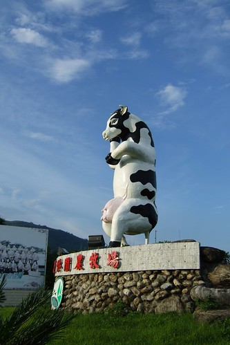

4點民宿check-in 進房納涼休息到5點多 一家子再散步一公里多去兆豐農場泡湯 (因為徹爸搞錯以為農場的大門口就在乳牛旁  行前GPS定位時還一直說人家地圖弄錯 說民宿就在農場旁 地圖上說的一公里多是錯的) 我說開車出門根本不可能走這樣的一段路   今日這樣的騎+走搭配別有一番樂趣 尤其泡完湯後微風徐徐加上滿天星空  散步是件很棒的享受 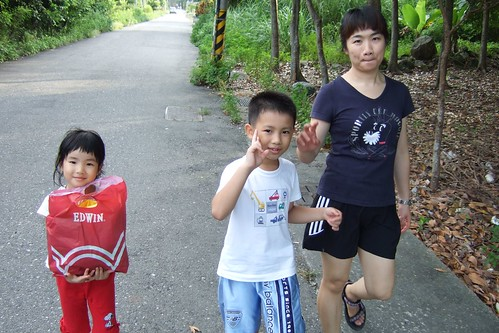

不同於白日的高溫熾熱 傍晚過後的池畔很涼爽很愜意 我跟阿徹說 今天的泡湯是讓你來充電的 希望你泡一泡冷冷身子後明天變的好勇猛啊 

泡完湯後因為附近沒有什麼晚餐選擇  只好去7-11"餐廳"解決我們的晚餐 這是阿徹跟小愛第一次吃seven的熟食/便當 而且還是在seven裡面吃的  兄妹倆可開心的哩 國民便當/水餃+沖泡式味增湯吃得津津有味 直嚷著好吃好吃 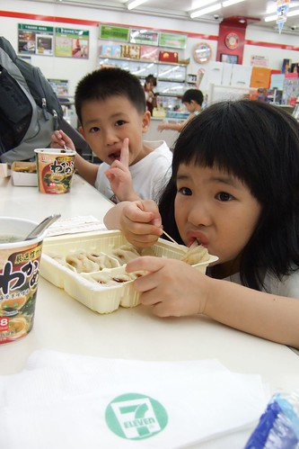

吃飽飯回到民宿準備好隔日的行李後 晚上9點一家子就早早上床睡覺了 第二天早上六點多起床盥洗吃完早餐 七點準時出發上路 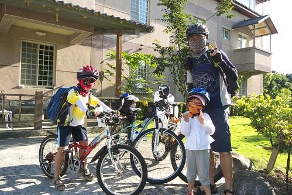

兆豐農場位於鳳林的最北端 所以得走一段台九後切往鄉道再切往線193 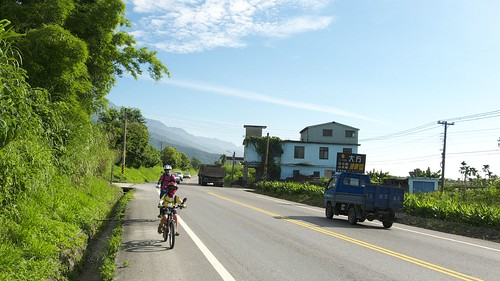

徹爸精心規畫了避開車潮/人潮 且又筆直又秀麗的鄉道走 (可是不是最佳捷徑) 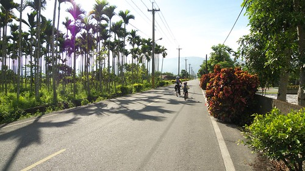

而且有美麗的藍天白雲伴著我們 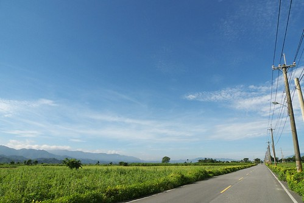

藍天白雲美麗歸美麗可是很曬人的哩... 所以四個人的墨鏡 領巾 排汗衣全都上了 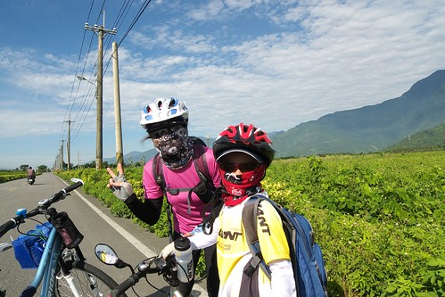

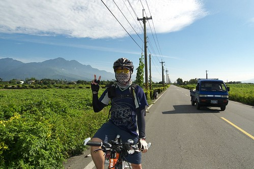

以前旅遊的重點都在北花蓮或是南花蓮  鳳林鎮幾乎就只是路過或是偶而的覓食點 今早騎經鄉間小路以及環鎮自行車道才第一次體會到這裡原來也有著像南花蓮那樣的純樸景致啊 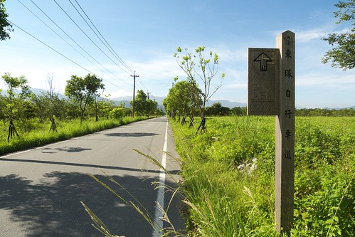

途中經過頗負典故的箭英大橋   好長的一座橋啊 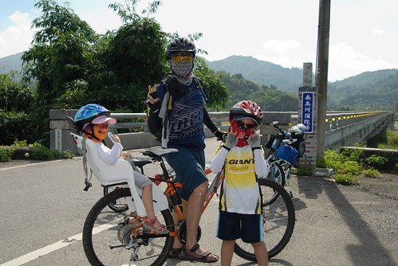

所有的行程中 我跟徹爸輪流前後帶路或是押車 把阿徹夾在我們的中間 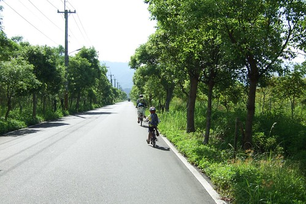

繞過大半個鳳林我們總算抵達轉往縣193的路口了 我們是向右轉 往光復方向的喔 

我跟徹爸(尤其是徹爸)嚮往了193好久 今日總算有機會踏著單車在這條路上了 只是...好個起伏 好個山路啊... 這樣的路況對徹爸來說絕對不是問題 就算練腳力的載了愛愛也不會是問題 可是阿徹的小短腿跟小20吋車子就有點吃力了 所以阿徹不行的時候就"自然"的下車用牽的了 而負責押車的人就也得下車陪牽了 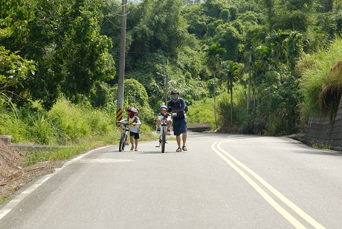

才剛進入193就是這樣的路況讓人感覺不甚樂觀 但此時還傻傻分不清的阿徹還笑得出來 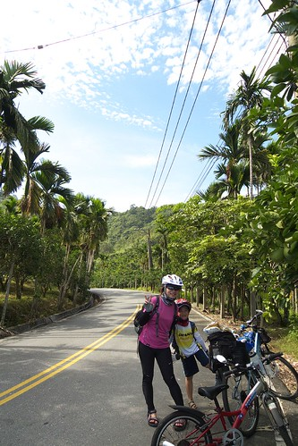

每段吃力的爬坡之後便會停留個一兩分鐘讓阿徹還有我自己喘一下 休息的時候躲在樹蔭下看看這好野好厲害的雲  然後喝個水再繼續往前衝... 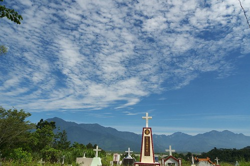

偶而徹爸助阿徹個一臂之力   (我們家的爸爸真是勇猛啊) 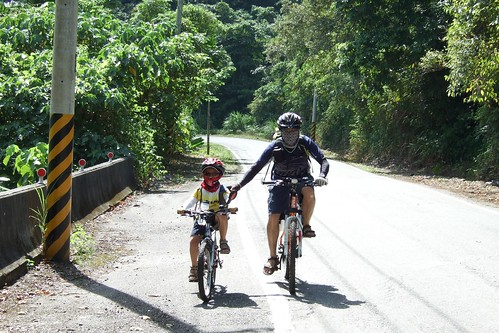

但大半的時候還是得要靠阿徹自己的努力啊 

爬完高度表中的第一跟第二高峰(呈現像U字型)中間的兩個小高峰後  阿徹開始喊吃不消 而徹爸看著高度表上之後最高峰的連續爬坡路段也明白這樣下去不是辦法 於是我們考慮著從光復切出去走台九 此時遇到了我們在今日193中唯一遇到的兩位車友伯伯  車友伯伯熱切的給阿徹加油打氣 徹爸剛好趁機詢問對方 "接下來之後的路況如何 是否還有像一開始那樣的連續爬坡" "有經驗"的車友伯伯說  "接下來還好啦 不會有像之前那樣的大爬坡啦 " 徹爸又問 "可是看地圖上好像還有大爬坡  我怕小孩會吃不消 所以考慮轉走台九" "有經驗"的車友伯伯一臉打氣鼓勵的樣子說 "不會啦  自強外役那段的坡很小 沒有什麼坡度..之類的話" 於是我們仿若溺水抓到木板似的相信了有經驗"的車友伯伯的話  繼續我們的193路線

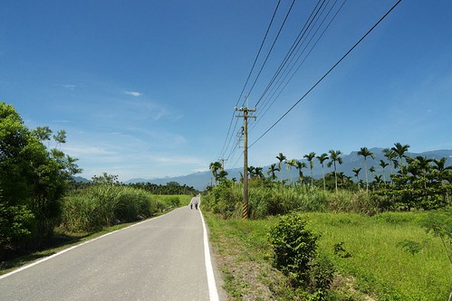

所以接下來 我們還是依照原定計畫在光復的太巴塱國小休息吃中餐  這時候上午10點半 ( 因為193上沒有任何的7-11或商店 這些食物都是早上在鳳林買的然後用保溫袋裝好載著 ) 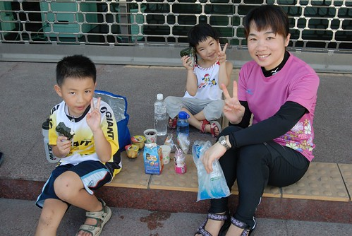

往國小的路上徹爸稍微迷路了一下  幸好路過的郵差伯伯指引了我們往國小的路 徹爸問郵差伯伯"請問太巴塑國小怎麼走"  郵差伯伯說"是太巴塱..前面然後左轉就是了" 哈哈 徹爸塑 塱傻傻分不清 被郵差伯伯笑了 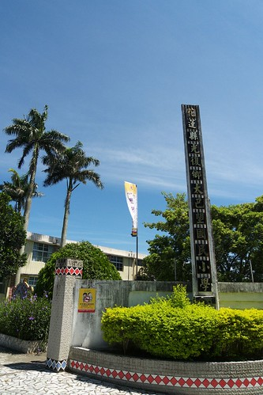

後來接近校門口時 郵差伯伯看到我們便又停下來關心我們有沒有找到 然後還介紹了一下太巴塱國小 原來這裡是很多職棒選手的發源地阿 像王光輝 黃忠義..都曾經是這裡的學生 都是在這的棒球場練球長大的 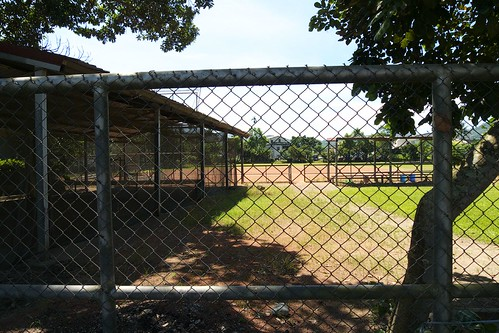

原本是想要進到校園的走廊下休息的  可惜今天(7/3)是小學的結業式 害羞的小學生阿徹直說著"我們不要進去了啦"   最後只好在小學對面的郵局門口席地休息而已 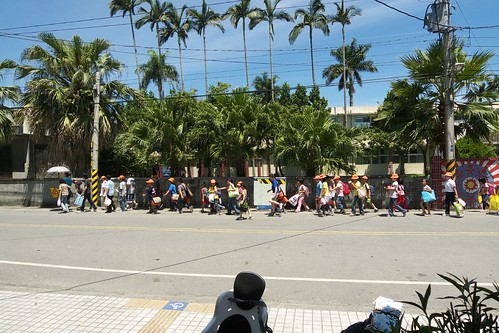

休息了半小時 該吃的吃 該尿的尿了後 我們又繼續上路了... 結果才又繼續193的路段很快就在往最高點的連續爬坡段上啊!!! 爬了半小時多 阿徹快不行了 徹爸說"以後問路不可以問那種看起來看厲害的車友 在他們眼裡這些爬坡都不算什麼" 嗚嗚嗚....可是對我們這一家婦小來講 真是給他很有什麼哩 我笑徹爸說 誰叫你寧可相信陌生人的話也不要相信地圖告訴你的... 所以現在只能想辦法彌補而已 想辦法切往台九了 只是不管怎麼樣還是都得爬過這個最高點哩....天啊!!! 不過起碼過了這最高點後 我們還有機會在第二高點開始爬坡前切往台九 

這時候阿徹已經快不行了  爬坡後的休息時間越拉越長 而且自己靜悄悄的就這樣跨趴在自己的車上 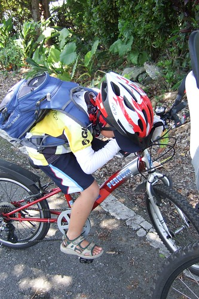

徹說:  我好累..我要騎大馬路的路...不是說要切往大馬路的路上嗎 徹爸說: "因為剛剛的伯伯說不會很爬 所以我們才走的啊  再讓我看到那兩個 我要殺了他們" (看到哥哥虛弱的樣子 小愛拼命的要我拿她的"維他命"Pinky給哥哥吃  我說哥哥吃這也沒效了) 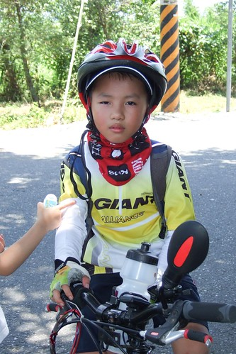

安慰阿徹 過了這個最大的爬坡就沒有了 性好小子沒有摔車 還是相信阿爸阿母的話傻傻繼續努力 

可是最後的高點路段沿路沒有遮陰處 加上此時又是正中午12點  熱! 熱! 熱啊!!! 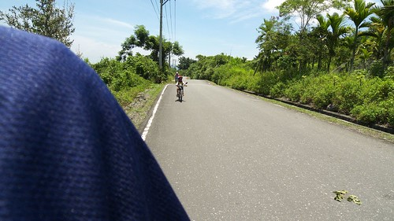

徹爸碼表上的溫度顯示44度  我說這溫度計應該熱壞了吧!!! 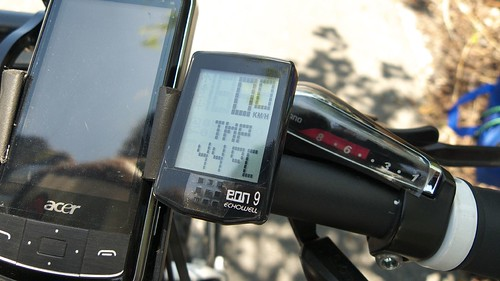

此時前後不著村又沒有樹蔭  往來車輛少到3根手指頭數的清 真的會覺得我們是瘋子爸媽才會帶小孩來這裡 這時候看到一條小小但卻超筆直仿若一條溜滑梯般的小道指引往台九 我跟徹爸好想就這樣一路給他滑下去啊 那一定很爽... 不過保守的我們決定還事先撐過這最後最痛苦的一段後 再依照GPS的指引由加禮灣切往台九 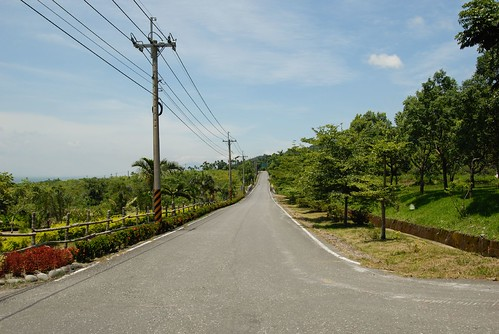

幸好此時我們的綠洲出現了 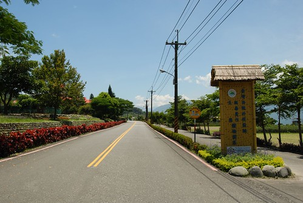

花蓮自強外役外的一座稻草涼亭對於此時的我們來講就仿若沙漠裡的綠洲啊 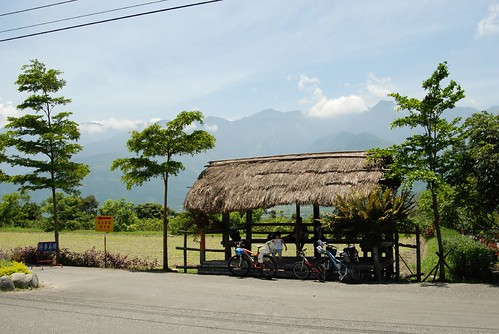

趕緊躲進涼亭裡降溫休息一下 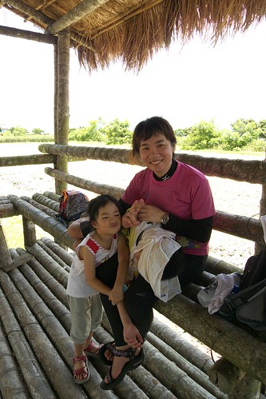

且涼亭旁還有山泉水水龍頭  讓我們可以弄濕毛巾敷在累到躺在我腿上的阿徹臉上 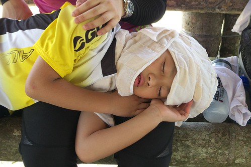

在抵達自強外役前 看著阿徹拖著沉重疲憊的腳步 賣力的牽著車走上他騎不上去的坡段時 陪走的我真的會擔心他熱到中暑倒下了 老實講 如果沒有這涼亭的休息 會發生什麼事真的不知道... 所以我們衷心的感謝 自強外役這樣貼心的涼亭設置啊 這回的193騎乘 徹爸最大的感想便是 應該要有更多的涼亭設置 193風景真的很美 可是沿途沒有任何涼亭的設置 沒有任何的補給點   這樣很難吸引更多的人來騎乘 這樣的美麗風景不該只是這樣限制給那些單車高手跟洄瀾挑戰的眾好手 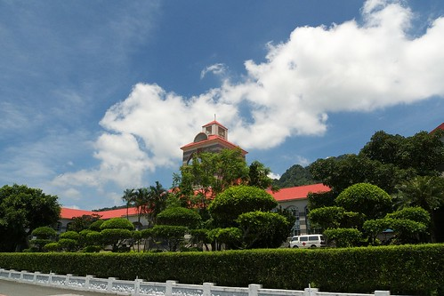

休息約莫半小時  阿徹降溫了會笑了 我們便又起身繼續上路 (不是我們苦毒小孩 是阿徹自己說休息夠了 要再上路了) 果然爬坡是為了下坡  所以過了自強外役後便是很長一段滑的很過癮的下坡路段 只是滑得太開心 一不小心就錯過了我們原本要轉出的加禮灣路口 等到徹爸發現時 我們又得賣力回頭騎一小段爬坡路  (阿徹忍不住念起徹爸讓他又得辛苦牽車了) 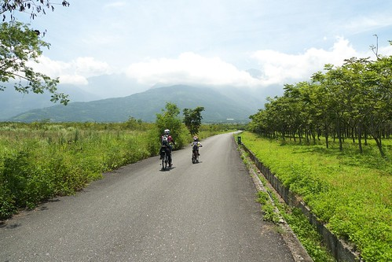

不過從加禮灣切往台九的鄉道沿途真是好美麗啊  (這是意外的收穫) 加上涼爽的微風以及微下坡的平緩路段 讓我們一掃剛剛的熾熱疲累 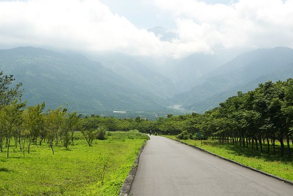

回到台九後 雖然太陽烈很多 汽車呼嘯而過的風塵也多很多 但是平緩的起伏好騎多了 總算明白為什麼環島的人都是走台九而不是193了   193真的操啊 

照片中對面山頭正中央的紅色建築物就是剛剛我們快死掉的自強外役 吼~ 原來我們還真騎在山裡勒  還真爬得有點高哩 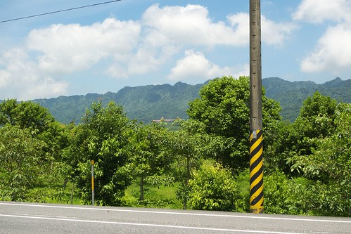

騎過193再來騎台九的阿徹開始如魚得水了  沿途沒有停歇的很快便抵達瑞穗 途中還經過了我們二月初才住過的靜蘆 多看了好多眼 進入瑞穗市中心前我們也總算看到從早上7點後再也沒看到過的seven 所以不管怎樣也要進去晃一晃喝飲料吹涼一下的嚕 進到seven後的阿徹完全不顯疲態了   喝著他最近很愛的檸檬紅茶 店內到處晃蕩 在這裡遇到了兩團環島團  果然7-11是單車族出門在外的好朋友好地方啊 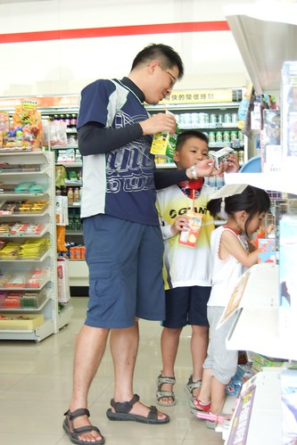

休息了半小時 我們決定再頂著烈陽撐個2-30分鐘趕快去我們今日落腳處 途經瑞穗外環道路前往瑞穗溫泉區 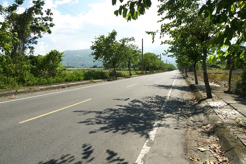

在seven不小心開心的冰冰涼涼吃太多害的這短短一段路又騎得有點痛苦了 體會了徹爸說的 喝太多流越多汗身體負擔越大的不舒服 為了等會的冷氣房要堅持到最後阿................. (徹爸對於下張照片的註解: 原來女生包一包之後都會變正妹阿 ) 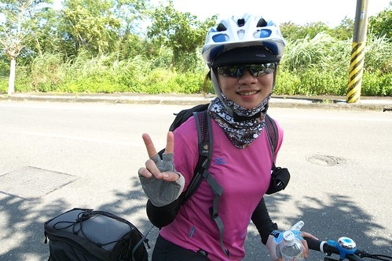

轉進長滿柚子的柚園裡 我們今日的目的地就快到了 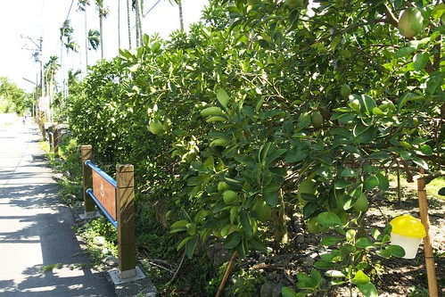

到了到了 下午三點鐘我們抵達我們今晚的落腳處  今日可以收工嚕! OHYA 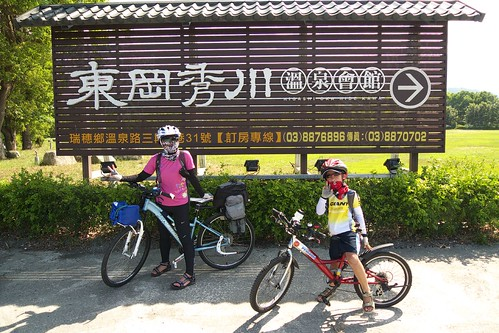

check-in時 小姐看著狼狽的我們搖著頭說"這種天氣騎車你們真厲害 他光站在外面就受不了" 所以趕緊進房沖涼 吹冷氣 吃冰嚕 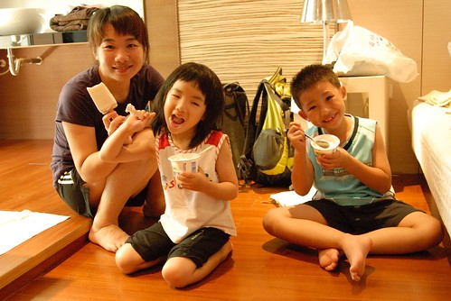

然後再小睡個片刻 泡湯泡腳去 (吼~媽媽的臉明顯的因為脫水而看起來瘦了) 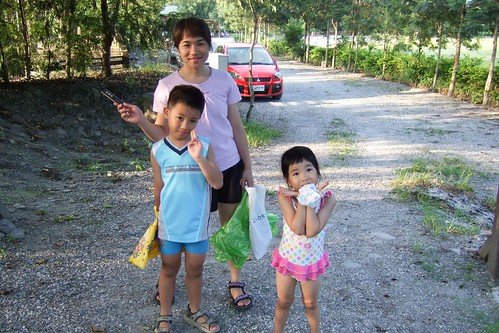

經過一天的曝曬 我們四個人的腳都成了斑馬腳   不過防曬油塗的比較缸夫的我跟愛愛狀況好些 騎乘之後的溫泉剛好舒緩鎮壓我們疲勞的雙腿  明日便又會是一雙好腿 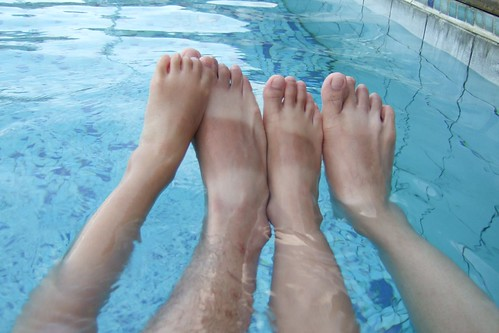

距離民宿最近的吃飯地點在1-2公里以外  我跟阿徹是完全不想再騎車了(而且沒有車燈) 幸好民宿工作人員好心的借我們Moto (不過不可以四貼 所以徹爸還是得騎車 ) 讓我們得以騎著ㄅㄨㄅㄨ去有名的綠精靈吃好吃牛奶鍋/養生羊肉爐鍋 瑞穗的溫泉 晚餐徹底的安慰了我們今日的疲勞 而隔天早上民宿配合提早提供的早餐及香濃的牛奶更給了我們第三日滿滿的精力啊 OH~ 忍不住想要高喊 "我愛瑞穗" (我們此行中唯一的一張全家福 謝謝民宿工作人員熱心主動的幫忙) 

早上八點我們開始今日的行程 今日目標193瑞穗到玉里段 途中經過昨晚讓我們飽餐一頓的綠精靈 真的是綠啊... 

一樣在seven補給好以及徹爸找了家機車行把有點鬆落的坐椅架調緊後  頂著烈陽努力往193前進 

(途中看到下面這個招牌 徹爸好樂 ) 

經過瑞穗泛舟中心當然得來張難得的地標照 機車行老闆說今日有上萬人來瑞穗泛舟喔...果然暑假熱季到了阿... 

瑞穗大橋 

過了瑞穗大橋後便開始是193的路段 雖然還是上上下下起起伏伏  但是對我們來說這已經可以算是小兒科了啦 哇哈哈!!! 

而且這段路沿路的風光又跟前一日不一樣了 視線所及盡是藍藍的天 美麗的山 豐收的稻田 

雖然每個爬坡段後都得小憩個1-2分鐘  但是能躲在涼爽樹蔭下欣賞著這樣的美景 幸福滿溢 

這段路深刻的讓人體會到人家說的"台灣用騎的最美" 用騎的感受真的跟以往開車而過的感受完全不一樣 道路不再只是一個"路過的道路"而是一個可以慢慢享受的"景點" 

美麗的花蓮縣道193 

今日預計32公里的路程中可以經過三個國小 原本預定要在2/3路程左右的最後一個國小休息用餐的 可是今日很勇猛的阿徹說 他想一口氣到安通  於是想休息的遜腳阿母還是得努力往前衝啦 

我偶而騎在後頭  拿出相機照照阿徹跟徹爸的背影 (上坡路段我就沒法騎後頭了 因為體力不佳的我得騎在前面照著自己的節奏才能上坡) 

南花蓮的收割期大約會比北花蓮早個一個月左右 所以越往玉里的方向越多的稻田已收割 

但是這樣的美景還是很讚 

阿徹小愛在這尿尿時 忍不住笑她們說 會不會哪天你吃到的飯有你尿尿的味道啊 

這就是193的景緻 

當初就是因為在Google Map上看到這樣的景緻讓我跟徹爸如此嚮往不已 然後有今日的傻勁 

感謝徹爸這次的路程策劃 安排 讓我們一家子得以一起在這樣美麗的道路上共騎 經過這幾天我跟徹爸說"你可以準備去參加今年的洄瀾200了 我相信你可以的..." 

193的美麗還不止這樣.. 接近台九的路段仿若阿勃勒黃金道路 

阿勃勒豐盈 鮮亮的盛開著  又更讓人讚嘆真是美麗的一條路啊 

哈~ 此行的第二張全家福 

平均時速12公里的情況下  大約11點半多我們抵達193的終點 

要跟這美麗的道路說再見了... 雖然這回沒能照預計的完成從壽豐到玉里的路段有點小遺憾 但是我相信有一天我們一定可以再四個人一起挑戰193全線的 

接著我們經過台九轉往玉長公路往今日的下榻地 安通溫泉邁進(連中餐都還沒吃就準備要下榻了 哈哈) 

最後往安通溫泉的連續上坡路段是今日的最硬處 但是小子今日很High 很猛 一鼓作氣的衝上去  反道是我這個媽媽爬的有點喘吁吁... 不過媽媽愛面子 所以不管怎樣也是得ㄍㄧㄥ下去 總算(但也很快啦)我們在12點初頭抵達安通  今日可以收工嚕 

不敢這麼早去問是否可以check-in  我們先在附近的土地公廟休息及吃我們的seven中餐 

等到1點時再去問櫃台小姐是否可以入房 因為前一日滿房需要點時間打掃 但是她們願意先打掃我們入住的房間盡量趕兩點前給我們 我問 附近是否有可以走走看看的地方 小姐問我 開車嗎? 我說 ㄟ..騎車 小姐睜大著眼問我 "你們就是我剛在路上看到一個小朋友加上一個爸爸載著小孩 然後媽媽騎在前面的那家人嗎"  我不好意思的點點頭 小姐說 "你們真是太厲害了 剛我在路上看到還跟我女兒說那小男生好厲害 給他加油 可是我女兒害羞不敢" 真素不好意思 我們竟然也成了開車人口中厲害的人物了 呵呵 可能小姐真因為覺得我們很厲害很辛苦 所以很熱烈的想辦法要換房給我們(可是我拒絕了) 在一點半前就把房間整理好 讓我們可以辦理住房休息  而且在等候的時間就讓我們進去泡涼消暑 

就是這溫泉鼓勵著阿徹這兩天努力的踩啊踩啊 

入房後沖個涼然後阿徹小愛玩整下午 而我跟徹爸或躺或睡整下午 

這樣的渡假方式感覺還真愜意哩 

只是肚子很早就餓了 早早就等著5點半餐廳開門吃晚餐 吃晚餐前硬是拉著阿徹小愛去外頭散散步 

安通溪畔 

安通溫泉外觀 

吃完晚餐再泡了個舒服的冷湯  今晚又是一夜好眠  然後早晨在陽光中舒醒賴床 

吃完早餐整裝待畢  八點我們又要出門下山往玉里車站方向前進了 

沿路下滑到台九線上 

等著過馬路前來一張 

我們走玉里鐵馬車道往玉里車站 

早上八點多 車道上就已經很曬啊!!! 

只是風景又真的有美麗 

舊鐵橋以及後方的彩虹玉里大橋 

後方紅色鐵橋是新的鐵道 襯著黃色稻穗是很美麗的地標 

不道40分鐘的時間我們便抵達玉里車站 準備搭9點39分莒光號往壽豐 

我們搭的是兩鐵環保列車 也就是單車不用套車套 直接放在貨櫃車廂 車子跟小人一樣買半票 

所有的資訊跟辦理都是徹爸搞定的 再次感謝我們家的爸爸 

火車到達前10分鐘 我們由一般旅客進出的入口進入準備搭車去 第一次牽著車走在火車站月台感覺還挺屌的 哈哈 

只是火車放的地方果然如我跟徹爸所預言的單純只是個貨廂 沒有任何保護/固定腳踏車的地方 讓我們沿路擔心單車傾倒 除了這點缺點外 雙鐵的運輸方式感覺還真不錯說 

除了可以沿途欣賞美景 

一家子又可以一起開開心心的說說笑笑 (父子女三人在比賽鬥雞眼) 

一小時又二十分鐘的時間我們便抵達壽豐站 (短短的路程我們花了4天時間騎乘 哈哈) 出了火車站後我們便又先前往車站附近的豐春冰菓店吃冰 (店裡的傳統製冰機) 

好吃的甘蔗冰..到這算是正式結束我們此行的單車行 

把單車架好在小紅上後 回台北前我們又去了立川漁場摸蛤 然後下午2點半多帶著滿滿的疲勞與收穫 我們驅車離開花蓮了 

(北宜高的路上又幸運的看到這樣的大景  ) 

晚上七點回到家門  完成我們此行花蓮100K挑戰 !!! 
