這幾年的夏天裡固定會有 沙灘玩沙 自來水博物館戲水的行程 但今年的夏天不知忙怎樣的忙到 還是說不小心的忽略到遲遲沒去做這兩件清涼的事 阿徹沒吵著要去水博物館戲水 倒是一直唸著今年夏天還沒去海邊玩沙哩  尤其開學後.. 總算在九月的最後一個週六實踐了對他的承諾 帶他去思思念念的外澳沙灘 而這兩週的秋意讓我忍不住竊喜 幸好那天去了...  應該算是有抓住夏天的尾巴吧! 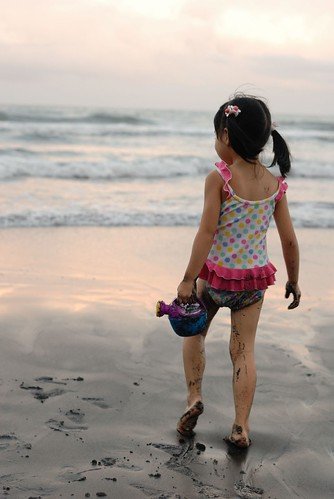

輕裝簡便的週六下午四點半 我們走在外澳沙灘外圍的步道上 在車裡換好泳衣的阿徹跟愛愛 心早已跑到遠處的沙灘上了 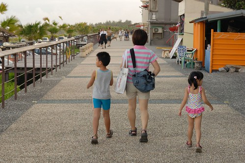 

兩人來到沙灘後 啥也多說的就各自埋鈄苦幹起來 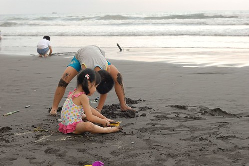

今天的浪不算小 潮間帶很寬 所以兩人的工作範圍也很大 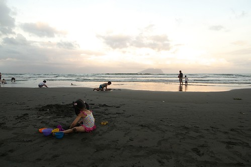

而我跟徹爸則是有備而來  拿下車上兩把小摺疊椅 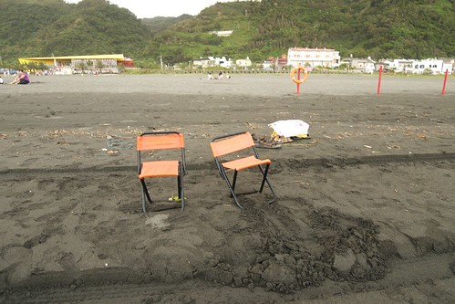

打算好好愜意的看著大海以及小孩 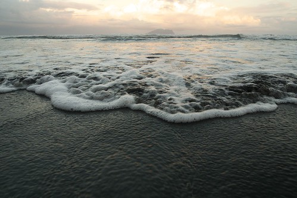

厚厚的雲壟罩在遠方龜山島上頭 有點詭異的氣氛... 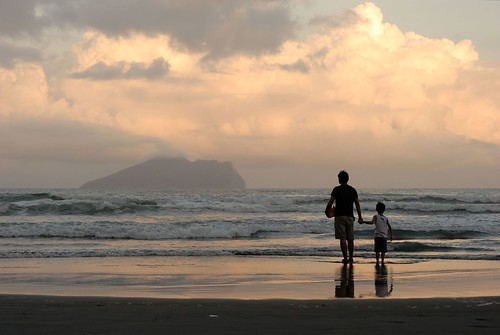

阿徹雄心壯志的想要做個攔沙壩 只可惜一次次的潮起潮落 瞎忙一場 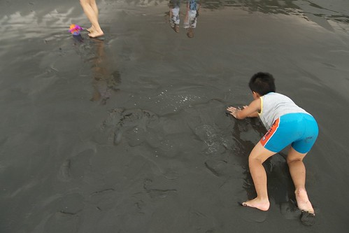

而小愛則不貪心的陶醉在自己堆沙 舀水的樂趣中 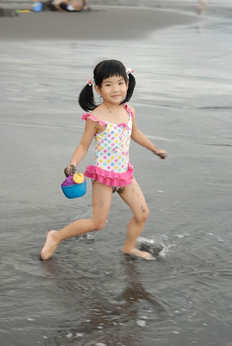

或許是自己童年玩樂的經驗值太少  所以總想盡自己可及的能力盡量豐富小孩的生活體驗 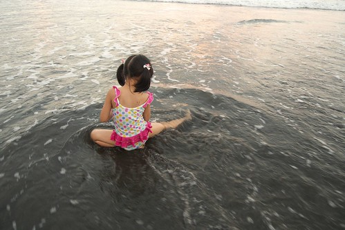

而海邊的戲沙是我認為很重要的夏日生活體驗之一 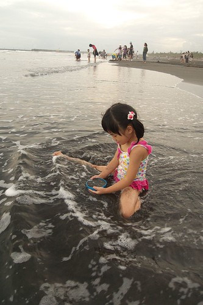

不怕髒 不怕浪 不怕風吹日曬的玩樂訓練及享受 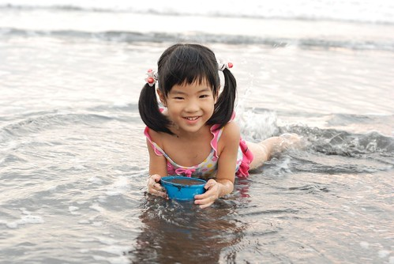

尤其看著孩子一年一年的大膽 但同時卻也益加的懂得照顧自己 讓人更是確信這些的重要 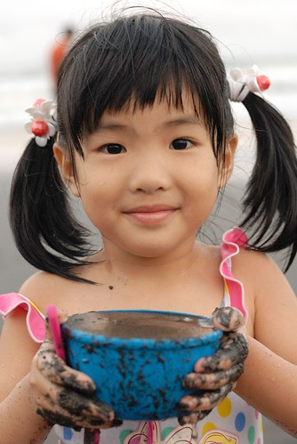

就像沙灘上愛愛一路走過的小腳印  凡走過必留下痕跡... 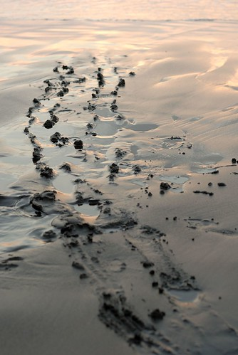

哇~ 真覺得家裡的小女兒越來越曼妙 漸漸脫胎變成一個小女生了ㄋ 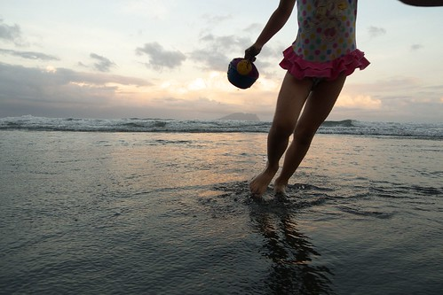

至於阿徹則是越來越強壯的陽光男了 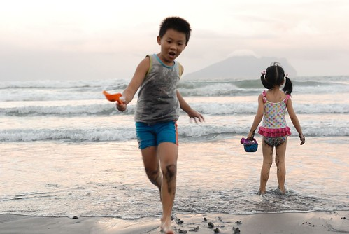

真好! 這樣的一個傍晚~  Summer, I catch you!  See you next year!!! 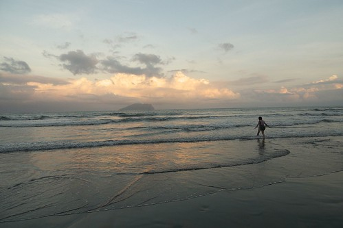
