\- 徹爸的同事剛好在我們出發的第一天打電話找徹爸 聽到我們在花蓮他說"又去花蓮..." - 徹媽以前的同事說 在我寫這次的遊記前應該先把上回花蓮(去年六月)的遊記補完 ㄘㄟ~ 真虧四號小姐還記得我這兩三年的遊記都沒寫完 還掛念著這事 (大感恩)

是的~ 我們又去花東了 不過這回的重點在台東 是的~ 這幾年大旅行的遊記好像都沒寫完 好多照片都沒好好的show一下 所以這回要改變策略 先來篇總述大回顧(好像在寫論文喔) 每個景點都先帶過 印象深刻或是想好好紀錄下來的地方再專文另述 這樣子寫遊記的壓力應該小一些 就算沒寫完遺憾也會少一些吧!!!

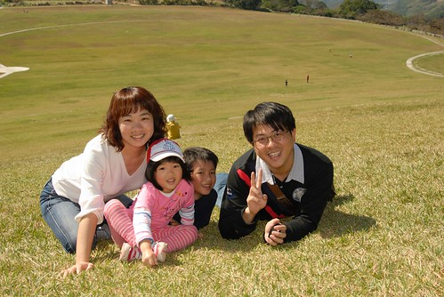

先分享一下這回的最終行程  這次的重點是花海 溫泉以及自行車

1/30 (六):　台北－＞花蓮市陳紀狀元粥舖　公正包子－＞瑞穗北回歸線紀念公園－＞ 台九線286.5公里玉溪農會畫布－＞宿安通溫泉飯店 1/31 (日) :　安通－＞台九線310公里富里鄉農會畫布－＞（池上鄉）台東客家文物館－＞ 池上大坡池環圳車道－＞萬安稻米原鄉館－＞大地飯店米冰淇淋－＞ （海端鄉）宿南橫霧鹿天龍飯店 2/1 (一) :　 南橫霧鹿－＞（鹿野鄉）鹿野高台－＞愛嬌姨茶餐－＞龍田自行車道－＞ 宿布農部落－＞（卑南鄉）原生應用植物園 2/2 (二) :　 布農部落－＞（關山鎮）關山環鎮自行車道－＞關山親水公園－＞（花蓮）瑞穗牧場－＞ 紅葉溫泉－＞宿靜廬生態渡假別墅 2/3 (三) :　 靜廬－＞光復糖廠　馬太鞍自行車道－＞鳳林肉園　三立冰淇淋－＞台北

+++++++++++++++++++++++++++++++++++++++++++++++++++++++++++++++++++++++++++++++++ 

那一天早上9點從台北出發 約12點半抵達花蓮市  第一站去了徹爸看旅遊書欽點的陳記狀元粥舖

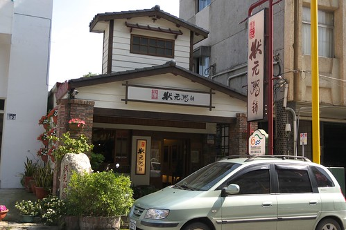

整家店非常的雅致 小菜粥品湯品也都很不錯  只是價格上也頗有名店風範

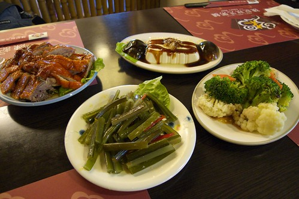

青菜豆腐湯雖然好喝到阿徹捧起完吸光 但是一碗要價80元還真的挺貴的 全部兩碗粥一盤炒飯一碗湯加上四盤小菜就得600多  算是一頓好吃但沒有飽足感的第一餐

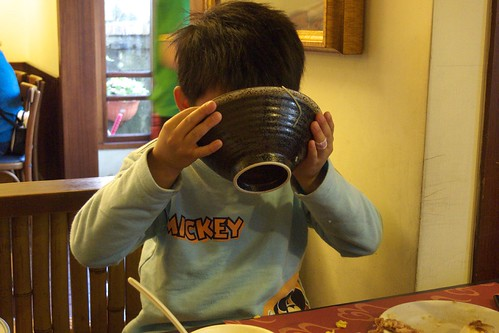

而對大人來說雖然夠味好吃 但是配有哇撒米醬料或是辣椒口味的小菜都完全不是愛愛的菜

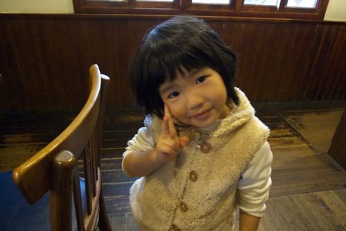

接著又去買了幾顆名號響鐺鐺的公正包子繼續填飽肚子 這幾年每年都來花蓮1-2趟 但是還真沒去吃過公正包子的說 嘴"材"的我們果然還是無法體會這名包子的美味  不難吃但也說不出特好吃

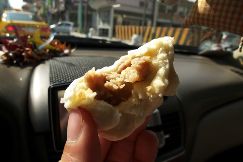

此行的重點在台東 所以第一天的2/3時間都在開車趕著抵達位處花蓮南段的安通 但沿途留意著行前特別印出的花東縱谷花海長廊景觀規劃表上的花田地點 每到接近的標示花田地點總是睜大眼睛期待花海的出現

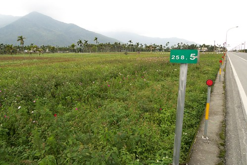

只是從壽豐 鳳榮 光豐 瑞穗鄉/地區一路下來 真是令人大失所望阿 如果不是花田真的很稀疏零散 那應該就是我們已經錯過花海盛開的時間點了吧

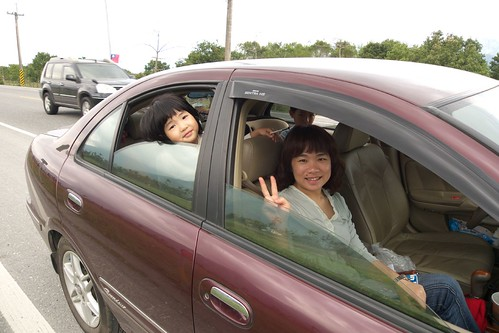

(阿徹帶著的笛子還真沒事就拿出來吹吹 車上吹 賞花吹 草原上也吹...) 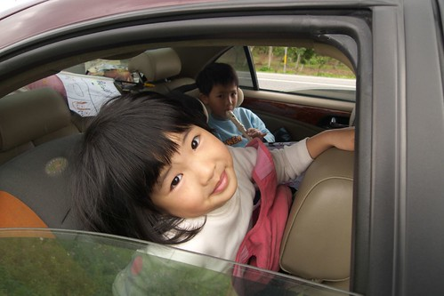

因為花蓮北段的花況太慘烈讓人根本不想停車拍照 離開花蓮市後只有在瑞穗的北回歸線紀念公園稍做停留休息

(瞧~愛愛這張的馬賽克打的多好) 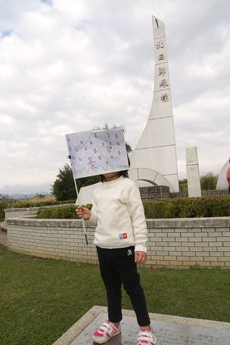

這回阿徹小愛依舊拿著我們的台灣黑熊隊旗出門 不過只有在第一天時頭興興會拿下車 後來慘遭淹沒在她們後座的垃圾堆中

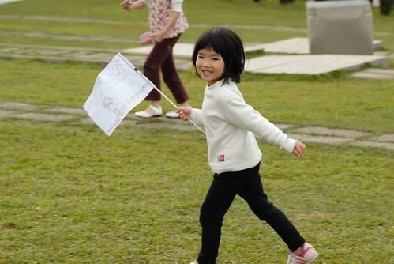

舞鶴的北回歸線紀念公園每回去台東時都會經過但卻很少停留 (附帶一提花東的山線比海線好走多了 徹爸形容海線的危險度比蘇花公路還高)

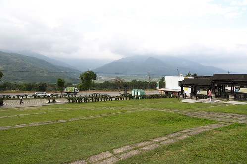

這回我們難得的好好在這吹吹風 拍拍照

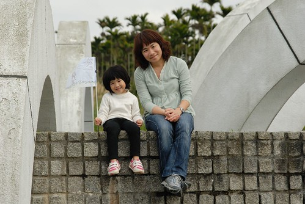

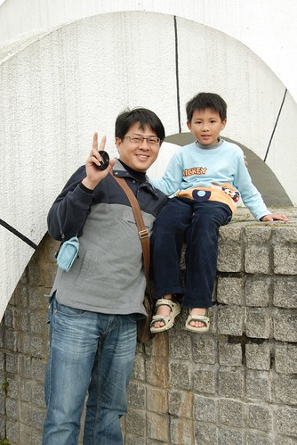

兄妹倆到哪都玩很大  跟屁蟲小愛總是跟在阿徹哥哥身邊找樂子

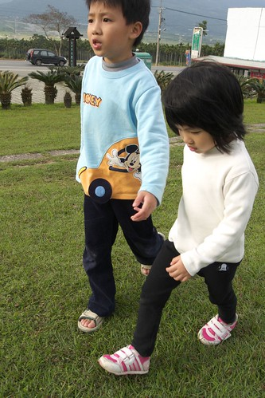

這幾年花海景觀的重點好像都在於畫布(圖騰) 今年花東沿線規劃有玉溪地區 富里鄉  池上鄉 關山鎮四個地區的畫布 這是我們看到的第一個 玉溪地區畫布

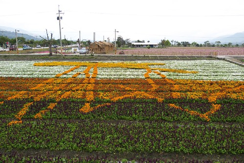

記得3年前的一月中我們來台東賞油菜花時 完全沒有這類的畫布 但是進入玉里地區後卻驚艷於接連不斷 一畦畦的油菜花或是波斯菊花田 老實講我比較愛以前的原始味 這類的畫布美歸美卻泛不起心中一絲的感動

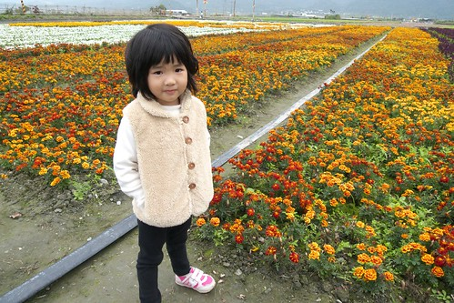

阿徹小愛看到這些可以看但卻不能碰的花田 看幾眼哇個一兩聲後就算是完成賞花 然後開始想辦法找樂子

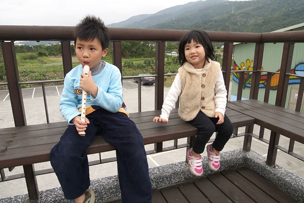

因為沿途賞花的時間比原本預期的要少很多 所以我們在四點左右便抵達我們第一晚的下榻地-安通溫泉 安通溫泉位於玉里 富里一帶算是南花蓮了 附近有有名的六十石山以及赤科山金針花區 照片中是已經有7-80年歷史的日式溫泉建築  不過現在純作為古蹟參觀而已

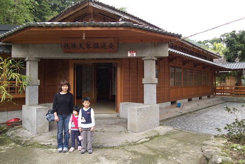

房客住的都是新館

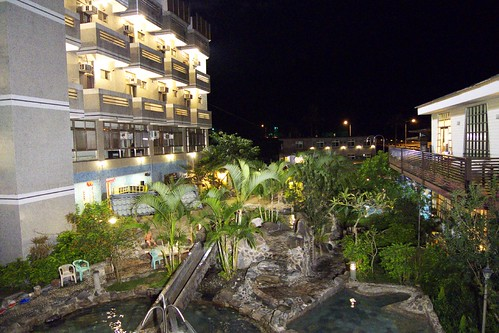

用石頭堆砌而成的泡湯池別有一番風味 加上溜滑梯讓阿徹小愛玩的不逸樂呼 (這池算是小孩池 另頭還有更大更深的三各大人池)

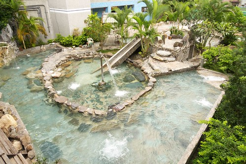

我們住的是雅緻雙人房 除了房內還有一個泡湯缸外 這也是唯一看到可以加床的雙人房 被分配到的房間兩面採光 通風涼快 感覺整齊又清爽

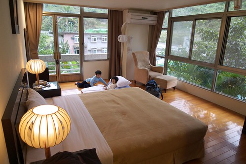

趁著天還沒黑 換泳裝泡溫泉去嚕 據說安通的碳酸溫泉有美人湯之稱喔

噹~ 泡完湯有變身成為小美女了嗎?

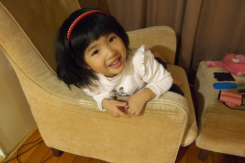

這樣ㄋ? 氣質有沒有更美女些?

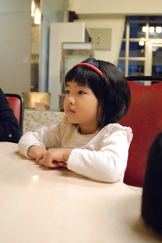

五天中有些等待零星時間 阿徹打發的方式便是用爸爸的PDA玩些小遊戲 幸好中毒不太深  該跑該跳該享受大自然的時候還是有給她用力去玩

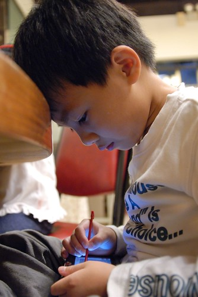

泡完湯有沒有變美女不知道 但肚子肯定是超餓的 菜都還沒上上來就忍不住大口大口扒飯  安通飯店的菜很好吃喔 3菜(炒鹿肉+糖醋魚+青菜)1湯(金針湯)也只要660 也算是平易的價錢

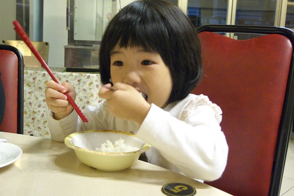

第二天早上吃完早餐也稍微逛了逛飯店的環山歨道後 我們繼續起身往南前進 離開安通不到半小時就抵達富里鄉農會的畫布區 主題是綠野仙蹤 看的出這幾個就是書中五個主角嗎

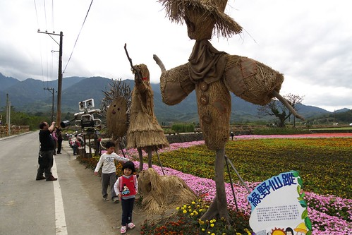

因為停車場在後方 所以當大家從後頭走來第一個看到機器人都會大喊 瓦力耶(不只我們 其他遊客也一樣) 等往前紛紛看到其他用稻草人做的造型人物及標示 (這才是重點)才明白原來是綠野仙蹤啦

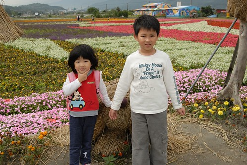

以前在電視上看到這些花海新聞覺得還蠻漂亮壯闊的 但這回親身至於其中 老實講蠻失望的 一來因為這些花近看其實蠻沒生命力的  再者畫布看起來都覺得差不多 才看了第二張畫布我就不想看了 我比較想看我記憶中一大片黃澄澄的油菜花田啦

這些畫布都由當地農會策劃 地點也都在農會或輾米場附近 因此我們也順道買了些富麗米還有金針花當單路

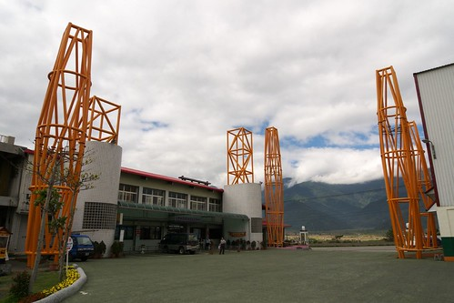

現在農會都把當地的特產包裝的蠻漂亮的 蠻適合拿來送人的 不過自己吃的話就還是把這些包裝費給省下來唄

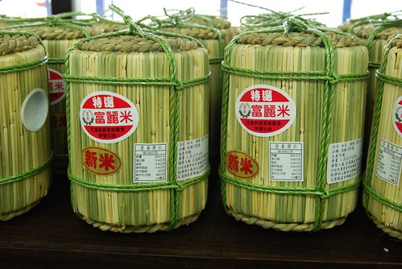

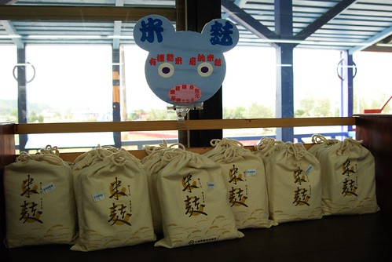

往南前進到富里後才總算可以看見比較旺盛且片連一大片的油菜花田

因為想要高照上面那片花田 我跟徹爸兩人會錯意的來到富里火車站 買了三張月台票進月台溜搭賞花(果然如徹爸說的 跟站台人員說一聲就可以不用買票了)

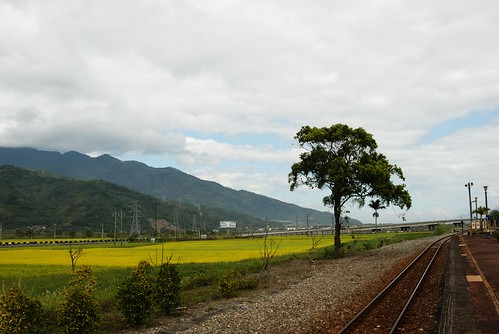

雖然因為某些樹的遮擋 花田的FU看起來不若我們一開始所想像的那樣美好 但是在火車站內瞎晃了10幾分鐘也還是挺愜意的

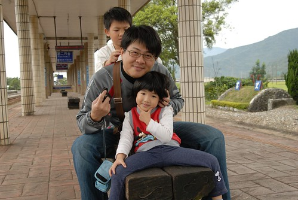

只是本來滿心期待能照到從這方向來的火車竟令我們失望的出現在另一邊

(明明太陽不大可是媽媽的眼睛卻因為臉腫到張不開 真是慘...) 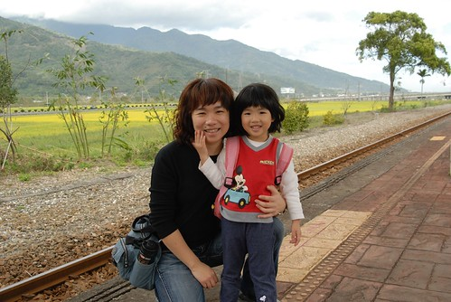

中午時分抵達原本是此行賞花的重點 也是最令我們期待的池上花海區 只是..只是...往年舉辦的會場竟然不見油菜花田... (三年前遊記請見 [blog.yam.com/hmchen1975/article/7887891](http://blog.yam.com/hmchen1975/article/7887891)) 順著花海指標被帶到的是台東縣客家文化園區 感覺的出這是新落成的館

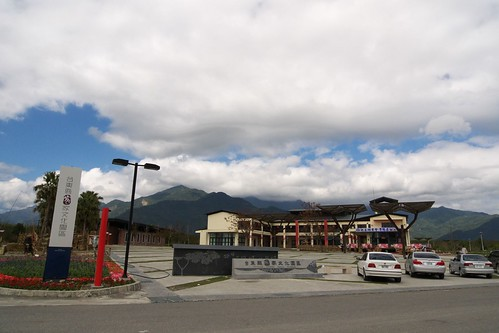

而今年池上的花海區坐落於此 只是沒有油菜花 取而代之的是一樣的畫布(對我來講真的都差不多) 我的心真的都快碎了... 嗚...........那ㄟ阿ㄋㄟ........... 本來完全不想下車的 但是我們還是下車5分鐘照了張相就走了 (你看~連愛愛也不喜歡 不想拍照阿)

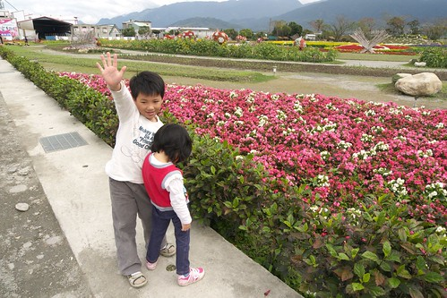

原本對於池上的花海抱予超高度的期望的 想不到最後竟是失望的有點落荒而逃的樣子 離開傷心地 我們便回到池上的街上找腳踏車出租店騎車去 池上大坡池環圳車道這幾年還蠻有名氣的 看到網路上人家照的照片我跟徹爸嚮往不已 只是真的來騎的人應該不多吧 因為街上的腳踏車出租店很少 而我們去的大地飯店出租部 車子可選擇的很少 車況亦不太佳 幸好最後我們三人都有適合且還不太難騎的車可騎 而妹妹當然就是坐媽媽的後座嚕

大坡池沒有想像中來的美(我應該真是愛之深責之切阿) 但坐在湖畔望著遠方青山白雲還是極度爽快  (我真覺得只有在花東才有這樣的享受)

自行車道的路況也不算優 但在不冷不熱微風徐徐的天氣騎車 尤其人煙稀少加上沿途青山綠田相伴 我還是只能說讚~推啦!

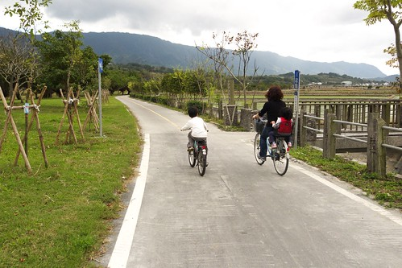

騎了快一小時我們總算抵達我們今日中餐的預定地: 萬安村稻米原鄉館

(詳細點的介紹見三年前遊記: [blog.yam.com/hmchen1975/article/8104198](http://blog.yam.com/hmchen1975/article/8104198) ) 很開心這館還在而且願意供餐給我們(已經一點半且館內沒有任何客人 跟三年前一樣的冷清) 坐在二樓用餐 一樣的餐桌 一樣的窗台

一樣美麗的稻田景色 一樣的讓人怡然自然

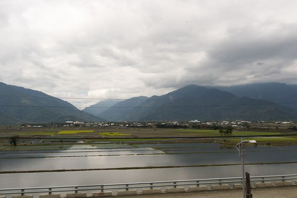

一樣豐盛好吃的餐點

我很高興阿徹似乎跟我一樣喜歡這裡 望著這一畦畦的稻田以及館內掛的稻穗成熟隨風飄舞的照片 讓我心裡又忍不住發願 以後一定要再稻穗成熟時再來一趟這裡 且在這裡的民宿好好住上一宿

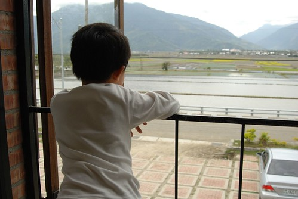

飯後我們再訪萬安磚窯場 (這也跟印象中一樣的荒涼)

在這媽媽教了阿徹認識鬼針草這玩意 接下來的幾天只好深受阿徹的鬼針草攻擊

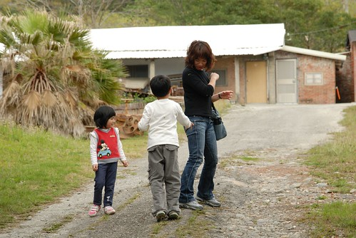

離開萬安 我們決定走伯朗大道回到池上大圳 因為坐在原鄉館吃飯時望見這筆直的伯朗大道 讓人忍不住想改變路線 一探究竟 筆直的田間小道騎起來很過癮  兩旁的田野風光更是讓人大呼值得

尤其還有這耶穌的光~  天ㄚ! 真是太美太棒了~ (好了 點到為止了 敬請期待專文介紹/讚嘆)

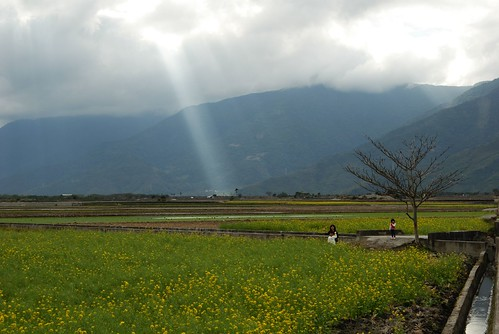

四點鐘左右我們回到大地飯店還腳踏車也吃了招牌米冰淇淋  結束豐富的池上半日遊

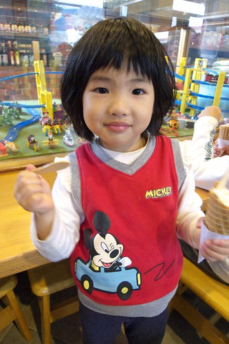

第二晚的下榻地是位處南橫的天龍飯店(雖在南橫但是從池上過去約莫4-50分鐘的車程而已) 會來住這最主要的原因是要來泡霧鹿溫泉

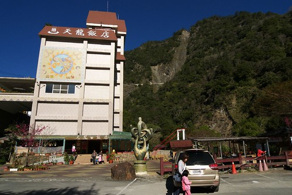

天龍飯店最有名的就是飯店旁火紅紅的天龍吊橋 橫跨兩座山頭間 給他有長有恐怖阿....膽小的我們走不到1/3便決定回頭了

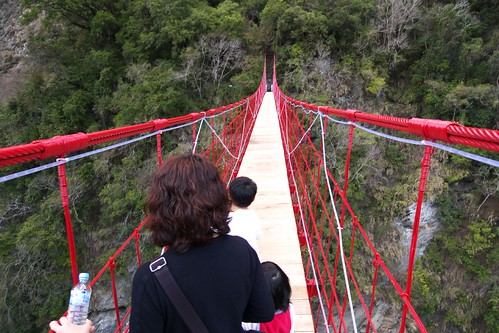

雖然吊橋不敢走 但是泡湯還是泡的很爽快 而晚上飯店的晚會活動(其實就是搗麻吉+卡拉OK大賽)也讓阿徹玩的很開心 念小學後越來越敢嘗試新事務的阿徹竟然出乎我們意外的自己舉手第一個上台搗麻吉(爸爸陪著上) 後來又要我跟小愛跟她再去一次

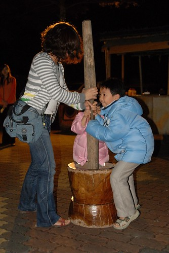

甚至在看了其他遊客勇猛的搗了60下後 又給她超積極認真的衝上台去自個的搗了第三次 事後大夥吃著搗好的麻吉時 阿徹吃了好多個還一直呼著"好好吃 好好吃喔"

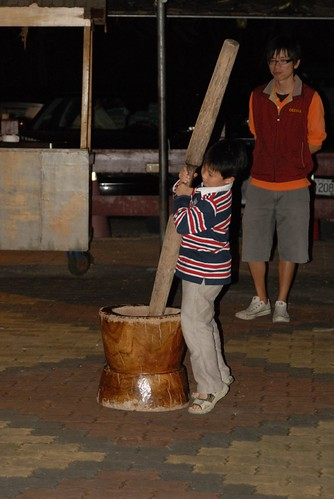

第二天早餐時徹爸從飯店梯間的窗戶照出去的吊橋 實在美的讓人腳軟

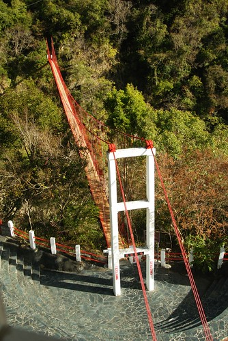

阿徹前一晚搗麻吉的勇氣可能尚未消退 竟然提出要去走吊橋 於是在徹爸陪同下真的走完全程 而愛愛在看了哥哥走完吊橋後的得意開心樣 竟也提出要去走吊橋 因此我們一家四個人都很棒的走過天龍吊橋了喔~

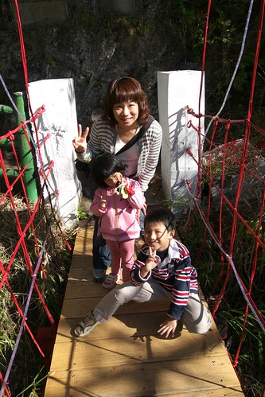

南橫的天空一如徹媽大二暑假南橫縱走時的藍到爆 而沿途的景緻也依舊原始美麗 若不是因為八八水災重創南橫的西半段 我本來真考慮要從南橫過到台東的 沒關係~ 以後有機會一定穿過南橫再來天龍飯店住一宿

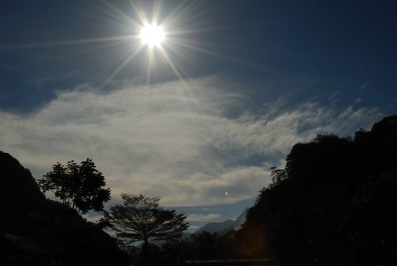

離開霧鹿很快的在10點半多就抵達鹿野高台   結果太陽烈阿!!!! 讓人忍不住懷疑這是夏天嗎?

(照片正中央的那小黑點不是髒點是阿徹喔) 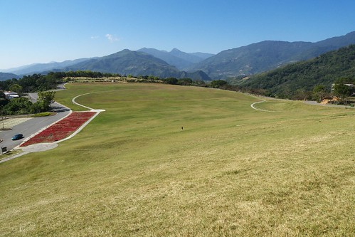

會再來鹿野高台最主要的原因當然是想來滑草 (請見97年遊記 [blog.yam.com/hmchen1975/article/15135854](http://blog.yam.com/hmchen1975/article/15135854)) 可是可是.....竟然沒有滑草機....沒有滑草可以玩........天阿.......情何以堪阿.......... 百般不願不開心的 阿徹只好吹泡泡找樂子  不過能在這樣遼闊的地方吹泡泡也是一大快樂阿!

然後阿徹還拔了一堆鬼針草(在上面那個小黑點的地方)射可憐的媽 這樣上下跑了兩趟下來 阿徹流汗了也黑了

不只阿徹 我們一家子都因為這上午的烈陽而黑了

那天的太陽雖然很大很烈 但是微風徐徐很舒服  尤其在沒有太陽照的涼亭下真是適合睡一場午覺 阿徹小愛兄妹倆果然是我們生的 自然而然的就躺在椅上子吹風小憩

正中十二點日頭赤焰焰 該是離開覓食去了...

(我們三個人在比賽走平衡木) 

今日預計的中餐是一樣位於鹿野高台的愛嬌姨風味(茶)餐 因為旅遊書上交代得先預訂所以先打了個電話過去詢問 果然生意很好得先預訂 最後我們訂了12點40分吃第二攤的 雖然還有40分鐘得等待 但因餐廳那也是茶行  所以我們還是先過去想說泡個茶(喝免費茶)躲熱等吃飯 卻想不到餐廳停車場旁便是花東縱谷南段最大涼亭- 茗圃亭 涼亭是個二樓的原木建築 支撐二樓的數十根柱子氣勢磅礡

我們一家四口意外的獨享這寬闊的涼亭~ 老闆 整個涼亭 我們家包了啦~

阿徹跟小愛所幸脫掉鞋子 在上面跑跑跳跳 玩跳繩

而媽媽我一如往常的找個地方吹風放空 享受美景

還硬要徹爸坐在一旁來一張搞FU的影子照

眼前的便是這一攬無疑的茶園景色

時間到進餐廳 找愛嬌姨用餐嚕~

獨家蜜香紅茶飯

紅茶滷肉 免費小菜(蘿蔔 剝皮辣椒) 茶油炒棕筍 還有剝皮辣椒雞湯

以及好吃到不行的綠茶炸豆腐 這些菜色果然都跟網友寫的也及餐廳DM一模一樣 但是真的好好吃 難怪菜色百年屹立不搖 生意好到都得預約 重點是這樣一餐吃下(還有一盤龍鬚菜沒照)才550元   CP值實在很高 有機會到鹿野高台時別忘了來愛嬌姨這吃飯喝茶 (飯後我們果然喝了不少免費的愛嬌姨泡的好茶 當然也買了一些茶)

飯後本來規劃去同在鹿野的龍田村騎車的 但是太陽正烈的下午兩點去騎車大概會換來阿徹的臭臉 因此我們改變計畫先去今晚下榻的布農部落看2點的表演 (這樣隔天早上也可以早點去關山了)

部落的表演早上10點跟下午2點各有一場  之前聽玟姿阿姨說過是很令人感動的表演 所以來到布農 不論如何都該排出時間看這表演

阿徹小愛雖然有那麼一點點懼怕表演中的某些儀式但是看的很認真 (阿徹應該就是因為怕所以才抱他妹的) 看完後阿徹甚至跟我說 他覺得好感動喔~ 還問了不少有關原住民的問題

看完表演晃了一下園區 我們3點辦理進房休息到傍晚再準備去龍田騎車 阿徹不想去騎的但是我們說不管怎樣他一定要去騎  因為腳踏車是此行的重點 (哈哈~連玩都嚴格的父母) 去到龍田的阿度單車挑了車 我們直攻有名的綠色隧道 (雖然龍田以日本移民社區享名但卻都被我們省略了  期待專文另敘)

因為挑不到適合的童車 阿徹跟徹爸騎了協力車 徹爸說阿徹的腿很有力 幾乎都是他在踩的

龍田的綠色隧道主由小欖仁樹所購成 這幾年因為阿度的推廣還頗負盛名 不過徹爸一睹風采後似乎覺得也不過爾爾不是很喜愛  相機拿的意興闌珊的 反到媽媽覺得在這照相的FU挺不錯的 拿著小兩幫徹爸父女倆拍了不少濃情照片

(媽媽這趟旅行中照相技術有進步 對焦對的比較準了)

回程換我跟阿徹一起騎 享受兒子的孝順 (我只需要在前面坐享騎乘)

騎了大約一小時還完車 我們便到隔壁的龍田國小玩秋千 雖然因為五百多棵的校樹而有台東最美麗校園的美譽   但是寒假時節覺得有點倉涼冷清說

那天的晚餐我們去了徹爸指名要再去吃的原生應用植物園吃野菜涮涮鍋 晚上的園區有著別於白日的氣氛/美麗

歨入中年後我跟徹爸的戰鬥力實在越來越差 吃沒一會就飽了 但是還是覺得好吃 而且吃了野菜鍋後可以讓ㄣㄣ很順喔...............

(這張是愛愛拍的 雖然徹爸的頭被cut了些 但是覺得感覺很好 看的出來大家酒足飯飽 滿面油光的樣子) 

第四天的早上也是我們這回的重頭戲 "關山騎腳踏車" 三年前的冬天我們也來騎過 不過那時候阿徹跟小愛都是坐後頭的娃娃椅 ([blog.yam.com/hmchen1975/article/7837606](http://blog.yam.com/hmchen1975/article/7837606)) 如今阿徹已經可以獨當一面騎車了 當然一定得帶他來關山朝聖一下的嚕

這是阿徹第一次騎路況比較多變的車道 像山路似的上坡下坡 尤其其中的約末一公里的下坡路段 讓阿徹開心的哇哇大叫 雖然有上下坡但總長12公里的環鎮車道對阿徹來講絶對是小case了 他不見苦樣/疲態  輕輕鬆鬆的完成關山環鎮車道

關山環鎮車道沿途的景色多樣且宜人美麗 尤其今日沒有大太陽氣候宜人很適合騎車 在這我們又看見成片美麗黃澄澄的油菜花田(關山畫布會場我們連去也沒去了)

還有色彩繽紛的波斯菊花田

阿徹小愛沿路騎騎玩玩 很是開心

途中我們還去草莓園採草莓  就是打算採個一斤現場及晚上吃掉就好 這的草莓一斤才180 比起西部的250真是便宜太多了

草莓雖然不是很大顆 但也是又紅又甜的

愛吃草莓的小愛又吃的開心極了 (吃飯很慢的小愛 吃草莓的速度卻是最快的 一顆一口不用三秒鐘下肚)

騎完車我們買了用關山米做的悟饕便當到親水公園裏吃

騎完車下午一點肚子早已餓扁 特別覺得便當好好吃阿... 尤其那個炸雞腿又香又嫩的 真是謝謝租車小弟的熱心推薦

吃完飯徹爸還陪著阿徹小愛玩了一下一二三木頭人  (媽媽這回真的有比較認真幫徹爸照相)

兩點離開關山 我們準備離開台東往回程的方向前進嚕~ 今晚的下榻地是花蓮瑞穗的靜廬生態渡假別墅

3點多我們便抵達check in稍微休息 準備晚些再去瑞穗其他景點玩

去了瑞穗牧場  因為要去喝牛奶買牛扎糖

買了瑞穗鮮奶(爸爸說7-11不是就有賣 ㄟ...原產地的不一樣ㄇㄟ) 奶酪 蛋糕還有冰淇淋(冰淇淋感覺就不像自產的)

好吃!

好吃!!

還有駱駝跟乳牛可以看 (真的是白底黑塊點的乳牛說)

阿徹真是越來越大膽了 拼命想偷摸駝鳥

走小溪小石

短腿愛也有模學樣的偷偷去

最重要的是買牛扎糖當單路 這是我們此行唯一買單路送人的地方 (沒辦法 其他的米 金針茶啥的實在不方便送同事/小朋友分享)

這是我們第一次來瑞穗牧場 覺得整體的感覺很好 很有日本的經營用心 不論在於店舖的美觀 產品的包裝設計 都很不錯

(小愛這偽貴婦實在有夠假的) 

然後去泡民宿主人建議的紅葉溫泉   位處瑞穗溫泉區的最裡面

真的是很有歷史的一家溫泉旅館...還保留日式溫泉旅館的房間跟走廊 我跟徹爸兩人私下偷偷說 雖然很有fu但還真不敢在這過夜 昏暗的樣子感覺還真有點怪

湯池也很簡單 三個不同水溫的水池 但是因為最後只剩我們一家子四口人包場 阿徹小愛獨享一池 我跟徹爸一池  隨便玩 隨便搞笑

泡完湯回到瑞穗鎮上吃完有名的涂媽媽肉粽(全家都不愛 徹爸連相都沒照) 我們便回到民宿洗澡 吃草莓還有跟民宿小孩玩跳棋

最後一天用早餐時 陽光灑進民宿餐廳 我們倚著窗享用我們豐盛的早餐 好不愜意

我喜歡在旅行的最後一天安排像這樣舒適愜意的民宿 享受平凡自在的快樂

而每一次的民宿住宿經驗也似乎都更強化我們一家子開民宿的夢想 (講開民宿是真的有點好高騖遠 但起碼以後退休後真的想來花東住)

花蓮的天氣真的很多變 早上9點的大太陽在短短不到一小時的時間就變成大陰天 因此原本要帶阿徹去他一直思思念念的立川漁場摸蛤的計畫也只好取消 最後去了花蓮糖廠租車騎馬太鞍字行車道

這回五天中有四天可以騎車 而且都是花東有名的車道 徹爸很是開心 只是體會更多的車道後也會更感嘆大部分車道的維護不易 除了關山車道讓徹爸讚不絕口 大力推薦外  其餘的車道就都很像台灣的建設 往往在一開始用的很美也大力宣廣 但是成立後或是熱潮退去之後卻往往因為沒了用心維護而漸漸令人失望 我們真的覺得台灣很美  雖然也會嚮往一些國家的美麗景色 但踏在自己的土地上 那份親切  那種享受 貼近心裡的感動 卻是到哪都無法取代的 衷心的希望政府多花些金錢人力在真的需要的人事務上面 而身為這土地一份子的大家也都能多去用心體會台灣的好山好水  別只是嘴巴喊著愛台灣.....

愛坐車時喜歡坐前面 因為這樣子跟媽媽的互動比較多比較開心 可是因為娃娃椅在前面的車子因為車距過短  騎的人都得張開腿用著很難看的姿勢騎車 所以媽媽並不愛 這次在光復糖廠租的車 因為車距夠長讓愛愛可以如願的坐在前面  甚至可以站起來

雖然飄著雨 但是小愛卻很開心

溼地比較熱鬧的時節應該是夏天吧 兩次冬天造訪都讓人有點失望...

不過其實也就是享受鄉間騎車的樂趣 看看沿途的沒有什麼的什麼景色

但是最後因雨勢越來越大 我們只好加快速度 狼狽的騎回糖廠結束此行最後的一個自行車道 離開糖廠真的就要踏上歸途了....  往北的方向我們順道去了鳳林 尋找書上介紹的美食

首先是沒有招牌差點讓人錯過的鳳林肉園  好吃 讚! 推! 就在台九線附近 徹爸說以後去花東都可以順道過來吃吃

(店面真的就像陳媽那樣的普通店家 沒招牌又有點昏暗 難怪徹爸開過時一直念著"沒有阿 書寫錯了吧")

然後是三立冰淇淋 (光復糖廠已經被列入我們的黑名單了) 據說是由曾經在光復糖廠工作20多年的員工出來開的

(吼~ 我喜歡這個沿廊 冰淇淋加分) 

爸媽大放送 阿徹跟小愛各自一球冰 我跟徹爸共享香蕉船

冰 好吃! 讚! 大大贏過光復糖廠的冰 吃完冰一家子發冷的躲回車上 直趨回台北嚕~

這一篇總述總算寫完了  越寫越長... (看了以前的遊記 我發現我真是越來越愛寫了) 寫完總述也覺得我此行的遊記好像也都寫完了 哈! 哈!! 哈!!! (本來要帶nb回嘉義過年寫日記的計畫也取消了) 謝謝各位觀眾的收看~~~
