總算總算在上週(1/7)拿到熱騰騰的2010年桌曆嚕 今年採了美賢阿姨的建議 徹媽做了個人版的桌曆 (徹爸依然是風景版) 呵呵~ 人版的桌曆擺在辦公桌上果然更添幾許溫暖上心頭阿...

整理2009年一整年的照片 要先選出有代表性且又適合的照片是件大工程 然後還得把照片排版成桌曆的版面 又是另一艱困點 感謝徹爸最後伸出的援手  靠著他的金眼睛還有天生具有的構圖美感幫我完成人版桌曆.. 也藉著這徹愛桌曆的分享 祝福所有愛徹家的親朋好友 2010年平安健康快樂~

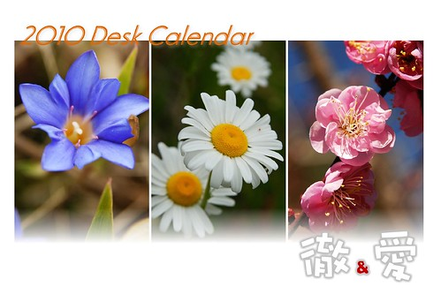

桌曆是給網路上的vow製成的 雖然效果還是不盡滿意 但是算是蠻有質感的 開箱照:

[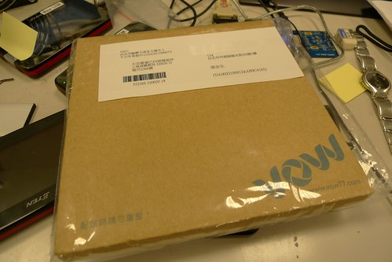](http://www.flickr.com/photos/hmchen0328/4268367908/ "P1050360")

成品: 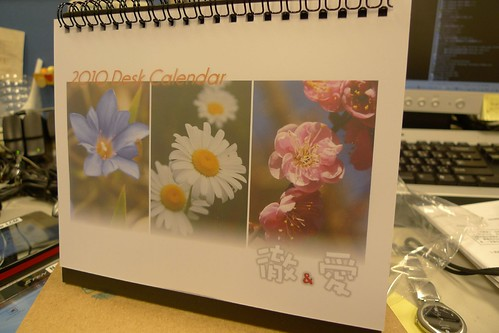

擺在徹爸雜亂的辦公桌上的模樣: 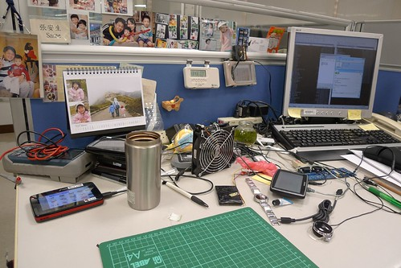

以下就是各月份選取的照片 因為是先用別的軟體排版好再套入到vow的版面中 所以直接po原始的圖檔

一月: 今年繼續努力往前走... 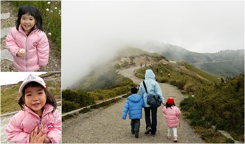

二月: 大地復甦 春意上心頭 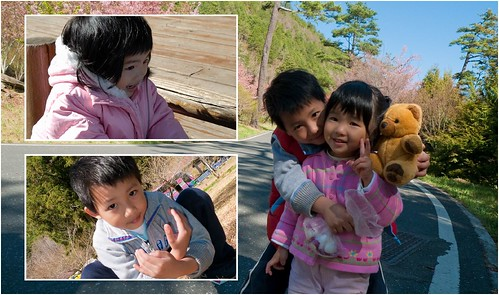

三月: 有對方真好的兄妹倆 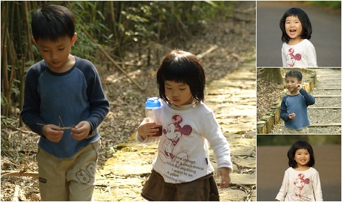

四月:今年一樣要相親相愛喔 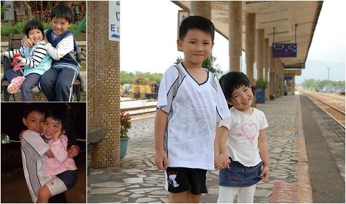

五月: 幸福美麗的月份 祝福所有天下有情人終成眷屬 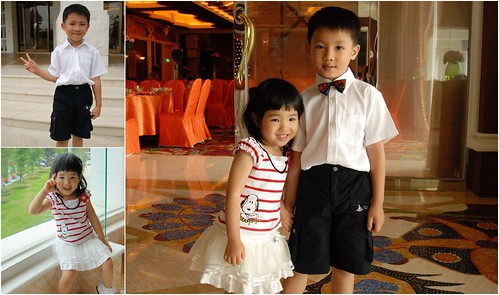

六月: 天熱了 可以去海邊嚕~ 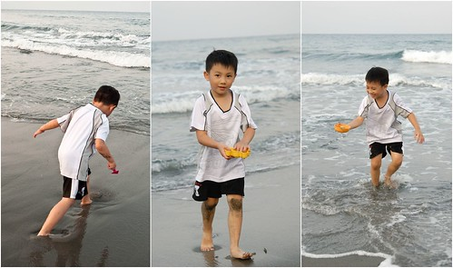

七月: 夏天就該這樣玩 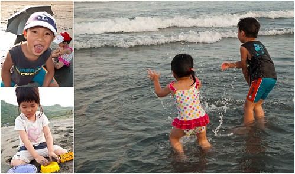

八月: 夏天繼續這樣涼爽的玩 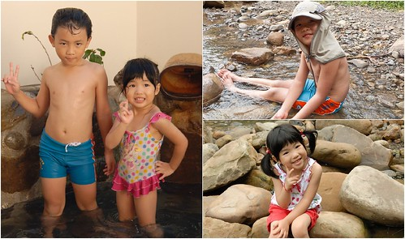

九月: 開學嚕 小學生揹起書包上學去 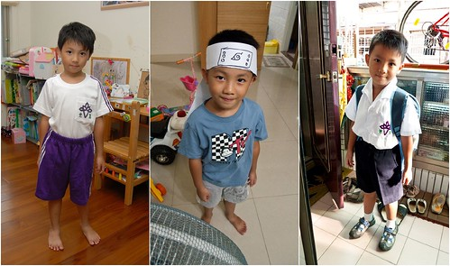

十月:秋高氣爽的秋天最適合郊遊旅行了 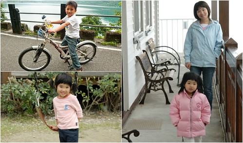

十一月: 小愛的月份 五歲嚕... 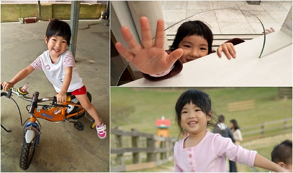

十二月:  臘梅冬雪 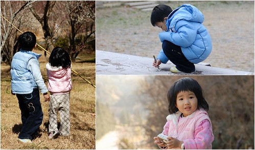
