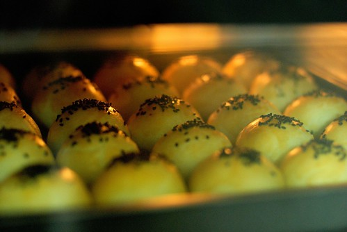
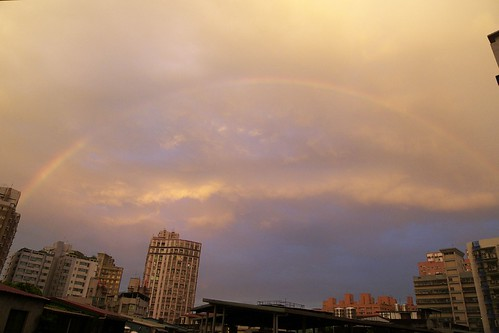

暑假兩個月咻的不知道忙什麼的就過完了 而開學後的九月是知道怎麼的 每天趕趕趕的也咻的一下過完了... 中秋節清早做了盤蛋黃酥 讓一家子感受中秋佳節的氣氛(家裡粉可憐沒有半個月餅) 吃了蛋黃酥 心裡突然踏實了起來 因為真的秋分了 真的涼爽了  真的到了我最喜愛的季節了... 

前陣子很墮落 著迷於日劇魚竿女 著迷於熱血漫畫-棒球大聯盟(兩週K了75集) 而徹爸也不遑多讓 很久沒有騎車上班了 很久沒有整理相機裡的照片了 以致於8/16號那天我拍下的彩虹直至今日才能讓我寫下些什麼以茲紀念

那天本來有點小累小煩但回到家門口準備開門時愛愛看著樓梯間的窗戶外大喊著"好奇怪顏色的天空喔" 我探出窗外一看 "哇塞 有彩虹哩" 然後母子三人興奮的跑到頂樓瞧個仔細 我說 我長這麼大從來沒有看過這麼大 這麼完整弧度的彩虹阿  更別說還是在自己家的頂樓看到的 真的是讓人High High High阿 

今日徹爸在flicker上PO了這一兩個月欠我的照片 而我也下定決心似的一口氣貼了6-7篇日記的照片 嗯~ 希望不要"草稿"太久阿 秋天~ 該是好好振作 好好做些什麼的....
