話說好久沒去武陵了 所以十月初訂了今年上山賞楓的房間 鑒於前兩年11月中上山時楓況都不鼎盛 今年刻意11月底再上山 結果所謂人算不如天算阿 今年的天氣冷的早  楓也紅的早 11月底的武陵已是一片濃濃的深秋景緻 滿地落葉阿! 所以就賞楓這事來講當然是有點令人失望了  不過武陵的高山景色與滿天星斗還是很棒的啦! 尤其這回我們還有備而來  來了趟全台最高海拔之自行車車道之旅ㄋ  

11/27一大早八點初投完票後(這輩子從沒這麼早去投過票的) 我們便趕著上山去嚕 如預期的四小時車程於中午一點抵達武陵 因為從家裡帶了壽司 水果做午餐 所以我們不若往年的先去武陵賓館用餐賞楓 我們直接先去遊客中心前的梅園野餐 一舖好野餐墊 阿徹跟小愛就迫不及待的把她們的家眷跟加斯投全擺了上去   

我說這對兄妹對於野餐這麼期待與開心 應該是因為可以帶著她們的娃一起岀門扮家家酒吧 東西沒耐心好好地吃 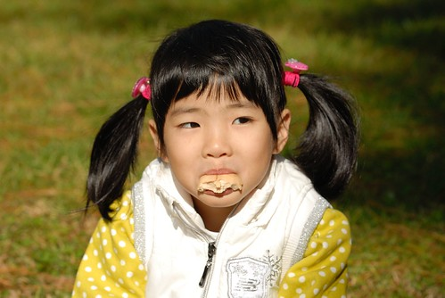

卻馬上一整個投入/忘情於她們的家庭遊戲中 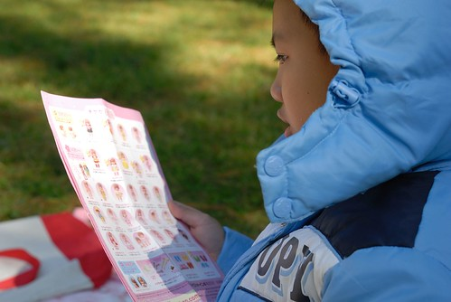

直到玩個過癮了才再好好吃個飽 然後繼續再大戰他個一回 

兄妹倆玩個過癮 徹爸也睡個過癮 (爸爸OS 這樣人家會以為爸爸岀門除了開車外就是在睡覺 有損他的形象) 

醒獅園大草坪上的大樹下是我們這幾回每上武陵的野餐唯一地點(真的成了一種習慣) 來武陵的遊客幾乎都會從旁小徑散步經過 而我們如此不顧世俗眼光 大辣辣地在此野餐 想想還真像是動物園裡逕自吃的高興玩的高興的猴子阿 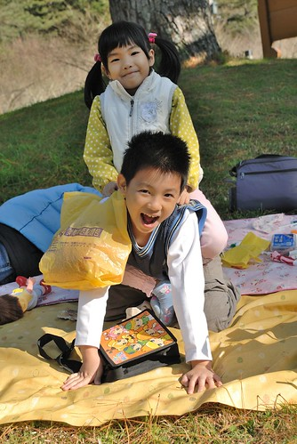

可是高山的低溫下 在這裡曬著溫暖的陽光真的是很舒服的一件事阿 而且每年每年看著相同大樹下嬉戲的阿徹小愛又不一樣又長大了 有種欣慰的感覺... 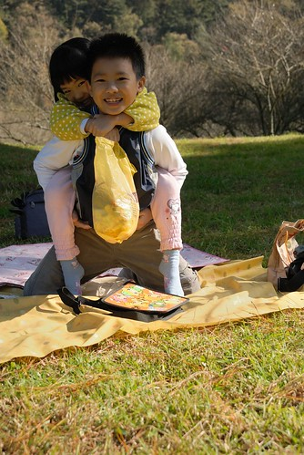

很多人很好奇爲什麼徹家這麼愛武陵 竟然連著三年上了五趟武陵 武陵到底有哪好玩? 呵呵! 其實真的也沒有什麼啦  我們真的單純就是想上武陵野餐跟看看 就像回老家看看一切是否安好一樣... 所以如果有人因著徹家的影響去了武陵但遺憾的 千萬不要怪我們喔

野餐了兩個小時 老的睡飽小的也玩夠後 我們才正式開始進行我們的"賞楓" 看到遊客中心前乾枯的楓樹 我們心底大概也明瞭今年的"楓"況應該如去年般不佳 但雖然沒有美麗的楓紅可以看 農場裡卻一整個秋意盎然阿 四處滿地的枯葉以及黃黃紅紅綠綠的樹葉 很是繽紛 (可惜行政中心旁的銀杏都掉光了　可見我們今年真是來晚了) 

尤其行政中心前的水池旁常可聽見遊客的讚嘆聲’哇　好大好美麗阿’ 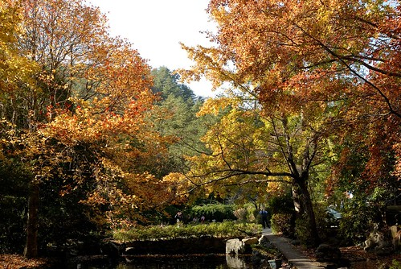

看著其他遊客使勁的拍照　我忍不住一直提醒徹爸來個一張吧 但可惜得到的回應往往是’很枯或是很逆光’　也就是很’難拍’啦(徹爸越來越常跟我講這句話了Orz) 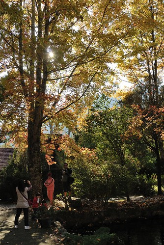

到櫻花鉤吻鮭的復育中心逛逛也是習慣了的一件事 

雖然整座農場給人的感覺本來就不擁擠　可是在這裡卻又讓我們更加感受靜謐 在這裡好像每次都會有不同的遊戲方式 上回撿松果踢松果　今日走平衡石．．． 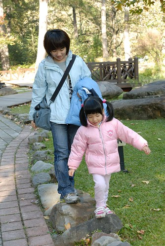

沒有美麗的楓紅可以撿　靈機一動的爸爸說那我們今年就用黃的葉子吧 

沒錯! 就是這樣的葉子　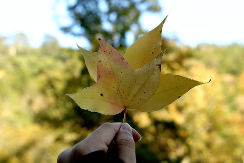

我們努力的撿(其實滿地都是隨手就可拈來啦) 

最後收成美麗的三小束’葉花’　噹噹噹~ 

然後然後我們又再把三小束捆成一大個 變變變　變成愛愛的新娘捧花了 然後兄妹倆就在假裝是新人了．．． 

又然後媽媽說"新娘子拿著捧花要這樣進場" 

一旁的愛愛看的又開心又認真　努力的要學起來 

突然 爸爸說"以後你結婚是我跟你一起進場　你挽著我的手的" 於是父女倆幸福滿益的漫步進入結婚會場(為此爸爸還得蹲身配合).. 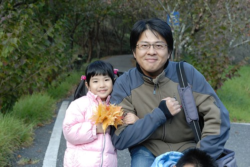

後來愛愛拿著這束葉逛園區時 竟然有年輕的美眉問'這是買的嗎?' 一臉的不相信這些全是我們撿來的...這真的有美的這麼誇張嗎?! 

結束’捧葉’的幸福鬧劇後 我們認真的朝著武陵賓館方向前進 武陵賓館後方廣場將是這回賞楓的最後一絲希望.. 沿途經過醫療站 其正對的那片山頭還真是美麗 真的很有深秋的fu 

但是賓館旁楓林小徑的楓果然也是都掉的差不多 只剩一兩顆尚有幾片殘紅 但是賓館後的廣場 顏色可就真是colorful   尤其是那鐵銹紅的誇張的二葉松 不過礙於已經五點光線不佳 加上九度的低溫已經快讓薄衣的我們冷的受不了 所以準備先窩回飯店 明日再來這好好的拍照 

之前來武陵都是住武陵賓館 曾經有農莊和室 歐洲小木屋 以及本館的套房 這回算是嚐鮮也爲了消耗徹爸員工旅遊的payeasy點數 我們'斥資'訂了武陵富野渡假村的三人套房 飯店的氣派果然不太一樣 才十一月底就處處可見濃濃的聖誕氣氛 

可是老實講我跟徹爸蠻失望的說... 除了晚上的觀星活動很方便外 其餘的不論房間暖氣設備(吹不慣的我們實在粉不舒服) 服務品質..都不甚滿意 尤其是早晚餐 雖然食物多樣化但實在不合我家胃口  坐在餐桌的空虛心靈更加思念賓館的快炒菜色阿 經過這回體驗讓我們更加篤定以後來武陵一定是住賓館的 再也不會望著上方的富野渡假村羨慕的... 不過渡假村提供的泡麵宵夜倒是很出乎我們意外 在寒冷的高山夜晚來這麼一碗熱呼呼的泡麵實在過癮  尤其滿足了我們晚餐空虛的胃 只是晚上十一點泡麵的代價是隔天的臉部水腫阿... 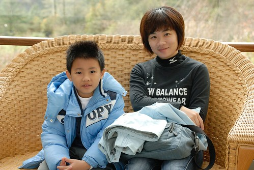

渡假村空中走廊的那幾張座椅是我們最滿意的一個角落 雖然沒直接感受到高山的風與空氣 但陽光灑進很是舒服 (順帶抱怨一下 臭愛愛有夠難睡的 讓跟她還有阿徹同床的媽媽一整夜睡不好 讓媽媽除了水腫外還泡泡眼 真慘) 

第二日早上九點多用畢早餐 退了房又要開始徹家方式的踏青嚕 今日又是個藍天白雲的好天氣阿 武陵的天氣真是棒! 

我們真的是踏青喔..'踏'著腳踏車的青... 真的 我們真的把我們的二大一小車全部的騎車傢斯頭都載上山了 為此我跟徹爸還興奮期待了很久 

總算總算我們真的騎在這美麗的高山自行車道上..夢想很久了說... 

途中經過觀魚台時是我們第一次好好的駐足在此 仔細尋找櫻花鉤吻鮭的蹤影 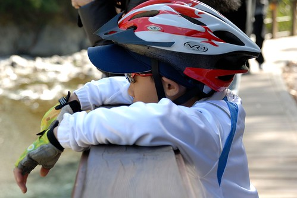

在此望眼所去 孕育國寶魚的七家彎溪 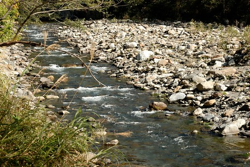

清澈見底的溪裡看見了幾條游著的櫻花鉤吻鮭  只有這樣乾淨的環境才能孕育出鉤吻鮭 

賞完了魚 接著的是一連串上上下下的路 從七月花東行後第二次騎車的阿徹想當然爾又是騎的喘噓噓 

但是有小練體力的媽媽騎的輕鬆愜意阿 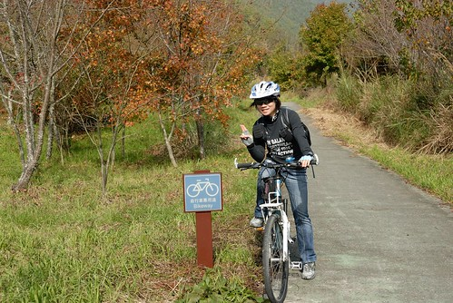

過桃園區後是跟汽車分道 貨真價實的自行車道 刻意穿過桃園 梅園 蘋果園的自行車道上又是不同以往所見的景緻 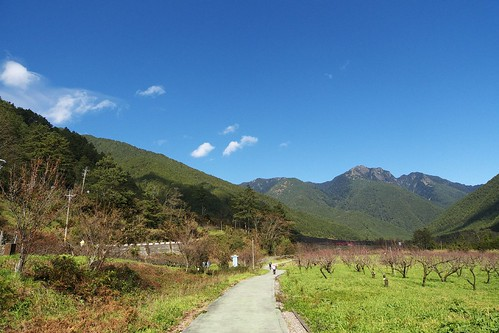

本來要騎到不能騎 騎到武陵山莊口的 怎耐差了幾百公尺遠的地方阿徹被狗嚇的堅持要回頭 於是我們沒能完整騎完車道 留下小小遺憾... 

回程時隨性地看到稍美麗的楓便停下車拍照 

今年此時看到的楓都是像這樣即將轉黃掉落的樣子  真的不太上相哩... 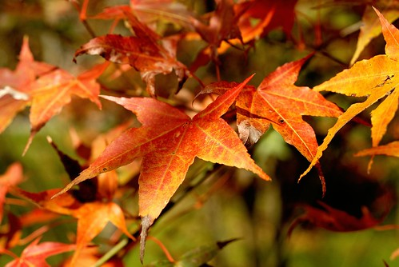

而滿樹枯黃的葉子雖美麗雖有FU 卻是難以用相機表達阿 

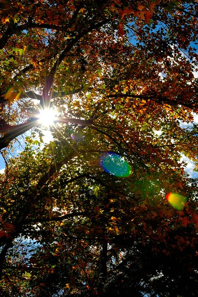

用騎車的方式遊武陵 感官感受又完全不同於開車或走路的方式 而且想停就停  多了很多可以仔細觀賞楓樹的機會 但是"慢遊"的過程其實很考驗小孩的耐心 所以郊外踏青時常用撿葉子來引起小人們的興致 

再者帶著心愛娃娃一同也可以讓小人們興致高昂 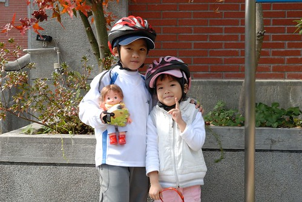

而連續的下坡路段則更讓我們的陽光徹笑的更開懷了 (最好所有的路都是下坡的) 

在雪壩國家公園警察局處我們第一次看見看見這樣美麗的蝴蝶 

恰巧的在下午的武陵農場介紹影片中知道了她的名字叫做曙鳳蝶 她美麗的身影讓徹爸即使沒有長鏡頭卻仍努力的連拍十幾二十張  亂發一通總有捕捉到的機會 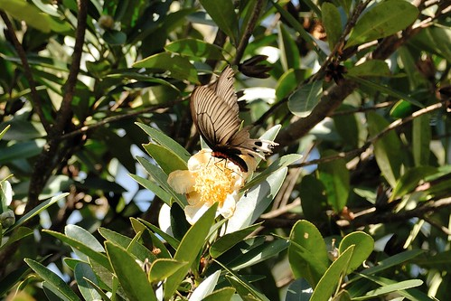

這回路上每每經過'楓'景點都換來徹爸的一聲'真的都掉光了'的感嘆 因為連茶莊前也是這樣的光禿禿 雖然會有點小遺憾 但我覺得在武陵隨遇而安 好好享受當下便會覺得處處是美景 

最後我們花了三個小時來回共騎了九公里 這樣應該也免強稱的上是"深度"旅遊吧! 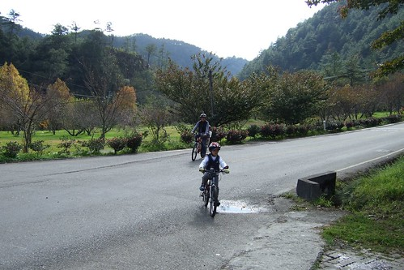

可是張小徹! 你真的需要多練練車了... 

回到武陵賓館時 看到被主人綁在外頭的這隻狗 向來怕狗的阿徹竟然要求合照 可是阿徹還是邊拍邊撮 離狗這麼遠 枉費小狗這麼認真的看鏡頭 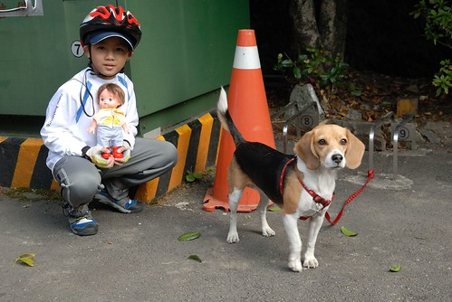

不知道是不是高山低壓的影響 脫下安全帽後的阿徹頭髮竟呈現岀美麗的波浪狀且久久散之不去 呵呵~ 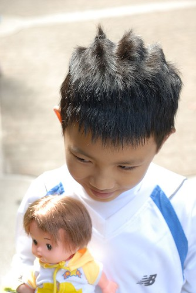

這回愛愛最喜歡的地方大概是楓林小徑上從去年到現在擺放著的聖誕雪橇造型椅子 每次經過便會開心嚷著"我要去坐雪橇嚕" 開心的模樣好像坐在上面就像是在過聖誕節一樣 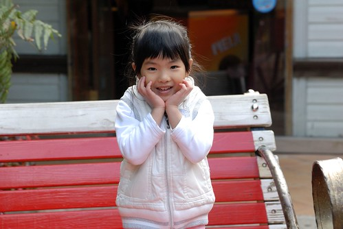

爸爸心目中美麗的楓該是這樣的紅 這樣的身形的  也難怪他很不滿意這回所見的楓景 因為只有楓林小徑上殘留幾片這樣的葉子 

今年上武陵賞楓的遊客感覺比前兩年多很多 只是園內疾駛的車輛也多很多 我猜想武陵農場真是漸漸打出口碑了 由其是秋楓與春櫻 

只是真的難得來一次武陵就放慢腳步 慢慢走慢慢開 敞開心胸感受大自然的原始美麗唄~ 

徹爸說二葉松的紅是很奇怪 不知道怎麼形容的顏色 而我給了個這樣的形容"鐵鏽"色 真的很像鐵片上生鏽的顏色吧! 不過數大真的便是美 紅澄澄的 此時就屬她最搶眼 

在這裡阿徹請我借他小DC 他要親自幫他的愛娃掌鏡 讓他隨興發揮的結果就是亂照一通 不過還是偶有佳作產生 像下列這張便頗獲徹爸讚賞 

愛愛偶而也一同入了鏡 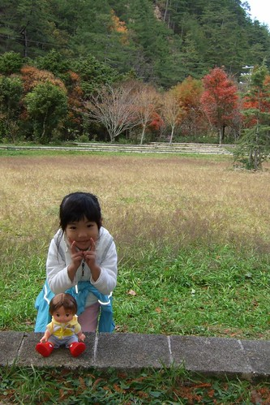

還好心地幫媽媽來一張 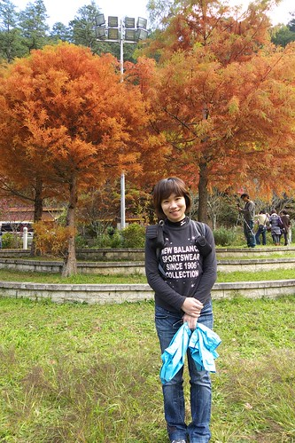

爸爸媽媽再來一張 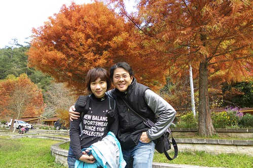

"Hi! 我是美樂哥 應該很少有娃像我這樣幸運來武陵外拍吧" "謝謝我的小主人阿徹 這麼善良貼心地帶著我出門 趴趴造 不過請記得好好照顧我別害我迷路回不了家了" (這張當然是徹爸拍的) 

(這張好像是愛愛拍的吧) 

結束半小時的外拍行程 趕緊進賓館取暖 吃熱呼呼的中餐嚕 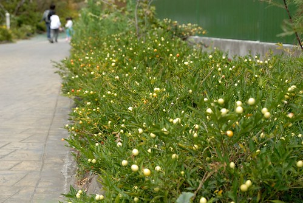

吃完中餐 收好車 看了遊客中心一點半播放的生態影片後便即將結束我們今年的武陵行 每次要下山總會有點不捨 總會跟徹爸幻想著 "不知道這缺不缺洗碗工 如果以後老了後可以在這當洗碗工那真是不錯哩 " (夫妻倆發夢中...) 

告別秋天的顏色  說聲再見~ 期待下回武陵的不同大地顏色 Bye Bye~ 

補充: 第一天一黃一紅的葉束煞是美麗 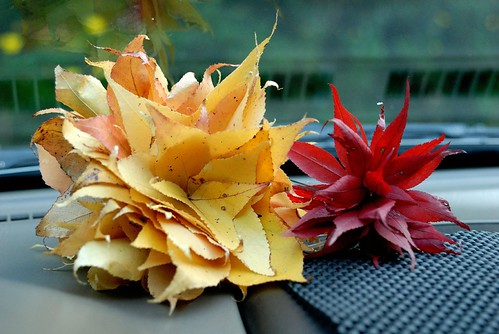

可是在車中經過一夜後便完全的脫水變形了 

徹爸形容的很噁心的紫色 但這一綠一紫多奇妙的組合阿 

美麗的山茶花 

我們不知道名稱的紅色花朵 一瓣瓣排列的多整齊 

這張雖然沒有主題 但我喜歡這樣的溫暖色調 
