愛愛幼稚園都已經在緊鑼密鼓準備五月的音樂發表會的表演了 而去年12月的聖誕節表演卻還一直被我擱在草稿中... 趕緊補紀錄一下!

去年的聖誕晚會 校方別出心裁特地請了攝影師(這幾年照大班畢業照的工作室)幫每個與會的家庭照全家福 準備入場的我們被這突然的"款待"有點嚇到 我說"不早說.. 不然就盛裝點 起碼也擦個口紅再來" 不過念歸念 其實我們家也很難多盛裝的啦! 所以平常心 1 2 3笑就好~ 

不過我們家平常愛照相的習慣在這種重要時刻還算有發揮效能四個人都笑的有自然 只是愛愛跟阿徹有點"假仙"  竟然只是抿嘴微微笑而已   兩人最近照相都愛用這種笑法... 而在聖誕節前幼稚園也發回了年曆照片 連續三年都有這樣的年曆 阿徹跟愛愛都已經集滿三張了

我看到阿徹這張照片的第一眼就很喜歡 感覺真是個超級陽光小子阿(皮膚真的有黑 牙齒有齊 笑容有燦爛) 可是阿徹猛搖頭說"不好看"  我說"不會阿 你看笑的多自然多有自信" 阿徹說"露牙齒不好看 我不要露牙齒 照相叔叔一直要我露" 阿徹邊說邊嘟嘴邊搖頭 真的很不滿意 可是我真的覺得這張照片上的阿徹超帥的說... 很有黑人牙膏充滿朝氣的感覺ㄋ! 

愛愛這張也照的有漂亮 可是化了個口紅感覺太成熟不像家裡的小女娃  有點難接受... 

話說回聖誕節表演活動 ................................................................................................................. 因為舞蹈班的表演要求小女生得用包包頭 於是那天中午前帶了愛愛去設計師阿姨那用包包頭 只是不知道是因為代勞的其他阿姨技術不夠堅強還是愛愛午覺睡的太盡興 包包頭到了傍晚已經滿頭髮絲亂飛(這已經又被我多夾了好多根髮夾修補過) 

不過包包頭的愛愛感覺很像火影忍者裡的天天  我們忍不住直喊她"天天 張天天" 愛愛有點生氣地說"不是啦~ 我是張愛愛!"  沒關係啦! 不管天天或愛愛都是很可愛的女生 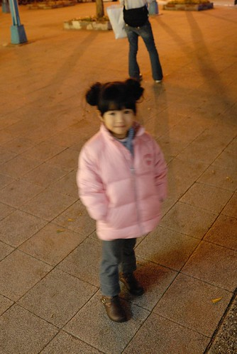

應阿徹要求為了搶得較佳觀賞視野 我們在活動開始前一小時便到達會場 

無聊 照照相打發時間 

後來小朋友陸續抵達 整個會場熱了起來也吵了起來  愛愛跟阿徹也四處找朋友串門子去了 這是愛愛四人幫裡當中的焦哥 話說聖誕節前焦哥跟爸媽去香港旅遊時看到女生小禮服一直說要買回來送愛愛也直嚷著自己要買領結跟襯衫回來跟愛愛結婚時穿... Orz 雖然後來是送了愛愛一個Hello Kitty包 但也足夠讓愛愛改口說第一喜歡焦哥好多天 (這三男一女的四人幫 三不五時就在聊這些想這些 唉~) 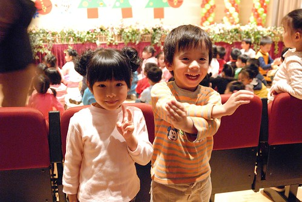

一改以往老師的節目為涯軸 今年老師們扮妖嬌 活力四射的開場炒熱晚會氣氛 孩子們在台下看到老師們表演的"大小姐"個個都High番 原本在哭的也應該忘記哭了 不知道是不是這原因 這次晚會沒有小孩在台上哭 每個都很棒很勇敢 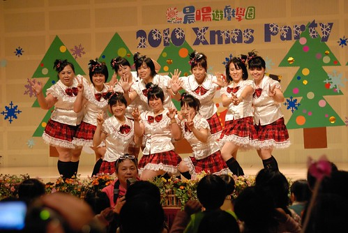

一如以往愛愛一樣是兩個班級表演 一個舞蹈班表演 班級表演的第一個節目有首蝴蝶 所以每個小女生也就都變成蝴蝶而男生則為蜜蜂 

展翅的蝴蝶 

指向遠方的蝴蝶 

圓圓臉的蝴蝶(話說那個頭髮才第一個表演就已經慘不忍睹了) 

表演結束的照相時間跟最常出現的"最喜歡第一名"的綠綠合照一張 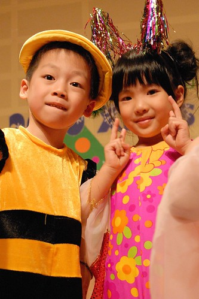

然後是舞蹈班的表演.. 預備動作 (看到每顆一樣的包包頭髮飾 突然覺得我的梳頭錢好像白花了 Orz ) 

扭腰擺臀 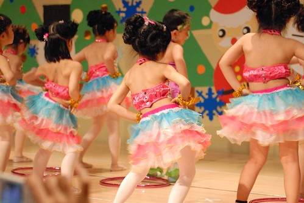

開車車 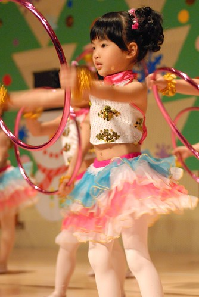

這..有個學名..可是我忘了.... 

亭亭玉立的模樣都不像剛開始念書幼幼班的娃樣了 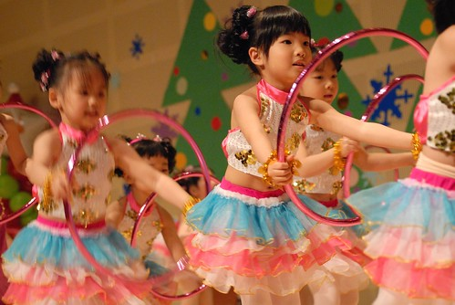

這個轉圈圈動作 愛愛曾經帶這圈圈回家努力練習過 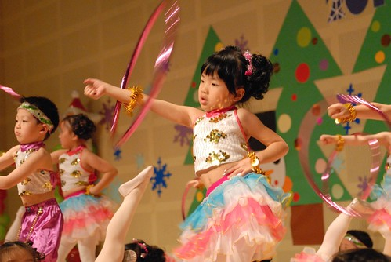

上台時 圈圈轉的很好 同時間也很厲害的大幅搖擺著她的屁股 可是突然間.....圈圈飛出去了 而且滾落在遙遠的左側舞臺下 飛出去的時候 全場的人可能都像我一樣忍不住阿了一聲 那刻我有點呆住了 不知道接下來愛愛會有什麼反應或是怎麼處理??? 結果愛愛呆了一秒後 馬上往圈圈的方向跑去撿圈圈 幾秒鐘後回到她的位置繼續轉 那一刻我真的覺得愛愛又長大了  本來還擔心她會不會在台上嚇到哭出來或是繼續呆下去的說 結果沒想到她超盡責的自己主動出擊去撿圈圈 然後不疾不徐的再繼續她的表演

我相信愛愛一定很介意這樣的事情 很不忍心問她的心情但又實在很想知道 於是隔兩天後我小心翼翼的問愛愛 "你還會難過嗎?" 愛愛點點頭 然後說"不知道為什麼 這幾天有時後頭腦就會突然又想起來..." 嗯! 媽媽可以想像&理解 因為媽媽也是對於出糗超難釋懷的人可是媽媽真的覺得愛愛的反應很勇敢 我相信愛愛一定會一輩子記得那天的事的 起碼爸爸媽媽一定會永遠記得... 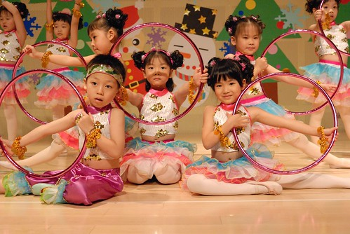

(沒有因為出糗而當機 表演結束後依然笑咪咪) 

大部分班級的表演服裝都是一個節目可愛 一個節目帥氣 可是愛愛班上今天都走可愛動物風 剛是蝴蝶蜜蜂這回全變成小乳牛了(包包頭更是完全包起來了) 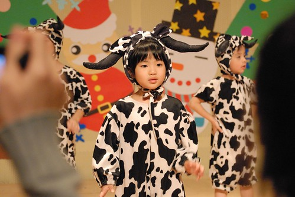

雖然愛愛不是那種閃耀的 適合舞台上的人 但是我喜歡愛愛那確實做好每個動作的態度以及邊唱邊跳的投入樣 

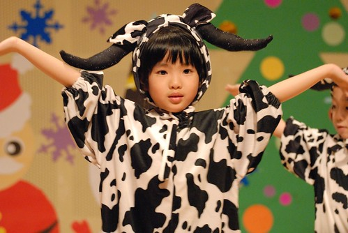

好賣力的樣子阿 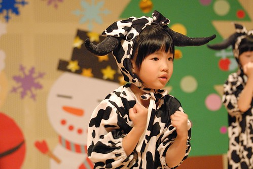

Ending時 因為距離左右兩邊的人都太遠 愛愛一下往右一下往左 努力地要跟左右邊都牽到手 最後總算及時連成線了 愛愛的嘴角也笑了... (不過愛愛真的好嬌小喔 起伏真大的凹) 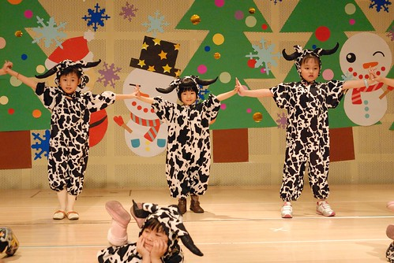

看著每年會場上家長手上的DV越來越多越來越高級 徹爸都會忍不住murmur一下'要不要來買一台阿' 呵呵! 小dc的錄影功能就可以了啦 徹爸的照片才是我們家的王道!!! 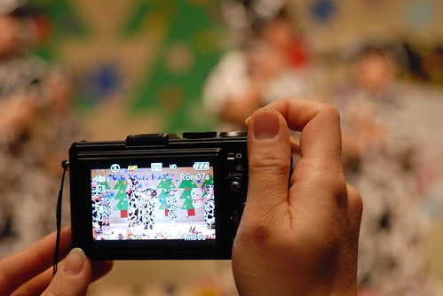

愛愛最後表演結束時 媽媽也湊上前來個合照 

我們家的愛愛今日真的很棒喔! 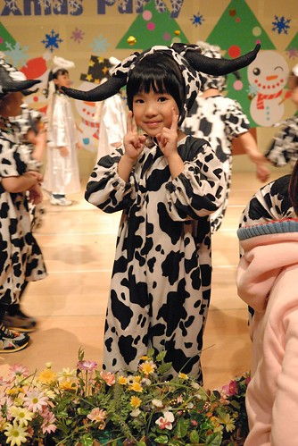

活動的最後是安親班全體小天使的大合唱  阿徹他們在後台窩了2小時後總算出場了 

只是人真的太多阿徹又在後排 我直到一半才找著我家的阿徹 幸好爸爸還有眼尖找著阿徹留下阿徹的天使照 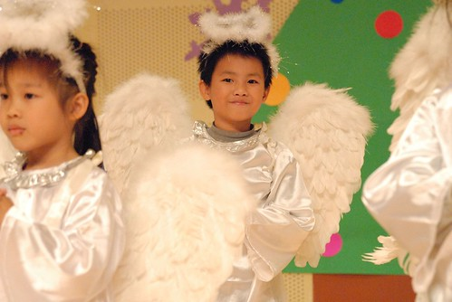

結束後我也跟我們家的天使照了一張 照片上阿徹的塊頭都快超過我了...好快 真的好快... 

但是爸爸說"真的老了!" 呵呵! 
