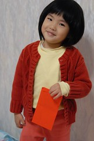

昨天(又是好多天前的昨天了)才不小心看到徹爸早已PO上的過年照片 看著照片中可愛的小愛 我的良心告訴我這媽媽"該是來篇照片拜年記了" 呵呵~ 藉著這些照片祝福大家/自己/愛徹家  \~~~新年快樂   福虎生豐~~~                  

結婚後一年比一年感受不到年味 不知道到底是因為時代的改變 還是自己越來越上年紀了 而對阿徹小愛來講過年開心的原因是可以領紅包以及可以在嘉義住好多天 不若以往包個1-2千元 可是最後還是都充公去了 今年徹爸決定只包給阿徹200元 小愛100元  這些錢就讓她們全權決定使用的方式 阿徹小愛其實對於金額沒有太多概念當然也就沒太高的期望 錢真的能用才最讓她們開心... 

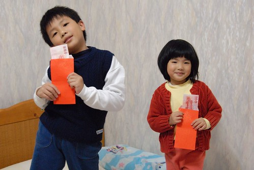

小時後的除夕夜(因為要到那一晚才結束過年前市場生意的忙碌)陳爸陳媽總會帶我們到新莊夜市買衣服 讓我們年初一穿新衣 歡歡喜喜的過個喜氣洋洋的年 等到自己當爸媽後對於過年卻是很隨便 我們總說"過年才一天 日子每天在過比較重要" 因著這理由我們沒有大掃除 大採買 大慶祝...的習慣 不過年初一還是忍不住想稍微把女兒打扮的紅一點 添點喜氣(雖然都不是新衣)

嘉義有一個很特別 其他縣市都沒有的習俗 就是在年初一會去"探墓草"

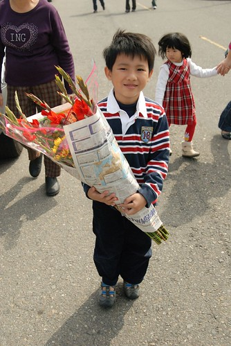

也許因為嘉義人特緬懷祖先 尤其在這該是全家團員的中國年裏 只是對於我這個向來很怕墓地的人來講 還是一整個難以理解... 當阿徹小愛還小時 年初一的早上我都是留守在家顧她們 (或許這也是我一直難以習慣的地方 年初一得自己冷冷清清的在家....) 這兩年阿徹小愛大些了 我們總算全家總動員一起去"探墓草"

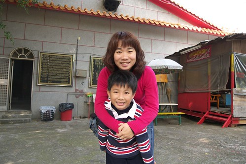

年初二當阿徹的三個姑姑們分別回到娘家 整個家的年味總算來了 因為忙著煮東西 吃東西 吃東西 收東西...一整個的鬧轟轟 不過過年就是該這樣熱鬧...

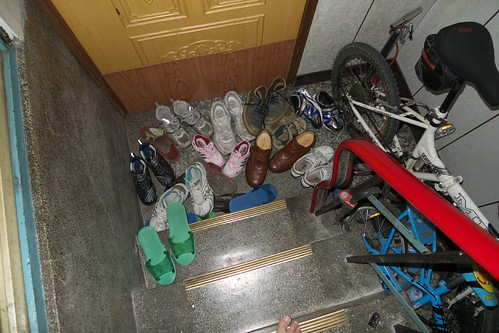

今年的年因為大半的天氣都是又濕又冷 加上年初五就上台北 所以徹爸照的照片不多 而且大半都是他口中那個甜蜜蜜的女兒照片 看著這些小愛的照片 怎麼覺得五歲的女娃又不一樣了....

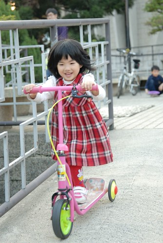

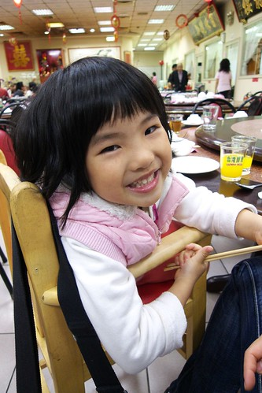

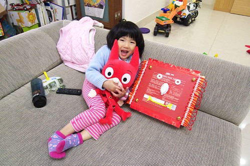

看著照片中的小愛 怎麼感覺比本人成熟很多阿... 其實愛愛現在的講話方式 思考邏輯 對事情的看法判斷力真的長大許多 甚至可以算是已經脫離小BABY的行列了

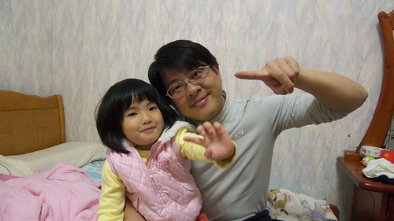

只是全家人對於最小的她應該還是不小心多了些寵愛吧 所以她也蠻會耍技巧的裝小 裝小BABY的模樣

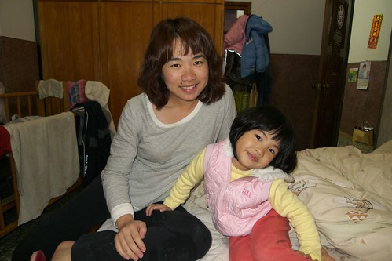

有沒有發現愛愛最近照相比較會看鏡頭 而且常露岀含蓄式的有氣質笑容

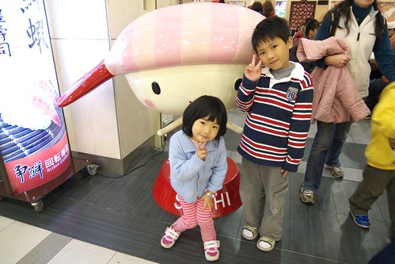

這全都是靠徹爸特訓出來的 徹爸可滿意/得意的哩...

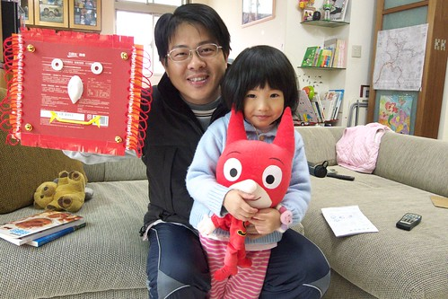

愛愛竟然連吃冰淇淋時也還不忘爸爸的教導 含蓄的笑著....這...這....中毒未免太深了....

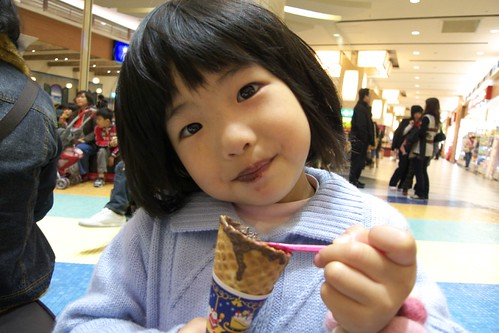

這樣才比較像愛愛的本性啦

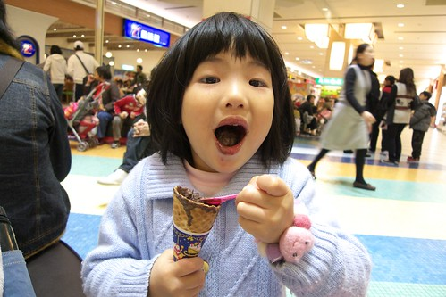

過年大放送 一人一隻31冰淇淋 而且是阿徹思思念念很久的哈密瓜口味

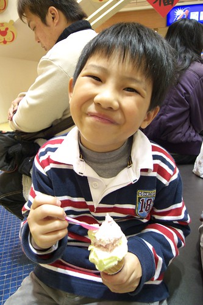

今年的過年 阿徹小愛領到了真的可以用的紅包 還額外收到徹爸大放送的買玩具機會 加上冰淇淋...這年應該過的挺開心的吧!!!

(愛愛這張的手勢真的超好笑.........) 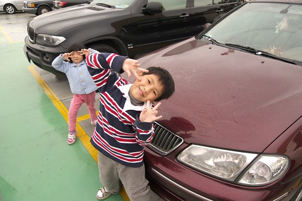
