原本是二月要去賞櫻的 可是因為氣候的異常以致今年花期延後 最後我們改成三月去賞春... 耳聞武陵的油菜花很久了 只是我一直很懷疑武陵的油菜花到底有多廣闊(照片常會騙人的) 尤其還是在會出現油菜花的稻田都早已插秧的三月裡... 雖然心中對於今年沒成行的武陵賞櫻一直有小小的遺憾 但因為保留的訂房而讓我們多了個武陵春之行是個意外的收穫... 兩年前開始去武陵時我們曾經發下豪語要把武陵的四季風景都看遍 這回我們總算在秋楓 冬梅 春櫻以外又多收集了個 大地回春綠意盎然的武陵三月春! 就如徹爸那天在山上說的一句話"武陵真的是個寶地 不同時候的風景都是這麼的漂亮"  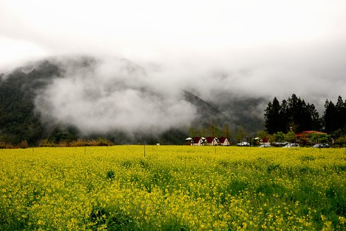

故事的背景在於: 為了一償住在櫻花盛開武陵的心願 去年12月初便訂了今年2/11的武陵賓館房間(2/11跟2/19還掙扎了很久) 那時還對照線人網站上數年的照片推敲櫻花大盛的時間  可是好個人算不如天算阿 今年的異常氣候使得花期delay  完全沒照以前的規矩來了 因為目的是賞大盛的櫻花 要在最大盛的櫻花期間住在櫻花小徑裡的山莊 因此確定看不到大盛櫻花後 我在原訂賞櫻日的前三天忍痛取消了訂房 接電話的服務人員還不可置信的語氣說"現在很美房間很搶手 你們竟然還要取消" 我說可是花沒有開很多不是嗎 小姐啞口了.... 其實取消訂房是可以選擇退費的 但我選擇了保留(保留到5月底) 因為這樣就可以趁機多上一次武陵了 呵呵! 於是在三月底的這週我們上武陵賞春去嚕~  

原本氣象預報說壞天氣到週六會好轉的 可是週五竟然又說壞天氣持續到隔週二而且週末又濕又冷 我還跟徹爸開完笑說 要不要去買個雪鍊說不定有機會可以順道去合歡山賞雪喔...(徹爸也完全不當真) 結果週六那天的天氣真的是又濕又冷啊 (去年12月賞楓時綁的兩個捧葉還躺在我們的車上) 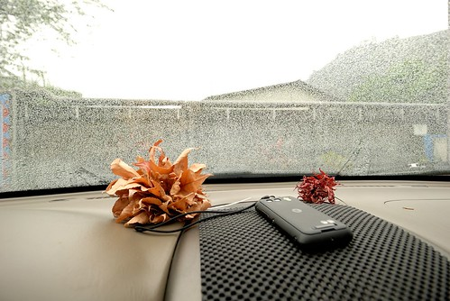

在大同往棲蘭以及七甲上山的路上多了好多的高麗菜田  遠遠看那一大片且綿延不絕的綠仿若一條綠河 只是這樣不會破壞水土保持 不會在下次的大水時造成影響嗎???  我心裡實在納悶 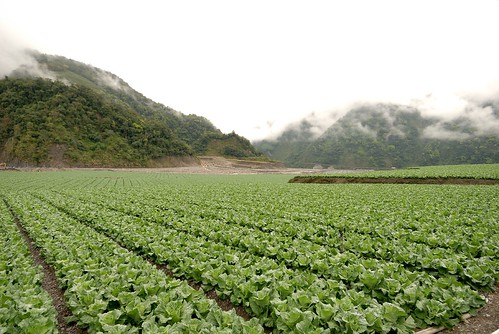

前一天因為家裡有小客人來訪 阿徹跟愛愛破紀錄的在家12點才上床睡覺 早上8點多從家裡出發後 愛愛很快地便在車上睡著了 我心理想小妮子前一晚沒睡飽一定很睏 大概可以從台北睡到山上去了吧 所以既沒阻擋她在宜蘭前睡覺(以前都要她撐過宜蘭後才可以睡這樣山路時就是睡覺狀態)也沒讓她吃暈車藥 結果愛愛從板橋睡到員山後便醒來了  然後在轉進七甲沒多久昏睡中的我便聽到阿徹在後座大叫"妹妹吐了..." 我轉頭一看災情還真慘重 兄妹倆的外套 衣褲以及愛愛帶出門的娃娃都遭殃了 找了個可以的地方停好車後我們花了好一番時間善後 然後再用著超慢的速度上山 (愛愛的表情超級無辜...) 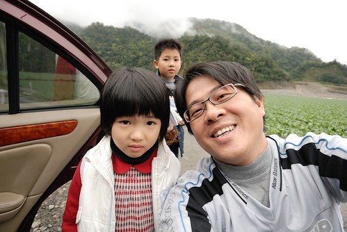

再上路後 越往高山起霧的情況越是嚴重 而且車外的溫度也越來越低 經過最容易下雪的思源啞口時 車外溫度計顯示著"2度" 我們開始哇哇大叫 今晚會不會有機會在武陵看到雪阿?! 哈! 要看雪講真的很難啦 所以純當玩笑話 不過很擔心武陵的天氣倒是真的...下雨的話可就不好了... 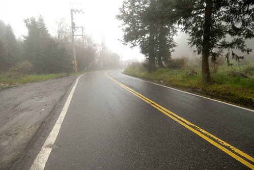

所幸過啞口轉過一個山頭後 台中那的天氣果然好一些 途上還看到這戶人家外美麗的樹 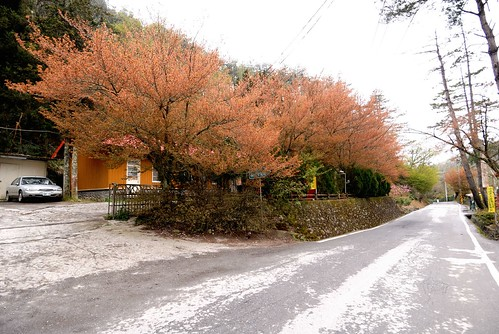

比原本導航系統預定的時間多了一個小時 我們1點半多才抵達武陵 首先去賓館辦裡住房登記 然後去賓館後方吃中餐 經過楓林小徑時 愛愛看到這雪橇一如以往又是開心不已大叫要照相 還真是每次來每次照百照不膩 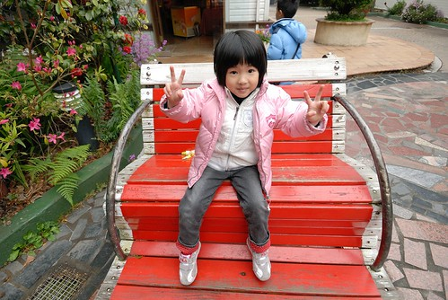

在武陵的中餐一樣是由山下買上來的御飯糰配上暖呼呼的熱茶 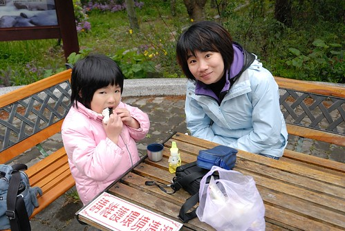

阿徹似乎很沉醉在這裡享受看書的樂趣說..(行前還說想帶水彩來寫生哩 幸好他忘了帶畫本) 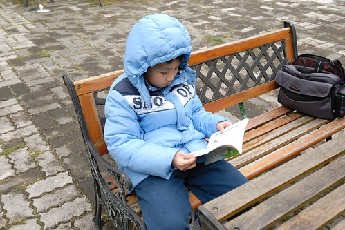

以往秋冬來武陵的時後 林間的顏色就像紅綠燈那樣有黃有紅有綠 但春天的色彩則是單一單純但具有層次的綠 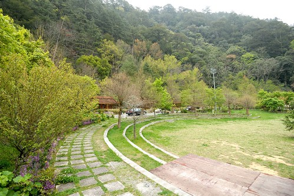

如此綠意且鮮嫩的楓葉 別有一番風情.. 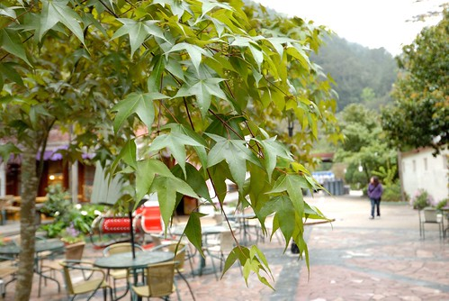

而園內各處也盛開著各式各樣小巧 鮮豔 美麗的小花 

一整個的春意盎然 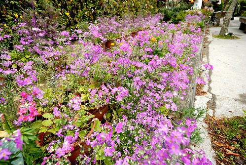

如果說有楓或有櫻的武陵是濃妝豔抹的迷人女子 那春天的武陵大概就是那不引人注意但是有心人會深戀不已的清秀佳人吧 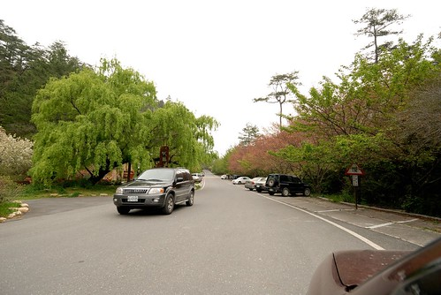

雖然沒有粉紅佳人及吉野櫻了 但場內不時還是可看見幾株鼎立的霧社山櫻(上網查的應該沒查錯) 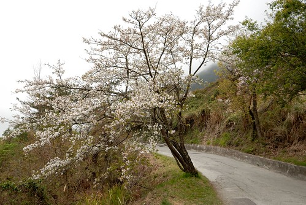

白色的小櫻花另一種風味 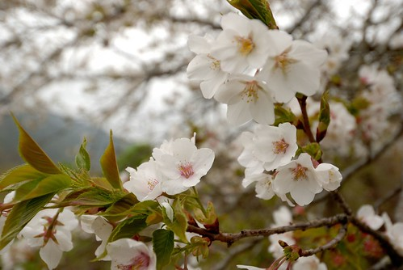

(這是往武陵山莊的小徑上) 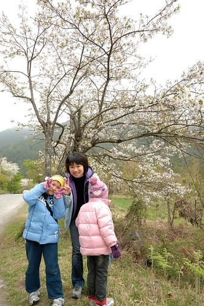

而往年此時已經盛開的武陵山莊紫藤 今年也才剛開始開而已 今年的春天真的來的特別晚阿 都亂了 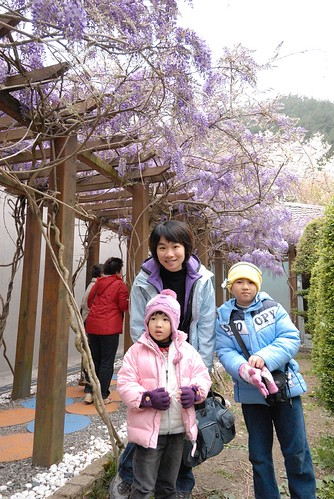

小串串紫藤含苞待放中... 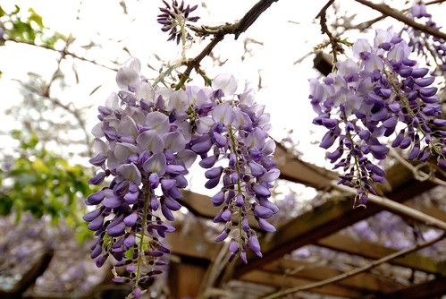 

阿徹她們已經是第六次來武陵了(有過夜的五次) 但是桃山瀑布步道只走過一次而且還沒走完哩([blog.yam.com/hmchen1975/article/18481351](http://blog.yam.com/hmchen1975/article/18481351)) 這回我說" 來了這麼多次武陵 竟然沒去過桃山瀑布實在很說不去哩..." 聽到要走步道 我們的阿徹哥哥當然馬上就哇哇叫 但是爸媽心意已決 所以威脅利誘併下 怎樣也要兄妹倆來個桃山瀑布大挑戰 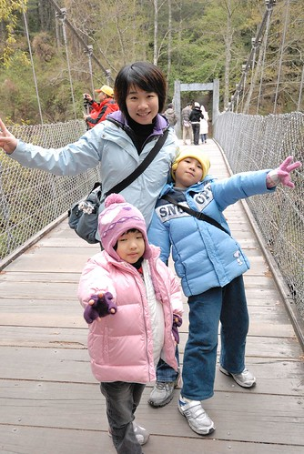 

從武陵山莊到桃山瀑布4.3公里，兩地落差約350公尺，平均坡度約8% 桃山瀑布步道呈之字形，整路都是水泥路，兩旁的針葉林高大且優美，樹種以台灣二葉松為主，樹蔭茂密 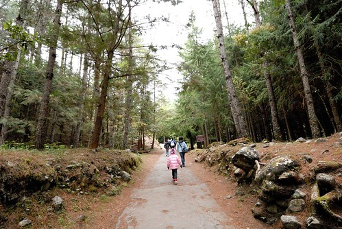

第一次來武陵時徹爸自己有走過一次 而我在大學時也曾經走過 所以這回真的是"刻意"挑戰兄妹的 (就是故意要挑戰阿徹跟愛愛的耐性啦) 小子們 拿出你們的戰鬥力吧! (注意喔! 愛愛這一列的照片 手勢超多超帥的) 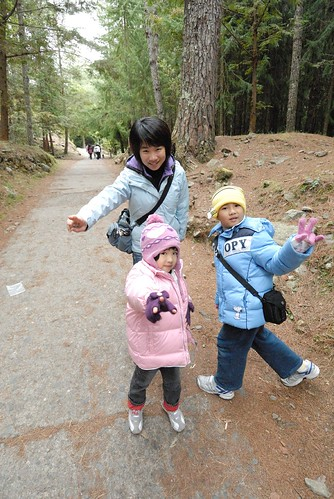

就算用爬的也要爬到終點阿! 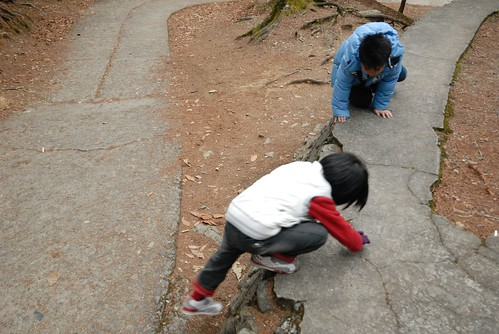

只是雖然步道平坦好走 但一路的緩坡走上來 老實講連我的心臟也會蹦蹦跳哩 更別說是阿徹跟愛愛嚕 因此媽媽只好拿出在武陵山莊買的牛奶糖誘騙 每走到1000M的標示牌時就可以領一顆糖喔 (真的很像在訓練小狗) 所以阿徹愛愛每走500M開始累開始唉時 我們就要說"努力喔 等一下給你糖" 再多走個2-300M時 再跟她說"快到嚕.. 就快要有糖吃嚕...要不然糖先給你讓你保護..." 然後兄妹倆就又熱血沸騰 認命的走啊走! 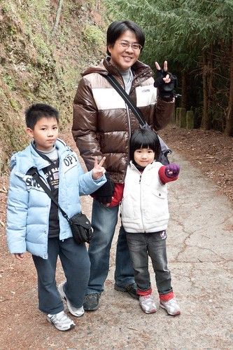

其實小孩子的耐力與體力真的就是這樣半哄半騙訓練起來的 不過我們知道他們可以的 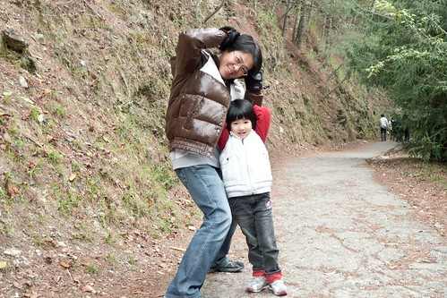

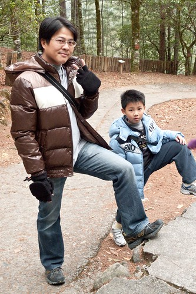

沿路上 越到終點越多的遊客跟愛愛加油打氣 大家都說"幾歲阿? 好厲害阿!" 愛愛也很開心地說"好多人給我加油喔" 我們說"是阿! 所以你更要走完 不要辜負了大家對你的期望" 所以 愛愛很棒喔!  暈車完的下午還可以這樣的勇猛!! 

(雖然10度以下的低溫 但是走久也是會熱得脫外套的哩) 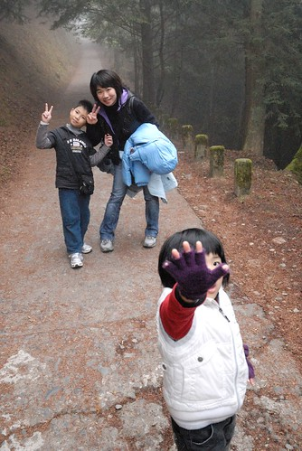

加油! 加油! 就快到了... 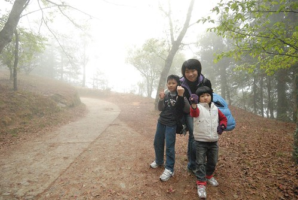

可是怎麼還是遙遙無盡頭的感覺阿... 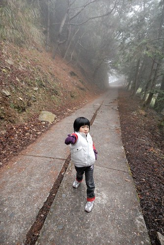

而且霧越來越濃 天氣越來越不好還飄起細雨了 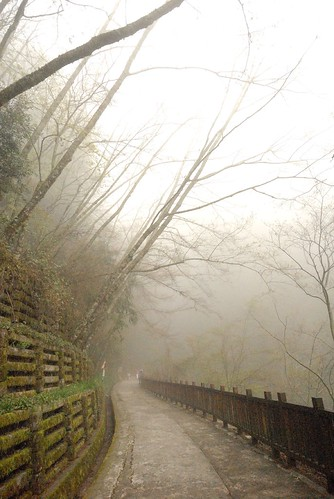

總算總算走了兩小時 我們四點半抵達桃山瀑布嚕 難得的是我們走的速度一點都沒有遜於常人喔 就跟山莊那的告示牌所寫的2小時恰恰好 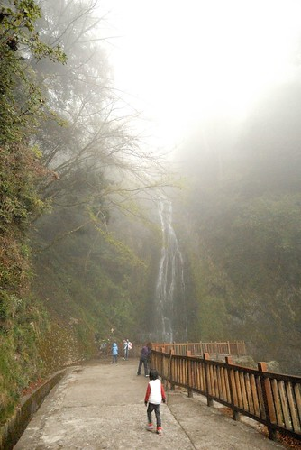

桃山瀑布又名煙聲瀑布，此名的由來，眾說紛紜，有說是因瀑布水量大，站在涼亭就可以感受到水氣，如同煙聲，書法 家趙恆惕 先生親臨體驗後，在瀑布旁的岩石上題字「煙聲」，故以之為名（有舊照片為證喔！）；另有一說是，瀑布一年四季水量豐沛，水勢由高處直瀉而下，風來水花飛濺如煙似霧，因而博得「煙聲瀑布」美名；還有人說是，因位於高海拔的山區，四周山林圍繞，霧氣濃厚之時，只聞水聲未見其形，因而得名。95年初開始，武陵農場和東勢林管處將瀑布名稱統一稱為桃山瀑布，煙聲瀑布這名字從此走入歷史 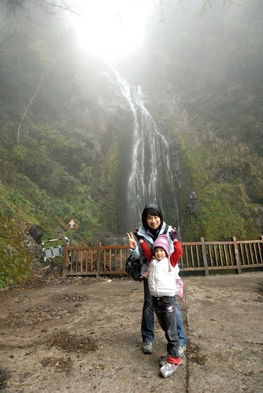

阿徹跟小愛都很棒 所以各自有兩單位的摩爾時間及馬力歐賽車時間入袋 (爸媽拿線上遊戲及wii時間利誘真是太卑俾了) 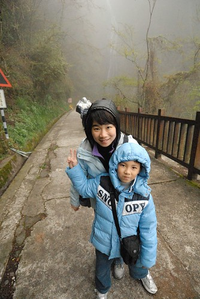

下山時因為天快黑加上小雨 我們加快腳步花了75分鐘就下到山莊了(來回也走了近9公里的路) 六點時分的武陵下著雨 我們第一次在武陵遇到下雨  但是這一幕好美好美............. 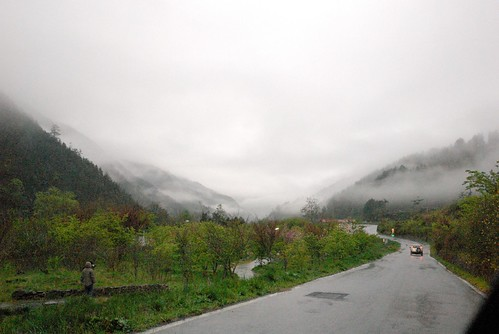

之前來武陵住過 農莊第二區雙人和式房 歐洲小木屋 賓館本部四人房以及富野度假村 這回住的又不一樣了 農莊第一區的四人房 很出乎我們意外的 房間既寬闖又通風 但是又不會覺得冷 是徹爸最滿意的一次 而且七點賓館晚餐又讓我們四個人都吃得好飽好滿足 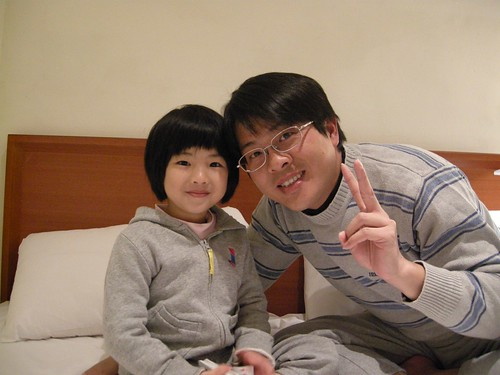

吃完晚餐 洗個溫暖的澡 玩一下牌 一家子要早早上床睡覺了 期待明天一早醒來外面已是一片雪白阿 (吃晚餐時 賓館室外溫度計顯示3度而且下著雨) 

可是一覺醒來 嗚嗚嗚...沒有雪只有越來越大的雨勢阿! 又濕又冷的..... 隨遇而安 隨遇而安 吃飽早餐再說吧! 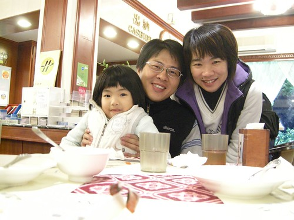

阿徹現在出門很常拿出他的相機隨手拍 這是徹爸在示範拍照如何抓住煞那的感動 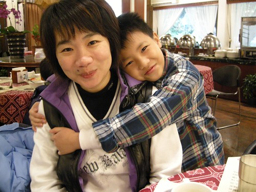

雖然雨很大 但是這回的重點之二水蜜桃花跟油菜花都還沒看哩 所以我們還是開著車遊園 撐著傘賞花 (車上的備用傘有夠大吧 把後面的花都遮住了) 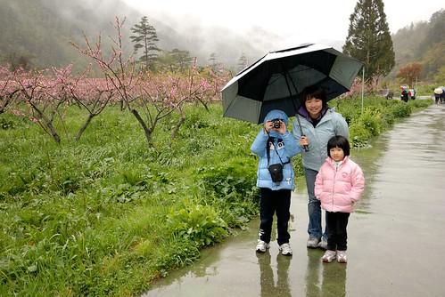

徹爸自己撐著小傘 機動的到處走到處看 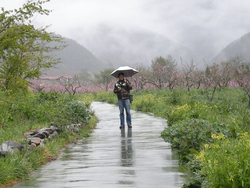

雖然真的不樂見雨天 但得承認雨天真的別有一番濕情畫意 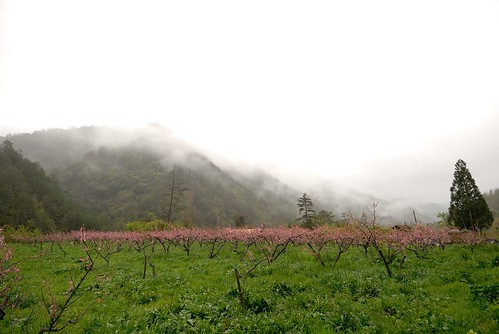

(我正在告訴阿徹 你看前面山景前還有一排紅色屋頂的屋子 這畫面多美阿) 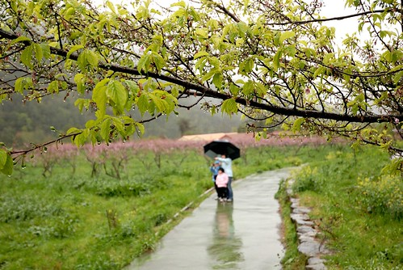

雖然下雨 但是阿徹的興緻還是很好 拿著相機四處拍他覺得美的事物 突然還幫我們四個人都來一張  

 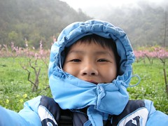

最後自拍完自己時看看照片 阿! 下巴都遮住了啦  自己拉好外套又再自拍一次 這是阿徹式的傻與可愛 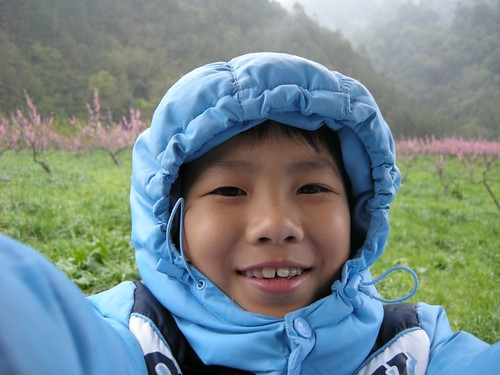

(這也是阿徹幫我們拍的) 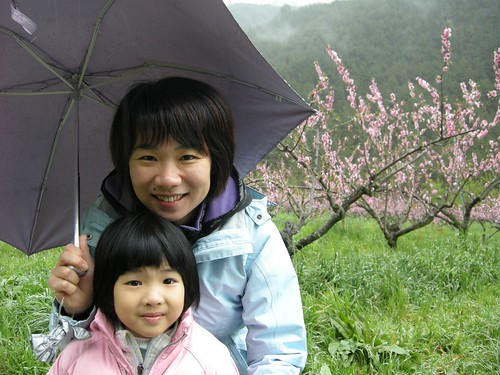

記得喔! 白的是李花 紅的是桃花 水蜜桃當然也是桃花的一種喔 所以是紅的(這是我們賞花時的討論之一) 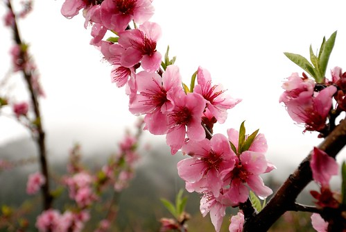

接著我們上到農場的露營區尋找那油菜花... 來到露營區沒看到阿 問了管理處的人"有喔! 開車在前面轉個彎過去 一分鐘就到了" 我們沒有開車 亂走小路尋花去 結果不小心走過濕濘的營地以及陡到快像溜滑梯(愛愛形容的)的小徑 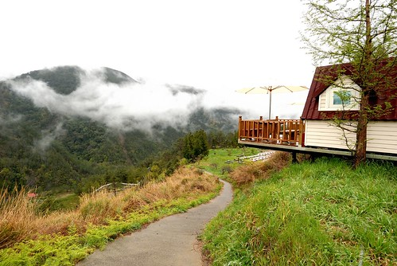

然後盡頭映入眼中的果然是一大片的油菜花阿! 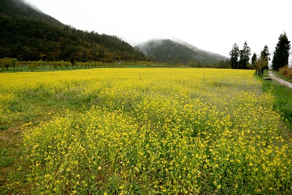

很愛很愛油菜花的我 當然又是抓著每個人狂照一番 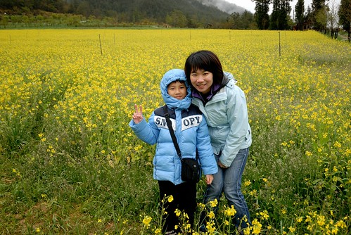

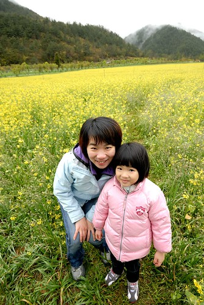

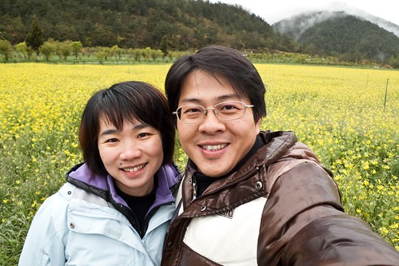

愛心裡OS: 媽媽你照好了沒 很冷耶...而且鞋子都濕了凍到腳趾頭去了 是阿....媽媽的鼻子也凍的紅咚咚的了 可是我的內心澎湃阿!!! 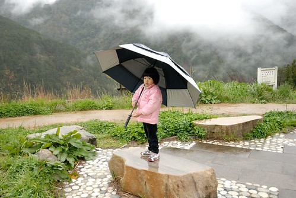

高山裡的油菜花田跟在花東平地看到的花田真的是截然不同的感覺  美呆了! 不虛此行了!! 

可是真的好冷.............所以去茶莊買了我們家缺貨很久的梅子粉之後(為此 家裡芭樂有點滯銷) 11點多我們便下山回家了 

回到車上時看的出愛愛的臉都凍的紅紅的了  吃點餅乾補充一下體力(還有吃暈車藥)我們要一路衝下山了 

這又是阿徹的自拍..這個YA是說他自己也很滿意這回的表現嗎(沒有哭哭鬧鬧) 不過得承認 下雨天多虧兩小乖巧甚至樂在其中 才讓我們此行沒受雨天影響心情而依舊玩的愉快 阿徹跟小愛 這回表現有棒! 

一點半多我們抵達羅東去菜根香粥鋪吃了豐盛的中餐 結束這次的旅行!!! 
