四月徹爸的球隊計劃著要下台中打友誼賽 徹爸問了我"要不要順道去台中玩" 兩人想想好久沒去中興了 於是向來不參與比賽的徹爸這回決定帶著最親愛的家人去台中打球 (PS雖然徹爸參加球隊但很少參加球隊比賽 純粹志在練球健身+娛樂 聽說還被封為練球"教主"哩 ) 很久很久沒有在台中玩這麼久 更別說過夜了.... 24小時裡有我與徹爸在逢甲夜市及中興的懷舊 有徹爸自己一人的運動陽光 還有我們母子三人與伴遊玟姿阿姨的吃喝玩樂... 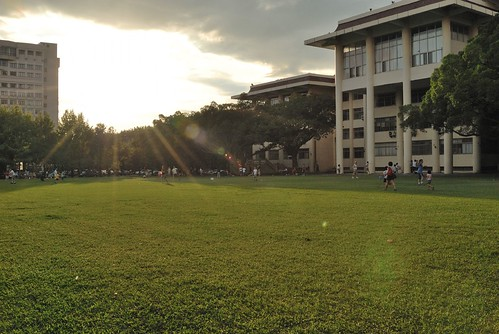

本來打算趁這機會好好在台中玩兩天的 但是卡個阿徹週六下午的學校扯鈴社團很為難 4月去花東騎車時已經答應阿徹 會是最後一次的請假了(半個學期就已經累積請3次假) 所以阿母我很不好意思的"探詢"阿徹再請假的可能性 而阿徹也如我預期的表達出他真的不想再缺課的矛盾情緒 因此我們最後決定等阿徹上完扯鈴後再下台中 來得及逛逢甲夜市就好 只是小子突然有一天跟我說"我還是請假好了 既然要渡假就好好的渡假!" 挖勒! 果然有真傳到阿母我的愛玩 真是讓我又欣慰又Orz 為了讓阿徹從小建立好的學習態度 我跟徹爸只好堅持阿徹得上完扯鈴再去台中了... 於是6/11週六下午三點待阿徹上完扯鈴 我們直接去學校接他後出發往台中 不到2小時的車程我們便抵達我們今晚的下榻地台中逢甲夜市 早到讓我們在休息過後6點多去逛夜市時天還好亮!

出發前一天晚上臨時惡補 向住台中的玟姿阿姨打探逢甲有什麼好吃的 阿姨推薦了手工漢堡 美式餐廳還有兩三樣點心 雖然逛夜市最大目的&任務就在吃吃喝喝 但考量我們家對於'正餐'的超級重視 因此決定先去'FeedMe'美式餐廳填飽一家子的肚子 好迎接之後的夜市點心 這是我們家第一次去美式餐廳用餐 而整間子的年輕人中突然出現我們這家老小也還真有點不太好意思... 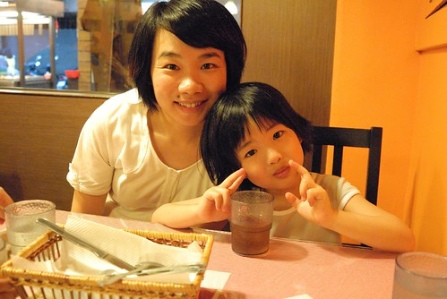 FeedMe的招牌是巨無霸漢堡.. 雖然徹爸望著別人的排餐很心動 雖然我知道那漢堡真的很大很大 我們肯定會吃不完 但徹爸說難得來一次 沒來個最有特色的巨無霸實在太枉然 因此我們真的'不顧一切'的點了三種肉的巨無霸漢堡 雖然點餐時 小姐便已解釋漢堡直徑大約22公分 但是等漢堡真的送上桌時 我跟徹爸還是忍不住對著漢堡瞪大了眼 喊著'哇賽! 這麼大' 小姐好像以為我們'面有難色' 還很好心但聽的出很惶恐的問著'還是我幫你們先切一切' 哈哈! 沒啦~ 我們兩個只是被嚇到有點呆了...想不到原來22公分的漢堡真的可以這麼壯觀.... 連阿徹跟愛愛隔天每當人家問去逢甲夜市吃什麼 兩人就振奮的說著 '..那個漢堡比媽媽的臉還要大...' 外加兩人兩雙小手的筆劃著.... 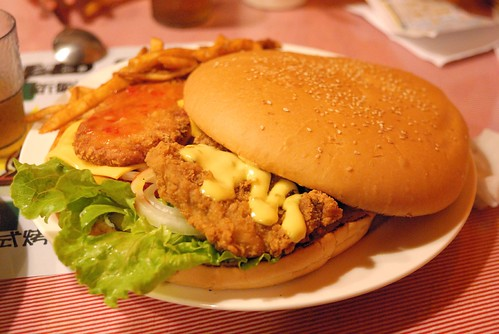 想像一下 一個可以同時平舖上一般漢堡尺寸的炸雞排 炸蝦排以及牛肉排 這個漢堡有多大... 真的真的很大...真的看到就有種飽的感覺... 不過漢堡出乎意外的比想像中好吃 麵包有軟 排有鮮嫩 醬料酸甜對味...還挺不錯的 只是考量之後的夜市 我們最後還是沒能嗑完 剩下了1/8... 漢堡全是我跟徹爸吃的 阿徹跟愛愛則是另外吃了盤嫩雞義大利麵以及我們漢堡盤上的脆薯 第一次吃帶點小小辣的義大利麵 阿徹吃的很過癮 開心說著'台中的義大利麵真是太好吃了...' 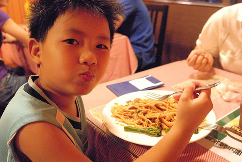 吃完晚餐後 我們沿著文華路開始逛我們的夜市 感覺走了好久才走到逢甲大門 才走到以前每次來的起點... 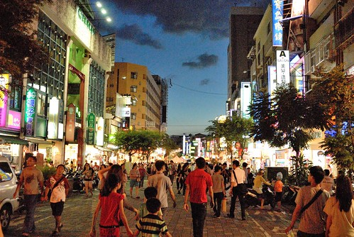 最後一次來逢甲已經是14年前 我跟徹爸交往第一天的事了 真的好久好久前..... 這幾年聽聞逢甲夜市大很多也熱鬧很多 玟姿甚至跟我說"10年了 你長大了 逢甲夜市也長大了 就抱著隨遇而安的心 好好去逛逛吧" (乾脆說10年我都已經從青春少女變成小學生的媽了) 果然! 今晚我跟徹爸不知道說了幾次 感歎了幾次 "真是變好多 真是熱鬧到誇張...." 連個小小地瓜球攤都可以這樣熱鬧 都要排隊十來分鐘  這是今晚夜市裡唯一照相的食物 因為人真的太多啦 多到讓人忘記也不想照相了 (話說 我把地瓜球串的還真像炸丸子哩 呵呵) 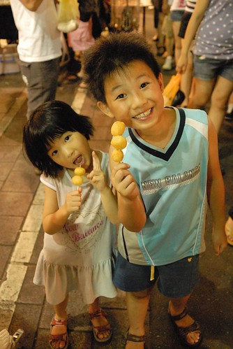 我們花了一個多小時吃了 地瓜球 烤魷魚 炸魚 成龍大雞排 現打綜合果汁 外加逛了一家禮品玩具店 逛完後 老實講還蠻失望的說.... 特別是大學裡佔有重要回憶的逢甲大雞排怎麼(變的? )又扁又鹹 而且夜市已經完全沒有當年 買塊雞排後 可以邊走邊吃邊逛的悠閒感了 莫非這就是玟姿前一天所要暗示的"幻滅就是成長的開始阿!" .....

9點回到下榻處後 一家子洗個澡後10點便一起上床睡覺了 當初本來考慮要用徹爸的旅遊補助點數找個商旅住 可是發現台中週末的房間還真是又貴且難訂阿 且考量我們夜市逛晚晚 隔天又早早要出門 真只是一個睡覺地方 因此最後住了球隊事前預訂的一日套房 這是我們的一日套房初體驗 雖然整體環境簡單也算乾淨 但寢具與冷氣的品質並不是很好 讓我跟徹爸睡的不甚好 不過徹愛兄妹倆的標準很不高 進房後直嚷著好漂亮 阿徹甚至還會說這樣簡簡單單的很漂亮.... 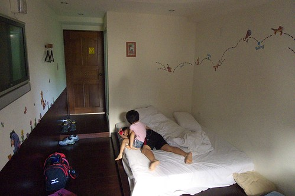 週日一大早八點 我們便退房出門了 徹爸先送我們去美術館跟玟姿阿姨會合 玟姿阿姨是我們母子三人今日的司機兼伴遊小姐 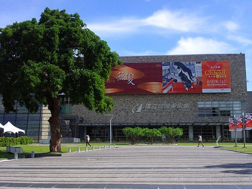 然後徹爸去台中工業區的球場打球... 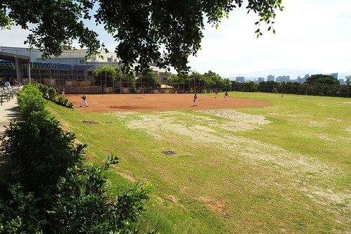 沒錯 我們一家今日兵分二路 我們母子三人沒那麼好心也沒那雅緻 在大熱天裡去球場幫親愛的老公/爸爸加油 況且我們母子三人有阿姨照顧 可以開開心心去玩 相信徹爸更能放心 自在的打球滴...

兩年前的暑假曾經看到國美館的相關新聞 推薦玟姿可以帶小姪女去國美的兒童遊戲室玩 總算我也有機會帶著徹愛來了 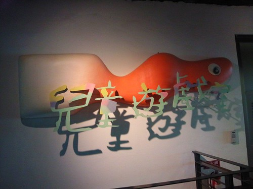 國美館的兒童遊戲室假日共有四個場次 每場次150人 得排隊領預約卷方能進場 我們9點前便抵達 趕開門的第一場 順利進場 進場後 玩些簡單的設施後 先去做第一個紙偶DIY課程 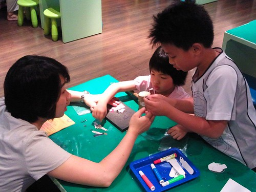 愛愛在帶領幾次後 很快的便可自己拿槌子打洞 好像有幾次不小心敲到自己的手 可是愛愛都沒唉沒哭 只有事後才悠悠的說"被槌子打到 好痛阿" 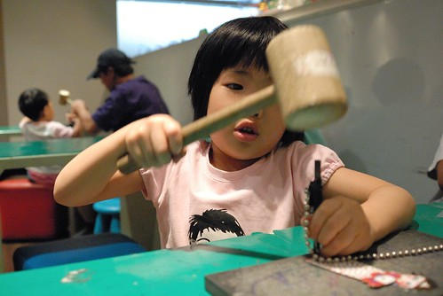 而小學生阿徹更是完全不用阿母操心 自己一手包辦 甚至還選擇空白的紙偶自己上色 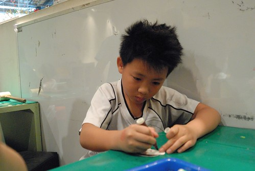 只要打洞跟組裝的愛愛很快地就完成她的作品 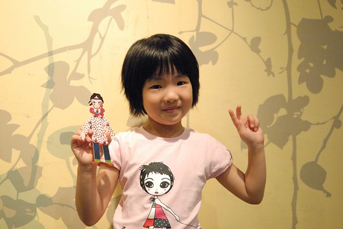 而阿徹則是花了點時間著好玩偶的顏色 著好衣服的顏色時 阿姨說"要不要再畫點什麼 比較漂亮阿" 阿徹二話不說拿起筆變點點 點起花紋 等阿徹著腳掌的顏色時 阿姨說"這顏色跟臉的顏色一樣 他不穿鞋子阿" 阿徹笑笑說"要阿 等會會畫" 當我跟阿姨看到阿徹拿著黑筆畫上簡單的夾腳拖鞋時 忍不住叫絕 搭雙夾腳拖的人偶整個時尚了起來 哈! 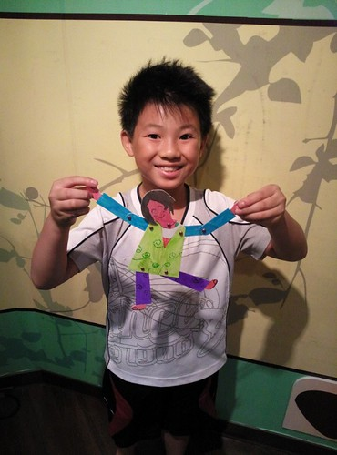 第一個DIY 兄妹倆大成功! 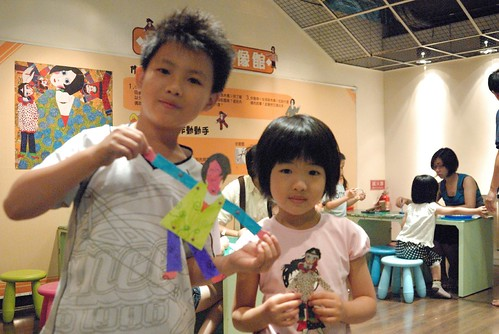 緊接著我們又去做了第二個DIY 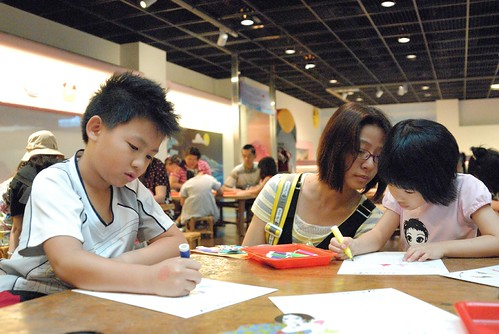 玟姿阿姨說她今日是和藹可親的伴遊阿姨 事實證明真的有和藹 有可親 對付小孩子的耐性與功力出乎我意外的高 想不到高中老師對小小孩也這麼厲害 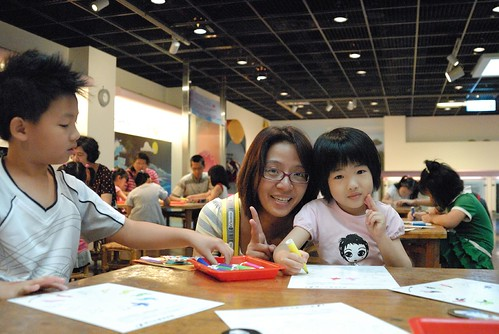 這個DIY主要就是替轉盤上色 急於去玩其他東西的阿徹開始沒耐性塗的隨便 我說"你塗的比愛愛還不仔細 用心" 結果小子竟然說"你不知道隨便也是我的風格之一嗎" 哇勒! 還風格勒~ (DIY的名稱是"安徒生剪紙動起來-在跳舞的皮埃羅") 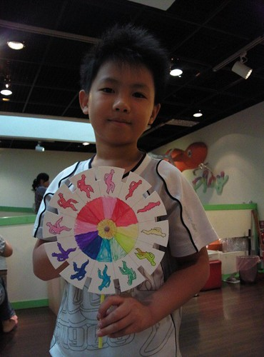 哥哥都已經滿場玩 不知道玩幾樣去了 可是愛愛還是依著自己的速度 仔細地上好所有的顏色 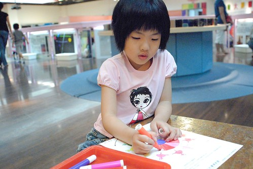 愛愛完成DIY後也開始到處玩 首先是壓克力板塗鴉  猜! 愛愛要畫什麼 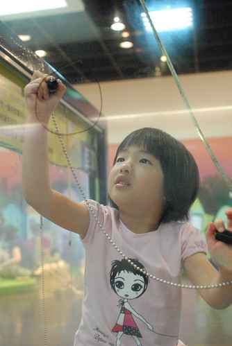 阿母看她下的第一筆就知道是穿裙子的女生啦!   原來是有刷睫毛 披著白紗的新娘子 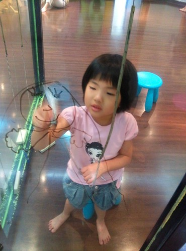 阿姨跟阿徹說"我坐你對面 你畫我" 阿徹扭扭捏捏不願意 我偷偷跟阿徹說"要不然你畫一隻豬好了" 果然阿徹便開心地 且下筆有如神助的畫了豬鼻阿姨 除了豬鼻外 其於的髮型 衣服 手勢其實還畫的挺寫真的 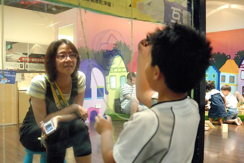 向來喜歡畫畫美勞課的阿徹 來這裡玩的很開心  可是阿姨念著要趕場去吃點心喝茶嚕... 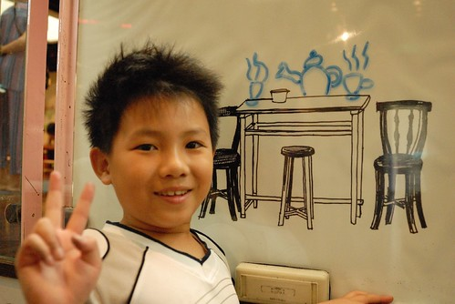 離去前 阿姨突然問愛愛要不要當美人魚 於是愛愛被我們搞成這樣的美人魚 哈哈! (徹爸說 好好一個女孩子被弄成這樣....) 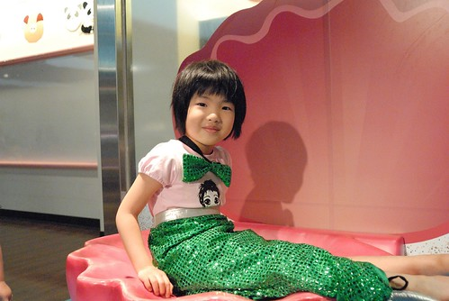 短短一個半小時 阿徹愛愛當然是不過癮  直嚷著哪還沒玩 哪展品還沒看... 乖 下次再找機會來這當小藝術家! 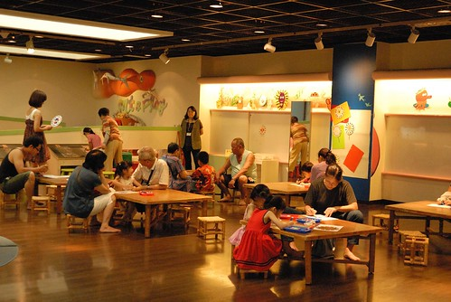 匆忙的準備出館時 從樓梯間的玻璃窗一眼望去看見這樣的好景色 真是個好地方阿! 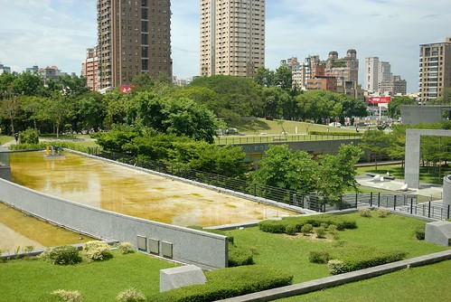 就在我們吹冷氣玩藝術 吃點心的同時 徹爸正如火如荼的頂著烈陽打球ing 爸爸!  加油! 我們精神與你同在! 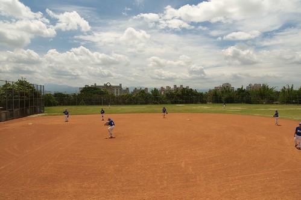 接著玟姿阿姨帶我們去美術館附近的'法米法式甜點'當貴婦吃點心 前幾天聽到阿姨說要帶我去當貴婦 我還問那我可以穿短褲去嗎 阿姨說 沒關係 因為只是價格很貴... 雖然最後證明穿短褲真的無傷 但那真的是好有FU 好貴的地方喔! 而且玟姿阿姨還很貼心的先預訂了親子包廂 她據聞裡面小孩子有得玩... 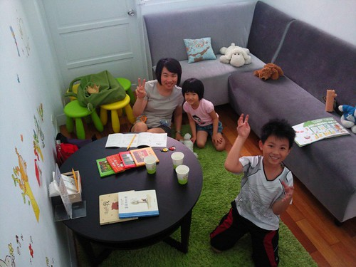 包廂跟非包廂部分截然不同的FU 我說包廂外人家是安安靜靜悠悠閒閒的吃早午餐 我們這裡面卻是一片鬧哄哄 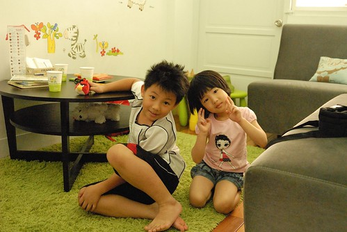 話說我們在等阿姨停車 等帶位時 阿徹問我"怎麼現在就來吃點心阿 應該是先吃午餐後再吃點心才對阿" 我笑說 "你果然是我兒子 這問題我也問過阿姨了" 可是好像因為下午很難訂吧! 於是我們早上十點半 人家才開店沒多久 就來吃甜點了 包廂的風格其實就是IKEA的燈具 小椅 以及可愛的壁貼 玩偶及童書所組成(全台標榜小孩的地方好像都這風格) 不過這片綠色的地毯很是關鍵 阿徹跟阿姨都忍不住高呼"好像在綠色的草坪上喔" 而我們也一整個都是坐或躺在這地毯上聊天玩耍 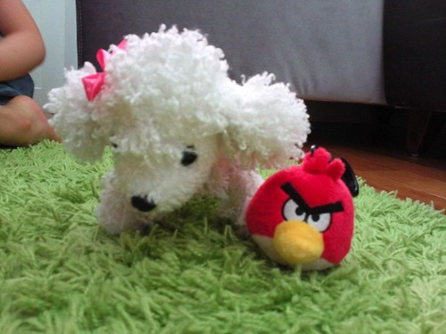 (右邊的angry bird是前一晚阿徹在逢甲夜市買的"紀念品" 媽媽說來這種城市地方哪還買紀念品 結果阿徹說這只有台中才有賣 雖然我們說台北也有只是我們都沒去逛街所以不知道 但是阿徹很堅持台中才有....) 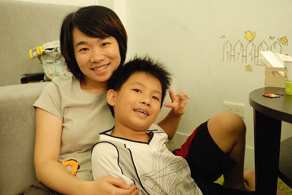 其實我高度懷疑是阿姨自己最想進來這親子包廂玩的...  阿姨的high度完全不輸徹愛兄妹倆 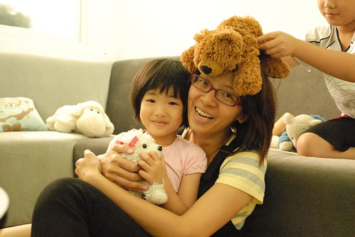 包廂的每人低消是150元 小孩子也算人 我說得吃600元的點心有點辛苦哩 可是阿姨說 這裡這麼貴點個飲料 沒幾個點心就超過了 果然是真的... 我第一次這樣當貴婦... 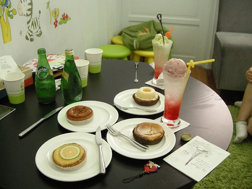 阿徹跟愛愛也是長這麼大第一次面對這麼多且高貴的點心飲料 不過阿徹果然是男孩子 不愛吃甜點 除了靠近他的那盤(是他跟愛愛點的) 吃了一口外 其餘幾乎引不起他興趣 而且過了前30分鐘的狂喊這裡好漂亮 好舒服後 就開始唸著"吃完沒 還要吃多久" 心都飛去美術館那些他還沒看到的展品上了... 不過向來愛吃甜點的愛愛則是吃的很開心 每個點心都願意嘗試 甚至還認真的把點心排名了 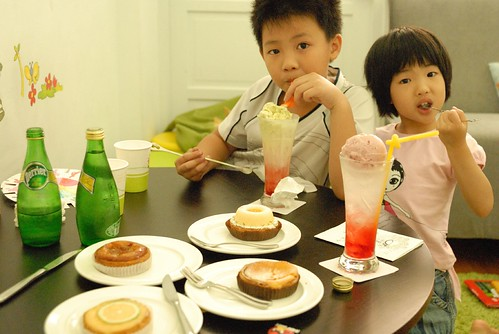 雖然吃了這麼多點心 但酸酸甜甜的味道卻讓我們越吃越想吃鹹的中餐 跟阿徹討論了好久之後 他選擇要吃義大利麵(因為他一心想要在附近吃一吃好再進去美術館) 於是阿姨又帶我們去黎明路上 他個人常去光顧的義大利麵店 生意真的有好! 就像阿姨說的"如果店門口沒人等 那一定是沒開店" 好在我們等沒多久就有位置了 只是門口的位置又熱又吵雜...(同時有兩個位置 老闆竟然還不准我們選位) 麵上來後 阿徹喊等一下 然後拿出他的相機要拍照 幫阿姨拍了一張後 還笑盈盈的說"阿姨 我幫你拍的很青春喔"  呵呵! 果真有青春阿!  再幫阿姨還有媽媽合照一張 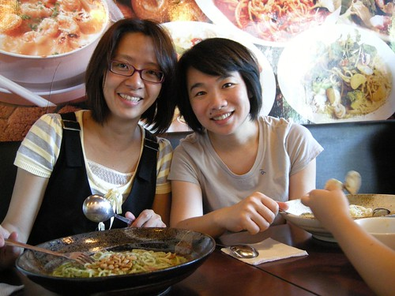 等到自己的焗烤飯上桌時 還費心的擺好餐具 飲料再照一張 小子果然越來越會利用相機 會照相了....(看完今日我跟阿徹拍的照片 徹爸還是比較稱讚他兒子) 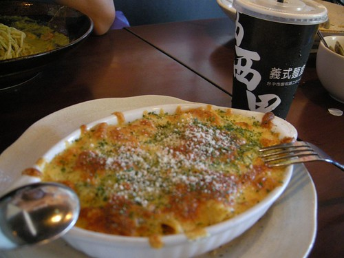 我們在義大利麵店吃得滿頭大汗 徹爸這時候好像也在球場邊滿頭大汗... 徹爸 繼續加油! 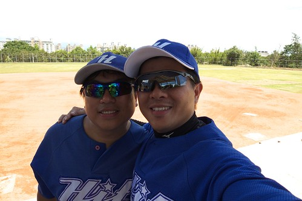 考量徹爸原先說的球賽大約2點多便結束 於是我們吃完義大麵便回阿姨家準備等徹爸 可是我們從二點等到三點 再從三點等到四點 我等到都打瞌睡了... 徹爸依然還在球場上奮戰 可能看我們太無聊 於是阿姨搬出他的私房勞作-蓋章 給我們玩 話說我還是第一次發現原來蓋章是門大學問阿 章個個漂亮特別不說 還可以做凸面 做熱塑片... 混了一整天 才發現原來最好玩的就在阿姨家阿 好玩到愛愛回家後一直唸唸不忘 直問著什麼時後要再去台中 要再去阿姨家 有一天早上睡醒後還跟我說 她夢到我們去台中玩 去阿姨家蓋章...

那天下午還約了我大二時後的家教學生碰個面的 (學生當時高一生 現在也是熟女一枚 覺得我們的距離真是越來越小了 呵呵) 因為徹爸的時間未定 等了好久後 只好再勞駕阿姨專車送我們趕場去 當我帶著徹愛來到會合的春水堂時 阿徹一看到店門口就大呼"又要喝下午茶喔" 哈! 今天的吃吃喝喝好像讓阿徹怕到了 所幸讓兄妹倆各喝一杯珍奶還能讓我跟凰嬿阿姨好好聊個天(兄妹倆今天吃的喝的甜點飲料真是破紀錄了) 只是離開後 我才發現我忘了跟凰嬿阿姨照張相啦....難得來一趟台中說.......嗚.............

徹爸打球打到快5點才跟我們會合 在春水堂喝了杯涼後我們一家子便又轉往中興大學去了 其實那時間已經是我們平常出門在外的回家時間了 而且徹爸應該真的很累了 但是此行最大的目的中興校園還沒去 這這..怎回得了家阿... 所以我跟徹爸還是拖著疲憊的身體去中興走走 車子停在興大路上 我們從綜合大樓旁的側門進去 才進門就發現我們沒見過的新大樓 再往中興湖前進 咦! 馬桶圖書館不見了 原地取代的是超級大器的新圖書館 我笑說果然如圖書館外牆掛條上所寫"邁向世界一流大學阿" 覺得中興少了我們那年代的"土味"(以前超像農學校) 氣質真的不太一樣了 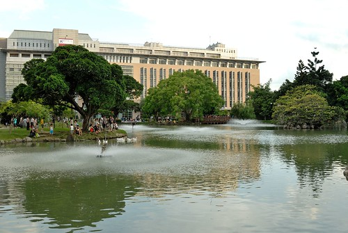 今日來中興最大的目的 當然是要到系館前晃晃  應數系的系館大概是全校園裡變化最少的 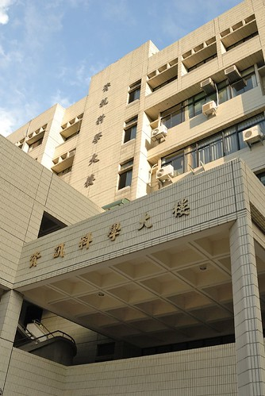 徹爸照了張系館的照片後 便急於PO到FB上 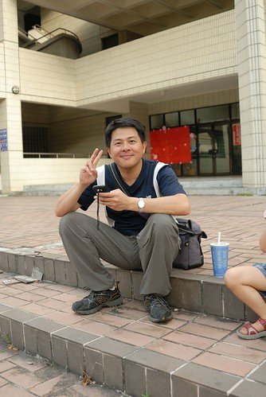 我跟愛愛則是吃起剛在中興湖畔買的茶葉蛋跟標榜中興鮮奶的冰淇淋 (中興湖畔有鐵牛車改裝的販賣車 而且還是學生在賣的 我說我這樣消費也算回饋母校吧) 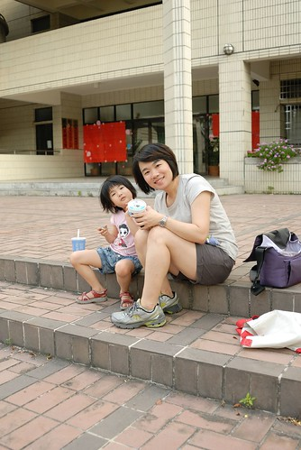 想了扯鈴一整天的阿徹則是破不急待的玩起他的扯鈴 徹爸說 來效法人家的圤街 我們也來個阿徹一百扯好了 第一扯就在今日的中興應數系館前..只是阿徹很不捧場不給正面照 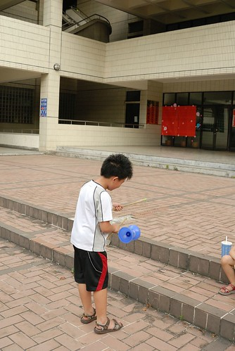 上回來系館是阿徹一歲的時後 那時後阿徹才剛學會走路 蹣跚的在系館前暴走 而今日卻已經是個壯碩的小二生了... 請容我再感嘆一次"時間納ㄟ過蔗呢緊"  在系館前短暫停留回憶後 我們應阿徹的請求讓他去行政大樓後的大草坪好好扯個夠 前進的路上 換愛愛邊走邊扯 很愛扯的兄妹倆... 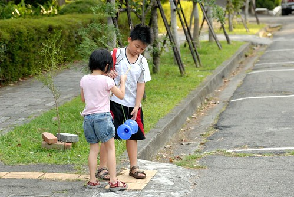 校園內到處有阿勃勒盛開著 尤其農業科學大樓旁的這棵 夕陽餘暉照映下特美... 話說帶著自己小孩走在母校裡 感覺真是奇妙.. 而對阿徹來講 走在爸爸媽媽曾經的校園裡 聽著我們說著以前的故事 應該也很有一番感受吧!  這回來中興 發現來中興湖畔散步 來大草坪上打球遊戲的人很多哩 熱鬧到儼然像是個風景區似的 加上校園內過往的車輛 路旁停滿的汽車... 徹爸說這感覺有像台大了 呵呵!  兒子 總算如你心願讓你在爸媽的母校扯了 這張就當作你一百扯的第一扯吧! 要認真繼續扯下去喔! 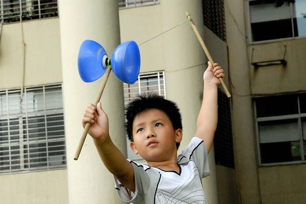 而小姑娘愛愛 要記得爸爸媽媽的愛情故事 以後去大學好好找個像爸爸一樣的好男人喔! 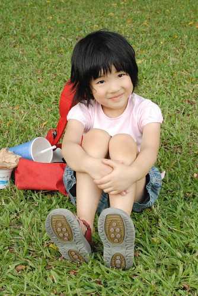 短短24小時的台中停留 很緊湊但很開心且回味無窮......................... 後記: 6點半離開中興後 我們便打道回府 直驅交流道 只是沿途我們竟然停了4-5家的7-11後才買齊父子三人要的三個飯糰   台中的御飯糰怎麼這麼難買阿?!
