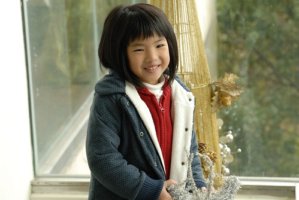

入秋以後 徹愛兄妹倆常嚷著"好想去泡溫泉 好想去住外面泡溫泉喔" 我說這對兄妹倆果然食髓知味 越來越會享受了(到底這樣是好是壞 我也不明白) 於是年底前安排了一趟苗栗的泡湯加草莓之旅 既可哄小孩又可用掉徹爸今年的旅遊補助! 來過幾次泰安 我蠻喜歡那還帶點原始的山林以及安靜的氛圍 而裡頭的溫泉飯店也都各有特色且品質不錯 這回為了滿足徹爸對於日本大浴場的懷念 我們選擇了沒有SAP只有大眾裸湯的竹美山閣入住 泡完湯後 可以在乾淨的置衣間穿上浴衣 然後涼爽且自在的啪著拖鞋漫步回房間 這才是完整的溫泉享受阿!

因為是透過PAYEASY的訂房 所以我們的住宿並未包含晚餐的提供 (如果可以一宿二泊會更讚的 可是單買晚餐那一泊實在是太貴了) 所以入山前 我們先去泰安豆腐街解決我們的晚餐 傍晚5點半多 整條豆腐老街的商店已大半打烊 除了這家手工豆腐店還人聲鼎沸  整間都還是坐著用餐以及等待用餐的遊客 老闆娘說"可以先點餐 等一下一定有位置 因為我們六點就打烊了" 也就是說反正就等著 六點後不會再接受新客人 所以等到最後一定會有位置低 於是我們點完餐後 等了快20分鐘才有位置然後再等了好一會餐點才上桌 但 等待真的有值得! 每樣東西都很好吃 尤其是豆腐 不論是炸豆腐 豆腐丸子 豆腐湯... 只是阿徹真的沒有興趣與耐心去為了一頓飯等待許久 回家後的討論他特別提出這點意見

這次的房間是飯店內唯一可以加床的房型 精緻和室房 房間內部區隔為客房 和室  有浴池的浴室以及小陽台 整體感覺簡單但寬敞舒適  check in時 特別跟服務人員要了兩件小朋友的浴衣 我們才剛到房間門口 服務人員便已同時送達 阿徹跟愛愛進房後就迫不及待的要換上 原先服務人員認為浴衣尺寸對愛愛來說應該會太大 但沒想到 穿起來將將好而且超級可愛  反倒是浴衣的花色與大小比較不那麼適合阿徹  顯得阿徹有點裝可愛說  泡湯前 泡湯後 兄妹倆就這樣一直穿著浴衣 沉浸在泡溫泉的FU中  尤其愛愛 連動作舉止也日本了起來 隔天早上也講了好多次的"我好喜歡這衣服 可以帶回家嗎?"  對照之下 我們的阿徹哥哥又又....真的不是很適合這浴衣哩 (不過穿浴衣 抓大腿應該方便很多)  這是第一次全家人一起穿浴衣  而且這機會超級難得  得好好的拍照紀念一下  原先徹爸還不太願意 嘀咕了一下"這有什麼好照的" 不過照了第一張後 徹爸的興致一整個高昂起來 徹爸說"和室拉門關上後 還真有FU 照片傳到FB上跟人家說這是日本 大家應該會相信"  這兩三年 全家人都好想再去日本 尤其是日本的溫泉 常四個人聊阿聊就一起發夢說著"好想去日本阿!" 不過現在的情況(養房養子)  短時間之內實在很難實現這夢想 所以難得在台灣可以泡到大浴場  一家子一起穿浴衣兜阿兜  就很令我們開心了!  照完全家福 說個睡前故事 徹愛可以上床睡個好覺嚕!  第二天早上進餐廳前 走廊窗外一眼望去看見這樣煙雨濛濛的泰安  有種深山祕湯的感覺 泰安真的是很適合來趟溫泉小旅行的好地方!  12月是聖誕鈴聲響的季節  飯店大廳內當然也有很多聖誕節的裝飾  我跟徹愛說"有一種提早過聖誕節的感覺哩"  這種歡樂的感覺挺好的 也許以後每年的12月都可以來安排像這樣的泡湯小旅行  建立徹家的傳統之一!  愛愛現在出門很喜歡跟各種"不會動"的佈置照相( 會動的妝扮人偶則會嚇的遠遠的)  常會主動說"爸爸 幫我照相" 而鏡頭下的小女生真的越來越像小女生了  尤其徹爸鏡頭下捕捉到的那些不經意的"瞬間"  更顯見是個開心的小女生  至於阿徹哥哥 ㄟ..就如徹爸常說的"老嚕"!  不過我還是覺得我們家阿徹很帥!!  前一天泡完男女分開的裸湯後 阿徹直嚷著"這種溫泉不好 不能全家人一起泡 連絡感情" 我說我們平常連絡的感情也夠多了吧  而且我跟愛愛 他跟爸爸各自聊著女生及男生的話題很好阿 尤其大浴池根本沒有人 他們男湯包全場 我們女湯也包了半場  多寬敞又舒服的泡湯空間 但阿徹還是很堅持全家人該一起泡湯聯絡感情 於時吃完早餐  散步消化一下後 趁著11點退房前 我們一家子在浴室的湯池聯絡感情 原來兄妹倆愛的是這樣的泡湯阿! 可以四個人一起聊天 可以玩來玩去!  泡完家庭湯屋 兄妹倆滿足了 我們也可以退房下山繼續我們的小旅行了!

ps.  其實有四個人一起在湯池裡照了張全家福 雖然大家都只露鎖骨以上 但媽媽會害羞...所以只能留在家庭相簿裡紀念 ps. 順帶抱怨一下那天泡湯時遇到的女客 話說我跟愛愛在大浴池旁努力洗身時 出現四名身上圍著大浴巾的女客  她們竟然沒有淨身也沒有把浴巾拿掉 就直接大辣辣的下池去  然後大聲嘻笑聊八卦 而泡完湯後浴巾依舊圍在她們的身上 然後一路溼答答走回置衣間... 人客阿! 泡湯禮儀要多注意啦!  這樣讓坦蕩蕩的我跟愛愛真的很吃虧哩! (雖然我剛好可以好好跟愛愛說泡湯禮儀的重要性) 後來跟徹爸說這件事 徹爸第一個反應"她們以為她們在拍偶像劇喔"  哈! 徹爸這個梗好笑!!
