在華陶窯那天的中午 徹爸便驚呼著"天阿 我早上竟然已經拍一百多張了.." 而回家後整理照片時 徹爸又說了好幾次的"真的照好多.."    數量多到讓徹爸不敢開始而延遲了兩天後才動工 徹爸甚至跟我說"我怎麼覺得我好像去過這地方...有種掉進歷史的感覺" 其實華陶窯真的不大 但置身在其中的我們卻有很多的感動 或許就因為我們很認真走進華陶窯的故事裡了 如官網上的這段話 "且把你的耳朵、視線以及步伐，交給我們，讓我們說花陶窯景的故事給你聽。 如果想了解我們生長的土地究竟是什麼樣子？ 歡迎走進這場「花陶窯景經典遊」， 讓我們一同來描繪原鄉土地的輪廓。" 

華陶窯的活動採預約制  而且好像一日入園人數的上限是350人 我們報名的是從上午10點到下午4點的經典遊 全程有專屬解說員導覽 內容包括午餐(割稻仔飯)、燒窯介紹、人文庭園賞遊、台灣原生植物園賞遊、陶藝教學以及DIY玩泥捏陶 那日除了幾個大團體外 只有連我們在內的三個小團體共10人參加這批次的全天體驗活動 所以活動品質非常的令人滿意 就從頭看照片回顧我們那天在華陶窯所體驗的一點一滴~

10點初人都到齊後集合於餐廳 由解說員介紹華陶窯的起源以及今日活動安排 解說員間好像會先協調活動的安排 以避免同一場地同時湧入太多遊客 所以那天除了在人文庭園區跟另一團體撞了兩次面外 其餘活動幾乎都不會被打擾 我們的活動順序為 人文庭園 燒窯介紹 午餐 植物園 陶藝教學與捏陶  跟隨著解說員(新宜)的腳步  才一開始 餐廳門前的海葡萄樹就讓我們駐足許久 聽著新宜的說明 想像著冬天時葉子會轉紅的海葡萄有多麼美麗 而掉落的又紅又圓的葉子拿來裝小點心是多麼的雅緻  人文庭園區的拄著枴狀的榕樹老爺爺 10幾年前 榕樹主幹生了嚴重的病 無法傳輸養份到莖葉 於是窯主借用水管與竹子 刻意養大榕樹的氣根 因此靠著氣根的養份傳輸 現在的榕樹老爺爺還是活的很旺盛 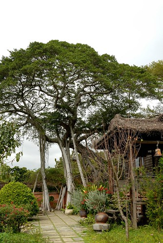 上頭房子的前廊下掛了一個鐘與鼓 早上10點會敲出24聲的鐘鼓(迎賓鐘)  代表一年24個節氣都竭誠歡迎到訪的遊客 而下午4點敲出36聲的送賓鐘 則取66大順之意 希望每個遊客都平安 順利  超大的蕉 讓人連想起西遊記裡的芭蕉扇 尤其這裡又是火炎山 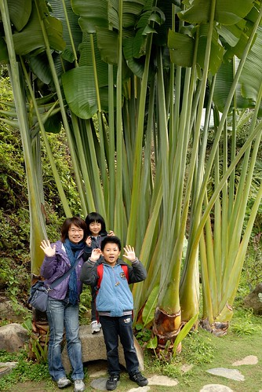 新宜跟我們解說著一路上的每個花 每個草... 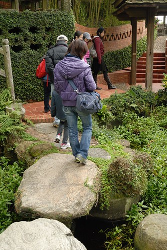 還帶我們到她最喜歡的一個地方  就是窯主家的大露臺 站在窯主的陽台 前方的鐵砧山完整呈現 而且聽說還可以看到太陽火紅紅的跳下山 難怪窯主在這露台擺了張大圓桌  美酒伴美景 多棒的待客方式  雖說真想跟窯主做朋友 好接受他的夕陽美景招待 可是窯主醉了  還是不要亂打擾他.. 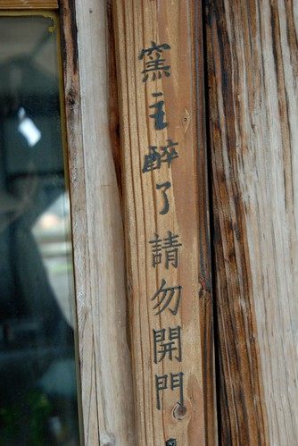 窯主家的大門口掛著以前養大他的家裡商行匾額 還有他那慈愛又長壽的奶奶照片 希望大家可以跟奶奶一樣活到一百多歲  一旁的院子裡 俗稱米老俗的小花  隨處可見的花器 裡頭的花草是精心也是隨興 不過我相信我就沒這樣信手拈來的巧心 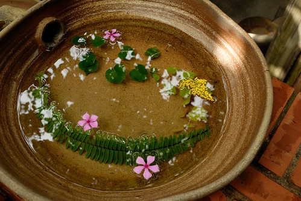 階梯 平台 不同形狀的門 延伸出的長長通道 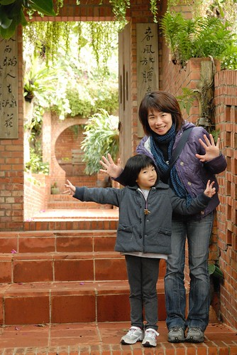 導覽時來不及好好拍照 等吃完中餐我們又再刻意跑來這照相 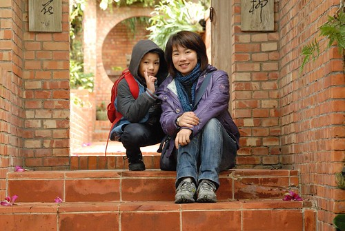 只可惜真的很難拍出那個moment  通道盡頭放的這張椅子 我說好像五燈獎裡衛冕者的寶座喔 一路從下頭的階梯跑上來 然後坐上這椅子 揮揮手.. 呵呵  園內有兩座窯 這是比較小的(忘了字了  新宜說窯名都是看外形叫的 那這是穴窯嗎)  窯旁整齊堆放著燒窯時用的相思木 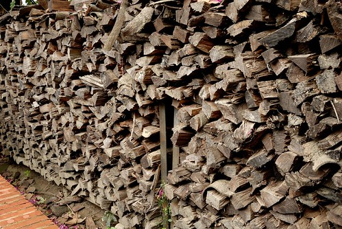 窯的不遠處還有一個可愛的狗屋   真是在這連狗都幸福 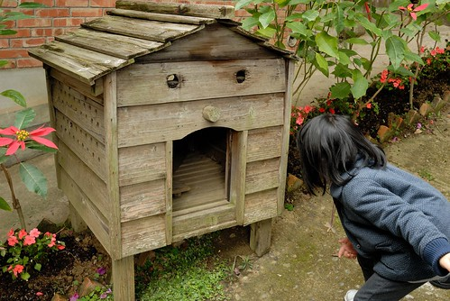 跟著新宜 我們穿梭在園區內 穿過樹洞也是捷徑之一  接著來到主要的燒陶處(那個綠色外牆才是我放這張照片的目的啦)  看形狀猜猜看這窯叫什麼? 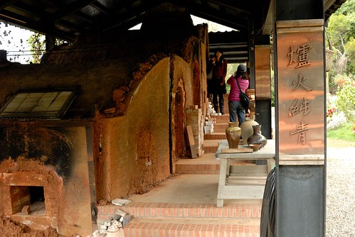 "登窯"  一步一步拾階而上 在這新宜跟我們解說陶燒的幾種方式 並教我們如何分辨  燒一半的 吸水性還特強 只適合當杯墊 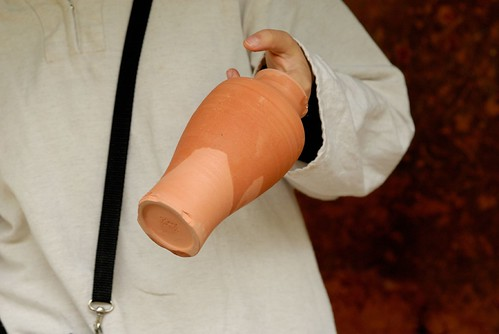 經過7天7夜材燒的作品 不知道窯裡會發生什麼事  釉如何附著... 所以每件成品都是獨一無二的藝術品 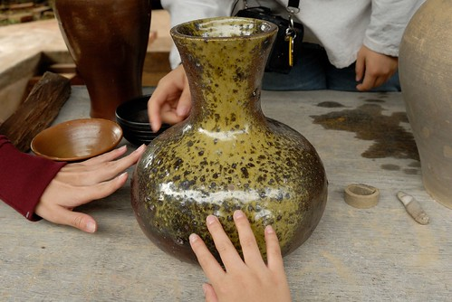 完成燒窯解說後 11點半我們回到餐廳吃午餐 午餐是自助式的割稻仔飯  有材燒白米飯 米湯 米粉湯 還有魯肉 豆乾 筍絲 菜埔蛋 高麗菜 白宰雞以及福菜湯 樣樣都是傳統農家的經典菜色  尤其用大碗公裝著的飯菜感覺更是好吃...  阿徹說"我要吃三碗!" 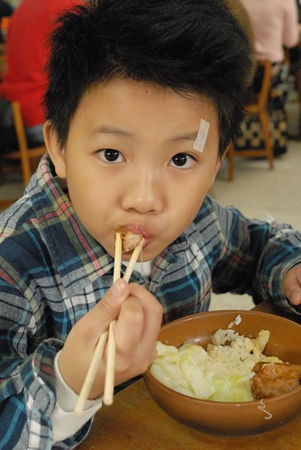 可惜大碗公的容量真不容小靚 阿徹喀完一大碗後便帶點遺憾的宣告放棄三碗  愛愛也大口大口吃著大碗公裡的飯菜 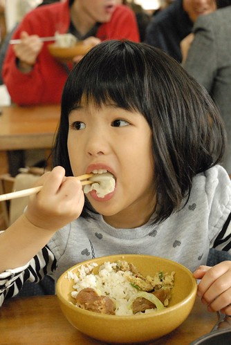 而吃飽飯菜後 我們一家子又吃了堆滿一大碗公皮的柳丁 真是簡單但滿足的一餐!  趁著飯後到下午活動集合時間前的空檔 我們把握時間到早上沒能好好拍照的地方補照相 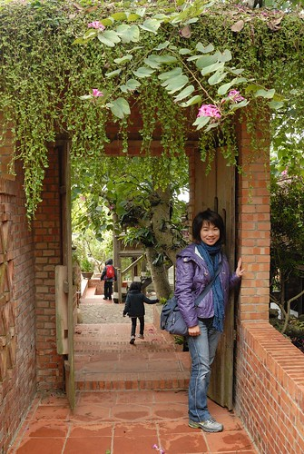 (每每經過這顆黃金槭樹下 就讓人忍不住抬頭看幾眼) 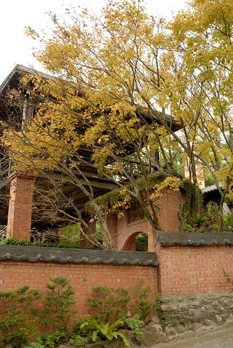 (這棵樹的天空也很棒) 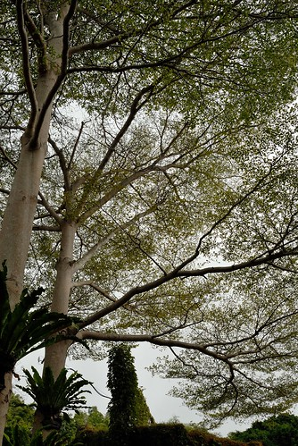 等著集合時 愛愛跟我開心的玩著小遊戲.. 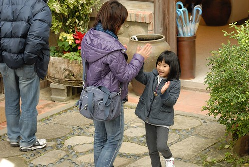 然後12點20 準時開始下午的植物園導覽 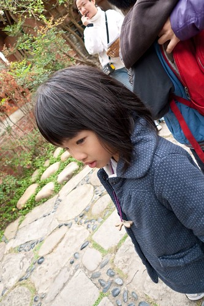 除了原先早上一起活動的10個人 又再加入一些遊客一起來趟植物園體驗 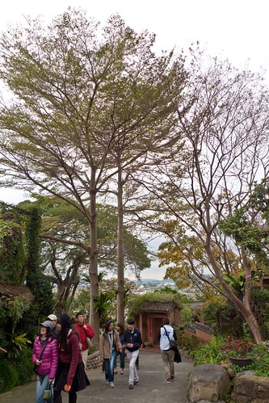 這是途中看到的另一顆利用水管/竹子養氣根的老榕樹 希望透過這樣的養成 幾十年後便能成就一個最原汁原味的樹屋 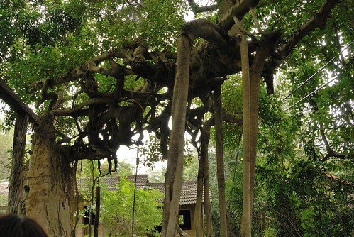 植物園不在園區內 得先走過一段產業道路(還經過隔壁鄰居家門前) 且植物園大門平時鎖著 遊客只能在解說員的帶領下才得以進入 而進入植物園後 一個跟外頭產業道路上完全不同的景緻頓時出現  幾株黃金槭數正黃澄澄的美麗著  而園內一株熱帶地區特有種"砲彈樹" 也正異於往年的結果累累!  一顆有著茂密綠葉的樹  主幹上就這樣長出許多像是放大好幾倍的龍眼的東西 你說奇怪不奇怪!  這就是真的超奇怪的砲彈樹  園內有一座人工小池塘 池畔邊種滿近百株的梅樹 正月梅花盛開的時節想必一定很漂亮  池裡還養了兩隻鵝與一隻鴨 看到我們來 ㄚㄚㄚ叫個不停希望討點零食吃 可惜大家身上都沒有麵包或饅頭 讓鵝與鴨失望的直到我們離開還ㄚ個不停 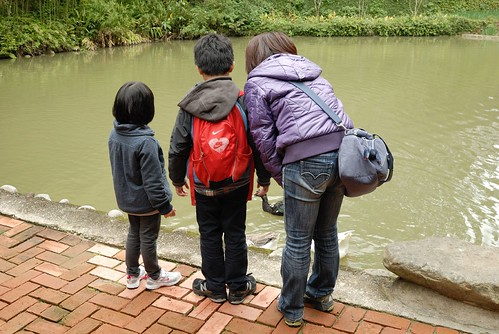

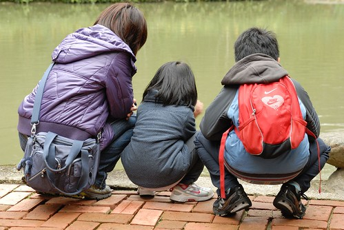 愛愛直說天鵝好漂亮! 看了好久...  跟隨著新宜的腳步 繼續探索著植物園美麗的地方 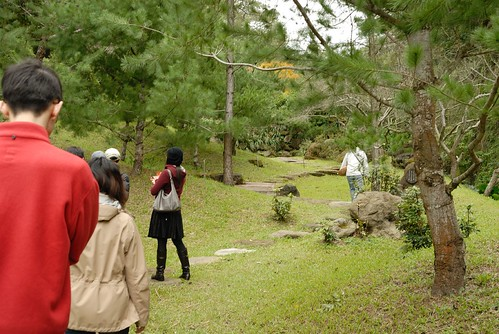 "華陶窯" 代表著花 陶 與窯(那日才知道華是花的古字) 這三大要素的構成原因 我覺得是個挺浪漫的愛情故事 由於窯主夫人是個花藝老師  苦於沒有好的花器 於是夫妻倆乾脆自己蓋窯燒花器 此外 窯主還跟政府租了這五公頃的植物園山地 種滿各式各樣的花材 一切的起源都在於窯主夫人 然後夫婦倆打造出這樣的華陶窯 我覺得這本身就是個動人的故事  植物園內第三個停憩的點 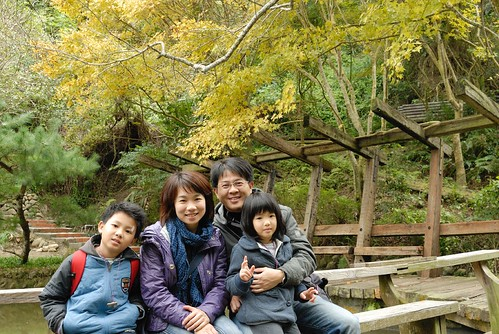 這的槭樹一樣也盛開著  看到好多漂亮的槭樹是這回的大收穫  群樹環抱的小台地 有種祕密基地的感覺 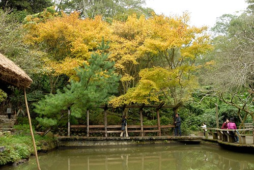 聽說這裡是窯主最喜歡的辦公地方 坐在這涼亭裡想事情 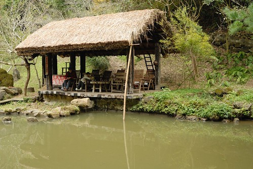 站在涼亭對岸時 還不太能體會窯主為什麼這麼喜歡這裡 但是坐在涼亭後 嗯! 果然是個可以讓人沉思的好地方阿 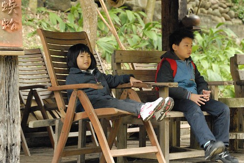 因為很容易坐著就不想動了  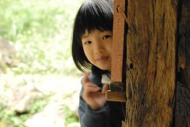 只是調皮的愛愛竟然在這聖地玩起躲貓貓.... 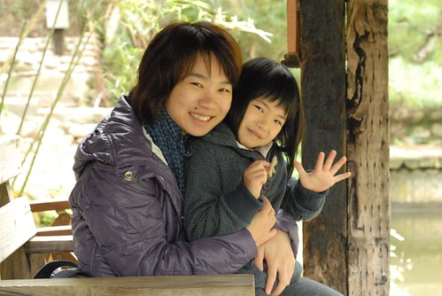 植物園的導覽很豐富但不緊湊 每個停憩給予我們很多的感受與照相時間 甚至在最後的停憩 我們還愜意的來了盤樹下的西瓜棋對決 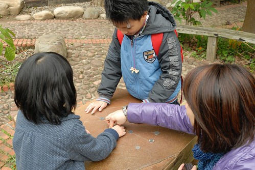 2點結束植物園的導覽後 緊接著是半小時的陶藝教學 由解說員簡單說明與示範捏陶的步驟與要點 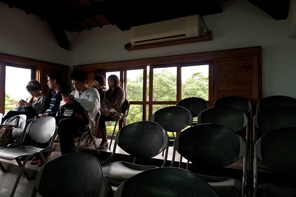 參與捏陶活動的人皆領取一包初土 可以選擇手捏或是投幣玩手拉坯 拉坏師傅先是示範手拉坯的要領 並保證在他指導下皆能有滿意作品帶回  50元換得的代幣可以體驗15分鐘的手拉坯  而且新宜說15分鐘就夠兩三人輪流體驗 於是我們先派徹爸上場 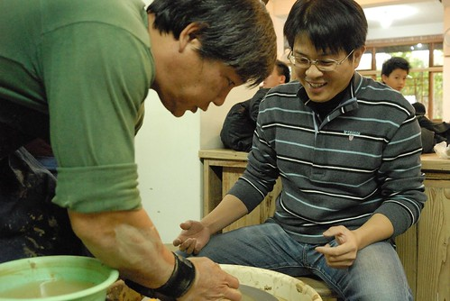 由師傅一開始定好中心並帶領體會手拉坯的操作變化後 便交由我們自由創作  講真的 因為很怕作品塌了或是飛出去 我們都不敢玩太久 見到一樣跟自己預期相差不太遠的作品出現了就趕緊踩煞車停工 這是徹爸的第一個作品 : 準備拿來養水中植物的花器 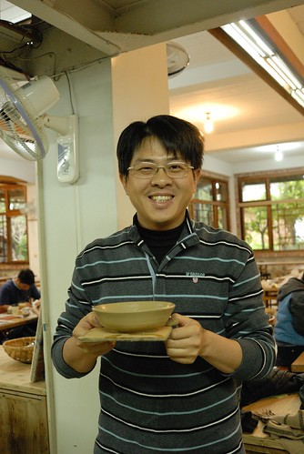 接著換愛愛體驗  原先嚷著不敢玩手拉坯的愛愛卻是我們當中體驗最久 玩的最開心的 而且可能因為手小加上力量小 覺得她的巧勁比我跟徹爸好很多 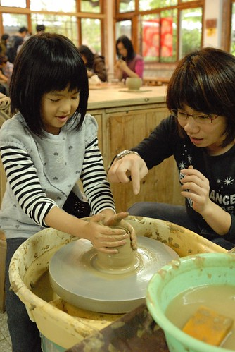 在師傅指導下 一下子讓手拉坯長高高 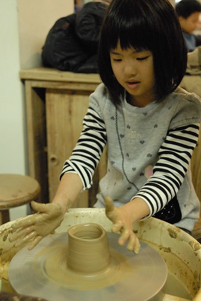 一下子讓手拉坯變胖胖 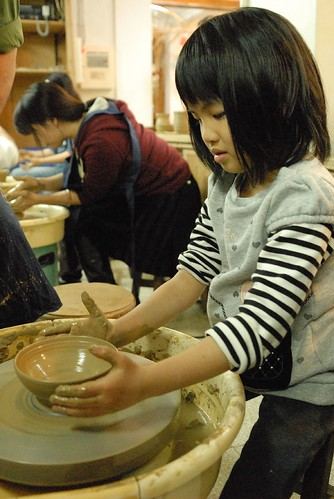 接著換我登場  想要做一個可以插一小把花的花瓶 最後收尾時 我的頓手一直不成功 耗費不少時數  時間用完機器停止後 我阿了一聲 結果師傅一臉不用擔心+這沒有什麼的 把電改個插座繼續運轉 讓我們用到完成一個作品 師傅你真是不只有好手藝還有好心腸!  我跟徹爸還有愛愛開心體驗手拉坯的同時 阿徹自己一個人留在大桌子區創作他的手捏陶藝 因為太好玩也太有成就感 於是我們又再買了一枚代幣讓阿徹體驗及徹爸再做一個花器 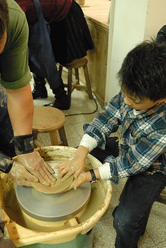 一家子真是手拉坯玩的太開心且那個氣氛真是太high 完全忘記新宜在陶藝教學時的交代: 最後的燒陶價錢以成品大小計價  杯子是最物超所值.. 以致最後六個成品做電燒費用的估算時 我們看著價錢瞠目結舌 尤其那幾個盤子... (柴燒價錢是電燒的三倍 當下更是完全不敢考慮) 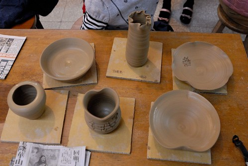 上面成品由上排左到右為 徹爸的花器 我的花瓶 徹的盤子 下盤左到右為 徹爸的花器 愛愛的愛心杯以及愛心盤 雖然徹爸笑說"藝術果然是昂貴的" 但難得一家子各自擁有這世上獨一無二的陶藝品 所以我說藝術無價啦! 下午4點結束捏陶體驗也結束了我們在華陶窯的一日體驗 就如徹跟愛笑著且大聲的跟新宜姊姊說再見 今天我們一家子在華陶窯真是開心!

民國100年12月10日  徹 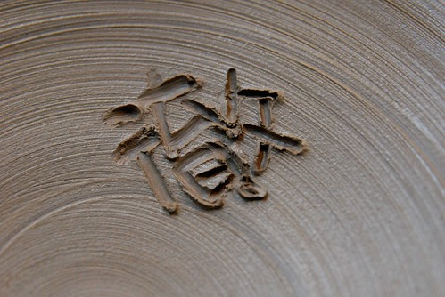 and愛 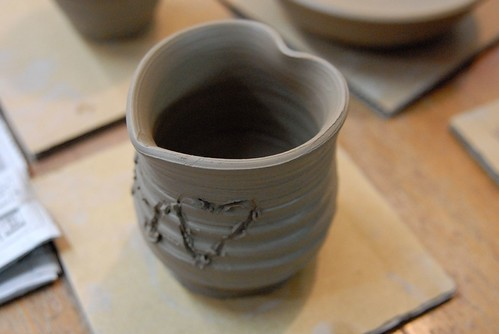 還有我們一起在華陶窯裝了滿滿的回憶!! 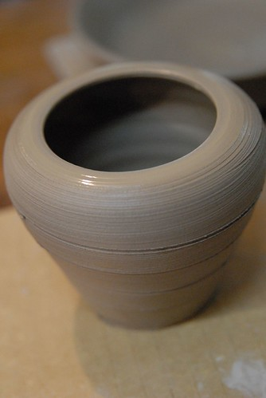 The end~
