10月時就用徹爸的旅遊補助訂了12月的苗栗之旅 只是這為了泰安溫泉而安排的苗栗之旅 除了採草莓跟吃草莓冰外 我還真沒想法要去哪玩 或許這是自己刻意的不以為意!  因為每次在西部的小旅行 我總不若去花東玩那樣的積極 認真與期待 出發的前一週 徹爸也不知道從哪看來的文而發現苗栗這樣一個充滿人文與藝術的地方 老實講 一開始我很沒當真 輕意地以應該來不及預約為由搪塞了徹爸 幸好徹爸這次不知怎的 莫名的想去這個地方 於是我打了個電話詢問是否可入園參觀 接電話的客服專員超級"像回事"的跟我解釋每個細節, 當天活動安排, 貼心叮嚀以及email正式的申請 被這樣盛重接待的我 於是沒有多考慮的就訂了四個人的一日體驗活動 徹爸看到申請單上的入門+活動費用後 吒舌問我"挺貴的哩 你真的就這樣訂了" 我說"對阿 專員的態度讓我很想去看看這是什麼樣的地方" 而報完名後我開始認真上網搜尋網友的分享遊記  哇! 真的耶!每個去過的人都說好! 讓我們更是期待了 那天在結束華陶窯的七小時體驗後 我跟徹爸說"這一個人的費用等同去吃一頓五星級的大餐 而我們今天就也好像吃了一頓充滿人文 藝術與美好回憶的大餐 所以這餐一點都不貴..." 我們一家子都很喜歡這樣一個小而美 小而豐富的華陶窯! 

那天早上七點半從板橋出發時 天還下著細雨 超級的陰霾 那連下一兩週雨 下的都快讓人發霉的天氣 讓我們不貪心的默許著苗栗只要不下雨就好 但沒想到南下過了關西後 竟讓我們見著了那久違的陽光 OH! 老天爺 真是太好了 給了我們個雖然冷但起碼風和日麗的好天氣!  以前我們一直以為苗栗是個山城 盡是起起伏伏的山路與山坡 這回從苑裡交流道下來後 才發現原來苗栗也有這樣的平原 往華陶窯的路上 看著一戶戶的樓舍 徹爸突然說 "現在什麼東西都可以上網買 住在這鄉下地方生活其實也不會太不方便" 嗯! 這論點的確挺好的  不過前提是得有一份維持生活的工作吧! 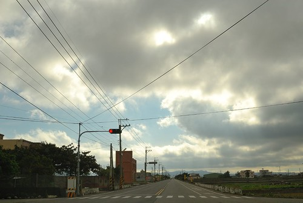 原本還擔心來不及10點前到達 準時參加活動的 想不到２小時的車程時間　我們便從板橋的家中移動到華陶窯了 華陶窯位處在一個就像是一般鄉間的小路盡頭  停好車後 進入園內前先經過服務中心  由工作人員確認我們的預約活動 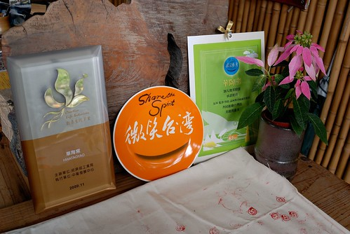 並且給予我們今日的識別證  這隻可愛的蜻蜓就是我們今日在園內暢行無阻的通行證 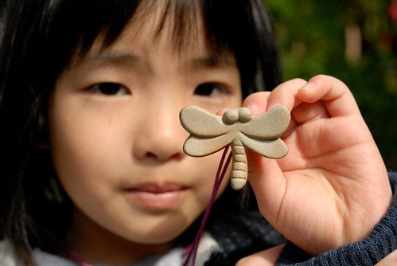 我們大搖大擺的入園嚕! (別懷疑這就是大門)  進入園區後馬上就被這道門給吸引住了  除了那磚的美 門的樸外 我喜歡上門聯上那四個字"斯土有情" 讓人有種像是回到家的感覺  接著轉個彎 我又被一片綠牆與木桌椅給吸引了  這時後 今日活動的解說專員出現眼前 歡迎我們並說明開始時間 而且超級熱心的幫我們照了張全家福 (那日只要看到徹爸幫我們三人照相時 都會熱情的問要不要全家福)  我們報名的一日體驗活動預計10點半開始 共有三小團體報名 只要等大家都到齊便可提早開始 趁著大家到期前的空檔 我們一家子隨意的在園內亂走亂看 園內的建物 階梯或圍牆 大部分都是用這樣的紅磚(有網友寫清水磚)砌成 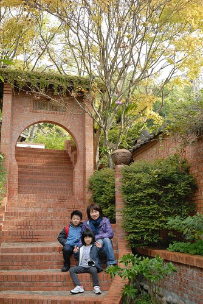 尤其這段階梯的FU真是棒 是我最愛的一個角落 有黃金槭楓 有陽光灑落... 這陣子以來難得的奢侈享受  愛愛最愛的是這階梯下 不知道該說是池塘還是路的幾顆大石頭 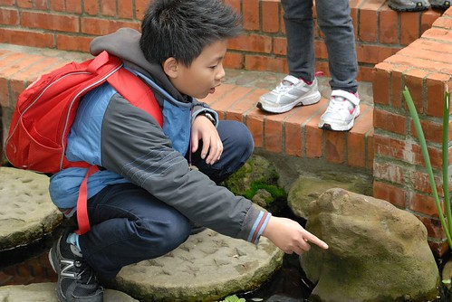 每每經過這裡 愛愛總是輕快且陶醉於她腳下的每一步  這裡進入是餐廳 也是解說室與陶藝教室  裡頭一桌桌整齊又乾淨的木桌椅加上四面大開窗   可以說是簡單中的奢華嗎 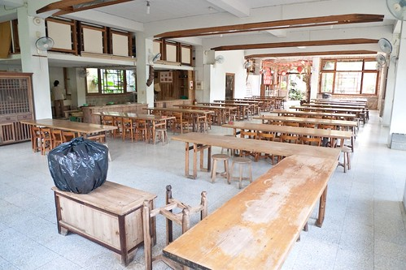 穿過餐廳 走出後門 走道的盡頭是餐廳 裡頭飄出來的米飯香 滷肉的八角香 讓兩個小時前才嗑完傳統大飯糰的我們忍不住喊著"聞的肚子好餓阿" 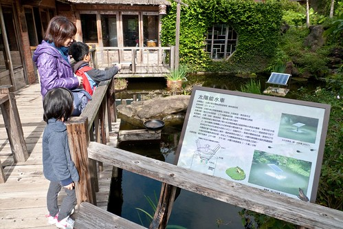 紅磚搭著原木沒上漆的欄杆 走道 窗框 門框  整個感覺真的很棒 徹爸不饋是我的好麻吉 說"你一定會希望以後有這樣的房子"   沒錯~我流口水幻想著... 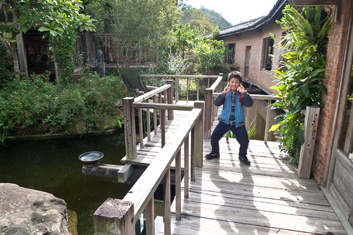 離開餐廳 我們循著我說的那美麗階梯繼續探訪園內 (愛愛一開始就是像照片裡那樣唉唉叫 不甚喜歡)  園內隨處可見木椅 或是長凳 或是單人靠背椅 讓人忍不住就想坐下來 慢下來  我想窯主一定也是希望每個來這裡的人都能隨地隨時的坐下享受這份愜意吧 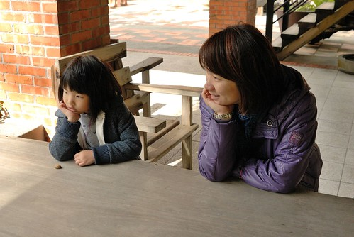 或是倚著欄杆俯瞰前方美景 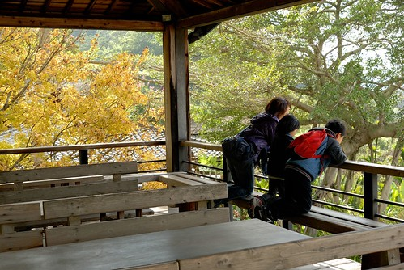 苑裡平原一覽無疑!  我說夏耘或秋收來的時候 一定很漂亮 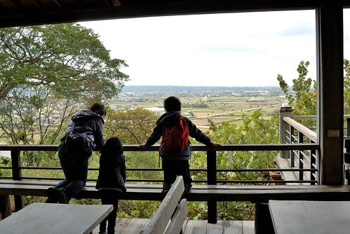 園區內也常可看到像這樣飄著一些花 一些葉的"盆景" 徹爸對這樣的看似隨意但又顯心思的花藝佈置很是喜歡也很感好奇 後來園區解說時還認真問了解說員 這到底是隨意還是刻意的結果  而除了椅子 花器外 另一項隨處可見的心裁是 牆上掛著的小詩 小曲或是台語語錄 雖然很多內容我都看不太懂 但看著看著就是感覺閒適  我們的40分鐘隨意亂走裡 除了看見上面那些人文藝術外 常一個轉身 一個轉角 便看見一幅幅美麗的圖畫 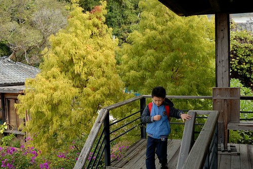 我真覺得這樣的庭園像是一幅幅的畫! 而且多變又豐富!  覺得這裡的植物看似任其自由生長 但卻又讓人感覺亂中又有序 奔放的讓人很舒服  難怪每個來過的網友都寫讚!  真的很讚的地方!!  連原本不感興奮的愛愛也興奮了起來 自己還跑到我們站的2樓右下方的一樓院子 比YA要爸爸照相 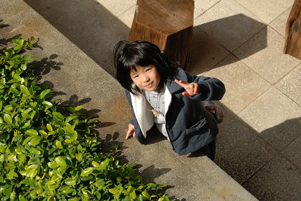 這樣就對了! 在這就是適合這樣到處坐 席地坐 放起空來  或是玩耍起來  看兄妹倆的笑容就明白他們跟爸爸媽媽一樣喜歡這裡 期待接下來一整天的活動... 
