小時候(談戀愛前)跟著兩個哥哥看棒球 支持兄弟象 而有了徹爸後 繼續跟著徹爸一起看棒球 甚至看著他從三商迷變成兄弟迷.. 只是當了爸媽後 到球場看球變成一件很奢侈的事 熬了這麼多年...總算... 我們全家人總算可以一起進球場看棒球嚕~ 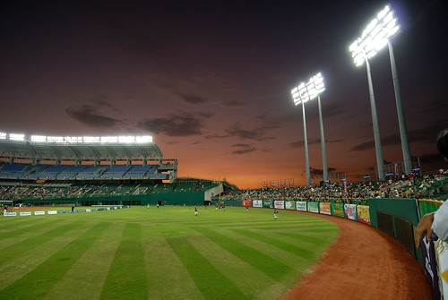

談戀愛時 我跟徹爸曾經在約會時去台北市立棒球場看球 結婚前 也一起去新莊棒球場看過好幾次 有了阿徹但還住在新莊時 也還起碼可以下班後兩人偷閒跑去新莊看球賽 但六年前 搬來板橋獨立自主生活後 我們再也沒去過球場看球賽了 於是徹爸只能看看電視轉播 過過癮 但偏偏老婆對於電視的管控越來越嚴格 於是徹爸只能偶而偷開電視偷看一下下 但又常會被徹愛噓"喉~爸爸又在偷看電視" 於是徹爸只好千拜託萬拜託地說"讓我看一分鐘就好 讓我看一下比數就好..." 然後在徹愛睡著後的緯來體育時間裡才能好好的關心職棒賽況 粉可憐的徹爸! 隨著徹愛越來越大 我跟徹爸開始期待著"總有那麼一天我們全家將一起重返球場" 且每次看到電視裡漂亮的澄清湖球場 徹爸都會讚嘆地說"好想去澄清湖球場.." 於是我們很認真的開始等待哪個時機點去看球 只是想歸想卻還是一直沒有付之實行....

果然! 做這種事是需要契機與衝動的 就在送愛愛回嘉義的那個下雨午後 寂寞的我們三個人在車裡等著聽因雨遲遲沒開始的球賽轉播 轉播記者與球評老師除了亂哈拉 介紹以前球場跟水有關的趣事外 還好好地介紹了一週後的2011明星賽之全壘打大賽 阿徹聽到球評老師說 每個參賽者最後出局球用的是金球 熱血沸騰的直嚷著"我要去撿金球" 然後在愛愛不在家的"寂寞"催情下 徹爸很熱情很慷慨地說 "下週回去嘉義接愛愛 剛好就來去看全壘打大賽吧 " 所以澄清湖棒球場 我們來嚕! 我們真的來嚕! 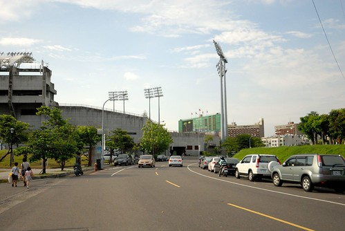 星期五下午我們迫不及待地回嘉義見我們的愛愛 然後星期六中午一起去高雄玩耍 我們在科學工藝博物館玩到4點後接著去澄清湖球場 進場前 徹爸罕見地說"停! 來照一張吧" 於是我亮出我們的麥當勞 阿徹拔出有備而來的加油棒 連愛愛也很有架式地攤開三張票 紀念我們家的歷史性一刻 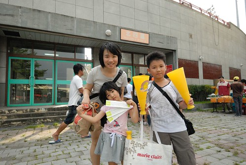 雖然內野才看得清楚球員 但徹爸說球打向外野的那種感覺很棒 所以我們坐在外野區 而且還超中間的中外野 坐在位置上 望去的視野真是好! 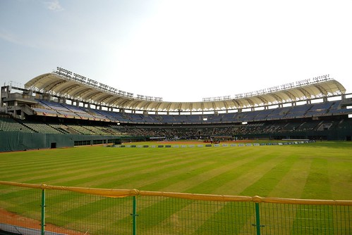 甫坐定 愛愛就迫不及待的要吃晚餐 坐在球場內吃麥當勞 應景地超幸福阿! 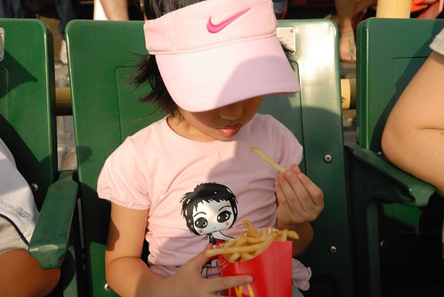 而我跟徹爸一整個地在"興奮"狀態 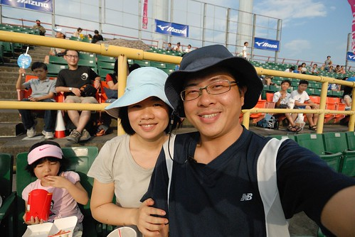 睽違7年的棒球場 真好! 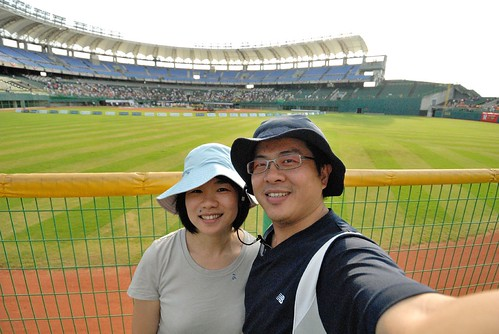 活動準時的在5點開始 第一次在球場立正唱國歌 我忍不住起了雞皮疙瘩  唱完國歌 介紹完與會政治人物後 全壘打大賽鳴鼓開始.... 滿心想撿金球的阿徹 套起他的球套準備著 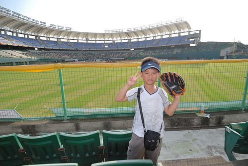 愛愛也拿出家裡七年不見天日的加油棒 準備擊鼓納喊 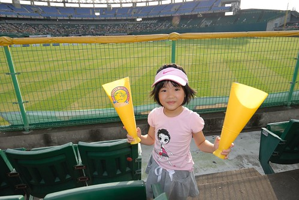 可是怎麼球打過全壘打牆的這麼少 愛愛沒一會就覺得有點煩悶 直唸著想要去內野區坐 畢竟要在內野才能近距離的看到球員與主持人間的一舉一動  總算...總算...有人敲出全壘打了 外野座位區觀眾的頭不約而同的跟著球一起轉過去 這畫面真的很有趣!  雖然明知道要接到球的機率微乎其微 但徹爸還是帶著阿徹在左/右外野區來回趕場著 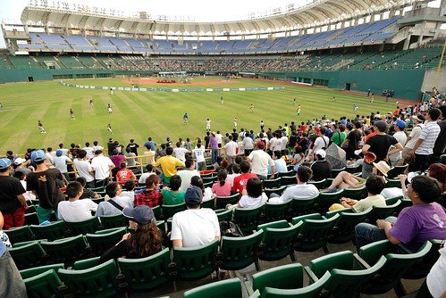 球掉在球場外野區時 外野區的小棒球手搶著接 而若掉在外野觀眾區 那搶的又更兇了...所以阿徹搶得到球嗎? 想也知道很難! 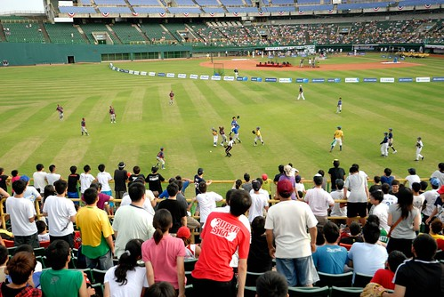 不過今天徹爸很熱血 很讚  領著/陪著阿徹"尋夢"去 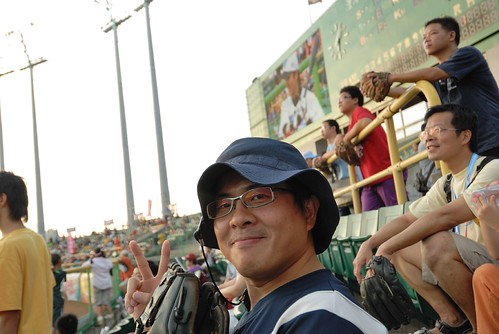 不過追個2-3個選手後 阿徹已經滿頭大汗ing 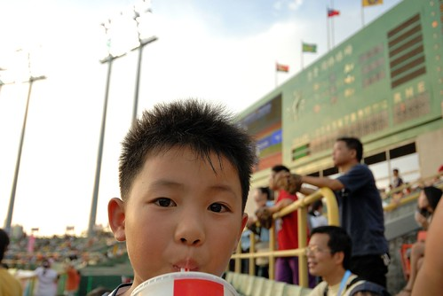 父子倆忙著追球的同時 我跟愛愛也沒閒著 中場休息拋放海報時 我們也超有參與地搶著海報 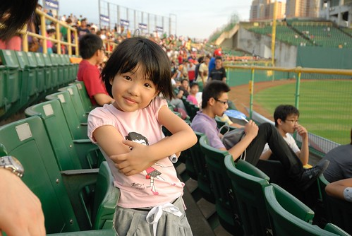 很幸運地剛好有一隻海報拋向我 也剛好被我撿到了 OHYA! 愛愛也因此整個high了起來 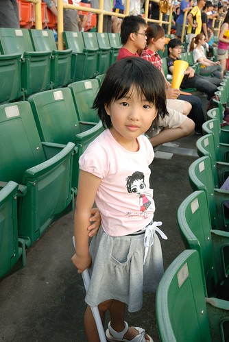 雖然5-6點的太陽還是很烈 但是我們的熱情完全不輸它 一家子看的很開心 野餐的很開心 玩的很開心! 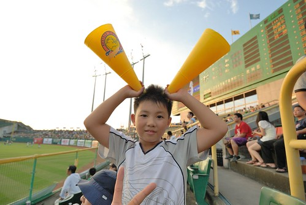 隨著太陽慢慢下山  天氣又更是越來越舒服了 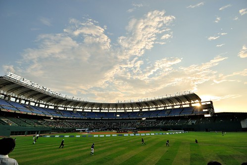 而天色暗了 球場的燈打亮另一種氣氛..(覺得自己好像比較像是來看球場的 哈!) 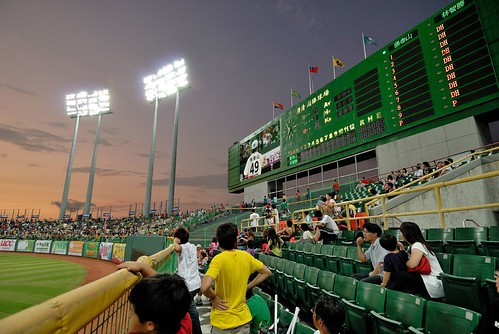 坐在球場裡 吹著涼風 看著天色的美麗變化 真覺得這是一個'好夏日'的美好夏日夜晚  會打棒球且喜歡棒球的徹爸 一定很喜歡這樣置身於球場氣氛中 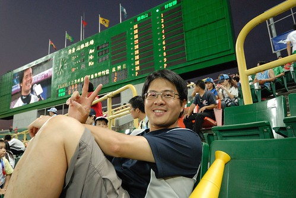 只是全壘打大賽有點出乎我意外地"長"(雖然徹爸說每年就都這樣) 就這樣一直打阿打 不知不知就也過了3個小時 而且還沒進入最後的總決賽 愛愛又無聊了起來... 因為其實她真的搞不清楚球場的狀況 以為是像電視上的球賽那樣 所以問了好幾次現在是哪一隊贏 小朋友! 今天沒有哪一隊 是比賽哪一個人全壘打敲的多!  幸好三輪比賽中間 鏡頭跟現場觀眾玩起親親遊戲 大螢幕上show的男女 只要親個嘴 賽後可以去領取小禮物 每個被圈中的人反應不一 很有趣  讓我們看的哈哈大笑 我們也超級地想被圈中 可惜我們不夠辣不夠帥.... 徹爸早上才在說 忘了跟我說可以穿我們的紅色家庭服 好增加上鏡機會 可惜... 下回再去看球賽就知道了! 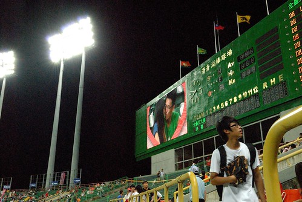 另方面休息時間裡 聯盟也總共拋放了3-4次的海報 每次拋海報時 觀眾總也像搶球般的搶著 我又很幸運的 在阿徹跟徹爸的眼前 再次抓到一張海報 我笑說 我這歐巴桑平常上菜市場搶菜的本事可不是假的ㄋ 阿徹一臉認真的問我'媽媽 你都在菜市場搶什麼菜?' 孩子 媽媽打個比喻而已 你還真當真哩... 不過徹爸說週年慶的翻花車訓練應該有幫助 Orz 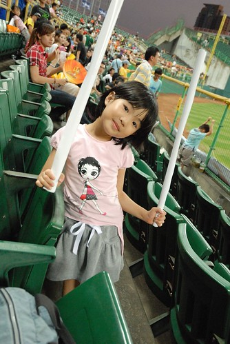 媽媽抓到的兩張海報是今日看球的收穫 阿徹跟愛愛兄妹倆也因此開心 得意地哩 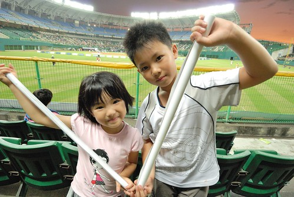 一人剛好一張 不用搶 不過最後那個不知道哪個人的海報被我們留在嘉義 只帶回第一張拿到的全壘打大賽海報 別具意義的海報要好好貼在我們的家裡 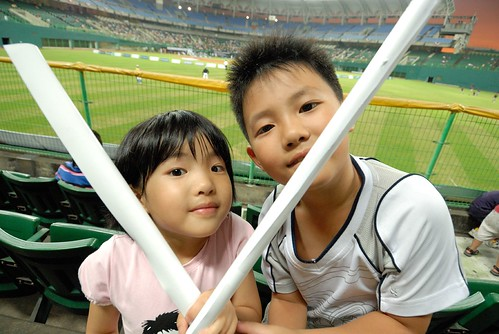 第二輪比賽時 最後一個出局數時 若選手擊出全壘打 計分版上空便會嘣嘣放個兩個煙火以玆慶祝 現場氣氛越炒越熱... 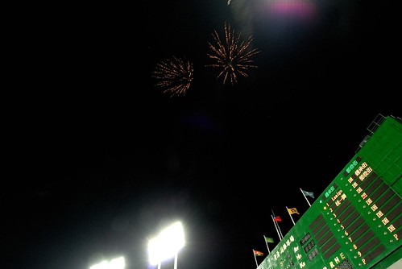 而最後的總決賽 原本以為一面倒的結局 卻讓鍾承佑(老實講 連電視球賽也沒看很久的我 今天前根本不知道這名字)在最後兩個出局數連番敲出7隻而逆轉獲勝 隨著他那一顆顆飛往外野看台的球 所有觀眾哇個不停 high到最高點 這個新科全壘打王有利害 有屌! 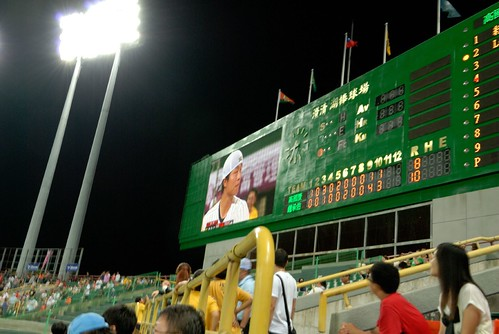 雖然今日的全壘打大賽 阿徹沒有接到金球很失望 雖然今日不是刺激緊張的球賽 看起來少了那麼幾味 但第一次全家一起來棒球場  第一次看全壘打大賽 是有著一家人美好回憶的第一次 尤其是在這美麗的澄清湖棒球場..真的很棒... 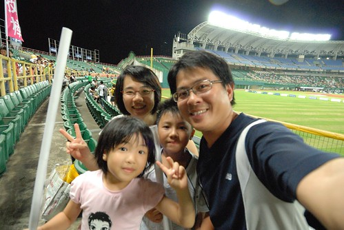 我們熱血地說 這個球季一定要去球場看場正式的比賽  阿徹跟愛愛齊聲歡呼叫好 不過愛愛比著前方的內野看台區說'可是我下次要坐那裡喔..' 嗯! 沒問題 下次包準讓你去內野 加油棒敲個夠 也被吵個夠!!!
