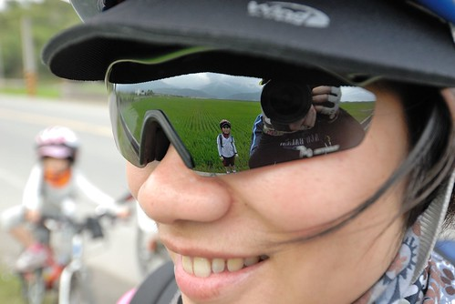
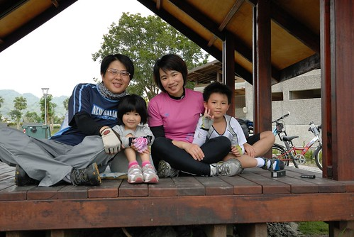

我很喜歡這張照片... 照片裡頭有一家子: 爸爸, 媽媽, 徹與愛有我們這次旅行的主角: 稻田與山還有我們家生活中重要的元素: 笑容, 大自然, 單車與攝影....　

心裡頭想要去花東賞稻已經很久了... 而總算下定決心要拿出行動力時竟也為了到底是要賞綠油油的還是金黃色的稻田而超級掙扎 難以抉擇 我問徹爸'你想看綠色的還是黃色的'  徹爸竟也回我'都可以 只要不是光禿禿的就好' 哈! 沒辦法 這幾年去花東不是寒假就是暑假 都是稻田收割後光禿禿的樣子 (就因為這樣 我的內心超級渴望地想要去賞稻) 於是我們這對涯給夫妻 繼去年7月的193挑戰後(想回味的請見[blog.yam.com/hmchen1975/article/29408983](http://blog.yam.com/hmchen1975/article/29408983)) 這回安排了個三天的瑞穗到池上的單車賞稻之旅! 而且這次還真的是全'雙鐵'喔...全部的交通工具就是 鐵路 鐵馬 若再加上我們的鐵腳 那是不是也可以稱為三鐵了 哈哈!

出發的前一天在網路上看到有人這樣形容這時節漫步在花東的心情 ‎"與這些稻米一樣吹著徐徐的風、呼吸著鄉間乾淨的空氣、享受陽光灑在身上的喜悅" 那時坐在辦公桌前的我 彷彿也吹到了風 聞到了稻田香 享受著陽光的溫暖 人一整個的舒服了起來... 三天中每當單車輕鬆的滑行在下坡路段時 我總忍不住打開左手(右手還得握車把ㄇㄟ) 心裡吶喊著'真的好棒' 那一刻真的是"與這些稻米一樣吹著徐徐的風、呼吸著鄉間乾淨的空氣、享受陽光灑在身上的喜悅" 真的!

不知道是否因為這次透早就出門摸黑才回家 抑或火車讓旅行的情緒高亢 在南花蓮跟台東的三天常感覺自己好像遠離塵囂很久了 但當三天後回到台北還是感嘆怎麼不能再呆久一點阿! 這次的旅行不知怎的 不順的事特別多 但有緣的 感動的事也特別多... 這回要好好地 細細地紀錄及回味 所有的美景與感動!!! 
