孩沙里 一個聽起來很美麗又可愛的名字 在出發前往台東的前兩天就是因為在玟姿的FB上撇見這三個字而引起我的好奇 上網估狗後才知道 原來這是在雲林的大花田 號稱全台十大花海之一 所以趁著台東行最後一天的西部大趕路 我們順道去雲林莿桐鄉的孩沙里看花田 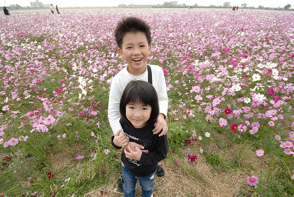 

其實從二高下到雲林後 我們是一路狐疑著才來到花田處 本來一直擔心會找不著路 卻果然在走到雲縣道156後就看見活動會場 雖然車子得停的不算近 但比起西部大型活動的大車陣 這裡還有著鄉間的優閒 而還沒看到真正的活動花田時 路旁一塊開滿油菜花的田地便已讓我們雀躍不已 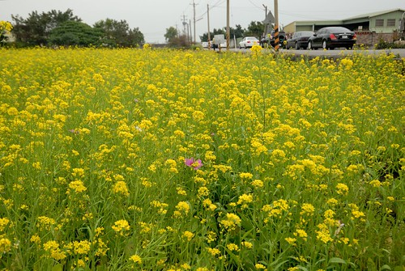 這是我第一次在西部見識到油菜花的數大就是美 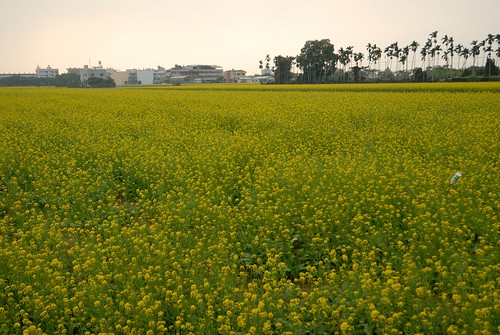 以後想看油菜花就不用大老遠跑去花東了!  真正走到活動的花田處時 心裡忍不住"哇! 果然不負十大花田的美譽" 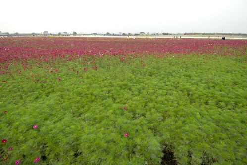 我喜歡這樣野放的大花田 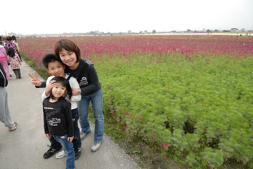 休耕時 將各色波斯菊 太陽花 油菜花種子大把大把灑進田裡 然後遊客如我們走在田間阡陌間 享受這幅自然不矯情的美麗畫布   徹爸說 會不會以後台灣各地都風靡種起這樣的花田 我說 現在就各地都有花田 花海相關活動啦 就像這幾年的花東縱谷 每年新聞稿總宣稱著花海又向北或向南延伸多少 串連多少公里 可是實際走過一遭後 會發現大都是千篇一律的花卉畫布造景 有些甚至有"騙人"之嫌疑 當然 政府的美意都在於推廣當地觀光 但是過多的置物性行銷 過於一致的風格 對於當地長遠的發展真是有幫助嗎?  我很驚艷也很喜歡這片孩沙里花田

  但心裡忍不住擔心 當這裡擠滿外來遊客(感覺那天大都是當地人結伴而來) 當這裡有一天成為超夯賞花地 那將是ㄧ幅什麼樣的畫面 會發生什麼樣的改變.. 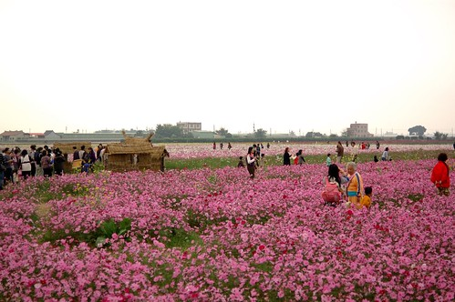 以上純屬張媽媽的碎碎念... 不過雲林真是我們很少走訪的縣市 今日才發現雲林也有這樣的一面 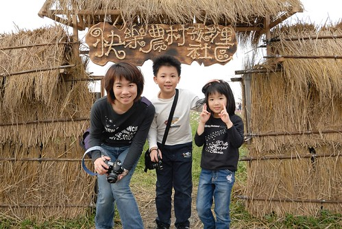 真的很高興 我們一家子有這趟算是天外飛來的賞花之旅  替我們這次的慢漫旅行畫下美麗的句點! 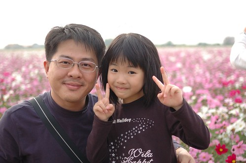

我說這樣的花田 真是怎麼拍怎麼美 不止花美 人也美 阿徹拿著他的相機 伴著一聲聲的驚嘆聲 拍下美麗的花朵倩影 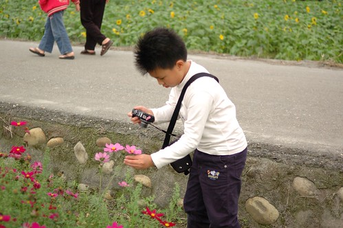 跟徹爸兩人認真的在太陽花叢裡拍採蜜的蜜蜂 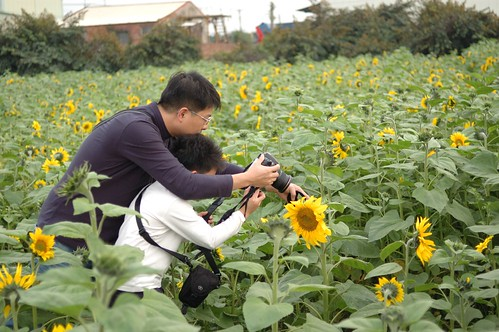 紀錄在這裡所見的農村景像  愛愛則是我們鏡頭下的最佳model  不只被爸爸拍 被哥哥拍 當爸爸跟哥哥兩人一路研究拍照時 還跟我組成拍照拍檔 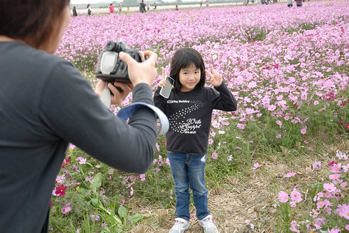 這是媽媽鏡頭下襯著太陽花的小臉 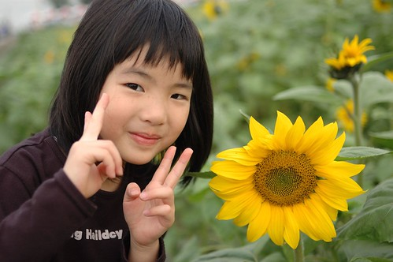 各色花田背景下的小臉   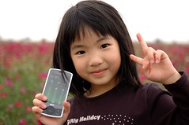  中間我跟愛愛說 你幫媽媽拍一張好嗎 想不到小妮子就這樣子 愛上拿相機 快門喀擦聲 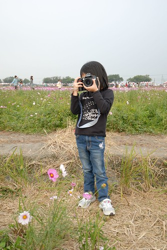 所以媽媽想拍愛愛得有一個條件 就是得讓愛愛也能拍媽媽 這是愛愛鏡頭下的各色花田背景的大臉     我跟愛愛說 媽媽超級喜歡油菜花 幫我多拍一張 愛愛把媽媽拍的好漂亮 媽媽看了真是開心!  這是愛愛鏡頭下的爸爸媽媽  愛愛好開心 今天好多媽媽的照片以及爸爸媽媽一起照的照片都是她拍的!  我想以後出門愛愛會跟我搶相機了... 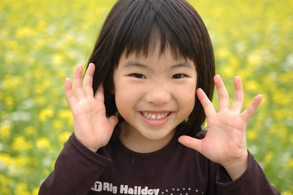

美麗的花田 有機會的話 趁著好天氣走訪一趟!  這是我在年前想與我親愛的朋友分享的一件事.... 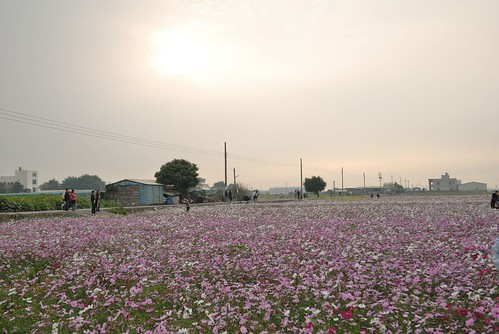
