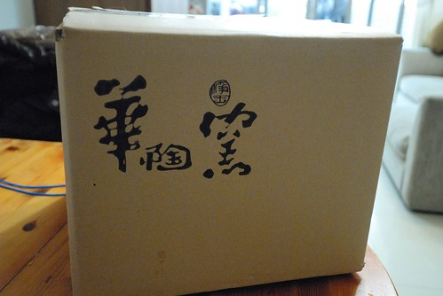

就在當我們都快忘記我們在華陶窯做的陶藝還沒收到時 2月初的某週六上午我們收到了來自華陶窯的包裹 雖然已經比當初所說的兩個月等待時間少了半個月 但還真的等很久 久到收到時有著意外獲得禮物的驚喜!  

看到這個專門的箱子 不得不讚嘆一下華陶窯自始至終的品質要求  而不只箱子美麗 也謹慎的做好可以的安全防護措施: 箱子上頭貼著請勿壓摔的警語  紙箱厚度比一般的還要厚 加上每個作品多層緊實的包裹著  真的一整個很用心阿 我們一件件的打開  心情有如打開聖誕禮物那樣的期待與開心 這是徹爸的小花盆  開口疑似有被師傅整大了   應該是徹爸之前的瓶口真的太小了 可能一燒之後就如拇指般寬度而已吧  我的花器 顏色出乎我意外的沉穩ㄚ  愛愛的愛心盤 隔天愛愛很堅持要用盤子裝她的晚餐菜  可是結果顯示愛愛的吃飯速度並未因此加速 基於安全考量沒再讓她用了  徹爸的第二個小花器 放了點薄菏與玫瑰葉後 還真是煞有其事的美麗又有氣質阿! 只是徹爸這樣的信手拈來就這麼一次  阿徹的盤子 阿徹捨不得拿來裝菜 目前用來裝他們三不五時從學校帶回來的小糖果 每每看到餐桌旁一盤的糖果 讓人有種好像在過年的錯覺  愛愛的愛心杯 目前也是使用一次之後 捨不得的一直晾在杯架上 雖然每個作品比我們想像中來的小  顏色來的古樸且有層次  但真的"好有感覺"阿 只是杯子 盤子太美麗 太獨一無二 還真的會讓人捨不得用說.... 或許我們該好好學習以前小學課本中那個為了一朵鮮花打掃一整個家裏的故事 我們也該好好想想怎麼把這些作品 裝飾似的應用在我們生活中 藉此好好提升我們家的藝術氣質阿!
